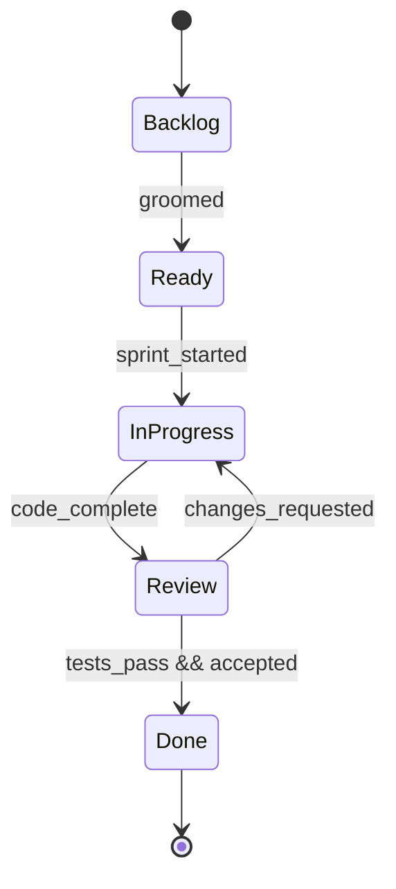

# Agile Workflows

TraceRTM integrates seamlessly with agile methodologies, supporting iterative development while maintaining full traceability. This guide covers implementing traceability in Scrum, Kanban, and other agile frameworks.

## Why Traceability in Agile?

Some teams believe traceability conflicts with agile principles. In reality, lightweight traceability **enhances** agility:

| Concern | Reality |
|---------|---------|
| "Too much overhead" | Automated linking reduces manual work |
| "Slows us down" | Impact analysis speeds up changes |
| "Not agile" | Supports continuous delivery with confidence |
| "We don't need it" | Essential for regulated industries, helpful for all |

## Agile Traceability Principles

### 1. Just Enough Documentation

Trace what matters, not everything:

```yaml
# .tracertm/config.yaml
traceability:
  # Core traces only
  required_links:
    - from: story
      to: test
      min_count: 1

    - from: story
      to: code
      optional: true  # Link if meaningful
```

### 2. Automate Everything

Let tools create links:

```python
# Auto-link from test docstrings
def test_user_login():
    """
    Story: US-042
    Acceptance: AC-042-1, AC-042-2
    """
    # Test automatically linked to story
    ...
```

### 3. Continuous Validation

Validate on every commit:

```yaml
# .github/workflows/ci.yml
- name: Traceability Check
  run: |
    tracertm validate --quick
    tracertm coverage --min 80 --type story
```

## Scrum Integration

### Sprint Artifacts

Map Scrum artifacts to TraceRTM:

| Scrum Artifact | TraceRTM Type | Purpose |
|----------------|---------------|---------|
| Epic | `epic` | Large feature grouping |
| User Story | `story` | Deliverable increment |
| Task | `task` | Work breakdown |
| Acceptance Criteria | `acceptance` | Verification criteria |
| Sprint | (metadata) | Time-boxing |

### Story Structure

```yaml
# Example user story
id: US-042
type: story
title: "As a user, I can reset my password"
epic: EPIC-005
sprint: Sprint-23
priority: high
points: 5

acceptance_criteria:
  - id: AC-042-1
    description: "Email sent within 5 seconds"
  - id: AC-042-2
    description: "Link expires after 24 hours"
  - id: AC-042-3
    description: "Old password still works until reset"
```

### Sprint Workflow



Configure in TraceRTM:

```yaml
# .tracertm/workflows/story.yaml
name: story
states:
  - backlog
  - ready       # Groomed, estimated
  - in_progress # Being worked
  - review      # Code complete, in review
  - done        # Accepted, deployed

transitions:
  - from: backlog
    to: ready
    requires:
      - field: points
        not_null: true
      - field: acceptance_criteria
        min_count: 1

  - from: review
    to: done
    requires:
      - link_type: verified_by
        target_type: test
        min_count: 1
      - all_tests_pass: true
```

### Sprint Planning Support

```bash
# See what's ready for sprint
tracertm list story --status ready --sort priority

# Check dependencies before pulling into sprint
tracertm impact US-042 --dependencies

# Output:
# US-042: Reset Password
#   depends_on: US-038 (Email Service) ✓ Done
#   depends_on: US-041 (User Auth) ✓ Done
#   Ready to pull into sprint
```

### Sprint Reporting

```bash
# Sprint burndown data
tracertm report sprint --sprint Sprint-23

# Output:
# Sprint-23 Progress
# ══════════════════
# Stories: 8/12 complete (67%)
# Points: 34/52 complete (65%)
# Days remaining: 3
#
# At Risk:
#   US-045: Payment Flow (8 pts) - blocked by API
#   US-047: Reporting (5 pts) - no tests yet

# Coverage by story
tracertm coverage --sprint Sprint-23 --by story
```

## Kanban Integration

### Board Configuration

Map Kanban columns to workflow states:

```yaml
# .tracertm/workflows/kanban.yaml
name: kanban_item
states:
  - backlog
  - ready      # Refined, ready to pull
  - in_progress
  - review
  - done

# WIP limits
wip_limits:
  in_progress: 3
  review: 2

# Automatic transitions
automation:
  - trigger: pr_opened
    action: move_to
    state: review

  - trigger: pr_merged
    action: move_to
    state: done
```

### Flow Metrics

```bash
# Cycle time analysis
tracertm report kanban --metric cycle-time --period 30d

# Output:
# Kanban Metrics (Last 30 Days)
# ═════════════════════════════
# Avg Cycle Time: 3.2 days
# Throughput: 24 items/week
# WIP Average: 4.5 items
#
# By Priority:
#   Critical: 1.5 days avg
#   High: 2.8 days avg
#   Medium: 4.2 days avg
```

### Continuous Flow

```python
from tracertm import TraceRTMClient

client = TraceRTMClient()

# Pull next item when capacity available
def pull_next_item(assignee: str):
    # Check WIP limit
    in_progress = client.list_items(
        item_type="kanban_item",
        status="in_progress",
        assignee=assignee
    )

    if len(in_progress) >= 2:  # Personal WIP limit
        return None

    # Pull highest priority ready item
    ready = client.list_items(
        item_type="kanban_item",
        status="ready",
        sort="priority",
        limit=1
    )

    if ready:
        item = ready[0]
        client.transition(item.id, "in_progress")
        client.update_item(item.id, assignee=assignee)
        return item

    return None
```

## SAFe Integration

For Scaled Agile Framework environments:

### Artifact Hierarchy

```
Portfolio → Program → Team
═══════════════════════════
Epic (Portfolio)
  └── Feature (Program)
        └── Story (Team)
              └── Task
```

### Configuration

```yaml
# .tracertm/config.yaml
hierarchy:
  portfolio_epic:
    children: [feature]

  feature:
    parent: portfolio_epic
    children: [story]

  story:
    parent: feature
    children: [task]

traceability:
  # Feature must trace to portfolio epic
  required_links:
    - from: feature
      to: portfolio_epic
      link_type: realizes

    - from: story
      to: feature
      link_type: part_of
```

### PI Planning Support

```bash
# Features for next PI
tracertm list feature --status ready --pi PI-24-Q1

# Dependency mapping for PI planning
tracertm report dependencies --type feature --pi PI-24-Q1

# Capacity planning
tracertm report capacity --teams "Team-A,Team-B" --pi PI-24-Q1
```

## Best Practices

### 1. Link at Creation Time

```python
# Good: Link when creating
story = client.create_item(title="Login Feature", item_type="story")
test = client.create_item(
    title="Test Login",
    item_type="test",
    metadata={"story_id": story.id}
)
client.create_link(test.id, story.id, "tests")

# Bad: "We'll link later"
story = client.create_item(title="Login Feature", item_type="story")
# TODO: Add tests and links  ← This never happens
```

### 2. Definition of Done Includes Traceability

```yaml
# Definition of Done checklist
definition_of_done:
  - code_reviewed: true
  - tests_passing: true
  - traceability_complete: true  # All ACs linked to tests
  - documentation_updated: true
```

### 3. Sprint Retrospective Includes Traceability Health

```bash
# Include in retro data
tracertm report health --sprint Sprint-23

# Questions to ask:
# - Did we have orphan stories? (no tests)
# - Did impact analysis catch issues early?
# - Are our cycle times improving?
```

### 4. Automate Status Transitions

```yaml
# Auto-update based on external events
automation:
  # PR merged → story done
  - trigger:
      event: webhook
      source: github
      action: pull_request_merged
    action:
      type: transition
      to: done

  # All tests pass → ready for review
  - trigger:
      event: webhook
      source: ci
      action: tests_passed
    action:
      type: transition
      to: review
```

## Common Patterns

### Pattern 1: Story → Test → Code

Most teams use this flow:

```
US-042 (Story)
    ├── verified_by → TEST-101 (Unit Tests)
    ├── verified_by → TEST-102 (Integration Test)
    └── realized_by → CODE-201 (Implementation)
```

### Pattern 2: Acceptance Criteria as First-Class Items

```python
# Create story with acceptance criteria
story = client.create_item(
    title="Password Reset",
    item_type="story"
)

# Each AC is an item
for ac in ["Email sent", "Link expires", "Password changed"]:
    criterion = client.create_item(
        title=ac,
        item_type="acceptance_criterion"
    )
    client.create_link(criterion.id, story.id, "criterion_of")

# Tests link to specific criteria
test = client.create_item(title="Test email timing", item_type="test")
client.create_link(test.id, criterion_email.id, "verifies")
```

### Pattern 3: Sprint-Scoped Queries

```python
# Get all items for a sprint
sprint_items = client.list_items(
    metadata={"sprint": "Sprint-23"}
)

# Coverage for sprint only
coverage = client.get_coverage(
    source_type="story",
    target_type="test",
    filter={"sprint": "Sprint-23"}
)
```

## Tooling Integration

### Jira Integration

```yaml
# Sync with Jira
integrations:
  jira:
    url: https://company.atlassian.net
    sync:
      - jira_type: Story
        tracertm_type: story
      - jira_type: Bug
        tracertm_type: defect

    field_mapping:
      jira_key: external_id
      summary: title
      sprint: sprint
```

### GitHub Integration

```yaml
# Link PRs to stories
integrations:
  github:
    auto_link:
      # PR title "US-042: Add login" → links to US-042
      pattern: "(US-\\d+)"
      link_type: realized_by
```

## Related Topics

- [Waterfall Workflows](/docs/wiki/concepts/workflows/waterfall) - Sequential approach
- [Hybrid Workflows](/docs/wiki/concepts/workflows/hybrid) - Mixed methodologies
- [Workflow Automation](/docs/wiki/concepts/workflows/automation) - Automating transitions
- [Best Practices](/docs/wiki/concepts/traceability/best-practices) - General guidelines

