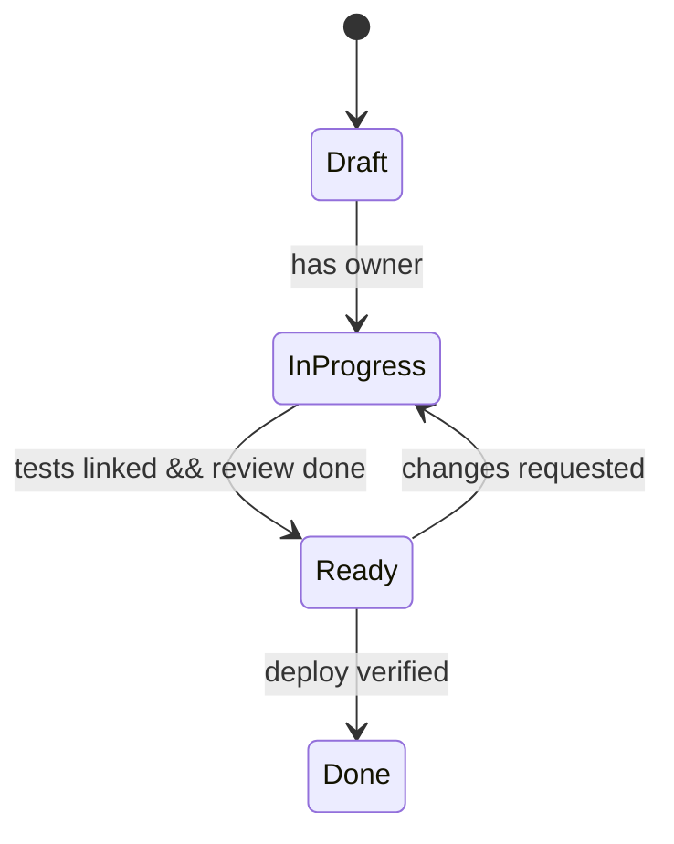

# Workflows

Workflows define how artifacts move from idea to done. Each artifact type has a state machine, validation rules, and automation hooks to keep quality high and traceability intact.

## Overview

- **States**: e.g., Draft → In Progress → Ready → Done; customizable per type.
- **Guards**: Required links, fields, or approvals before transitions.
- **Automation**: Webhooks, agents, or jobs triggered on enter/exit of a state.
- **Audit**: Every transition records actor, time, and context.

## Designing a workflow

- Define states that reflect your delivery steps.
- Add guards (required relationships/tests) before “Done”.
- Add notifications or webhooks on risky transitions (e.g., Done → Reopen).
- Keep transitions minimal; simpler graphs are easier to govern.

## Example

## Best practices

- Keep entry/exit criteria explicit and enforced automatically.
- Require links to tests and code before completing requirements.
- Emit events to monitoring/observability for audit and SLO tracking.
- Use idempotent automation; retries happen.

## Related

- [Workflow States](./02a-workflow-states/)
- [Relationships](./04-relationships/)
- [Traceability](./01-traceability/)
