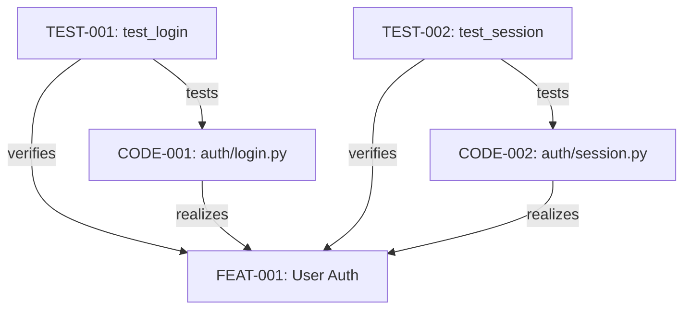
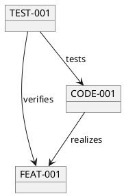

# Visualization

TraceRTM provides multiple visualization options to help you understand and navigate your traceability graph. From interactive graphs to matrices and reports, visualization makes complex relationships comprehensible.

## Graph Views

### Interactive Graph

The graph view shows artifacts as nodes and links as edges:

```bash
# Open interactive graph in browser
tracertm graph --open

# Graph for specific item and its connections
tracertm graph FEAT-001 --depth 2

# Graph for specific link types
tracertm graph FEAT-001 --types realizes,verifies
```

### Graph Configuration

```yaml
# .tracertm/config.yaml
graph:
  # Layout algorithm
  layout: force  # force | hierarchical | circular | tree

  # Node appearance
  nodes:
    feature:
      color: "#4CAF50"
      shape: rectangle
      icon: "📋"
    code:
      color: "#2196F3"
      shape: hexagon
      icon: "💻"
    test:
      color: "#FF9800"
      shape: diamond
      icon: "🧪"
    design:
      color: "#9C27B0"
      shape: ellipse
      icon: "📐"

  # Edge appearance
  edges:
    realizes:
      color: "#4CAF50"
      style: solid
      arrow: true
    verifies:
      color: "#FF9800"
      style: dashed
      arrow: true
    depends_on:
      color: "#F44336"
      style: dotted
      arrow: true
```

### Python SDK Graph

```python
from tracertm import TraceRTMClient
from tracertm.visualization import Graph

client = TraceRTMClient()

# Build graph
graph = Graph(client)

# Add starting points
graph.add_node("FEAT-001")
graph.expand(depth=2)

# Filter by type
graph.filter_node_types(["feature", "code", "test"])
graph.filter_link_types(["realizes", "verifies"])

# Export
graph.export_svg("traceability.svg")
graph.export_html("traceability.html")  # Interactive
graph.export_dot("traceability.dot")    # Graphviz format
```

### Graph Layouts

#### Force-Directed

Organic layout that groups connected nodes:

```python
graph.set_layout("force", {
    "attraction": 0.1,
    "repulsion": 100,
    "iterations": 500
})
```

#### Hierarchical

Tree-like layout showing levels:

```python
graph.set_layout("hierarchical", {
    "direction": "top-down",  # or "left-right"
    "level_separation": 100,
    "node_separation": 50
})
```

```
        EPIC-001
       /        \
   FEAT-001    FEAT-002
   /      \       |
CODE-001 CODE-002 CODE-003
   |       |       |
TEST-001 TEST-002 TEST-003
```

#### Circular

Nodes arranged in a circle, useful for dependency analysis:

```python
graph.set_layout("circular", {
    "radius": 300,
    "sort_by": "type"  # Group by artifact type
})
```

## Traceability Matrix

The traceability matrix shows relationships in tabular form:

### Requirements-to-Tests Matrix

```bash
# Generate matrix
tracertm matrix --from feature --to test --link verifies

# Output:
#                    TEST-001  TEST-002  TEST-003  TEST-004  TEST-005
# FEAT-001              ✓         ✓                   ✓
# FEAT-002              ✓                   ✓
# FEAT-003                        ✓         ✓         ✓
# FEAT-004                                            ✓         ✓
# FEAT-005 (gap)
#
# Coverage: 80% (4/5 features have tests)
```

### Python Matrix API

```python
from tracertm.visualization import Matrix

# Create matrix
matrix = Matrix(client)
matrix.set_rows(item_type="feature")
matrix.set_columns(item_type="test")
matrix.set_link_type("verified_by")

# Render
print(matrix.to_text())
print(matrix.to_html())
matrix.to_csv("traceability_matrix.csv")
matrix.to_excel("traceability_matrix.xlsx")
```

### Bidirectional Matrix

```python
# Requirements ↔ Code ↔ Tests
matrix = Matrix(client)
matrix.add_dimension("feature", position="row")
matrix.add_dimension("code", position="row")
matrix.add_dimension("test", position="column")

# Shows multi-level traceability
matrix.render()
```

```
                    TEST-001  TEST-002  TEST-003
FEAT-001
  └─ CODE-001          ✓         ✓
  └─ CODE-002                    ✓         ✓
FEAT-002
  └─ CODE-003          ✓                   ✓
```

## Coverage Visualization

### Coverage Dashboard

```bash
# Open coverage dashboard
tracertm coverage --dashboard

# Export coverage visualization
tracertm coverage --format html --output coverage.html
```

### Coverage Charts

```python
from tracertm.visualization import CoverageChart

chart = CoverageChart(client)

# Pie chart of coverage
chart.pie_chart(
    source_type="feature",
    target_type="test",
    link_type="verified_by"
)

# Bar chart by priority
chart.bar_chart(
    source_type="feature",
    target_type="test",
    link_type="verified_by",
    group_by="priority"
)

# Trend over time
chart.trend_chart(
    metric="test_coverage",
    period="30d"
)
```

### Heatmap

```python
# Coverage heatmap by component and test type
heatmap = CoverageHeatmap(client)
heatmap.set_rows("component")
heatmap.set_columns("test_type")
heatmap.set_metric("coverage_percentage")

heatmap.render()
```

```
            Unit    Integration    E2E
Auth         95%        80%        60%
Users        88%        75%        50%
Payment      92%        85%        70%
Reports      75%        60%        40%
```

## Impact Visualization

### Impact Graph

```bash
# Visualize impact of a change
tracertm impact FEAT-001 --graph

# Output: Opens interactive graph showing:
# - Changed item (center)
# - Direct impact (inner ring)
# - Indirect impact (outer rings)
# - Color coded by impact level
```

### Impact Tree

```python
from tracertm.visualization import ImpactTree

tree = ImpactTree(client)
impact = client.analyze_impact("FEAT-001", max_depth=3)

tree.render(impact)
```

```
FEAT-001 (changed)
├── CODE-001 (direct)
│   ├── TEST-001 (indirect)
│   └── TEST-002 (indirect)
├── CODE-002 (direct)
│   └── TEST-003 (indirect)
├── FEAT-002 (direct, depends_on)
│   └── TEST-010 (indirect)
└── FEAT-003 (direct, depends_on)
    └── TEST-011 (indirect)
```

## Dependency Visualization

### Dependency Graph

```bash
# Show dependencies for an item
tracertm deps FEAT-001 --graph

# Show all project dependencies
tracertm deps --project PROJ-001 --type depends_on
```

### Cycle Detection

```python
from tracertm.visualization import CycleDetector

detector = CycleDetector(client)
cycles = detector.find_cycles(link_types=["depends_on", "blocks"])

if cycles:
    print("Circular dependencies found:")
    for cycle in cycles:
        detector.visualize_cycle(cycle)
```

```
Cycle detected:
FEAT-001 ──depends_on──> FEAT-002
    ↑                        │
    │                        │
    └───────depends_on───────┘
```

## Timeline Visualization

### Change Timeline

```bash
# Show artifact changes over time
tracertm timeline FEAT-001

# Output:
# Timeline for FEAT-001
# ═════════════════════
#
# 2024-12-01 09:00  Created (status: draft)
# 2024-12-01 10:30  Linked to EPIC-001 (child_of)
# 2024-12-02 14:00  Status → in_progress
# 2024-12-05 16:00  Linked to CODE-001 (realized_by)
# 2024-12-06 09:00  Linked to TEST-001 (verified_by)
# 2024-12-10 11:00  Status → done
```

### Gantt View

```python
from tracertm.visualization import GanttChart

gantt = GanttChart(client)

# Show features with their lifecycle
features = client.list_items(
    item_type="feature",
    metadata={"sprint": "2024-S3"}
)

gantt.add_items(features)
gantt.render_html("sprint_gantt.html")
```

## Export Formats

### SVG Export

```bash
# Export graph as SVG
tracertm graph FEAT-001 --format svg --output graph.svg
```

```python
graph = Graph(client)
graph.add_node("FEAT-001")
graph.expand(depth=2)
graph.export_svg("traceability.svg", width=1200, height=800)
```

### PNG/PDF Export

```bash
# Export as PNG (requires graphviz)
tracertm graph FEAT-001 --format png --output graph.png

# Export as PDF
tracertm graph FEAT-001 --format pdf --output graph.pdf
```

### Mermaid Export

```python
# Export as Mermaid diagram
mermaid = graph.export_mermaid()
print(mermaid)
```



### PlantUML Export

```python
# Export as PlantUML
plantuml = graph.export_plantuml()
print(plantuml)
```



## Web UI Integration

### Embedding Graphs

```html
<!-- Embed in web app -->
<div id="traceability-graph"></div>
<script>
  import { TraceGraph } from '@tracertm/visualize';

  const graph = new TraceGraph('#traceability-graph', {
    apiUrl: 'https://api.tracertm.io',
    projectId: 'PROJ-001'
  });

  graph.focus('FEAT-001');
  graph.expandDepth(2);
</script>
```

### Interactive Features

```javascript
// Graph interactions
graph.on('nodeClick', (node) => {
  console.log('Clicked:', node.id);
  showNodeDetails(node);
});

graph.on('edgeClick', (edge) => {
  console.log('Link:', edge.source, '→', edge.target);
  showLinkDetails(edge);
});

// Navigation
graph.zoomToFit();
graph.focusNode('FEAT-001');
graph.expandNode('FEAT-001');
graph.collapseNode('FEAT-001');
```

## CLI Visualization

### ASCII Graph

```bash
# Simple ASCII visualization
tracertm graph FEAT-001 --ascii

# Output:
#          ┌───────────┐
#          │ FEAT-001  │
#          └─────┬─────┘
#       ┌────────┼────────┐
#       │        │        │
#       ▼        ▼        ▼
# ┌─────────┐ ┌─────────┐ ┌─────────┐
# │CODE-001 │ │CODE-002 │ │TEST-001 │
# └────┬────┘ └────┬────┘ └─────────┘
#      │           │
#      ▼           ▼
# ┌─────────┐ ┌─────────┐
# │TEST-002 │ │TEST-003 │
# └─────────┘ └─────────┘
```

### Tree View

```bash
# Tree visualization
tracertm tree FEAT-001 --depth 3

# Output:
# FEAT-001: User Authentication
# ├── realized_by
# │   ├── CODE-001: auth/login.py
# │   │   └── tested_by
# │   │       ├── TEST-002: test_login_valid
# │   │       └── TEST-003: test_login_invalid
# │   └── CODE-002: auth/session.py
# │       └── tested_by
# │           └── TEST-004: test_session
# └── verified_by
#     └── TEST-001: test_auth_flow
```

## Best Practices

### 1. Use Appropriate View for Task

| Task | Best View |
|------|-----------|
| Understanding dependencies | Graph (force layout) |
| Coverage analysis | Matrix |
| Impact assessment | Impact tree |
| Hierarchies | Tree or hierarchical graph |
| Compliance | Matrix with coverage |

### 2. Filter to Reduce Noise

```python
# Don't visualize everything at once
graph = Graph(client)
graph.add_node("FEAT-001")
graph.expand(depth=2)

# Filter to relevant types
graph.filter_node_types(["feature", "code", "test"])
graph.filter_link_types(["realizes", "verifies"])

# Exclude archived items
graph.exclude_status("archived")
```

### 3. Save and Share Views

```bash
# Save view configuration
tracertm graph FEAT-001 --depth 2 --types realizes,verifies \
  --save "auth-traceability"

# Load saved view
tracertm graph --load "auth-traceability"

# Share via URL
tracertm graph FEAT-001 --share
# URL: https://app.tracertm.io/graph/abc123
```

### 4. Use Color Coding

```yaml
# Color by status
graph:
  status_colors:
    draft: "#9E9E9E"
    in_progress: "#FFC107"
    done: "#4CAF50"
    blocked: "#F44336"
```

## Related Topics

- [Relationship Types](/docs/wiki/concepts/relationships/types) - Link types
- [Relationship Mapping](/docs/wiki/concepts/relationships/mapping) - Creating links
- [Impact Analysis](/docs/wiki/concepts/relationships/impact-analysis) - Change impact
- [Reports](/docs/getting-started/first-project/reports) - Coverage reports

