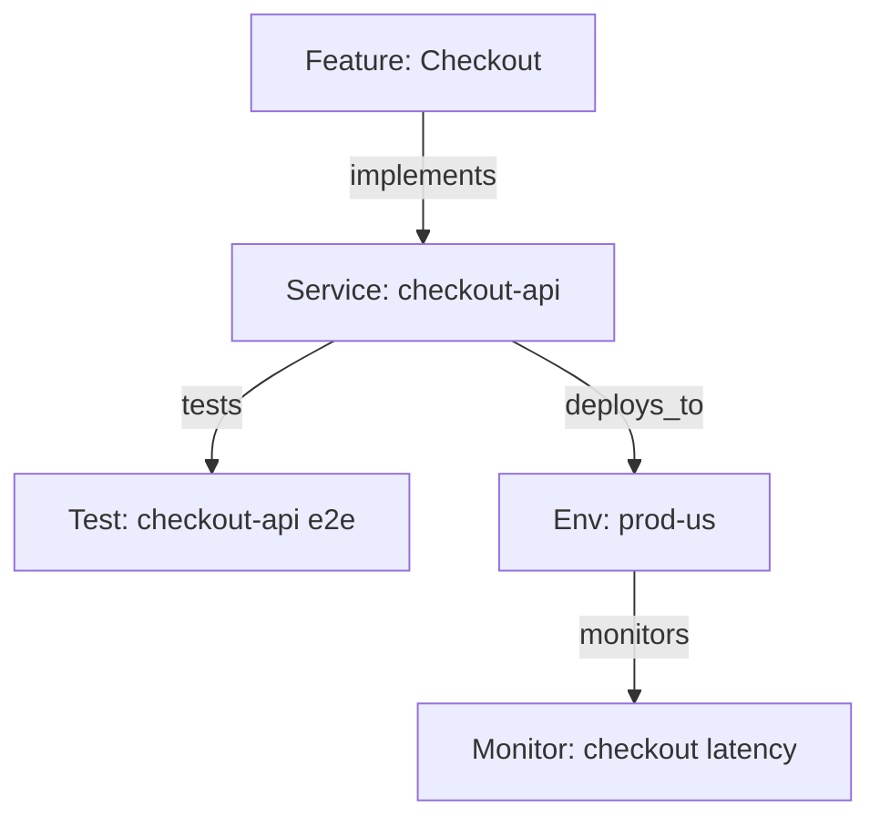

# Relationships

Relationships connect artifacts and give the traceability graph its meaning. They are typed, directional, and validated so reports and automations stay trustworthy.

## Overview

- **Typed**: implements, tests, verifies, parent_of, depends_on, blocks, deploys_to, monitors, etc.
- **Directional**: `code --implements--> feature` is different from the reverse.
- **Governed**: Some artifact types require certain link types before moving state.

## Categories

- **Hierarchical**: `parent_of`, `child_of`, `contains`, `part_of`
- **Implementation**: `implements`, `realizes`, `satisfies`
- **Testing**: `tests`, `verifies`, `validates`
- **Dependency**: `depends_on`, `blocks`, `enables`, `requires`
- **Operational**: `deploys_to`, `monitors`, `alerts_on`
- **Temporal**: `precedes`, `follows`, `triggers`

## Practices

- Use the narrowest correct type (e.g., `tests` vs. generic `relates_to`).
- Keep direction consistent: implementation flows from code → requirement; testing flows from test → target.
- Validate links during workflow transitions; block “Done” if required links are missing.
- Periodically prune or fix stale links after refactors.

## Examples

## Related

- [Relationship Types](./04a-relationship-types/)
- [Traceability](./01-traceability/)
- [Workflow States](./02a-workflow-states/)
