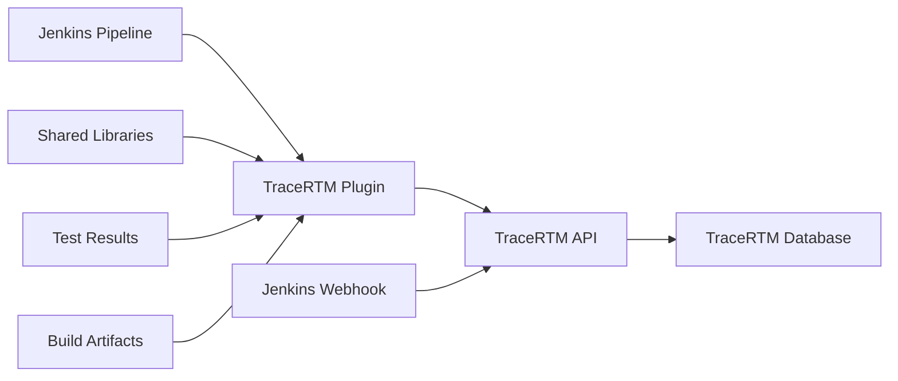

# Jenkins Integration

## Overview

The Jenkins integration enables seamless connectivity between TraceRTM and your Jenkins CI/CD pipelines. This integration provides automated traceability linking for builds, test results, artifacts, and deployments, ensuring complete visibility across your development lifecycle.

### Key Capabilities

- **Build Traceability**: Automatically link Jenkins builds to requirements, test cases, and issues
- **Test Result Integration**: Import test results and link them to test cases in TraceRTM
- **Artifact Management**: Track artifacts across builds and link them to requirements
- **Webhook Triggers**: Real-time updates from Jenkins to TraceRTM
- **Pipeline Integration**: Deep integration with Jenkins Pipeline (Declarative and Scripted)
- **Blue Ocean Support**: Enhanced visualization and traceability in Blue Ocean UI
- **Multi-branch Pipeline Support**: Track traceability across feature branches and PRs
- **Shared Library Integration**: Reusable traceability steps for standardized workflows

### Use Cases

- Link commits and builds to requirements and test cases
- Track test coverage across builds
- Generate compliance reports from CI/CD data
- Monitor requirements implementation status in real-time
- Automate impact analysis when code changes
- Create audit trails for regulated industries

## Architecture



## Installation

### Plugin Installation

#### Install from Jenkins Update Center

1. Navigate to **Manage Jenkins** > **Manage Plugins**
2. Select the **Available** tab
3. Search for "TraceRTM"
4. Check the box next to **TraceRTM Traceability Plugin**
5. Click **Install without restart** or **Download now and install after restart**

#### Manual Installation

```bash
# Download the plugin
wget https://github.com/tracertm/jenkins-plugin/releases/latest/download/tracertm.hpi

# Install via Jenkins CLI
java -jar jenkins-cli.jar -s http://localhost:8080/ install-plugin tracertm.hpi

# Restart Jenkins
java -jar jenkins-cli.jar -s http://localhost:8080/ safe-restart
```

### Configuration

#### Global Configuration

Configure the TraceRTM connection in **Manage Jenkins** > **Configure System**:

```groovy
// Jenkins Configuration as Code (JCasC)
unclassified:
  tracertm:
    serverUrl: "https://tracertm.example.com"
    apiToken: "${TRACERTM_API_TOKEN}"
    projectKey: "DEFAULT"
    validateSsl: true
    connectionTimeout: 30
    retryAttempts: 3
```

#### Credentials Setup

Store your TraceRTM API token securely:

1. Navigate to **Manage Jenkins** > **Manage Credentials**
2. Select appropriate domain (e.g., Global)
3. Click **Add Credentials**
4. Choose **Secret text** kind
5. Enter your TraceRTM API token
6. Set ID as `tracertm-api-token`

## Pipeline Integration

### Declarative Pipeline

#### Basic Integration

```groovy
pipeline {
    agent any

    environment {
        TRACERTM_PROJECT = 'PROJ-123'
    }

    options {
        tracertm(
            projectKey: env.TRACERTM_PROJECT,
            autoLink: true
        )
    }

    stages {
        stage('Build') {
            steps {
                sh 'mvn clean package'

                // Link build to requirements from commit messages
                tracertmLinkBuild(
                    parseCommits: true,
                    requirementPattern: 'REQ-\\d+'
                )
            }
        }

        stage('Test') {
            steps {
                sh 'mvn test'

                // Publish test results to TraceRTM
                junit 'target/surefire-reports/*.xml'
                tracertmPublishTests(
                    testResults: 'target/surefire-reports/*.xml',
                    linkToRequirements: true
                )
            }
        }

        stage('Deploy') {
            steps {
                sh './deploy.sh'

                // Record deployment in TraceRTM
                tracertmRecordDeployment(
                    environment: 'staging',
                    version: env.BUILD_NUMBER,
                    artifacts: ['app-${BUILD_NUMBER}.jar']
                )
            }
        }
    }

    post {
        always {
            // Send build status to TraceRTM
            tracertmNotify(
                status: currentBuild.result,
                includeArtifacts: true,
                includeTestResults: true
            )
        }
    }
}
```

#### Advanced Pipeline with Traceability Matrix

```groovy
pipeline {
    agent any

    parameters {
        string(name: 'REQUIREMENT_IDS', defaultValue: '', description: 'Comma-separated requirement IDs')
        booleanParam(name: 'RUN_IMPACT_ANALYSIS', defaultValue: true, description: 'Run impact analysis')
    }

    stages {
        stage('Pre-Build Analysis') {
            steps {
                script {
                    if (params.RUN_IMPACT_ANALYSIS) {
                        // Analyze which requirements are affected
                        def impactedReqs = tracertmImpactAnalysis(
                            changedFiles: currentBuild.changeSets,
                            includeTransitive: true
                        )

                        echo "Impacted requirements: ${impactedReqs}"

                        // Store for later stages
                        env.IMPACTED_REQUIREMENTS = impactedReqs.join(',')
                    }
                }
            }
        }

        stage('Build') {
            steps {
                sh 'mvn clean package'

                // Link to specific requirements
                tracertmLinkBuild(
                    requirementIds: params.REQUIREMENT_IDS ?: env.IMPACTED_REQUIREMENTS,
                    buildArtifacts: ['target/*.jar'],
                    sourceCommits: true
                )
            }
        }

        stage('Integration Tests') {
            steps {
                sh 'mvn verify'

                // Publish integration test results
                tracertmPublishTests(
                    testResults: 'target/failsafe-reports/*.xml',
                    testType: 'integration',
                    linkStrategy: 'auto', // Auto-link based on test names
                    createMissing: true    // Create test cases if not found
                )
            }
        }

        stage('Generate Traceability Report') {
            steps {
                // Generate comprehensive traceability report
                tracertmGenerateReport(
                    reportType: 'traceability-matrix',
                    includeTests: true,
                    includeDefects: true,
                    format: 'html',
                    outputFile: 'traceability-report.html'
                )

                publishHTML([
                    reportDir: '.',
                    reportFiles: 'traceability-report.html',
                    reportName: 'Traceability Report'
                ])
            }
        }
    }
}
```

### Scripted Pipeline

```groovy
node {
    def tracertm

    stage('Initialize') {
        // Initialize TraceRTM client
        tracertm = new TracertmClient(
            url: 'https://tracertm.example.com',
            token: credentials('tracertm-api-token'),
            project: 'PROJ-123'
        )
    }

    stage('Checkout') {
        checkout scm

        // Extract requirement IDs from commits
        def commits = sh(
            script: 'git log -1 --pretty=%B',
            returnStdout: true
        ).trim()

        env.REQUIREMENT_IDS = tracertm.extractRequirements(commits)
    }

    stage('Build') {
        sh 'mvn clean package'

        // Create build record in TraceRTM
        def buildId = tracertm.createBuild([
            name: "Build #${env.BUILD_NUMBER}",
            requirements: env.REQUIREMENT_IDS.split(','),
            status: 'in-progress',
            metadata: [
                branch: env.GIT_BRANCH,
                commit: env.GIT_COMMIT
            ]
        ])

        env.TRACERTM_BUILD_ID = buildId
    }

    stage('Test') {
        try {
            sh 'mvn test'

            // Upload test results
            tracertm.uploadTestResults(
                buildId: env.TRACERTM_BUILD_ID,
                resultsPath: 'target/surefire-reports',
                format: 'junit'
            )

        } catch (Exception e) {
            tracertm.updateBuildStatus(env.TRACERTM_BUILD_ID, 'failed')
            throw e
        }
    }

    stage('Archive') {
        archiveArtifacts artifacts: 'target/*.jar'

        // Link artifacts to build
        tracertm.linkArtifacts(
            buildId: env.TRACERTM_BUILD_ID,
            artifacts: findFiles(glob: 'target/*.jar')
        )
    }

    stage('Complete') {
        tracertm.updateBuildStatus(env.TRACERTM_BUILD_ID, 'success')
    }
}
```

## Build Traceability Linking

### Automatic Linking from Commit Messages

Configure commit message patterns to automatically extract and link requirements:

```groovy
tracertmLinkBuild {
    parseCommits = true
    commitPatterns = [
        requirement: 'REQ-\\d+',
        testCase: 'TC-\\d+',
        issue: 'ISSUE-\\d+'
    ]
    linkTypes = [
        requirement: 'implements',
        testCase: 'tests',
        issue: 'fixes'
    ]
    includeMergeCommits = false
    lookbackLimit = 20
}
```

### Manual Linking

```groovy
// Link specific requirements to build
tracertmLinkBuild(
    requirementIds: ['REQ-101', 'REQ-102', 'REQ-103'],
    linkType: 'implements'
)

// Link to test cases
tracertmLinkBuild(
    testCaseIds: ['TC-201', 'TC-202'],
    linkType: 'verifies'
)
```

### Branch-Based Linking

```groovy
stage('Link Based on Branch') {
    steps {
        script {
            def branchName = env.GIT_BRANCH

            if (branchName.startsWith('feature/REQ-')) {
                // Extract requirement ID from branch name
                def reqId = branchName.replaceAll('feature/(REQ-\\d+).*', '$1')

                tracertmLinkBuild(
                    requirementIds: [reqId],
                    linkType: 'implements',
                    metadata: [
                        branch: branchName,
                        feature: true
                    ]
                )
            }
        }
    }
}
```

## Test Result Integration

### JUnit Test Results

```groovy
stage('Unit Tests') {
    steps {
        sh 'mvn test'

        // Publish JUnit results
        junit 'target/surefire-reports/*.xml'

        tracertmPublishTests {
            testResults = 'target/surefire-reports/*.xml'
            format = 'junit'
            testType = 'unit'

            // Mapping strategy
            mappingStrategy = 'name-based' // or 'annotation-based', 'config-file'

            // Auto-create test cases
            autoCreateTestCases = true
            testCaseTemplate = 'default-unit-test'

            // Link to requirements
            linkToRequirements = true
            requirementMappingFile = 'test-mapping.json'
        }
    }
}
```

### TestNG Results

```groovy
tracertmPublishTests {
    testResults = 'target/testng-results.xml'
    format = 'testng'
    testType = 'integration'

    // Extract requirement IDs from test annotations
    annotationMapping = [
        requirement: '@Requirement',
        testCase: '@TestCase'
    ]
}
```

### Custom Test Results

```groovy
stage('Custom Tests') {
    steps {
        sh './run-custom-tests.sh'

        // Parse custom format and upload
        script {
            def testResults = readJSON file: 'test-results.json'

            tracertmUploadTestResults {
                results = testResults.tests.collect { test ->
                    [
                        name: test.name,
                        status: test.passed ? 'passed' : 'failed',
                        duration: test.duration,
                        testCaseId: test.traceId,
                        errorMessage: test.errorMessage
                    ]
                }
                buildId = env.TRACERTM_BUILD_ID
            }
        }
    }
}
```

## Artifact Management

### Linking Build Artifacts

```groovy
stage('Archive and Link Artifacts') {
    steps {
        // Archive in Jenkins
        archiveArtifacts artifacts: 'target/*.jar,target/*.war', fingerprint: true

        // Link to TraceRTM
        tracertmLinkArtifacts {
            artifacts = [
                [
                    path: 'target/app.jar',
                    type: 'application',
                    version: env.BUILD_NUMBER,
                    checksum: sh(script: 'sha256sum target/app.jar', returnStdout: true).split()[0]
                ],
                [
                    path: 'target/app.war',
                    type: 'webapp',
                    version: env.BUILD_NUMBER
                ]
            ]

            linkToRequirements = true
            uploadArtifacts = false // Just link, don't upload
            artifactRepository = 'nexus' // Where artifacts are stored
        }
    }
}
```

### Artifact Versioning and Traceability

```groovy
stage('Version and Track') {
    steps {
        script {
            def version = readFile('VERSION').trim()

            tracertmCreateArtifact {
                name = "MyApp"
                version = version
                buildNumber = env.BUILD_NUMBER

                // Link to all requirements in this release
                requirements = tracertmQueryRequirements {
                    milestone = version
                    status = 'implemented'
                }

                // Add metadata
                metadata = [
                    gitCommit: env.GIT_COMMIT,
                    gitBranch: env.GIT_BRANCH,
                    buildUrl: env.BUILD_URL,
                    jenkinsPipeline: env.JOB_NAME
                ]

                // Link to previous version for diff
                previousVersion = tracertmGetLatestArtifact('MyApp')?.version
            }
        }
    }
}
```

## Webhook Triggers

### Configure Jenkins Webhook

Add a webhook in TraceRTM settings to trigger Jenkins builds:

**TraceRTM Webhook Configuration:**
- URL: `https://jenkins.example.com/generic-webhook-trigger/invoke`
- Secret Token: `${JENKINS_WEBHOOK_TOKEN}`
- Events: `requirement.updated`, `test-case.created`, `release.planned`

### Generic Webhook Trigger Plugin

```groovy
pipeline {
    agent any

    triggers {
        GenericTrigger(
            genericVariables: [
                [key: 'requirement_id', value: '$.requirement.id'],
                [key: 'event_type', value: '$.event'],
                [key: 'project_key', value: '$.project.key']
            ],

            causeString: 'Triggered by TraceRTM event: $event_type',

            token: 'tracertm-webhook-token',

            regexpFilterText: '$event_type',
            regexpFilterExpression: '(requirement.updated|test-case.created)'
        )
    }

    stages {
        stage('Process TraceRTM Event') {
            steps {
                script {
                    echo "Processing event: ${env.event_type}"
                    echo "Requirement: ${env.requirement_id}"

                    if (env.event_type == 'requirement.updated') {
                        // Run impact analysis
                        tracertmImpactAnalysis(requirementId: env.requirement_id)
                    }
                }
            }
        }
    }
}
```

### Requirement Change Validation

```groovy
stage('Validate Requirement Change') {
    when {
        expression { env.event_type == 'requirement.updated' }
    }
    steps {
        script {
            // Get requirement details
            def requirement = tracertmGetRequirement(env.requirement_id)

            // Check if linked test cases exist
            if (requirement.testCases.isEmpty()) {
                echo "WARNING: Requirement ${env.requirement_id} has no test cases"
                tracertmCreateIssue(
                    title: "Missing test cases for ${env.requirement_id}",
                    type: 'quality-issue',
                    severity: 'medium'
                )
            }

            // Trigger regression tests
            build job: 'regression-tests', parameters: [
                string(name: 'REQUIREMENT_ID', value: env.requirement_id)
            ]
        }
    }
}
```

## Jenkins Shared Libraries

Create reusable TraceRTM integration steps in a shared library:

### Library Structure

```
vars/
  tracertmBuild.groovy
  tracertmTest.groovy
  tracertmDeploy.groovy
  tracertmReport.groovy
src/
  com/example/tracertm/
    TracertmClient.groovy
    RequirementParser.groovy
resources/
  templates/
    traceability-report.html
```

### Shared Library Step Example

```groovy
// vars/tracertmBuild.groovy
def call(Map config = [:]) {
    def client = new com.example.tracertm.TracertmClient(
        url: config.url ?: env.TRACERTM_URL,
        token: config.token ?: env.TRACERTM_TOKEN
    )

    // Parse commits for requirements
    def requirements = parseCommitsForRequirements()

    // Create build record
    def buildId = client.createBuild([
        name: "Build #${env.BUILD_NUMBER}",
        project: config.project,
        requirements: requirements,
        branch: env.GIT_BRANCH,
        commit: env.GIT_COMMIT
    ])

    // Store for later stages
    env.TRACERTM_BUILD_ID = buildId

    return buildId
}

def parseCommitsForRequirements() {
    def commits = sh(
        script: 'git log -10 --pretty=format:"%s"',
        returnStdout: true
    )

    def parser = new com.example.tracertm.RequirementParser()
    return parser.extractRequirements(commits)
}
```

### Using Shared Library in Pipeline

```groovy
@Library('tracertm-lib@main') _

pipeline {
    agent any

    stages {
        stage('Build') {
            steps {
                // Use shared library step
                script {
                    tracertmBuild(
                        project: 'PROJ-123',
                        url: 'https://tracertm.example.com'
                    )
                }

                sh 'mvn clean package'
            }
        }

        stage('Test') {
            steps {
                sh 'mvn test'

                // Use shared library test step
                tracertmTest(
                    resultsPath: 'target/surefire-reports',
                    format: 'junit',
                    linkStrategy: 'auto'
                )
            }
        }

        stage('Report') {
            steps {
                // Generate traceability report
                tracertmReport(
                    type: 'traceability-matrix',
                    includeTests: true,
                    format: 'html'
                )
            }
        }
    }
}
```

## Blue Ocean Integration

### Enhanced Visualization

The TraceRTM plugin integrates with Blue Ocean to provide enhanced visualization:

```groovy
pipeline {
    agent any

    stages {
        stage('Build with Traceability') {
            steps {
                script {
                    // TraceRTM Blue Ocean extension provides visual links
                    tracertmBuildWithVisualization {
                        requirements = ['REQ-101', 'REQ-102']
                        showInTimeline = true
                        annotateStages = true
                    }
                }

                sh 'mvn clean package'
            }
        }
    }
}
```

### Custom Blue Ocean Cards

Display traceability information in Blue Ocean:

```groovy
stage('Traceability Summary') {
    steps {
        script {
            def summary = tracertmGetBuildSummary()

            // Create Blue Ocean card
            blueOceanCard([
                title: 'Traceability Summary',
                content: """
                    Requirements: ${summary.requirementCount}
                    Test Cases: ${summary.testCaseCount}
                    Coverage: ${summary.coverage}%
                """,
                link: summary.reportUrl
            ])
        }
    }
}
```

## Best Practices

### 1. Consistent Requirement Naming

Use consistent patterns in commit messages and branch names:

```
✓ Good:
  - "Implement REQ-101: User authentication"
  - "Fix ISSUE-234 affecting REQ-101"
  - Branch: feature/REQ-101-authentication

✗ Bad:
  - "Fixed login bug"
  - "Updates"
  - Branch: johns-feature
```

### 2. Automated Traceability Checks

Add quality gates to enforce traceability:

```groovy
stage('Traceability Validation') {
    steps {
        script {
            def validation = tracertmValidate {
                requireRequirementLinks = true
                requireTestCoverage = 80
                requireApprovals = true
            }

            if (!validation.passed) {
                error("Traceability validation failed: ${validation.errors}")
            }
        }
    }
}
```

### 3. Environment-Specific Configuration

```groovy
def getTracertmConfig() {
    def configs = [
        dev: [
            url: 'https://tracertm-dev.example.com',
            project: 'PROJ-DEV',
            autoLink: true
        ],
        staging: [
            url: 'https://tracertm-staging.example.com',
            project: 'PROJ-STG',
            autoLink: true
        ],
        prod: [
            url: 'https://tracertm.example.com',
            project: 'PROJ-PROD',
            autoLink: false,
            requireApproval: true
        ]
    ]

    return configs[env.ENVIRONMENT] ?: configs.dev
}
```

### 4. Error Handling and Retries

```groovy
def tracertmWithRetry(Closure body) {
    retry(3) {
        try {
            body()
        } catch (Exception e) {
            echo "TraceRTM operation failed: ${e.message}"
            sleep(5)
            throw e
        }
    }
}

// Usage
tracertmWithRetry {
    tracertmPublishTests(testResults: 'target/surefire-reports/*.xml')
}
```

### 5. Parallel Test Execution with Traceability

```groovy
stage('Parallel Tests') {
    parallel {
        stage('Unit Tests') {
            steps {
                sh 'mvn test'
                tracertmPublishTests(
                    testResults: 'target/surefire-reports/*.xml',
                    testType: 'unit'
                )
            }
        }
        stage('Integration Tests') {
            steps {
                sh 'mvn verify'
                tracertmPublishTests(
                    testResults: 'target/failsafe-reports/*.xml',
                    testType: 'integration'
                )
            }
        }
    }
}
```

### 6. Multi-branch Pipeline Configuration

```groovy
pipeline {
    agent any

    stages {
        stage('Branch-Specific Traceability') {
            steps {
                script {
                    def config = [:]

                    if (env.BRANCH_NAME == 'main') {
                        config.strictValidation = true
                        config.requireApprovals = true
                        config.generateComplianceReport = true
                    } else if (env.BRANCH_NAME.startsWith('release/')) {
                        config.strictValidation = true
                        config.generateReleaseNotes = true
                    } else {
                        config.strictValidation = false
                    }

                    tracertmConfigure(config)
                }
            }
        }
    }
}
```

### 7. Audit Trail and Compliance

```groovy
stage('Generate Compliance Report') {
    when {
        branch 'main'
    }
    steps {
        tracertmGenerateReport {
            type = 'compliance-audit'
            includeTestResults = true
            includeCodeChanges = true
            includeApprovals = true
            includeDeployments = true
            format = 'pdf'
            outputFile = "compliance-report-${env.BUILD_NUMBER}.pdf"

            // For regulated industries
            certify = true
            certificationLevel = 'FDA-21-CFR-Part-11'
        }

        archiveArtifacts artifacts: '*.pdf', fingerprint: true
    }
}
```

## Troubleshooting

### Connection Issues

```bash
# Test TraceRTM API connectivity from Jenkins
curl -H "Authorization: Bearer ${TRACERTM_TOKEN}" \
     https://tracertm.example.com/api/health

# Check Jenkins logs
tail -f /var/log/jenkins/jenkins.log | grep -i tracertm
```

### Plugin Not Found

```groovy
// Verify plugin installation
def pluginInstalled = Jenkins.instance
    .pluginManager
    .plugins
    .find { it.shortName == 'tracertm' }

if (!pluginInstalled) {
    error('TraceRTM plugin not installed')
}
```

### Authentication Failures

```groovy
// Validate credentials
stage('Validate TraceRTM Connection') {
    steps {
        script {
            try {
                tracertmHealthCheck()
                echo "TraceRTM connection successful"
            } catch (Exception e) {
                error("TraceRTM authentication failed: ${e.message}")
            }
        }
    }
}
```

## API Reference

- [Jenkins Plugin API](/docs/api-reference/jenkins-plugin)
- [TraceRTM REST API](/docs/api-reference/rest-api)
- [Webhook Events](/docs/api-reference/webhooks)

## Related Topics

- [CI/CD Integration Overview](/docs/wiki/concepts/integrations)
- [GitHub Actions Integration](/docs/wiki/concepts/integrations/github-actions)
- [GitLab CI Integration](/docs/wiki/concepts/integrations/gitlab-ci)
- [Test Management](/docs/wiki/concepts/test-management)
- [Traceability Matrix](/docs/wiki/concepts/traceability-matrix)
