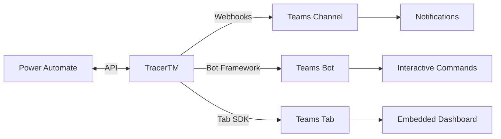

# Microsoft Teams Integration

Integrate TracerTM with Microsoft Teams to bring requirements traceability directly into your team's collaboration workspace. Receive real-time notifications, interact with traceability data, and manage requirements without leaving Teams.

## Overview

The Microsoft Teams integration provides multiple ways to connect TracerTM with your organization's Teams environment:

- **Incoming Webhooks**: Send automated notifications to Teams channels
- **Adaptive Cards**: Rich, interactive notifications with actionable buttons
- **Bot Integration**: Two-way communication for querying and managing requirements
- **Teams Tabs**: Embedded TracerTM dashboards and views
- **Power Automate Flows**: Custom workflows and automation
- **Activity Feed**: Personal notifications in Teams

### Key Capabilities

- Real-time notifications for requirement changes, test results, and approval workflows
- Interactive cards for approving/rejecting changes directly in Teams
- Search and query requirements from Teams chat
- Embedded traceability matrices and dashboards
- @mention notifications for assigned items
- Compliance and audit trail integration
- Multi-tenant support for enterprise deployments

### Integration Architecture



## Teams App Setup

### Prerequisites

- Microsoft 365 tenant with Teams enabled
- Azure AD app registration permissions
- TracerTM instance with API access
- Teams admin rights (for organization-wide deployment)

### Creating a Teams App

1. **Register Azure AD Application**

```bash
# Using Azure CLI
az ad app create \
  --display-name "TracerTM Integration" \
  --sign-in-audience AzureADMyOrg \
  --web-redirect-uris "https://your-tracertm.com/auth/teams/callback"
```

2. **Configure App Manifest**

Create a Teams app manifest (`manifest.json`):

```json
{
  "$schema": "https://developer.microsoft.com/json-schemas/teams/v1.16/MicrosoftTeams.schema.json",
  "manifestVersion": "1.16",
  "version": "1.0.0",
  "id": "YOUR-APP-ID",
  "packageName": "com.tracertm.teams",
  "developer": {
    "name": "TracerTM",
    "websiteUrl": "https://your-tracertm.com",
    "privacyUrl": "https://your-tracertm.com/privacy",
    "termsOfUseUrl": "https://your-tracertm.com/terms"
  },
  "name": {
    "short": "TracerTM",
    "full": "TracerTM Requirements Traceability"
  },
  "description": {
    "short": "Requirements traceability and management",
    "full": "TracerTM brings requirements traceability directly into Teams with real-time notifications, interactive dashboards, and collaborative workflows."
  },
  "icons": {
    "color": "color-icon.png",
    "outline": "outline-icon.png"
  },
  "accentColor": "#0078D4",
  "configurableTabs": [
    {
      "configurationUrl": "https://your-tracertm.com/teams/tab-config",
      "canUpdateConfiguration": true,
      "scopes": ["team", "groupchat"]
    }
  ],
  "staticTabs": [
    {
      "entityId": "tracertm-dashboard",
      "name": "Dashboard",
      "contentUrl": "https://your-tracertm.com/teams/dashboard",
      "websiteUrl": "https://your-tracertm.com",
      "scopes": ["personal"]
    }
  ],
  "bots": [
    {
      "botId": "YOUR-BOT-ID",
      "scopes": ["personal", "team", "groupchat"],
      "supportsFiles": false,
      "isNotificationOnly": false,
      "commandLists": [
        {
          "scopes": ["personal", "team", "groupchat"],
          "commands": [
            {
              "title": "search",
              "description": "Search requirements and items"
            },
            {
              "title": "status",
              "description": "Get project status"
            },
            {
              "title": "matrix",
              "description": "View traceability matrix"
            }
          ]
        }
      ]
    }
  ],
  "connectors": [
    {
      "connectorId": "YOUR-CONNECTOR-ID",
      "scopes": ["team"]
    }
  ],
  "permissions": [
    "identity",
    "messageTeamMembers"
  ],
  "validDomains": [
    "your-tracertm.com",
    "*.your-tracertm.com"
  ],
  "webApplicationInfo": {
    "id": "YOUR-AAD-APP-ID",
    "resource": "api://your-tracertm.com/YOUR-AAD-APP-ID"
  }
}
```

3. **Install App in Teams**

Using Teams Admin Center:
```bash
# Upload app package (ZIP containing manifest.json and icons)
# Go to Teams Admin Center > Teams apps > Manage apps > Upload
```

Using PowerShell:
```powershell
# Connect to Teams
Connect-MicrosoftTeams

# Upload custom app
New-CsTeamsApp -Path "./TracerTM-Teams-App.zip"

# Allow app for organization
Set-CsTeamsAppPermissionPolicy -Identity Global -AllowUserCustomApps $true
```

## Incoming Webhook Configuration

### Setting Up Webhooks

1. **Create Incoming Webhook in Teams**

In your Teams channel:
- Click "..." next to channel name
- Select "Connectors"
- Find "Incoming Webhook"
- Click "Configure"
- Name your webhook (e.g., "TracerTM Notifications")
- Copy the webhook URL

2. **Configure TracerTM Webhook**

```bash
# Using TracerTM CLI
tracertm integration add teams \
  --webhook-url "https://outlook.office.com/webhook/YOUR-WEBHOOK-URL" \
  --channel "requirements-tracking" \
  --events "requirement.created,requirement.updated,test.failed"
```

Configuration file (`config/integrations/teams.yml`):

```yaml
teams:
  enabled: true
  webhooks:
    - name: "Requirements Channel"
      url: "https://outlook.office.com/webhook/YOUR-WEBHOOK-URL"
      events:
        - requirement.created
        - requirement.updated
        - requirement.deleted
        - link.created
        - test.failed
        - approval.requested
      filters:
        projects:
          - "project-123"
          - "project-456"
        severity:
          - critical
          - high
      rate_limit: 30  # messages per minute

    - name: "Test Results Channel"
      url: "https://outlook.office.com/webhook/ANOTHER-WEBHOOK-URL"
      events:
        - test.completed
        - test.failed
        - coverage.updated
      batch_enabled: true
      batch_size: 10
      batch_interval: 300  # seconds
```

3. **Sending Webhook Messages**

Using the TracerTM API:

```python
from tracertm.integrations.teams import TeamsWebhook

webhook = TeamsWebhook(
    url="https://outlook.office.com/webhook/YOUR-WEBHOOK-URL"
)

# Simple message
webhook.send_message(
    title="Requirement Updated",
    text="REQ-123: User authentication requirements have been modified",
    theme_color="0078D4"
)

# Message with facts
webhook.send_message(
    title="Test Results",
    text="Regression test suite completed",
    facts=[
        {"name": "Total Tests", "value": "247"},
        {"name": "Passed", "value": "245"},
        {"name": "Failed", "value": "2"},
        {"name": "Duration", "value": "12m 34s"}
    ],
    theme_color="FF0000"  # Red for failures
)
```

## Adaptive Cards for Notifications

Adaptive Cards provide rich, interactive notifications in Teams. TracerTM uses Adaptive Cards for approval workflows, status updates, and interactive reports.

### Card Templates

**Requirement Change Notification**

```json
{
  "type": "message",
  "attachments": [
    {
      "contentType": "application/vnd.microsoft.card.adaptive",
      "content": {
        "$schema": "http://adaptivecards.io/schemas/adaptive-card.json",
        "type": "AdaptiveCard",
        "version": "1.4",
        "body": [
          {
            "type": "Container",
            "style": "emphasis",
            "items": [
              {
                "type": "ColumnSet",
                "columns": [
                  {
                    "type": "Column",
                    "width": "auto",
                    "items": [
                      {
                        "type": "Image",
                        "url": "https://your-tracertm.com/icons/requirement.png",
                        "size": "small"
                      }
                    ]
                  },
                  {
                    "type": "Column",
                    "width": "stretch",
                    "items": [
                      {
                        "type": "TextBlock",
                        "text": "Requirement Updated",
                        "weight": "bolder",
                        "size": "medium"
                      },
                      {
                        "type": "TextBlock",
                        "text": "REQ-123",
                        "isSubtle": true,
                        "spacing": "none"
                      }
                    ]
                  }
                ]
              }
            ]
          },
          {
            "type": "Container",
            "items": [
              {
                "type": "TextBlock",
                "text": "**Title:** User Authentication Requirements",
                "wrap": true
              },
              {
                "type": "TextBlock",
                "text": "**Changed By:** John Doe",
                "wrap": true
              },
              {
                "type": "TextBlock",
                "text": "**Project:** Web Portal v2.0",
                "wrap": true
              },
              {
                "type": "FactSet",
                "facts": [
                  {
                    "title": "Status:",
                    "value": "In Review"
                  },
                  {
                    "title": "Priority:",
                    "value": "High"
                  },
                  {
                    "title": "Linked Items:",
                    "value": "12 test cases, 3 design docs"
                  }
                ]
              }
            ]
          },
          {
            "type": "Container",
            "items": [
              {
                "type": "TextBlock",
                "text": "**Changes:**",
                "weight": "bolder"
              },
              {
                "type": "TextBlock",
                "text": "- Added OAuth 2.0 support\n- Updated password complexity rules\n- Added MFA requirement",
                "wrap": true
              }
            ]
          }
        ],
        "actions": [
          {
            "type": "Action.OpenUrl",
            "title": "View Details",
            "url": "https://your-tracertm.com/requirements/REQ-123"
          },
          {
            "type": "Action.OpenUrl",
            "title": "View Impact",
            "url": "https://your-tracertm.com/requirements/REQ-123/impact"
          },
          {
            "type": "Action.Http",
            "title": "Approve",
            "method": "POST",
            "url": "https://your-tracertm.com/api/requirements/REQ-123/approve",
            "headers": [
              {
                "name": "Authorization",
                "value": "Bearer {{token}}"
              }
            ]
          }
        ]
      }
    }
  ]
}
```

**Test Failure Alert**

```python
from tracertm.integrations.teams import AdaptiveCard

card = AdaptiveCard()
card.add_header(
    title="Test Failures Detected",
    icon_url="https://your-tracertm.com/icons/alert.png",
    theme_color="attention"
)

card.add_fact_set([
    {"title": "Test Suite", "value": "Regression Tests"},
    {"title": "Failed Tests", "value": "3 of 247"},
    {"title": "Build", "value": "#1234"},
    {"title": "Branch", "value": "main"}
])

card.add_section(
    title="Failed Tests",
    text="- test_user_authentication_oauth\n- test_session_timeout\n- test_password_reset_email"
)

card.add_actions([
    {
        "type": "Action.OpenUrl",
        "title": "View Test Results",
        "url": "https://your-tracertm.com/tests/run/1234"
    },
    {
        "type": "Action.OpenUrl",
        "title": "View Logs",
        "url": "https://your-tracertm.com/tests/run/1234/logs"
    }
])

webhook.send_card(card)
```

## Bot Integration

The TracerTM bot enables two-way communication with Teams users, allowing them to query requirements, get status updates, and perform actions.

### Bot Setup

1. **Register Bot in Azure**

```bash
az bot create \
  --name TracerTMBot \
  --resource-group your-resource-group \
  --kind registration \
  --appid YOUR-AAD-APP-ID \
  --endpoint https://your-tracertm.com/api/teams/bot
```

2. **Implement Bot Handler**

```python
from botbuilder.core import ActivityHandler, TurnContext
from botbuilder.schema import Activity, ActivityTypes

class TracerTMBot(ActivityHandler):

    async def on_message_activity(self, turn_context: TurnContext):
        text = turn_context.activity.text.lower()

        if text.startswith("search"):
            await self.handle_search(turn_context)
        elif text.startswith("status"):
            await self.handle_status(turn_context)
        elif text.startswith("matrix"):
            await self.handle_matrix(turn_context)
        elif text.startswith("help"):
            await self.send_help(turn_context)
        else:
            await turn_context.send_activity(
                "I didn't understand that. Type 'help' for available commands."
            )

    async def handle_search(self, turn_context: TurnContext):
        query = turn_context.activity.text[7:].strip()
        results = await search_requirements(query)

        card = self.create_search_results_card(results)
        await turn_context.send_activity(
            Activity(
                type=ActivityTypes.message,
                attachments=[card]
            )
        )

    async def handle_status(self, turn_context: TurnContext):
        # Get project status and send adaptive card
        pass

    async def on_teams_signin_verify_state(self, turn_context: TurnContext):
        # Handle authentication
        pass
```

### Bot Commands

Available bot commands:

```
@TracerTM search <query>          - Search requirements and items
@TracerTM status [project]        - Get project status
@TracerTM matrix [project]        - View traceability matrix
@TracerTM item <id>               - Get item details
@TracerTM assign <id> @user       - Assign item to user
@TracerTM coverage [project]      - View test coverage
@TracerTM report <type>           - Generate report
@TracerTM help                    - Show help message
```

Example usage in Teams:
```
User: @TracerTM search authentication
Bot: Found 12 items matching "authentication":
     - REQ-123: User Authentication
     - REQ-124: OAuth Integration
     - TST-045: Auth Flow Test
     [View all results]

User: @TracerTM item REQ-123
Bot: [Adaptive card with REQ-123 details]

User: @TracerTM assign REQ-123 @john.doe
Bot: ✓ Assigned REQ-123 to John Doe
```

## Channel and Chat Notifications

### Channel Notifications

Configure notifications for specific Teams channels based on events, projects, or filters:

```yaml
notifications:
  channels:
    - channel_id: "19:abc123..."
      name: "Requirements Team"
      events:
        - requirement.created
        - requirement.updated
        - approval.requested
      filters:
        projects: ["web-portal", "mobile-app"]
        priority: ["high", "critical"]
      mention_users: true

    - channel_id: "19:def456..."
      name: "QA Team"
      events:
        - test.failed
        - test.coverage_below_threshold
      filters:
        test_types: ["integration", "e2e"]
      mention_users: true
      mention_channel: true  # @channel for critical issues
```

### Personal Chat Notifications

Send direct messages to users for assigned items or mentions:

```python
from tracertm.integrations.teams import TeamsNotifier

notifier = TeamsNotifier()

# Notify user about assignment
await notifier.send_personal_notification(
    user_id="user@domain.com",
    title="You've been assigned REQ-123",
    message="John assigned you to REQ-123: User Authentication",
    actions=[
        {"title": "View Item", "url": "https://tracertm.com/items/REQ-123"},
        {"title": "Accept", "action": "accept"},
        {"title": "Decline", "action": "decline"}
    ]
)
```

### @Mention Notifications

Automatically @mention users in Teams when they're assigned or mentioned in TracerTM:

```yaml
mentions:
  enabled: true
  events:
    - item.assigned
    - item.mentioned
    - approval.requested
    - review.requested
  include_activity_summary: true
```

## Teams Tabs for TracerTM Dashboards

Embed TracerTM dashboards directly in Teams channels as tabs.

### Configurable Tab

```typescript
// teams-tab-config.tsx
import * as microsoftTeams from "@microsoft/teams-js";

function ConfigPage() {
  microsoftTeams.initialize();

  const onSaveConfig = () => {
    microsoftTeams.settings.setSettings({
      contentUrl: `https://tracertm.com/teams/dashboard?project=${selectedProject}`,
      entityId: selectedProject,
      suggestedDisplayName: `TracerTM - ${projectName}`
    });
    microsoftTeams.settings.setValidityState(true);
  };

  return (
    <div>
      <h2>Configure TracerTM Tab</h2>
      <select onChange={(e) => setSelectedProject(e.target.value)}>
        <option value="dashboard">Dashboard</option>
        <option value="matrix">Traceability Matrix</option>
        <option value="reports">Reports</option>
      </select>
      <button onClick={onSaveConfig}>Save</button>
    </div>
  );
}
```

### Personal Tab

```typescript
// teams-dashboard.tsx
import * as microsoftTeams from "@microsoft/teams-js";

function DashboardTab() {
  useEffect(() => {
    microsoftTeams.initialize();
    microsoftTeams.authentication.getAuthToken({
      successCallback: (token) => {
        // Use token to authenticate with TracerTM API
        loadDashboardData(token);
      },
      failureCallback: (error) => {
        console.error("Auth failed", error);
      }
    });
  }, []);

  return (
    <div className="teams-dashboard">
      <h1>TracerTM Dashboard</h1>
      {/* Dashboard content */}
    </div>
  );
}
```

### Deep Linking

Create deep links to open specific views in Teams tabs:

```typescript
const deepLink = `https://teams.microsoft.com/l/entity/${appId}/${entityId}?context=${encodeURIComponent(JSON.stringify({
  subEntityId: "requirement-REQ-123",
  channelId: "19:abc123..."
}))}`;
```

## Power Automate Integration

### Flow Templates

**New Requirement Flow**

```
Trigger: When a requirement is created in TracerTM
Actions:
  1. Get requirement details
  2. Create item in SharePoint list
  3. Send adaptive card to Teams
  4. Create Planner task
  5. Add to project timeline
```

**Approval Workflow**

```
Trigger: When approval is requested in TracerTM
Actions:
  1. Post adaptive card to Teams channel
  2. Wait for response
  3. If approved:
     - Update requirement status in TracerTM
     - Notify stakeholders
  4. If rejected:
     - Add comment to requirement
     - Notify author
```

### Custom Connector

Create a custom connector for Power Automate:

```json
{
  "swagger": "2.0",
  "info": {
    "title": "TracerTM",
    "description": "Requirements traceability management",
    "version": "1.0"
  },
  "host": "your-tracertm.com",
  "basePath": "/api/v1",
  "schemes": ["https"],
  "consumes": ["application/json"],
  "produces": ["application/json"],
  "paths": {
    "/requirements": {
      "post": {
        "summary": "Create requirement",
        "operationId": "CreateRequirement",
        "parameters": [
          {
            "name": "body",
            "in": "body",
            "required": true,
            "schema": {
              "type": "object",
              "properties": {
                "title": {"type": "string"},
                "description": {"type": "string"},
                "project_id": {"type": "string"}
              }
            }
          }
        ]
      }
    }
  }
}
```

## Security and Compliance

### Authentication

TracerTM Teams integration supports multiple authentication methods:

```yaml
security:
  authentication:
    method: "azure_ad"  # or "oauth2", "api_key"
    tenant_id: "YOUR-TENANT-ID"
    client_id: "YOUR-CLIENT-ID"
    scopes:
      - "https://graph.microsoft.com/User.Read"
      - "https://graph.microsoft.com/Group.Read.All"

  authorization:
    role_mapping:
      teams_owner: "tracertm_admin"
      teams_member: "tracertm_user"
      teams_guest: "tracertm_readonly"
```

### Data Security

- All communications encrypted with TLS 1.3
- Webhook URLs treated as secrets
- Bot messages use Azure Bot Service encryption
- Personal data handling compliant with GDPR
- Message retention follows Teams policies

### Compliance Features

```yaml
compliance:
  audit_logging:
    enabled: true
    events:
      - message.sent
      - card.action
      - bot.interaction
      - tab.viewed
    retention_days: 90

  data_residency:
    region: "US"  # or "EU", "UK", "APAC"

  information_barriers:
    enabled: true
    respect_teams_policies: true
```

### Permissions

Required permissions for Teams app:

- `ChannelMessage.Read.All` - Read channel messages
- `ChannelMessage.Send` - Send messages to channels
- `Chat.ReadWrite` - Read and write chat messages
- `TeamsActivity.Send` - Send activity feed notifications
- `User.Read` - Read user profiles
- `Group.Read.All` - Read group/team information

## Best Practices for Enterprise Teams

### 1. Channel Organization

```yaml
recommended_structure:
  teams:
    - name: "Product Development"
      channels:
        - name: "Requirements"
          purpose: "Requirement changes and approvals"
          notifications:
            - requirement.created
            - requirement.updated
            - approval.requested

        - name: "Test Results"
          purpose: "Test execution and coverage"
          notifications:
            - test.failed
            - coverage.changed

        - name: "Compliance"
          purpose: "Audit and compliance reports"
          notifications:
            - audit.created
            - compliance.check_failed
```

### 2. Notification Management

- Use severity-based routing (critical → @channel, low → silent)
- Batch non-urgent notifications (every 4 hours)
- Implement quiet hours (respect user time zones)
- Allow user preferences for notification types
- Use threaded conversations for related updates

### 3. Bot Interaction Guidelines

- Provide clear help documentation (`@TracerTM help`)
- Use conversational language
- Implement error handling with helpful messages
- Support natural language queries
- Provide command autocomplete

### 4. Performance Optimization

```yaml
performance:
  webhook:
    rate_limit: 30  # per minute
    retry_policy:
      max_attempts: 3
      backoff: exponential

  bot:
    response_timeout: 10  # seconds
    cache_duration: 300  # seconds

  tabs:
    lazy_loading: true
    data_refresh: 60  # seconds
```

### 5. Multi-Tenant Configuration

```yaml
tenants:
  - tenant_id: "TENANT-1"
    name: "Contoso"
    webhook_url: "https://outlook.office.com/webhook/TENANT1-URL"
    bot_id: "BOT-ID-TENANT1"
    data_isolation: true

  - tenant_id: "TENANT-2"
    name: "Fabrikam"
    webhook_url: "https://outlook.office.com/webhook/TENANT2-URL"
    bot_id: "BOT-ID-TENANT2"
    data_isolation: true
```

### 6. Monitoring and Analytics

Track integration health and usage:

```python
from tracertm.integrations.teams import TeamsAnalytics

analytics = TeamsAnalytics()

# Track metrics
analytics.track_event("notification.sent", {
    "channel": "requirements",
    "event_type": "requirement.created"
})

# Monitor health
health = await analytics.get_health_status()
# {
#   "webhook_success_rate": 0.99,
#   "bot_response_time_avg": 245,  # ms
#   "daily_active_users": 127
# }
```

### 7. Disaster Recovery

```yaml
disaster_recovery:
  webhook_failover:
    enabled: true
    backup_channels:
      - "https://outlook.office.com/webhook/BACKUP-URL"

  message_queue:
    enabled: true
    provider: "azure_service_bus"
    retry_duration: 86400  # 24 hours

  data_backup:
    configuration: daily
    retention: 30  # days
```

## Troubleshooting

### Common Issues

**Webhook Not Receiving Messages**
- Verify webhook URL is active in Teams
- Check rate limiting (30 messages/minute)
- Validate JSON payload format
- Check firewall/proxy settings

**Bot Not Responding**
- Verify bot endpoint is accessible
- Check Azure Bot Service status
- Review bot authentication tokens
- Check conversation ID is valid

**Adaptive Cards Not Rendering**
- Validate card JSON against schema
- Check Teams client version supports card version
- Review card size limits (28 KB)
- Test card in Adaptive Cards Designer

**Tab Authentication Failing**
- Verify AAD app registration
- Check redirect URIs configured
- Review token scopes
- Clear Teams cache

## Related Resources

- [Teams Developer Documentation](https://docs.microsoft.com/microsoftteams/platform/)
- [Adaptive Cards Designer](https://adaptivecards.io/designer/)
- [Bot Framework SDK](https://github.com/Microsoft/botbuilder-js)
- [Power Automate Templates](/docs/wiki/integrations/power-automate)
- [TracerTM API Reference](/docs/api-reference)
- [Security Best Practices](/docs/wiki/guides/security)

