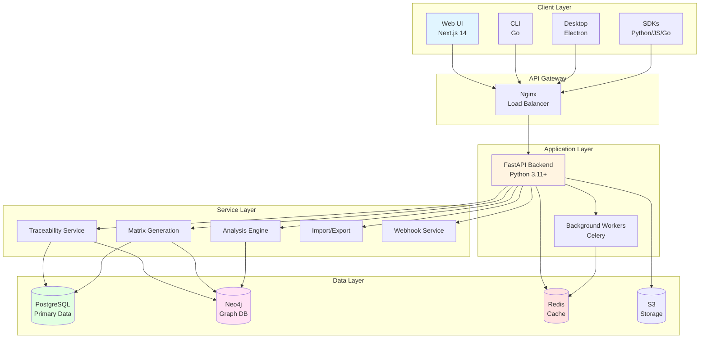
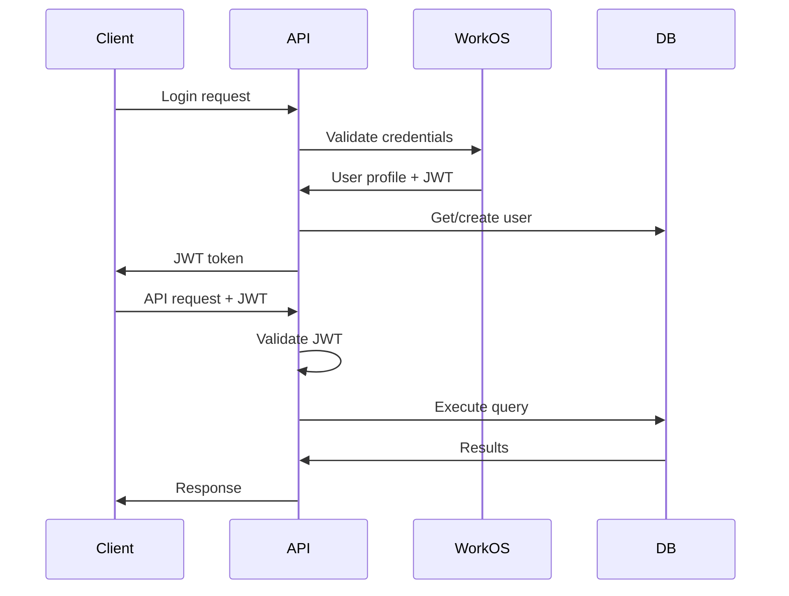

import { Callout } from 'fumadocs-ui/components/callout';
import { FileTree } from 'fumadocs-ui/components/file-tree';
import { Tabs, Tab } from 'fumadocs-ui/components/tabs';

# Architecture Overview

TraceRTM is built on modern, scalable architecture principles using Python (FastAPI), React (Next.js), PostgreSQL, and Neo4j.

## System Architecture



## Technology Stack

### Backend

| **Component** | **Technology** | **Purpose** |
|---------------|----------------|-------------|
| **API Framework** | FastAPI 0.104+ | High-performance async REST API |
| **Language** | Python 3.11+ | Business logic, services |
| **ORM** | SQLAlchemy 2.0 | Database access, models |
| **Migrations** | Alembic | Schema versioning |
| **Validation** | Pydantic 2.0 | Request/response validation |
| **Auth** | WorkOS AuthKit | Authentication & SSO |
| **Task Queue** | Celery + Redis | Background jobs |

### Frontend

| **Component** | **Technology** | **Purpose** |
|---------------|----------------|-------------|
| **Framework** | Next.js 14 | React framework, SSR |
| **Language** | TypeScript 5.0+ | Type-safe UI code |
| **Styling** | Tailwind CSS 3.4 | Utility-first CSS |
| **UI Components** | Radix UI | Accessible components |
| **State Management** | TanStack Query | Server state |
| **Forms** | React Hook Form | Form handling |
| **Charts** | Recharts | Data visualization |

### Databases

| **Database** | **Purpose** | **Data Types** |
|--------------|-------------|----------------|
| **PostgreSQL 15+** | Primary data store | Items, projects, users, metadata |
| **Neo4j 5+** | Graph relationships | Links, traceability graph, impact analysis |
| **Redis 7+** | Cache & sessions | API cache, session data, rate limiting |

### Infrastructure

| **Component** | **Technology** | **Purpose** |
|---------------|----------------|-------------|
| **Container** | Docker | Application packaging |
| **Orchestration** | Kubernetes | Production deployment |
| **Reverse Proxy** | Nginx | Load balancing, SSL |
| **Monitoring** | Prometheus + Grafana | Metrics & dashboards |
| **Logging** | Loki + Promtail | Centralized logging |
| **Tracing** | Jaeger | Distributed tracing |

## High-Level Components

### 1. API Layer

**FastAPI Application** (`src/backend/src/main.py`):

```python
from fastapi import FastAPI, Depends
from fastapi.middleware.cors import CORSMiddleware
from src.api.routes import router
from src.core.config import settings

app = FastAPI(
    title="TraceRTM API",
    version="1.0.0",
    docs_url="/docs",
    redoc_url="/redoc"
)

# CORS middleware
app.add_middleware(
    CORSMiddleware,
    allow_origins=settings.ALLOWED_ORIGINS,
    allow_credentials=True,
    allow_methods=["*"],
    allow_headers=["*"],
)

# Include routers
app.include_router(router, prefix="/api/v1")
```

**Route Organization**:

<FileTree>
  <FileTree.Folder name="src/api" defaultOpen>
    <FileTree.Folder name="routes">
      <FileTree.File name="projects.py" />
      <FileTree.File name="requirements.py" />
      <FileTree.File name="links.py" />
      <FileTree.File name="baselines.py" />
      <FileTree.File name="views.py" />
      <FileTree.File name="analysis.py" />
    </FileTree.Folder>
    <FileTree.File name="dependencies.py" />
    <FileTree.File name="middleware.py" />
  </FileTree.Folder>
</FileTree>

### 2. Service Layer

**Hexagonal Architecture** - Business logic isolated from infrastructure:

```python
# src/services/traceability_service.py

from typing import List
from src.domain.models import Requirement, Link
from src.repositories.requirement_repository import RequirementRepository
from src.repositories.link_repository import LinkRepository

class TraceabilityService:
    """Business logic for traceability operations."""

    def __init__(
        self,
        requirement_repo: RequirementRepository,
        link_repo: LinkRepository
    ):
        self.requirement_repo = requirement_repo
        self.link_repo = link_repo

    async def create_requirement_with_links(
        self,
        requirement: Requirement,
        parent_ids: List[str]
    ) -> Requirement:
        """Create requirement and establish parent links."""

        # Validate parents exist
        parents = await self.requirement_repo.get_many(parent_ids)
        if len(parents) != len(parent_ids):
            raise ValueError("Some parent requirements not found")

        # Create requirement
        created = await self.requirement_repo.create(requirement)

        # Create links
        for parent_id in parent_ids:
            await self.link_repo.create(Link(
                source_id=created.id,
                target_id=parent_id,
                link_type="parent"
            ))

        return created

    async def get_full_trace(
        self,
        requirement_id: str,
        direction: str = "both"
    ) -> dict:
        """Get complete forward/backward trace."""

        if direction == "forward":
            return await self._get_forward_trace(requirement_id)
        elif direction == "backward":
            return await self._get_backward_trace(requirement_id)
        else:
            forward = await self._get_forward_trace(requirement_id)
            backward = await self._get_backward_trace(requirement_id)
            return {**forward, **backward}
```

**Service Organization**:

- `TraceabilityService` - Core traceability operations
- `MatrixGenerationService` - RTM generation
- `AnalysisService` - Coverage, gaps, impact analysis
- `BaselineService` - Baseline management
- `ImportExportService` - Data migration
- `WebhookService` - Event notifications

### 3. Repository Layer

**Data Access** - Abstraction over databases:

```python
# src/repositories/requirement_repository.py

from typing import List, Optional
from sqlalchemy import select
from sqlalchemy.ext.asyncio import AsyncSession
from src.domain.models import Requirement
from src.infrastructure.database import get_session

class RequirementRepository:
    """PostgreSQL repository for requirements."""

    def __init__(self, session: AsyncSession):
        self.session = session

    async def create(self, requirement: Requirement) -> Requirement:
        """Create requirement."""
        self.session.add(requirement)
        await self.session.commit()
        await self.session.refresh(requirement)
        return requirement

    async def get(self, id: str) -> Optional[Requirement]:
        """Get requirement by ID."""
        result = await self.session.execute(
            select(Requirement).where(Requirement.id == id)
        )
        return result.scalar_one_or_none()

    async def get_many(
        self,
        ids: List[str]
    ) -> List[Requirement]:
        """Get multiple requirements."""
        result = await self.session.execute(
            select(Requirement).where(Requirement.id.in_(ids))
        )
        return result.scalars().all()

    async def list_by_project(
        self,
        project_id: str,
        filters: dict = None,
        skip: int = 0,
        limit: int = 100
    ) -> List[Requirement]:
        """List requirements with filters."""
        query = select(Requirement).where(
            Requirement.project_id == project_id
        )

        if filters:
            if "type" in filters:
                query = query.where(Requirement.type == filters["type"])
            if "status" in filters:
                query = query.where(Requirement.status == filters["status"])

        query = query.offset(skip).limit(limit)
        result = await self.session.execute(query)
        return result.scalars().all()
```

**Neo4j Repository** for graph operations:

```python
# src/repositories/graph_repository.py

from neo4j import AsyncGraphDatabase
from typing import List, Dict

class GraphRepository:
    """Neo4j repository for relationship queries."""

    def __init__(self, driver: AsyncGraphDatabase.driver):
        self.driver = driver

    async def get_impact_tree(
        self,
        item_id: str,
        depth: int = 5
    ) -> Dict:
        """Get impact tree using graph traversal."""

        async with self.driver.session() as session:
            result = await session.run(
                """
                MATCH path = (source:Item {id: $item_id})-[*1..$depth]->()
                RETURN path
                """,
                item_id=item_id,
                depth=depth
            )

            paths = []
            async for record in result:
                paths.append(record["path"])

            return self._build_tree(paths)

    async def find_shortest_path(
        self,
        source_id: str,
        target_id: str
    ) -> List[Dict]:
        """Find shortest traceability path."""

        async with self.driver.session() as session:
            result = await session.run(
                """
                MATCH path = shortestPath(
                    (source:Item {id: $source_id})
                    -[*]->
                    (target:Item {id: $target_id})
                )
                RETURN path
                """,
                source_id=source_id,
                target_id=target_id
            )

            record = await result.single()
            return self._path_to_dict(record["path"]) if record else None
```

### 4. Domain Layer

**Domain Models** using SQLAlchemy:

```python
# src/domain/models/requirement.py

from sqlalchemy import Column, String, Text, JSON, DateTime, Enum
from sqlalchemy.dialects.postgresql import UUID
from src.infrastructure.database import Base
import uuid
from datetime import datetime

class Requirement(Base):
    """Requirement domain model."""

    __tablename__ = "requirements"

    id = Column(
        UUID(as_uuid=True),
        primary_key=True,
        default=uuid.uuid4
    )
    project_id = Column(UUID(as_uuid=True), nullable=False, index=True)
    type = Column(
        Enum("BR", "FR", "NFR", name="requirement_type"),
        nullable=False
    )
    title = Column(String(500), nullable=False)
    description = Column(Text, nullable=True)
    priority = Column(
        Enum("MUST", "SHOULD", "COULD", "WONT", name="priority"),
        nullable=False,
        default="SHOULD"
    )
    status = Column(
        Enum("draft", "review", "approved", "implemented", name="status"),
        nullable=False,
        default="draft"
    )
    custom_fields = Column(JSON, default=dict)
    created_at = Column(DateTime, default=datetime.utcnow)
    updated_at = Column(
        DateTime,
        default=datetime.utcnow,
        onupdate=datetime.utcnow
    )

    # Indexes for common queries
    __table_args__ = (
        Index("ix_requirements_project_type", "project_id", "type"),
        Index("ix_requirements_status", "status"),
        Index("ix_requirements_priority", "priority"),
    )
```

## Data Model

### PostgreSQL Schema

**Core Tables**:

```sql
-- Projects
CREATE TABLE projects (
    id UUID PRIMARY KEY DEFAULT gen_random_uuid(),
    key VARCHAR(50) UNIQUE NOT NULL,
    name VARCHAR(200) NOT NULL,
    description TEXT,
    settings JSONB DEFAULT '{}',
    created_at TIMESTAMP DEFAULT NOW(),
    updated_at TIMESTAMP DEFAULT NOW()
);

-- Items (requirements, test cases, etc.)
CREATE TABLE items (
    id UUID PRIMARY KEY DEFAULT gen_random_uuid(),
    project_id UUID REFERENCES projects(id) ON DELETE CASCADE,
    type VARCHAR(20) NOT NULL, -- BR, FR, NFR, TC, etc.
    title VARCHAR(500) NOT NULL,
    description TEXT,
    status VARCHAR(50) NOT NULL DEFAULT 'draft',
    priority VARCHAR(20),
    custom_fields JSONB DEFAULT '{}',
    created_by UUID REFERENCES users(id),
    created_at TIMESTAMP DEFAULT NOW(),
    updated_at TIMESTAMP DEFAULT NOW()
);

CREATE INDEX idx_items_project_type ON items(project_id, type);
CREATE INDEX idx_items_status ON items(status);
CREATE INDEX idx_items_custom_fields ON items USING GIN(custom_fields);

-- Links (traceability relationships)
CREATE TABLE links (
    id UUID PRIMARY KEY DEFAULT gen_random_uuid(),
    source_id UUID REFERENCES items(id) ON DELETE CASCADE,
    target_id UUID REFERENCES items(id) ON DELETE CASCADE,
    link_type VARCHAR(50) NOT NULL,
    rationale TEXT,
    strength VARCHAR(20) DEFAULT 'strong',
    created_at TIMESTAMP DEFAULT NOW()
);

CREATE INDEX idx_links_source ON links(source_id);
CREATE INDEX idx_links_target ON links(target_id);
CREATE INDEX idx_links_type ON links(link_type);
CREATE UNIQUE INDEX idx_links_unique ON links(source_id, target_id, link_type);

-- Baselines
CREATE TABLE baselines (
    id UUID PRIMARY KEY DEFAULT gen_random_uuid(),
    project_id UUID REFERENCES projects(id) ON DELETE CASCADE,
    name VARCHAR(100) NOT NULL,
    description TEXT,
    snapshot JSONB NOT NULL, -- Full project snapshot
    frozen BOOLEAN DEFAULT FALSE,
    created_at TIMESTAMP DEFAULT NOW()
);
```

### Neo4j Graph Model

**Nodes**:

```cypher
// Item node
CREATE (item:Item {
    id: "req-fr-1",
    type: "FR",
    title: "User authentication",
    project_id: "proj-123"
})

// Project node
CREATE (project:Project {
    id: "proj-123",
    key: "PROJ",
    name: "My Project"
})
```

**Relationships**:

```cypher
// Traceability links
MATCH (fr:Item {id: "req-fr-1"})
MATCH (br:Item {id: "req-br-1"})
CREATE (fr)-[:SATISFIES {
    rationale: "FR implements business need",
    created_at: datetime()
}]->(br)

// Project membership
MATCH (item:Item {id: "req-fr-1"})
MATCH (project:Project {id: "proj-123"})
CREATE (item)-[:BELONGS_TO]->(project)
```

**Graph Queries**:

```cypher
// Get full forward trace
MATCH path = (source:Item {id: $id})-[*1..10]->()
RETURN path

// Get backward trace to root
MATCH path = ()-[*1..10]->(target:Item {id: $id})
WHERE NOT (target)-[]->()
RETURN path

// Find items affected by change
MATCH (changed:Item {id: $id})-[*1..5]->(affected)
RETURN DISTINCT affected

// Coverage analysis
MATCH (req:Item)-[:VERIFIED_BY]->(test:Item)
WHERE req.type IN ['FR', 'NFR']
RETURN req.id, COUNT(test) as test_count
```

## Key Design Patterns

### 1. Hexagonal Architecture

**Benefits**:
- Business logic independent of infrastructure
- Easy to test (mock repositories)
- Flexible data storage (swap PostgreSQL for MySQL)
- Clear separation of concerns

**Structure**:
```
Domain (core business logic)
  ↓
Services (use cases)
  ↓
Repositories (data access interface)
  ↓
Infrastructure (PostgreSQL, Neo4j implementation)
```

### 2. CQRS (Command Query Responsibility Segregation)

**Commands** (writes):
- Use PostgreSQL for transactional consistency
- Sync to Neo4j asynchronously
- Emit events for webhooks

**Queries** (reads):
- Simple queries: PostgreSQL
- Graph queries: Neo4j
- Aggregations: Redis cache

### 3. Event-Driven Architecture

**Events**:

```python
# src/events/events.py

from dataclasses import dataclass
from datetime import datetime

@dataclass
class RequirementCreated:
    requirement_id: str
    project_id: str
    created_by: str
    timestamp: datetime

@dataclass
class LinkCreated:
    link_id: str
    source_id: str
    target_id: str
    link_type: str
    timestamp: datetime
```

**Event Handlers**:

```python
# src/events/handlers.py

class EventHandler:
    async def handle_requirement_created(
        self,
        event: RequirementCreated
    ):
        # Sync to Neo4j
        await self.graph_repo.create_node(event.requirement_id)

        # Update cache
        await self.cache.invalidate(f"project:{event.project_id}")

        # Trigger webhooks
        await self.webhook_service.trigger(
            "requirement.created",
            event
        )
```

## Performance Optimization

### Caching Strategy

**Layers**:

1. **Application Cache** (Redis):
   - API responses (5 min TTL)
   - User sessions (24h TTL)
   - Project metadata (1h TTL)

2. **Database Query Cache**:
   - Prepared statements
   - Connection pooling
   - Query result caching

3. **CDN Cache**:
   - Static assets (frontend)
   - Public API responses

**Cache Invalidation**:

```python
# src/infrastructure/cache.py

class CacheManager:
    async def invalidate_project(self, project_id: str):
        """Invalidate all project-related caches."""
        patterns = [
            f"project:{project_id}:*",
            f"requirements:{project_id}:*",
            f"links:{project_id}:*",
            f"matrix:{project_id}:*",
        ]

        for pattern in patterns:
            keys = await self.redis.keys(pattern)
            if keys:
                await self.redis.delete(*keys)
```

### Database Optimization

**Indexing**:
- B-tree indexes for equality/range queries
- GIN indexes for JSONB fields
- Partial indexes for filtered queries

**Query Optimization**:
```sql
-- Efficient pagination with cursor
SELECT * FROM items
WHERE project_id = 'proj-123'
  AND created_at > '2025-01-01'
ORDER BY created_at
LIMIT 100;

-- Avoid N+1 with joins
SELECT i.*, array_agg(l.*) as links
FROM items i
LEFT JOIN links l ON l.source_id = i.id
WHERE i.project_id = 'proj-123'
GROUP BY i.id;
```

## Security Architecture

### Authentication Flow



### Authorization

**Role-Based Access Control (RBAC)**:

```python
# src/auth/authorization.py

from enum import Enum

class Permission(Enum):
    CREATE_REQUIREMENT = "requirement:create"
    UPDATE_REQUIREMENT = "requirement:update"
    DELETE_REQUIREMENT = "requirement:delete"
    APPROVE_REQUIREMENT = "requirement:approve"

class Role(Enum):
    VIEWER = ["requirement:read"]
    CONTRIBUTOR = ["requirement:read", "requirement:create", "requirement:update"]
    APPROVER = ["requirement:read", "requirement:approve"]
    ADMIN = ["*"]

def has_permission(user: User, permission: Permission) -> bool:
    """Check if user has permission."""
    user_permissions = ROLE_PERMISSIONS.get(user.role, [])
    return "*" in user_permissions or permission.value in user_permissions
```

## Next Steps

- [Backend Development](/docs/developer/backend) - Deep dive into backend
- [Frontend Development](/docs/developer/frontend) - React/Next.js guide
- [Database Guide](/docs/developer/database) - Schema and migrations
- [Testing Strategy](/docs/developer/testing) - Comprehensive testing

<Callout type="info">
**Questions about architecture?** Join [Discord #architecture](https://discord.gg/tracertm)
</Callout>
