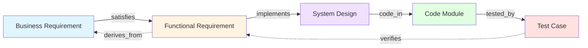
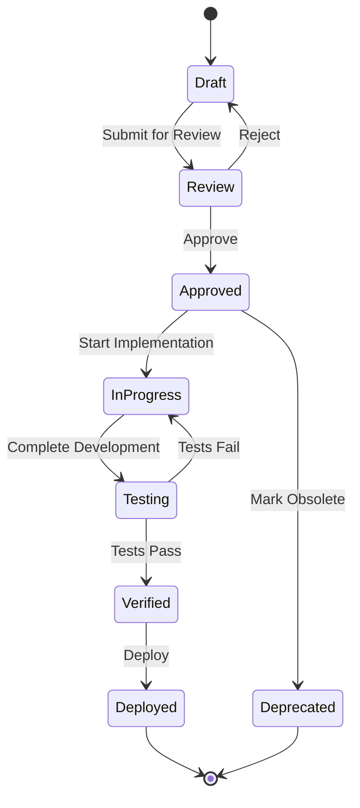

import { Callout } from 'fumadocs-ui/components/callout';
import { Tabs, Tab } from 'fumadocs-ui/components/tabs';

# Core Concepts

Understanding these core concepts will help you effectively use TraceRTM to maintain complete traceability across your product development lifecycle.

## Requirements Traceability

**Requirements traceability** is the ability to track relationships between different artifacts throughout the development lifecycle - from initial business needs through design, implementation, testing, and deployment.

<Callout type="info" title="Why Traceability Matters">
- **Compliance**: Prove regulatory requirements are met (FDA, ISO, DO-178C)
- **Quality**: Ensure nothing is missed or over-implemented
- **Change Management**: Understand impact of changes before making them
- **Testing**: Verify test coverage for all requirements
- **Audits**: Quickly demonstrate completeness and correctness
</Callout>

### Forward vs Backward Traceability



- **Forward Trace**: BR → FR → SD → CM → TC (implementation path)
- **Backward Trace**: TC → CM → SD → FR → BR (verification path)

Both directions must be complete for true traceability!

## The 16 Item Types

TraceRTM organizes work items into 16 standardized types based on industry standards (IEEE 830, ISO/IEC 12207, CMMI).

### Requirements Layer

Items that describe what the system should do:

<Tabs items={['Business Requirement', 'Functional Requirement', 'Non-Functional Requirement']}>
  <Tab value="Business Requirement">
    **Business Requirement (BR)**

    High-level business objectives and goals.

    **Example**:
    ```
    BR-1: Increase user engagement
    Description: The platform shall provide personalized
    recommendations to increase daily active users by 20%

    Links:
    - FR-15 (satisfied by): Recommendation engine
    - FR-16 (satisfied by): User behavior tracking
    - FR-17 (satisfied by): A/B testing framework
    ```

    **Typical Fields**:
    - Business value
    - Success metrics
    - Stakeholders
    - ROI analysis
  </Tab>

  <Tab value="Functional Requirement">
    **Functional Requirement (FR)**

    Specific functionality the system must provide.

    **Example**:
    ```
    FR-15: Recommendation Engine
    Description: System shall generate personalized content
    recommendations using collaborative filtering

    Acceptance Criteria:
    - Recommendations update every 4 hours
    - Algorithm considers user history from last 90 days
    - Minimum 10 recommendations per user

    Links:
    - BR-1 (satisfies): Increase user engagement
    - SD-8 (implemented_by): Recommendation Service
    - TC-45 (verified_by): Test recommendation accuracy
    ```

    **Typical Fields**:
    - Acceptance criteria
    - Priority (MoSCoW)
    - Complexity estimate
    - Dependencies
  </Tab>

  <Tab value="Non-Functional Requirement">
    **Non-Functional Requirement (NFR)**

    Quality attributes and constraints (performance, security, usability).

    **Example**:
    ```
    NFR-5: API Response Time
    Description: 95th percentile API response time shall be
    under 200ms for all endpoints

    Verification Method: Load testing with 1000 concurrent users

    Links:
    - SD-12 (implemented_by): Caching strategy
    - SD-13 (implemented_by): Database indexing
    - TC-89 (verified_by): Performance test suite
    ```

    **Categories**:
    - Performance
    - Security
    - Scalability
    - Usability
    - Reliability
    - Maintainability
  </Tab>
</Tabs>

### Design Layer

Items describing how the system is structured:

| **Type** | **Purpose** | **Example** |
|----------|-------------|-------------|
| **System Design (SD)** | High-level architecture | SD-1: Microservices architecture |
| **Interface Design (ID)** | API contracts, UI layouts | ID-3: RESTful API specification |
| **Database Design (DD)** | Schema, relationships | DD-2: User authentication schema |

### Implementation Layer

Actual code artifacts:

| **Type** | **Purpose** | **Example** |
|----------|-------------|-------------|
| **Code Module (CM)** | Source code files | CM-45: auth_service.py |
| **Component (COMP)** | Reusable components | COMP-12: LoginForm.tsx |
| **Service (SVC)** | Microservices, APIs | SVC-3: User Management Service |

### Testing Layer

Verification and validation:

| **Type** | **Purpose** | **Example** |
|----------|-------------|-------------|
| **Test Case (TC)** | Individual test | TC-101: Verify login with valid credentials |
| **Test Suite (TS)** | Group of tests | TS-5: Authentication test suite |
| **Test Result (TR)** | Execution results | TR-2024-05: Sprint 5 regression results |

### Quality Layer

Risk and issue management:

| **Type** | **Purpose** | **Example** |
|----------|-------------|-------------|
| **Risk (RISK)** | Potential problems | RISK-7: Database scalability limits |
| **Issue (ISS)** | Bugs, defects | ISS-234: Login fails on Safari |
| **Change Request (CR)** | Proposed changes | CR-15: Add biometric authentication |

### Compliance Layer

Regulatory requirements:

| **Type** | **Purpose** | **Example** |
|----------|-------------|-------------|
| **Regulation (REG)** | Legal/regulatory needs | REG-1: GDPR data privacy compliance |

<Callout type="tip" title="Customization">
While TraceRTM provides 16 standard types, you can customize:
- Field definitions
- Workflow states
- Validation rules
- Templates

See [Configuration Guide](/docs/developer/configuration) for details.
</Callout>

## Link Types and Relationships

TraceRTM supports **60+ relationship types** organized into 8 categories:

### 1. Hierarchical Relationships

Parent-child and part-whole relationships:

- **parent/child**: Decomposition (FR-1 is parent of FR-1.1, FR-1.2)
- **contains/part_of**: Composition (TS-5 contains TC-101, TC-102)

### 2. Traceability Relationships

Core traceability links:

- **satisfies/satisfied_by**: FR satisfies BR
- **implements/implemented_by**: SD implements FR
- **verifies/verified_by**: TC verifies FR
- **validates/validated_by**: Testing validates requirements

### 3. Dependency Relationships

Work dependencies:

- **depends_on/dependency_of**: FR-2 depends on FR-1 being complete
- **blocks/blocked_by**: ISS-45 blocks FR-12
- **requires/required_by**: Component requirements

### 4. Evolution Relationships

How items evolve over time:

- **derives_from/derived_to**: FR-2.0 derives from FR-1.0 (refinement)
- **replaces/replaced_by**: New requirement replaces deprecated one
- **refines/refined_by**: More detailed specification

### 5. Association Relationships

General connections:

- **related_to**: Bidirectional relationship
- **affects/affected_by**: Change impact
- **references/referenced_by**: Documentation links

### 6. Testing Relationships

Test-specific links:

- **tests/tested_by**: TC tests CM
- **covers/covered_by**: Test coverage
- **executes/executed_in**: Test execution

### 7. Quality Relationships

Quality management:

- **mitigates/mitigated_by**: RISK mitigated by FR
- **causes/caused_by**: Root cause analysis
- **fixes/fixed_by**: ISS fixed by CR

### 8. Compliance Relationships

Regulatory traceability:

- **complies_with/compliance_from**: Design complies with regulation
- **mandates/mandated_by**: REG mandates FR

<Callout type="warn" title="Link Direction Matters">
Always use the correct direction:
- ✅ FR-1 **satisfies** BR-1 (requirement satisfies business need)
- ❌ BR-1 **satisfies** FR-1 (incorrect direction)

TraceRTM automatically creates inverse relationships.
</Callout>

## The 16 Views

Each view provides unique analytical perspectives:

### Traceability Views

1. **Requirements Traceability Matrix (RTM)**
   - Complete forward/backward trace
   - Coverage percentages
   - Gap analysis

2. **Vertical Traceability View**
   - Full lifecycle trace: BR → FR → SD → CM → TC
   - Completeness indicators
   - Missing link detection

3. **Horizontal Traceability View**
   - Peer relationships at same level
   - Dependencies between requirements
   - Related items clustering

### Coverage Views

4. **Test Coverage View**
   - Requirements → Test Cases mapping
   - Untested requirements
   - Test redundancy detection

5. **Implementation Coverage View**
   - Requirements → Code mapping
   - Unimplemented requirements
   - Over-implementation detection

6. **Design Coverage View**
   - Requirements → Design artifacts
   - Design gaps
   - Architecture completeness

### Analysis Views

7. **Change Impact Analysis**
   - What a change affects
   - Ripple effect visualization
   - Impacted tests and code

8. **Risk Impact View**
   - Risk propagation through system
   - High-risk components
   - Mitigation coverage

9. **Dependency Graph View**
   - Item dependencies
   - Critical path analysis
   - Circular dependency detection

### Status Views

10. **Requirements Status Dashboard**
    - Status distribution (draft, approved, implemented)
    - Progress tracking
    - Bottleneck identification

11. **Test Execution Status**
    - Pass/fail rates
    - Execution coverage
    - Failing requirement identification

12. **Implementation Status**
    - Development progress
    - Code review status
    - Deployment status

### Quality Views

13. **Gap Analysis View**
    - Missing requirements
    - Untested functionality
    - Documentation gaps

14. **Compliance Matrix**
    - Regulatory requirements
    - Compliance coverage
    - Audit trail

15. **Issue Impact View**
    - Bug severity analysis
    - Affected requirements
    - Resolution status

### Evolution Views

16. **Change History View**
    - Requirement evolution
    - Version comparison
    - Audit log

<Callout type="info">
Each view is customizable with filters, grouping, and export options.
See [Views Documentation](/docs/user/guides/views) for details.
</Callout>

## Workflows and States

TraceRTM implements state machines for each item type:

### Standard Requirement Workflow



### State Transitions

Each state has:
- **Entry conditions**: What must be true to enter
- **Exit conditions**: What must be true to leave
- **Allowed transitions**: Next valid states
- **Required approvals**: Who can authorize transition

Example for **Approved → InProgress**:
- Entry: Requirement approved by stakeholder
- Exit: Design complete, test cases created
- Transitions: Can move to Testing or back to Approved
- Approvals: Development lead must approve

<Callout type="tip" title="Custom Workflows">
Configure workflows per project or item type:
```yaml
workflows:
  custom_agile:
    states: [Backlog, Sprint, InProgress, Review, Done]
    transitions:
      Backlog -> Sprint: requires_sprint_planning
      Sprint -> InProgress: requires_assignment
```
</Callout>

## Baseline and Versioning

**Baselines** capture snapshots of your traceability matrix:

### Creating Baselines

```bash
# Create baseline for release
tracertm baseline create v1.0.0 \
  --name "Release 1.0.0" \
  --description "First production release" \
  --freeze-requirements
```

### Comparing Baselines

```bash
# Compare current state to baseline
tracertm baseline diff v1.0.0

# Output:
# Added: 5 requirements, 12 test cases
# Modified: 3 requirements, 1 design doc
# Deleted: 2 deprecated requirements
# Coverage change: 87% → 92% (+5%)
```

<Callout type="warn" title="Frozen Baselines">
Frozen baselines are immutable - perfect for audits and compliance.
Changes require creating a new baseline version.
</Callout>

## Permissions and Access Control

Role-based access control (RBAC):

| **Role** | **Permissions** |
|----------|----------------|
| **Viewer** | Read items and views |
| **Contributor** | Create/edit items, create links |
| **Approver** | Approve requirements, transitions |
| **Project Admin** | Manage project settings, users |
| **System Admin** | All permissions, system config |

Fine-grained permissions per item type:
```yaml
permissions:
  business_requirements:
    create: [business_analyst, product_manager]
    approve: [product_manager, stakeholder]
  test_cases:
    create: [qa_engineer, developer]
    execute: [qa_engineer]
```

## Next Steps

Now that you understand the core concepts:

1. **[Creating Requirements](/docs/user/guides/creating-requirements)** - Write effective requirements
2. **[Linking Items](/docs/user/guides/linking-items)** - Build traceability relationships
3. **[Using Views](/docs/user/guides/views)** - Analyze your traceability matrix
4. **[Team Collaboration](/docs/user/guides/teams)** - Work with your team

<Callout type="info" title="Deep Dives Available">
- [Item Types Deep Dive](/docs/user/concepts/item-types)
- [Link Types Reference](/docs/user/concepts/link-types)
- [Views Reference](/docs/user/concepts/views)
- [Workflow Configuration](/docs/user/concepts/workflows)
</Callout>
