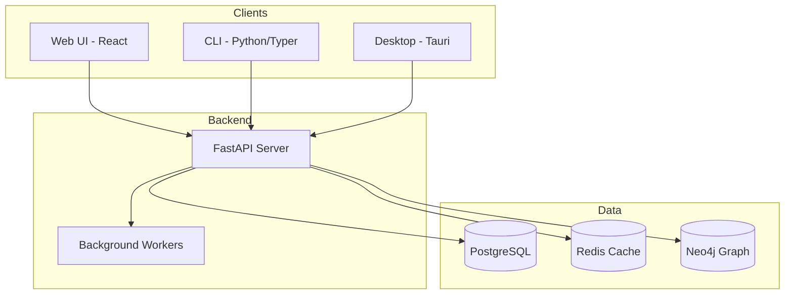

# Developer Documentation

Welcome to the TraceRTM Developer Documentation. This section is for software engineers
who want to integrate with TraceRTM, extend its functionality, or contribute to the
project.

## Architecture Overview

TraceRTM is built with a modern, scalable architecture:



## Quick Links

<Cards>
  <Card
    title="Development Setup"
    description="Get the development environment running locally"
    href="/docs/developer/setup"
    icon="Laptop"
  />
  <Card
    title="Architecture Guide"
    description="Understand the system design and components"
    href="/docs/developer/architecture"
    icon="Blocks"
  />
  <Card
    title="API Development"
    description="Work with the FastAPI backend"
    href="/docs/developer/backend"
    icon="Server"
  />
  <Card
    title="Contributing"
    description="How to contribute to TraceRTM"
    href="/docs/developer/contributing"
    icon="GitPullRequest"
  />
</Cards>

## Technology Stack

### Backend
| Component | Technology | Purpose |
|-----------|------------|---------|
| API Server | FastAPI (Python) | REST/WebSocket endpoints |
| Task Queue | Celery + Redis | Background job processing |
| Primary DB | PostgreSQL | Relational data storage |
| Graph DB | Neo4j | Traceability relationships |
| Search | Meilisearch | Full-text search |
| Cache | Redis | Session and query caching |

### Frontend
| Component | Technology | Purpose |
|-----------|------------|---------|
| Web App | React + Vite | Main web interface |
| State | Zustand | Client-side state management |
| Styling | Tailwind CSS | Utility-first styling |
| Components | Custom + Radix | UI component library |

### CLI & Desktop
| Component | Technology | Purpose |
|-----------|------------|---------|
| CLI | Python + Typer | Command-line interface |
| TUI | Textual | Terminal UI |
| Desktop | Tauri + React | Cross-platform desktop app |

## Project Structure

<FileTree>
  <Folder name="tracertm" open>
    <Folder name="src" open>
      <Folder name="tracertm">
        <Folder name="api">
          <File name="main.py" />
          <File name="routes/" />
        </Folder>
        <Folder name="cli">
          <File name="app.py" />
          <File name="commands/" />
        </Folder>
        <Folder name="models">
          <File name="item.py" />
          <File name="link.py" />
        </Folder>
        <Folder name="services">
          <File name="traceability_service.py" />
        </Folder>
      </Folder>
    </Folder>
    <Folder name="frontend">
      <Folder name="apps">
        <Folder name="web" highlight />
        <Folder name="desktop" />
      </Folder>
      <Folder name="packages">
        <Folder name="ui" />
        <Folder name="api-client" />
      </Folder>
    </Folder>
    <Folder name="docs-site">
      <File name="content/" />
      <File name="components/" />
    </Folder>
  </Folder>
</FileTree>

## Getting Started

<Steps>
  <Step>
    **Clone the repository**

    ```bash
    git clone https://github.com/tracertm/tracertm.git
    cd tracertm
    ```
  </Step>
  <Step>
    **Set up the development environment**

    ```bash
    # Install Python dependencies
    pip install -e ".[dev]"

    # Install frontend dependencies
    cd frontend && npm install
    ```
  </Step>
  <Step>
    **Start the services**

    ```bash
    # Using Docker Compose
    docker-compose -f docker-compose.dev.yml up -d

    # Start the API server
    uvicorn tracertm.api.main:app --reload
    ```
  </Step>
  <Step>
    **Run the tests**

    ```bash
    pytest tests/
    npm run test --workspace=@tracertm/web
    ```
  </Step>
</Steps>

<Callout type="tip" title="New Contributor?">
  Check out our [Contributing Guide](/docs/developer/contributing) for code style,
  PR guidelines, and how to find good first issues.
</Callout>

## Development Principles

1. **Type Safety** - Use TypeScript for frontend, type hints for Python
2. **Testing** - Maintain high test coverage, write tests for new features
3. **Documentation** - Document APIs, update docs with code changes
4. **Performance** - Profile before optimizing, cache strategically
5. **Security** - Follow OWASP guidelines, validate all inputs

## Need Help?

- **Discord**: Join our developer community
- **GitHub Issues**: Report bugs or request features
- **Stack Overflow**: Tag questions with `tracertm`
