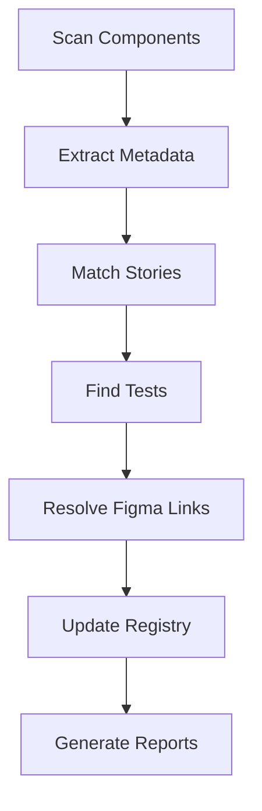

# Design Traceability Architecture

**Version**: 1.0.0
**Date**: 2025-11-30
**Status**: Reference Architecture

---

## Table of Contents

1. [Architecture Overview](#architecture-overview)
2. [Directory Structure](#directory-structure)
3. [Component Registry](#component-registry)
4. [Design Registry](#design-registry)
5. [Wireframe Items](#wireframe-items)
6. [Story Items](#story-items)
7. [Auto-Linking System](#auto-linking-system)
8. [CLI Commands](#cli-commands)
9. [Integration Workflows](#integration-workflows)
10. [Schema Definitions](#schema-definitions)

---

## Architecture Overview

The Design Traceability Architecture establishes bidirectional links between:

- **React/Vue components** in the repository
- **Storybook stories** (auto-generated from components)
- **Figma designs** (code-generated references)
- **Requirements** in `.trace/`

```
.trace/                          src/components/           .storybook/
+-- stories/                     +-- Button/               +-- stories/
|   +-- STORY-001.md            |   +-- Button.tsx        |   +-- Button.stories.tsx
|       (links to component)     |   +-- Button.test.tsx   |       (auto-generated)
+-- wireframes/                  |   +-- index.ts          |
|   +-- WF-001.md               |                          |
|       (links to Figma)         |                          |
+-- .meta/                       |                          |
    +-- components.yaml          |                          |
    |   (component registry)     |                          |
    +-- designs.yaml             |                          |
        (Figma links)            |                          |
```

### Core Principles

1. **Single Source of Truth**: `.trace/.meta/` contains all traceability metadata
2. **Bidirectional Links**: Components reference stories; stories reference components
3. **Auto-Discovery**: CLI tools scan and update registries automatically
4. **Figma Integration**: Design tokens and node IDs enable code-to-design mapping
5. **Story Generation**: Storybook stories can be scaffolded from component analysis

---

## Directory Structure

### Complete `.trace/` Layout

```
.trace/
+-- .meta/
|   +-- components.yaml      # Component registry (component -> story -> test -> figma)
|   +-- designs.yaml         # Figma file/node registry
|   +-- tokens.yaml          # Design token mappings
|   +-- sync-state.yaml      # Last sync timestamps
|   +-- config.yaml          # Traceability configuration
|
+-- stories/
|   +-- STORY-001.md         # User story with component links
|   +-- STORY-002.md
|   +-- index.yaml           # Story index with metadata
|
+-- wireframes/
|   +-- WF-001.md            # Wireframe requirement
|   +-- WF-002.md
|   +-- index.yaml           # Wireframe index
|
+-- requirements/
|   +-- REQ-001.md           # Functional requirement
|   +-- index.yaml           # Requirements index
|
+-- coverage/
    +-- design-coverage.yaml  # Design coverage metrics
    +-- component-coverage.yaml
    +-- test-coverage.yaml
```

### Component Structure (Source)

```
src/
+-- components/
|   +-- ui/
|   |   +-- Button/
|   |   |   +-- Button.tsx           # Component implementation
|   |   |   +-- Button.test.tsx      # Unit tests
|   |   |   +-- Button.stories.tsx   # Storybook stories (can be auto-generated)
|   |   |   +-- Button.trace.yaml    # Optional: inline trace metadata
|   |   |   +-- index.ts             # Public exports
|   |   +-- Card/
|   |   +-- Dialog/
|   +-- layout/
|   +-- forms/
|
+-- packages/
    +-- ui/                          # Shared UI library
        +-- src/
            +-- components/
                +-- Button.tsx
                +-- Card.tsx
```

---

## Component Registry

### Schema: `.trace/.meta/components.yaml`

```yaml
# .trace/.meta/components.yaml
# Component Registry - Maps components to stories, tests, and Figma designs

version: "1.0"
last_updated: "2025-11-30T10:00:00Z"
sync_hash: "abc123def456"

# Configuration
config:
  component_paths:
    - "src/components/**/*.tsx"
    - "packages/ui/src/components/**/*.tsx"
  story_paths:
    - "src/**/*.stories.tsx"
    - ".storybook/stories/**/*.stories.tsx"
  test_patterns:
    - "*.test.tsx"
    - "*.spec.tsx"
    - "__tests__/**/*.tsx"
  exclude_patterns:
    - "node_modules/**"
    - "dist/**"
    - "*.d.ts"

# Component definitions
components:
  # UI Library Components
  btn-001:
    id: "btn-001"
    name: "Button"
    display_name: "Button"
    description: "Primary button component with multiple variants"
    category: "ui"

    # Source location
    source:
      path: "packages/ui/src/components/Button.tsx"
      line_start: 35
      line_end: 42
      export_name: "Button"
      export_type: "named"  # named | default

    # Story links
    stories:
      - story_id: "STORY-001"
        storybook_path: "frontend/apps/storybook/src/stories/Button.stories.tsx"
        storybook_id: "components-button"
        variants:
          - "Default"
          - "Destructive"
          - "Outline"
          - "Secondary"
          - "Ghost"
          - "Link"
          - "Small"
          - "Large"
          - "Disabled"
          - "AllVariants"

    # Test links
    tests:
      - path: "packages/ui/src/components/__tests__/Button.test.tsx"
        type: "unit"
        coverage: 92.5
        test_count: 12
      - path: "frontend/apps/web/src/__tests__/integration/Button.integration.test.tsx"
        type: "integration"
        coverage: 85.0
        test_count: 5

    # Figma design links
    figma:
      file_id: "abc123XYZ"
      node_id: "1234:5678"
      node_name: "Button/Primary"
      frame_url: "https://www.figma.com/file/abc123XYZ/DesignSystem?node-id=1234:5678"
      last_synced: "2025-11-29T15:30:00Z"
      version: "v2.1.0"

      # Variant mappings
      variants:
        default:
          node_id: "1234:5678"
          props: { variant: "default", size: "default" }
        destructive:
          node_id: "1234:5679"
          props: { variant: "destructive", size: "default" }
        outline:
          node_id: "1234:5680"
          props: { variant: "outline", size: "default" }
        small:
          node_id: "1234:5681"
          props: { variant: "default", size: "sm" }
        large:
          node_id: "1234:5682"
          props: { variant: "default", size: "lg" }

    # Design tokens used
    tokens:
      - "color.primary"
      - "color.primary-foreground"
      - "color.destructive"
      - "spacing.4"
      - "radius.lg"
      - "font.size.sm"
      - "font.weight.medium"

    # Props/API
    props:
      - name: "variant"
        type: "enum"
        values: ["default", "destructive", "outline", "secondary", "ghost", "link"]
        default: "default"
        required: false
      - name: "size"
        type: "enum"
        values: ["default", "sm", "lg", "icon"]
        default: "default"
        required: false
      - name: "disabled"
        type: "boolean"
        default: false
        required: false
      - name: "className"
        type: "string"
        required: false
      - name: "children"
        type: "ReactNode"
        required: true

    # Requirements traceability
    requirements:
      - "REQ-UI-001"  # Accessible button component
      - "REQ-UI-002"  # Theme support
      - "REQ-A11Y-001"  # WCAG 2.1 AA compliance

    # Metadata
    metadata:
      created_at: "2025-11-01T00:00:00Z"
      updated_at: "2025-11-30T10:00:00Z"
      created_by: "system"
      status: "active"  # active | deprecated | draft
      version: "1.2.0"
      accessibility:
        wcag_level: "AA"
        aria_support: true
        keyboard_nav: true

  # Card Component
  card-001:
    id: "card-001"
    name: "Card"
    display_name: "Card"
    description: "Container component with header, content, and footer sections"
    category: "ui"

    source:
      path: "packages/ui/src/components/Card.tsx"
      line_start: 1
      line_end: 50
      export_name: "Card"
      export_type: "named"

    stories:
      - story_id: "STORY-002"
        storybook_path: "frontend/apps/storybook/src/stories/Card.stories.tsx"
        storybook_id: "components-card"
        variants:
          - "Default"
          - "WithHeader"
          - "WithFooter"
          - "Interactive"

    tests:
      - path: "packages/ui/src/components/__tests__/Card.test.tsx"
        type: "unit"
        coverage: 88.0
        test_count: 8

    figma:
      file_id: "abc123XYZ"
      node_id: "2345:6789"
      node_name: "Card/Default"
      frame_url: "https://www.figma.com/file/abc123XYZ/DesignSystem?node-id=2345:6789"

    tokens:
      - "color.card"
      - "color.card-foreground"
      - "radius.xl"
      - "shadow.sm"

    requirements:
      - "REQ-UI-003"

    metadata:
      status: "active"
      version: "1.0.0"

  # Dialog Component
  dialog-001:
    id: "dialog-001"
    name: "Dialog"
    display_name: "Dialog"
    description: "Modal dialog with overlay, content, header, and footer"
    category: "ui"

    source:
      path: "packages/ui/src/components/Dialog.tsx"
      export_name: "Dialog"

    # Sub-components (compound component pattern)
    sub_components:
      - name: "DialogTrigger"
        export_name: "DialogTrigger"
      - name: "DialogContent"
        export_name: "DialogContent"
      - name: "DialogHeader"
        export_name: "DialogHeader"
      - name: "DialogFooter"
        export_name: "DialogFooter"
      - name: "DialogTitle"
        export_name: "DialogTitle"
      - name: "DialogDescription"
        export_name: "DialogDescription"

    stories:
      - story_id: "STORY-003"
        storybook_path: "frontend/apps/storybook/src/stories/Dialog.stories.tsx"
        storybook_id: "components-dialog"

    figma:
      file_id: "abc123XYZ"
      node_id: "3456:7890"
      node_name: "Dialog/Default"

    requirements:
      - "REQ-UI-004"
      - "REQ-A11Y-002"  # Focus trap requirement

    metadata:
      status: "active"

# Component groups/categories
categories:
  ui:
    name: "UI Components"
    description: "Core UI building blocks"
    components: ["btn-001", "card-001", "dialog-001"]

  layout:
    name: "Layout Components"
    description: "Page structure and navigation"
    components: []

  forms:
    name: "Form Components"
    description: "Input and form handling"
    components: []

# Statistics
stats:
  total_components: 3
  components_with_stories: 3
  components_with_tests: 2
  components_with_figma: 3
  coverage:
    story_coverage: 100.0
    test_coverage: 66.7
    figma_coverage: 100.0
```

---

## Design Registry

### Schema: `.trace/.meta/designs.yaml`

```yaml
# .trace/.meta/designs.yaml
# Design Registry - Figma files, nodes, and design tokens

version: "1.0"
last_updated: "2025-11-30T10:00:00Z"

# Figma API configuration
figma_config:
  team_id: "team_abc123"
  access_token_env: "FIGMA_ACCESS_TOKEN"  # Environment variable name
  webhook_enabled: true
  auto_sync: true
  sync_interval_hours: 24

# Figma files
files:
  design-system:
    file_id: "abc123XYZ"
    name: "TraceRTM Design System"
    description: "Core design system with components, tokens, and patterns"
    url: "https://www.figma.com/file/abc123XYZ/TraceRTM-Design-System"
    version: "v2.1.0"
    last_modified: "2025-11-29T12:00:00Z"
    last_synced: "2025-11-30T10:00:00Z"

    # Pages within the file
    pages:
      foundations:
        page_id: "page_001"
        name: "Foundations"
        description: "Colors, typography, spacing, icons"

      components:
        page_id: "page_002"
        name: "Components"
        description: "UI component library"

      patterns:
        page_id: "page_003"
        name: "Patterns"
        description: "Common UI patterns and templates"

    # Key frames/nodes
    nodes:
      # Color tokens
      colors-primary:
        node_id: "100:1"
        name: "Colors/Primary"
        type: "frame"
        description: "Primary color palette"

      colors-semantic:
        node_id: "100:2"
        name: "Colors/Semantic"
        type: "frame"
        description: "Semantic colors (success, error, warning)"

      # Component frames
      button-component:
        node_id: "1234:5678"
        name: "Button"
        type: "component_set"
        description: "Button component with all variants"
        component_id: "btn-001"
        variants:
          - property: "Variant"
            values: ["Primary", "Secondary", "Outline", "Ghost", "Link", "Destructive"]
          - property: "Size"
            values: ["Small", "Medium", "Large"]
          - property: "State"
            values: ["Default", "Hover", "Pressed", "Disabled"]

      card-component:
        node_id: "2345:6789"
        name: "Card"
        type: "component_set"
        description: "Card container component"
        component_id: "card-001"

      dialog-component:
        node_id: "3456:7890"
        name: "Dialog"
        type: "component_set"
        description: "Modal dialog component"
        component_id: "dialog-001"

  wireframes:
    file_id: "def456ABC"
    name: "TraceRTM Wireframes"
    description: "Application wireframes and user flows"
    url: "https://www.figma.com/file/def456ABC/TraceRTM-Wireframes"
    version: "v1.5.0"

    pages:
      dashboard:
        page_id: "wf_page_001"
        name: "Dashboard"
        wireframe_ids: ["WF-001", "WF-002"]

      project-view:
        page_id: "wf_page_002"
        name: "Project View"
        wireframe_ids: ["WF-003", "WF-004"]

    nodes:
      dashboard-main:
        node_id: "500:1"
        name: "Dashboard/Main View"
        type: "frame"
        wireframe_id: "WF-001"
        linked_stories: ["STORY-010", "STORY-011"]

      project-list:
        node_id: "500:2"
        name: "Dashboard/Project List"
        type: "frame"
        wireframe_id: "WF-002"

# Design tokens
tokens:
  # Source configuration
  source:
    type: "figma"  # figma | tokens-studio | style-dictionary
    file_id: "abc123XYZ"
    auto_export: true
    export_format: "css"  # css | scss | json | ts
    export_path: "src/styles/tokens"

  # Token categories
  categories:
    color:
      description: "Color tokens"
      tokens:
        primary:
          figma_style_id: "S:abc123"
          value: "hsl(222.2 47.4% 11.2%)"
          css_variable: "--primary"
          usage: "Primary brand color, main actions"

        primary-foreground:
          figma_style_id: "S:abc124"
          value: "hsl(210 40% 98%)"
          css_variable: "--primary-foreground"
          usage: "Text on primary backgrounds"

        destructive:
          figma_style_id: "S:abc125"
          value: "hsl(0 84.2% 60.2%)"
          css_variable: "--destructive"
          usage: "Destructive actions, errors"

        muted:
          figma_style_id: "S:abc126"
          value: "hsl(210 40% 96.1%)"
          css_variable: "--muted"

        accent:
          figma_style_id: "S:abc127"
          value: "hsl(210 40% 96.1%)"
          css_variable: "--accent"

        card:
          figma_style_id: "S:abc128"
          value: "hsl(0 0% 100%)"
          css_variable: "--card"

        border:
          figma_style_id: "S:abc129"
          value: "hsl(214.3 31.8% 91.4%)"
          css_variable: "--border"

    spacing:
      description: "Spacing scale"
      tokens:
        "0": { value: "0px", css_variable: "--spacing-0" }
        "1": { value: "0.25rem", css_variable: "--spacing-1" }
        "2": { value: "0.5rem", css_variable: "--spacing-2" }
        "3": { value: "0.75rem", css_variable: "--spacing-3" }
        "4": { value: "1rem", css_variable: "--spacing-4" }
        "6": { value: "1.5rem", css_variable: "--spacing-6" }
        "8": { value: "2rem", css_variable: "--spacing-8" }

    radius:
      description: "Border radius"
      tokens:
        none: { value: "0px", css_variable: "--radius-none" }
        sm: { value: "0.125rem", css_variable: "--radius-sm" }
        md: { value: "0.375rem", css_variable: "--radius-md" }
        lg: { value: "0.5rem", css_variable: "--radius-lg" }
        xl: { value: "0.75rem", css_variable: "--radius-xl" }
        full: { value: "9999px", css_variable: "--radius-full" }

    typography:
      description: "Typography tokens"
      tokens:
        font-sans:
          value: "ui-sans-serif, system-ui, sans-serif"
          css_variable: "--font-sans"
        font-mono:
          value: "ui-monospace, monospace"
          css_variable: "--font-mono"

        # Font sizes
        text-xs: { value: "0.75rem", line_height: "1rem" }
        text-sm: { value: "0.875rem", line_height: "1.25rem" }
        text-base: { value: "1rem", line_height: "1.5rem" }
        text-lg: { value: "1.125rem", line_height: "1.75rem" }
        text-xl: { value: "1.25rem", line_height: "1.75rem" }

    shadow:
      description: "Box shadows"
      tokens:
        sm:
          value: "0 1px 2px 0 rgb(0 0 0 / 0.05)"
          css_variable: "--shadow-sm"
        md:
          value: "0 4px 6px -1px rgb(0 0 0 / 0.1)"
          css_variable: "--shadow-md"
        lg:
          value: "0 10px 15px -3px rgb(0 0 0 / 0.1)"
          css_variable: "--shadow-lg"

# Token-to-component mapping
token_usage:
  "color.primary":
    components: ["btn-001"]
    css_classes: [".bg-primary", ".text-primary"]

  "color.destructive":
    components: ["btn-001", "alert-001"]
    css_classes: [".bg-destructive", ".text-destructive"]

  "radius.lg":
    components: ["btn-001", "card-001"]
    css_classes: [".rounded-lg"]

# Statistics
stats:
  total_files: 2
  total_nodes: 8
  total_tokens: 25
  components_linked: 3
  wireframes_linked: 2
```

---

## Wireframe Items

### Schema: `.trace/wireframes/WF-001.md`

```markdown
---
id: WF-001
title: Dashboard Main View Wireframe
type: wireframe
status: approved
priority: high
created: 2025-11-01
updated: 2025-11-30
author: design-team
---

# WF-001: Dashboard Main View

## Overview

The main dashboard view providing an overview of projects, recent activity, and quick actions.

## Figma Reference

- **File**: TraceRTM Wireframes
- **File ID**: `def456ABC`
- **Node ID**: `500:1`
- **Frame**: Dashboard/Main View
- **URL**: [Open in Figma](https://www.figma.com/file/def456ABC/TraceRTM-Wireframes?node-id=500:1)
- **Version**: v1.5.0
- **Last Updated**: 2025-11-29

## Layout Structure

```
+----------------------------------------------------------+
|  Header (nav, search, user menu)                          |
+----------------------------------------------------------+
|  Sidebar  |  Main Content Area                            |
|           |  +------------------------------------------+ |
|  - Home   |  |  Welcome Banner                          | |
|  - Projs  |  +------------------------------------------+ |
|  - Items  |  |  Project Cards Grid                      | |
|  - Links  |  |  +--------+  +--------+  +--------+     | |
|  - Graph  |  |  | Proj 1 |  | Proj 2 |  | Proj 3 |     | |
|           |  |  +--------+  +--------+  +--------+     | |
|           |  +------------------------------------------+ |
|           |  |  Recent Activity Feed                    | |
|           |  +------------------------------------------+ |
+----------------------------------------------------------+
```

## Components Used

| Component | ID | Usage |
|-----------|-----|-------|
| Header | `layout-001` | Top navigation bar |
| Sidebar | `layout-002` | Left navigation |
| Card | `card-001` | Project cards |
| Button | `btn-001` | Actions (Create, View) |
| Avatar | `avatar-001` | User indicators |

## Linked Stories

- [STORY-010](../stories/STORY-010.md) - Dashboard Overview
- [STORY-011](../stories/STORY-011.md) - Project Quick Access

## Linked Requirements

- [REQ-DASH-001](../requirements/REQ-DASH-001.md) - Dashboard must show project overview
- [REQ-DASH-002](../requirements/REQ-DASH-002.md) - Quick access to recent projects

## Design Decisions

1. **Card-based layout**: Projects displayed as cards for visual scanning
2. **Sidebar navigation**: Persistent nav for quick section access
3. **Activity feed**: Real-time updates on project changes

## Interaction States

### Default State
- Shows 6 most recent projects
- Activity feed shows last 10 items

### Empty State
- Welcome message for new users
- "Create your first project" CTA

### Loading State
- Skeleton cards during data fetch

## Responsive Behavior

| Breakpoint | Layout Change |
|------------|---------------|
| Desktop (>1024px) | Full sidebar, 3-column grid |
| Tablet (768-1024px) | Collapsed sidebar, 2-column grid |
| Mobile (<768px) | Bottom nav, single column |

## Accessibility Notes

- Sidebar navigation is keyboard accessible
- Cards have proper focus indicators
- Activity feed uses ARIA live regions

## Change History

| Date | Change | Author |
|------|--------|--------|
| 2025-11-01 | Initial wireframe | @designer |
| 2025-11-15 | Added activity feed | @designer |
| 2025-11-29 | Updated card layout | @designer |

---

**Trace Links**:
- Design File: `figma://def456ABC/500:1`
- Components: `btn-001`, `card-001`, `layout-001`, `layout-002`
- Stories: `STORY-010`, `STORY-011`
- Requirements: `REQ-DASH-001`, `REQ-DASH-002`
```

### Wireframe Index: `.trace/wireframes/index.yaml`

```yaml
# .trace/wireframes/index.yaml

version: "1.0"
last_updated: "2025-11-30T10:00:00Z"

wireframes:
  WF-001:
    title: "Dashboard Main View"
    status: "approved"
    figma_node: "500:1"
    figma_file: "def456ABC"
    components: ["btn-001", "card-001", "layout-001"]
    stories: ["STORY-010", "STORY-011"]
    requirements: ["REQ-DASH-001", "REQ-DASH-002"]

  WF-002:
    title: "Project List View"
    status: "approved"
    figma_node: "500:2"
    figma_file: "def456ABC"
    components: ["table-001", "btn-001", "search-001"]
    stories: ["STORY-012"]
    requirements: ["REQ-PROJ-001"]

  WF-003:
    title: "Project Detail View"
    status: "in-review"
    figma_node: "500:3"
    figma_file: "def456ABC"
    components: ["card-001", "tabs-001", "btn-001"]
    stories: ["STORY-013", "STORY-014"]
    requirements: ["REQ-PROJ-002", "REQ-PROJ-003"]

stats:
  total: 3
  approved: 2
  in_review: 1
  draft: 0
```

---

## Story Items

### Schema: `.trace/stories/STORY-001.md`

```markdown
---
id: STORY-001
title: Button Component Implementation
type: component-story
status: implemented
priority: high
created: 2025-11-01
updated: 2025-11-30
assignee: frontend-team
---

# STORY-001: Button Component Implementation

## User Story

**As a** developer
**I want** a reusable Button component with multiple variants
**So that** I can maintain consistent UI patterns across the application

## Acceptance Criteria

- [ ] Button renders with default styling
- [ ] Button supports variant prop (default, destructive, outline, secondary, ghost, link)
- [ ] Button supports size prop (default, sm, lg, icon)
- [ ] Button supports disabled state
- [ ] Button is keyboard accessible
- [ ] Button has proper focus indicators

## Component Link

- **Component ID**: `btn-001`
- **Source**: `packages/ui/src/components/Button.tsx`
- **Export**: `Button` (named export)

```tsx
import { Button } from '@tracertm/ui'

// Usage
<Button variant="default" size="default">
  Click me
</Button>
```

## Storybook

- **Story File**: `frontend/apps/storybook/src/stories/Button.stories.tsx`
- **Storybook URL**: `/story/components-button`
- **Variants Documented**:
  - Default
  - Destructive
  - Outline
  - Secondary
  - Ghost
  - Link
  - Small
  - Large
  - Disabled
  - AllVariants

## Figma Design

- **File**: TraceRTM Design System
- **Node**: Button Component Set
- **Node ID**: `1234:5678`
- **URL**: [Open in Figma](https://www.figma.com/file/abc123XYZ/DesignSystem?node-id=1234:5678)

## Test Coverage

| Test Type | File | Coverage |
|-----------|------|----------|
| Unit | `Button.test.tsx` | 92.5% |
| Integration | `Button.integration.test.tsx` | 85.0% |

## Design Tokens

- `color.primary`
- `color.primary-foreground`
- `color.destructive`
- `spacing.4`
- `radius.lg`
- `font.size.sm`

## Related Items

- **Requirements**: REQ-UI-001, REQ-A11Y-001
- **Wireframes**: WF-001, WF-002, WF-003 (used in all views)

## Implementation Notes

The Button component uses `class-variance-authority` (CVA) for variant management and Tailwind CSS for styling.

```tsx
const buttonVariants = cva(
  'inline-flex items-center justify-center rounded-lg...',
  {
    variants: {
      variant: { default: '...', destructive: '...' },
      size: { default: '...', sm: '...', lg: '...' }
    }
  }
)
```

---

**Trace Links**:
- Component: `btn-001`
- Figma: `figma://abc123XYZ/1234:5678`
- Storybook: `storybook://components-button`
- Tests: `test://packages/ui/src/components/__tests__/Button.test.tsx`
```

### Story Index: `.trace/stories/index.yaml`

```yaml
# .trace/stories/index.yaml

version: "1.0"
last_updated: "2025-11-30T10:00:00Z"

stories:
  STORY-001:
    title: "Button Component Implementation"
    type: "component-story"
    status: "implemented"
    component_id: "btn-001"
    storybook_id: "components-button"
    figma_node: "1234:5678"
    requirements: ["REQ-UI-001", "REQ-A11Y-001"]

  STORY-002:
    title: "Card Component Implementation"
    type: "component-story"
    status: "implemented"
    component_id: "card-001"
    storybook_id: "components-card"
    figma_node: "2345:6789"
    requirements: ["REQ-UI-003"]

  STORY-003:
    title: "Dialog Component Implementation"
    type: "component-story"
    status: "in-progress"
    component_id: "dialog-001"
    storybook_id: "components-dialog"
    figma_node: "3456:7890"
    requirements: ["REQ-UI-004", "REQ-A11Y-002"]

  STORY-010:
    title: "Dashboard Overview"
    type: "feature-story"
    status: "implemented"
    wireframe_id: "WF-001"
    components: ["btn-001", "card-001"]
    requirements: ["REQ-DASH-001"]

stats:
  total: 4
  implemented: 3
  in_progress: 1
  component_stories: 3
  feature_stories: 1
```

---

## Auto-Linking System

### How Auto-Linking Works

The auto-linking system maintains bidirectional references between:

```
Component <-> Story <-> Wireframe <-> Requirement
    |           |           |             |
    +-- Figma --+-- Test ---+-- Design ---+
```

### Link Discovery Process



### Auto-Link Configuration: `.trace/.meta/config.yaml`

```yaml
# .trace/.meta/config.yaml

version: "1.0"

auto_linking:
  enabled: true
  scan_on_commit: true
  scan_interval: "on-demand"  # on-demand | hourly | daily

  # Component discovery
  components:
    scan_paths:
      - "src/components/**/*.tsx"
      - "packages/ui/src/components/**/*.tsx"
    exclude:
      - "**/*.test.tsx"
      - "**/*.stories.tsx"
      - "**/index.ts"

    # How to identify components
    detection:
      patterns:
        - "export const \\w+ = forwardRef"
        - "export function \\w+\\("
        - "export const \\w+: React\\.FC"
      props_pattern: "interface (\\w+)Props"

  # Story discovery
  stories:
    scan_paths:
      - "**/*.stories.tsx"
      - "**/*.stories.ts"

    # Link stories to components
    component_matching:
      # Match by import statement
      import_pattern: "import { (\\w+) } from"
      # Match by story title
      title_pattern: "title: ['\"]Components/(\\w+)['\"]"

  # Test discovery
  tests:
    scan_paths:
      - "**/*.test.tsx"
      - "**/*.spec.tsx"
      - "**/__tests__/**/*.tsx"

    # Link tests to components
    component_matching:
      import_pattern: "import { (\\w+) } from"
      describe_pattern: "describe\\(['\"]?(\\w+)"

  # Figma integration
  figma:
    enabled: true
    api_token_env: "FIGMA_ACCESS_TOKEN"

    # Auto-sync from Figma
    sync:
      enabled: true
      interval_hours: 24
      on_file_change: true

    # Component name matching
    matching:
      # Match Figma component name to code component
      strategies:
        - type: "exact"  # Figma "Button" matches code "Button"
        - type: "case_insensitive"
        - type: "prefix_strip"  # Figma "UI/Button" matches "Button"
          prefix: "UI/"

  # Wireframe linking
  wireframes:
    figma_file_id: "def456ABC"

    # Extract component usage from wireframes
    component_detection:
      enabled: true
      use_figma_instances: true

  # Requirements linking
  requirements:
    scan_paths:
      - ".trace/requirements/**/*.md"

    # Parse requirement references from code comments
    code_comments:
      enabled: true
      patterns:
        - "@requirement (REQ-\\w+-\\d+)"
        - "@req (REQ-\\w+-\\d+)"
        - "Implements: (REQ-\\w+-\\d+)"

# Validation rules
validation:
  # Require all components to have stories
  components_require_stories: true

  # Require all components to have tests
  components_require_tests: true

  # Require all wireframes to link to components
  wireframes_require_components: true

  # Require all stories to link to requirements
  stories_require_requirements: false

  # Coverage thresholds
  thresholds:
    story_coverage: 80  # % of components with stories
    test_coverage: 70   # % of components with tests
    figma_coverage: 50  # % of components with Figma links

# Notifications
notifications:
  on_unlinked_component: "warn"
  on_orphan_story: "warn"
  on_missing_figma: "info"
  on_coverage_drop: "error"
```

### Storybook Auto-Generation

When a new component is detected without a story, the system can generate one:

```typescript
// Auto-generated story template
// Generated by: rtm link component --generate-story

import type { Meta, StoryObj } from '@storybook/react-vite'
import { {{ComponentName}} } from '{{importPath}}'

/**
 * @trace-component {{componentId}}
 * @trace-figma {{figmaNodeId}}
 * @trace-requirements {{requirements}}
 */
const meta: Meta<typeof {{ComponentName}}> = {
  title: 'Components/{{ComponentName}}',
  component: {{ComponentName}},
  tags: ['autodocs'],
  parameters: {
    design: {
      type: 'figma',
      url: '{{figmaUrl}}',
    },
  },
  argTypes: {
    // Auto-generated from props
    {{#each props}}
    {{name}}: {
      control: '{{control}}',
      {{#if options}}options: {{options}},{{/if}}
      description: '{{description}}',
    },
    {{/each}}
  },
}

export default meta
type Story = StoryObj<typeof meta>

export const Default: Story = {
  args: {
    {{#each defaultArgs}}
    {{name}}: {{value}},
    {{/each}}
  },
}

{{#each variants}}
export const {{name}}: Story = {
  args: {
    {{#each args}}
    {{name}}: {{value}},
    {{/each}}
  },
}
{{/each}}
```

---

## CLI Commands

### `rtm link component`

Link components to stories, tests, and Figma designs.

```bash
# Scan and auto-link all components
rtm link component --scan

# Link specific component
rtm link component btn-001 --story STORY-001

# Link component to Figma
rtm link component btn-001 --figma abc123XYZ:1234:5678

# Link component to test
rtm link component btn-001 --test packages/ui/src/components/__tests__/Button.test.tsx

# Generate story for component
rtm link component btn-001 --generate-story

# Generate story with Figma variant mapping
rtm link component btn-001 --generate-story --map-figma-variants

# Show component links
rtm link component btn-001 --show

# Validate all component links
rtm link component --validate

# Export component registry
rtm link component --export json > components.json
```

#### Command Implementation

```python
# cli/tracertm/commands/link_component.py

"""Component linking commands for TraceRTM CLI"""

import typer
from pathlib import Path
from typing import Optional, List
from rich.console import Console
from rich.table import Table
import yaml

app = typer.Typer(no_args_is_help=True)
console = Console()


@app.command("scan")
def scan_components(
    path: Optional[str] = typer.Option(None, "--path", "-p", help="Path to scan"),
    update_registry: bool = typer.Option(True, "--update", "-u", help="Update registry"),
    dry_run: bool = typer.Option(False, "--dry-run", "-d", help="Show changes without applying"),
) -> None:
    """Scan codebase for components and auto-link to stories/tests"""

    console.print("[bold]Scanning for components...[/bold]")

    # Load config
    config = load_trace_config()
    scan_paths = config.get("auto_linking", {}).get("components", {}).get("scan_paths", [])

    if path:
        scan_paths = [path]

    discovered = []
    for scan_path in scan_paths:
        components = discover_components(scan_path)
        discovered.extend(components)

    console.print(f"Found [green]{len(discovered)}[/green] components")

    # Match with stories
    stories = discover_stories(config)
    matched = match_components_to_stories(discovered, stories)

    # Match with tests
    tests = discover_tests(config)
    matched = match_components_to_tests(matched, tests)

    # Display results
    table = Table(title="Component Discovery Results")
    table.add_column("Component", style="cyan")
    table.add_column("Story", style="green")
    table.add_column("Tests", style="yellow")
    table.add_column("Figma", style="magenta")

    for comp in matched:
        table.add_row(
            comp["name"],
            comp.get("story_id", "-"),
            str(comp.get("test_count", 0)),
            comp.get("figma_node", "-")
        )

    console.print(table)

    if update_registry and not dry_run:
        update_component_registry(matched)
        console.print("[green]Registry updated[/green]")


@app.command("link")
def link_component(
    component_id: str = typer.Argument(..., help="Component ID to link"),
    story: Optional[str] = typer.Option(None, "--story", "-s", help="Story ID to link"),
    test: Optional[str] = typer.Option(None, "--test", "-t", help="Test file path"),
    figma: Optional[str] = typer.Option(None, "--figma", "-f", help="Figma node (file:node)"),
    requirement: Optional[List[str]] = typer.Option(None, "--req", "-r", help="Requirement IDs"),
) -> None:
    """Link a component to story, test, or Figma design"""

    registry = load_component_registry()

    if component_id not in registry.get("components", {}):
        console.print(f"[red]Component {component_id} not found[/red]")
        raise typer.Exit(1)

    component = registry["components"][component_id]
    updates = []

    if story:
        component.setdefault("stories", []).append({"story_id": story})
        updates.append(f"Linked to story {story}")

    if test:
        component.setdefault("tests", []).append({"path": test, "type": "unit"})
        updates.append(f"Linked to test {test}")

    if figma:
        file_id, node_id = figma.split(":")
        component["figma"] = {
            "file_id": file_id,
            "node_id": node_id,
            "frame_url": f"https://www.figma.com/file/{file_id}?node-id={node_id}"
        }
        updates.append(f"Linked to Figma {figma}")

    if requirement:
        component.setdefault("requirements", []).extend(requirement)
        updates.append(f"Linked to requirements {', '.join(requirement)}")

    save_component_registry(registry)

    for update in updates:
        console.print(f"[green]OK[/green] {update}")


@app.command("generate-story")
def generate_story(
    component_id: str = typer.Argument(..., help="Component ID"),
    output: Optional[str] = typer.Option(None, "--output", "-o", help="Output path"),
    map_figma: bool = typer.Option(False, "--map-figma-variants", help="Map Figma variants"),
) -> None:
    """Generate Storybook story for component"""

    registry = load_component_registry()

    if component_id not in registry.get("components", {}):
        console.print(f"[red]Component {component_id} not found[/red]")
        raise typer.Exit(1)

    component = registry["components"][component_id]

    # Analyze component source
    source_path = component["source"]["path"]
    props = extract_component_props(source_path)

    # Generate story
    story_content = generate_story_template(
        component_name=component["name"],
        component_id=component_id,
        import_path=source_path,
        props=props,
        figma=component.get("figma"),
        map_figma_variants=map_figma
    )

    # Determine output path
    if not output:
        output = f".storybook/stories/{component['name']}.stories.tsx"

    Path(output).parent.mkdir(parents=True, exist_ok=True)
    Path(output).write_text(story_content)

    console.print(f"[green]Generated story:[/green] {output}")


@app.command("show")
def show_links(
    component_id: str = typer.Argument(..., help="Component ID"),
) -> None:
    """Show all links for a component"""

    registry = load_component_registry()

    if component_id not in registry.get("components", {}):
        console.print(f"[red]Component {component_id} not found[/red]")
        raise typer.Exit(1)

    component = registry["components"][component_id]

    console.print(f"\n[bold]{component['name']}[/bold] ({component_id})")
    console.print(f"Source: {component['source']['path']}")

    # Stories
    console.print("\n[cyan]Stories:[/cyan]")
    for story in component.get("stories", []):
        console.print(f"  - {story.get('story_id', 'N/A')}: {story.get('storybook_path', 'N/A')}")

    # Tests
    console.print("\n[yellow]Tests:[/yellow]")
    for test in component.get("tests", []):
        console.print(f"  - [{test.get('type')}] {test.get('path')} ({test.get('coverage', 'N/A')}%)")

    # Figma
    console.print("\n[magenta]Figma:[/magenta]")
    figma = component.get("figma", {})
    if figma:
        console.print(f"  - Node: {figma.get('node_id')}")
        console.print(f"  - URL: {figma.get('frame_url')}")
    else:
        console.print("  - Not linked")

    # Requirements
    console.print("\n[blue]Requirements:[/blue]")
    for req in component.get("requirements", []):
        console.print(f"  - {req}")


@app.command("validate")
def validate_links(
    fix: bool = typer.Option(False, "--fix", "-f", help="Attempt to fix issues"),
) -> None:
    """Validate all component links"""

    registry = load_component_registry()
    config = load_trace_config()

    issues = []

    for comp_id, component in registry.get("components", {}).items():
        # Check source exists
        source_path = component["source"]["path"]
        if not Path(source_path).exists():
            issues.append({
                "component": comp_id,
                "type": "error",
                "message": f"Source file not found: {source_path}"
            })

        # Check story requirement
        if config.get("validation", {}).get("components_require_stories"):
            if not component.get("stories"):
                issues.append({
                    "component": comp_id,
                    "type": "warning",
                    "message": "Component has no linked stories"
                })

        # Check test requirement
        if config.get("validation", {}).get("components_require_tests"):
            if not component.get("tests"):
                issues.append({
                    "component": comp_id,
                    "type": "warning",
                    "message": "Component has no linked tests"
                })

        # Validate Figma links
        figma = component.get("figma", {})
        if figma:
            # Could add Figma API validation here
            pass

    # Display results
    if issues:
        table = Table(title="Validation Issues")
        table.add_column("Component", style="cyan")
        table.add_column("Type", style="yellow")
        table.add_column("Message")

        for issue in issues:
            style = "red" if issue["type"] == "error" else "yellow"
            table.add_row(
                issue["component"],
                f"[{style}]{issue['type']}[/{style}]",
                issue["message"]
            )

        console.print(table)
        console.print(f"\n[yellow]Found {len(issues)} issues[/yellow]")
    else:
        console.print("[green]All component links valid[/green]")
```

### `rtm link design`

Link Figma designs to components and wireframes.

```bash
# Sync designs from Figma
rtm link design --sync

# Sync specific file
rtm link design --sync --file abc123XYZ

# Link design node to component
rtm link design abc123XYZ:1234:5678 --component btn-001

# Link design to wireframe
rtm link design abc123XYZ:500:1 --wireframe WF-001

# Export design tokens
rtm link design --export-tokens --format css > tokens.css

# Show design coverage
rtm link design --coverage

# Validate Figma links
rtm link design --validate

# Generate component from Figma
rtm link design abc123XYZ:1234:5678 --generate-component
```

#### Command Implementation

```python
# cli/tracertm/commands/link_design.py

"""Design linking commands for TraceRTM CLI"""

import typer
from pathlib import Path
from typing import Optional
from rich.console import Console
from rich.table import Table
from rich.progress import Progress, SpinnerColumn, TextColumn
import yaml
import os

app = typer.Typer(no_args_is_help=True)
console = Console()


@app.command("sync")
def sync_designs(
    file_id: Optional[str] = typer.Option(None, "--file", "-f", help="Specific Figma file ID"),
    include_tokens: bool = typer.Option(True, "--tokens", help="Sync design tokens"),
    include_components: bool = typer.Option(True, "--components", help="Sync component nodes"),
) -> None:
    """Sync designs from Figma API"""

    # Check for API token
    token = os.environ.get("FIGMA_ACCESS_TOKEN")
    if not token:
        console.print("[red]FIGMA_ACCESS_TOKEN environment variable not set[/red]")
        raise typer.Exit(1)

    design_registry = load_design_registry()
    files_to_sync = []

    if file_id:
        files_to_sync = [{"file_id": file_id}]
    else:
        files_to_sync = list(design_registry.get("files", {}).values())

    with Progress(
        SpinnerColumn(),
        TextColumn("[progress.description]{task.description}"),
        console=console
    ) as progress:

        for file_info in files_to_sync:
            fid = file_info.get("file_id")
            task = progress.add_task(f"Syncing {fid}...", total=None)

            # Fetch file from Figma API
            figma_data = fetch_figma_file(token, fid)

            # Update file metadata
            design_registry["files"][fid] = {
                **file_info,
                "name": figma_data.get("name"),
                "version": figma_data.get("version"),
                "last_modified": figma_data.get("lastModified"),
                "last_synced": get_timestamp()
            }

            if include_components:
                # Extract component nodes
                components = extract_figma_components(figma_data)
                for comp in components:
                    design_registry.setdefault("files", {}).setdefault(fid, {}).setdefault("nodes", {})[comp["id"]] = comp

            if include_tokens:
                # Extract design tokens
                tokens = extract_figma_tokens(figma_data)
                design_registry["tokens"] = tokens

            progress.update(task, completed=True)

    save_design_registry(design_registry)
    console.print(f"[green]Synced {len(files_to_sync)} file(s)[/green]")


@app.command("link")
def link_design(
    figma_ref: str = typer.Argument(..., help="Figma reference (file_id:node_id)"),
    component: Optional[str] = typer.Option(None, "--component", "-c", help="Component ID to link"),
    wireframe: Optional[str] = typer.Option(None, "--wireframe", "-w", help="Wireframe ID to link"),
    story: Optional[str] = typer.Option(None, "--story", "-s", help="Story ID to link"),
) -> None:
    """Link Figma design node to component, wireframe, or story"""

    # Parse Figma reference
    parts = figma_ref.split(":")
    if len(parts) != 2:
        console.print("[red]Invalid Figma reference. Use format: file_id:node_id[/red]")
        raise typer.Exit(1)

    file_id, node_id = parts

    design_registry = load_design_registry()
    component_registry = load_component_registry()

    # Validate Figma node exists
    file_data = design_registry.get("files", {}).get(file_id)
    if not file_data:
        console.print(f"[yellow]Warning: Figma file {file_id} not in registry[/yellow]")

    figma_url = f"https://www.figma.com/file/{file_id}?node-id={node_id}"

    updates = []

    if component:
        if component not in component_registry.get("components", {}):
            console.print(f"[red]Component {component} not found[/red]")
            raise typer.Exit(1)

        component_registry["components"][component]["figma"] = {
            "file_id": file_id,
            "node_id": node_id,
            "frame_url": figma_url,
            "last_synced": get_timestamp()
        }
        save_component_registry(component_registry)
        updates.append(f"Linked to component {component}")

    if wireframe:
        wireframe_registry = load_wireframe_index()
        if wireframe not in wireframe_registry.get("wireframes", {}):
            console.print(f"[red]Wireframe {wireframe} not found[/red]")
            raise typer.Exit(1)

        wireframe_registry["wireframes"][wireframe]["figma_file"] = file_id
        wireframe_registry["wireframes"][wireframe]["figma_node"] = node_id
        save_wireframe_index(wireframe_registry)
        updates.append(f"Linked to wireframe {wireframe}")

    if story:
        story_registry = load_story_index()
        if story not in story_registry.get("stories", {}):
            console.print(f"[red]Story {story} not found[/red]")
            raise typer.Exit(1)

        story_registry["stories"][story]["figma_node"] = node_id
        save_story_index(story_registry)
        updates.append(f"Linked to story {story}")

    for update in updates:
        console.print(f"[green]OK[/green] {update}")

    console.print(f"\n[dim]Figma URL: {figma_url}[/dim]")


@app.command("export-tokens")
def export_tokens(
    format: str = typer.Option("css", "--format", "-f", help="Output format (css, scss, json, ts)"),
    output: Optional[str] = typer.Option(None, "--output", "-o", help="Output file"),
) -> None:
    """Export design tokens from Figma"""

    design_registry = load_design_registry()
    tokens = design_registry.get("tokens", {})

    if not tokens:
        console.print("[yellow]No tokens found. Run 'rtm link design --sync' first.[/yellow]")
        raise typer.Exit(1)

    content = ""

    if format == "css":
        content = generate_css_tokens(tokens)
    elif format == "scss":
        content = generate_scss_tokens(tokens)
    elif format == "json":
        content = generate_json_tokens(tokens)
    elif format == "ts":
        content = generate_typescript_tokens(tokens)
    else:
        console.print(f"[red]Unknown format: {format}[/red]")
        raise typer.Exit(1)

    if output:
        Path(output).write_text(content)
        console.print(f"[green]Tokens exported to {output}[/green]")
    else:
        console.print(content)


@app.command("coverage")
def show_coverage() -> None:
    """Show design coverage report"""

    component_registry = load_component_registry()
    design_registry = load_design_registry()

    total_components = len(component_registry.get("components", {}))
    linked_components = sum(
        1 for c in component_registry.get("components", {}).values()
        if c.get("figma")
    )

    coverage_pct = (linked_components / total_components * 100) if total_components > 0 else 0

    table = Table(title="Design Coverage Report")
    table.add_column("Metric", style="cyan")
    table.add_column("Value", style="yellow")

    table.add_row("Total Components", str(total_components))
    table.add_row("With Figma Links", str(linked_components))
    table.add_row("Coverage", f"{coverage_pct:.1f}%")
    table.add_row("", "")
    table.add_row("Figma Files", str(len(design_registry.get("files", {}))))
    table.add_row("Design Tokens", str(count_tokens(design_registry.get("tokens", {}))))

    console.print(table)

    # List unlinked components
    unlinked = [
        c["name"] for c in component_registry.get("components", {}).values()
        if not c.get("figma")
    ]

    if unlinked:
        console.print("\n[yellow]Components without Figma links:[/yellow]")
        for name in unlinked[:10]:  # Show first 10
            console.print(f"  - {name}")
        if len(unlinked) > 10:
            console.print(f"  ... and {len(unlinked) - 10} more")


@app.command("validate")
def validate_designs() -> None:
    """Validate Figma design links"""

    token = os.environ.get("FIGMA_ACCESS_TOKEN")
    component_registry = load_component_registry()

    issues = []

    for comp_id, component in component_registry.get("components", {}).items():
        figma = component.get("figma", {})
        if not figma:
            continue

        file_id = figma.get("file_id")
        node_id = figma.get("node_id")

        if token:
            # Validate node exists via API
            exists = validate_figma_node(token, file_id, node_id)
            if not exists:
                issues.append({
                    "component": comp_id,
                    "type": "error",
                    "message": f"Figma node {node_id} not found in file {file_id}"
                })
        else:
            # Just check for completeness
            if not file_id or not node_id:
                issues.append({
                    "component": comp_id,
                    "type": "warning",
                    "message": "Incomplete Figma reference"
                })

    if issues:
        table = Table(title="Design Validation Issues")
        table.add_column("Component", style="cyan")
        table.add_column("Type", style="yellow")
        table.add_column("Message")

        for issue in issues:
            style = "red" if issue["type"] == "error" else "yellow"
            table.add_row(
                issue["component"],
                f"[{style}]{issue['type']}[/{style}]",
                issue["message"]
            )

        console.print(table)
    else:
        console.print("[green]All design links valid[/green]")
```

---

## Integration Workflows

### CI/CD Integration

```yaml
# .github/workflows/design-traceability.yml

name: Design Traceability Check

on:
  push:
    paths:
      - 'src/components/**'
      - 'packages/ui/**'
      - '.trace/**'
  pull_request:
    paths:
      - 'src/components/**'
      - 'packages/ui/**'
      - '.trace/**'

jobs:
  validate-traceability:
    runs-on: ubuntu-latest

    steps:
      - uses: actions/checkout@v4

      - name: Setup Python
        uses: actions/setup-python@v5
        with:
          python-version: '3.12'

      - name: Install TraceRTM CLI
        run: pip install tracertm

      - name: Scan Components
        run: rtm link component --scan --dry-run

      - name: Validate Component Links
        run: rtm link component --validate

      - name: Validate Design Links
        run: rtm link design --validate
        env:
          FIGMA_ACCESS_TOKEN: ${{ secrets.FIGMA_ACCESS_TOKEN }}

      - name: Check Coverage Thresholds
        run: |
          rtm link component --coverage --json > coverage.json
          python -c "
          import json
          with open('coverage.json') as f:
              data = json.load(f)
          story_cov = data['story_coverage']
          if story_cov < 80:
              print(f'Story coverage {story_cov}% below threshold 80%')
              exit(1)
          "

      - name: Generate Report
        if: always()
        run: |
          rtm link component --export markdown > traceability-report.md
          cat traceability-report.md >> $GITHUB_STEP_SUMMARY

  sync-figma:
    runs-on: ubuntu-latest
    if: github.event_name == 'schedule' || github.event.inputs.sync_figma == 'true'

    steps:
      - uses: actions/checkout@v4

      - name: Setup Python
        uses: actions/setup-python@v5
        with:
          python-version: '3.12'

      - name: Install TraceRTM CLI
        run: pip install tracertm

      - name: Sync Figma Designs
        run: rtm link design --sync
        env:
          FIGMA_ACCESS_TOKEN: ${{ secrets.FIGMA_ACCESS_TOKEN }}

      - name: Export Updated Tokens
        run: rtm link design --export-tokens --format css -o src/styles/tokens.css

      - name: Create PR if Changes
        uses: peter-evans/create-pull-request@v5
        with:
          title: 'chore: Sync Figma designs and tokens'
          body: 'Automated sync of Figma designs and design tokens'
          branch: figma-sync
          commit-message: 'chore: sync figma designs'
```

### Pre-commit Hook

```yaml
# .pre-commit-config.yaml

repos:
  - repo: local
    hooks:
      - id: validate-component-links
        name: Validate Component Links
        entry: rtm link component --validate --quiet
        language: system
        files: '\.(tsx?|yaml)$'
        pass_filenames: false

      - id: check-story-coverage
        name: Check Story Coverage
        entry: bash -c 'rtm link component --coverage --json | python -c "import sys,json; data=json.load(sys.stdin); exit(0 if data[\"story_coverage\"] >= 80 else 1)"'
        language: system
        files: 'src/components/.*\.tsx$'
        pass_filenames: false
```

### Storybook Integration

```typescript
// .storybook/main.ts

import type { StorybookConfig } from '@storybook/react-vite'
import { loadTraceMetadata } from './trace-addon'

const config: StorybookConfig = {
  stories: [
    '../src/**/*.mdx',
    '../src/**/*.stories.@(js|jsx|mjs|ts|tsx)',
    // Auto-include traced stories
    '../.trace/stories/**/*.stories.tsx',
  ],

  addons: [
    '@storybook/addon-links',
    '@storybook/addon-docs',
    // Custom trace addon
    './trace-addon',
  ],

  framework: {
    name: '@storybook/react-vite',
    options: {},
  },

  async viteFinal(config) {
    // Inject trace metadata
    const traceMetadata = await loadTraceMetadata()

    return {
      ...config,
      define: {
        ...config.define,
        __TRACE_METADATA__: JSON.stringify(traceMetadata),
      },
    }
  },
}

export default config
```

```typescript
// .storybook/trace-addon/index.ts

import { addons, types } from '@storybook/manager-api'
import { AddonPanel } from './Panel'

const ADDON_ID = 'tracertm'
const PANEL_ID = `${ADDON_ID}/panel`

addons.register(ADDON_ID, () => {
  addons.add(PANEL_ID, {
    type: types.PANEL,
    title: 'Trace Links',
    match: ({ viewMode }) => viewMode === 'story',
    render: AddonPanel,
  })
})
```

```tsx
// .storybook/trace-addon/Panel.tsx

import React from 'react'
import { useParameter } from '@storybook/manager-api'
import { styled } from '@storybook/theming'

const Container = styled.div`
  padding: 16px;
`

const Link = styled.a`
  display: block;
  margin: 8px 0;
  color: #1ea7fd;
`

export const AddonPanel: React.FC = () => {
  const traceData = useParameter<{
    componentId?: string
    figmaUrl?: string
    requirements?: string[]
    storyId?: string
  }>('trace', {})

  if (!traceData.componentId) {
    return (
      <Container>
        <p>No trace metadata found for this story.</p>
        <p>Add trace parameters to your story:</p>
        <pre>
{`parameters: {
  trace: {
    componentId: 'btn-001',
    figmaUrl: 'https://figma.com/...',
    requirements: ['REQ-001'],
  }
}`}
        </pre>
      </Container>
    )
  }

  return (
    <Container>
      <h3>Trace Links</h3>

      <div>
        <strong>Component ID:</strong> {traceData.componentId}
      </div>

      {traceData.figmaUrl && (
        <Link href={traceData.figmaUrl} target="_blank">
          Open in Figma
        </Link>
      )}

      {traceData.storyId && (
        <Link href={`/.trace/stories/${traceData.storyId}.md`}>
          View Story: {traceData.storyId}
        </Link>
      )}

      {traceData.requirements && traceData.requirements.length > 0 && (
        <div>
          <strong>Requirements:</strong>
          <ul>
            {traceData.requirements.map((req) => (
              <li key={req}>
                <Link href={`/.trace/requirements/${req}.md`}>{req}</Link>
              </li>
            ))}
          </ul>
        </div>
      )}
    </Container>
  )
}
```

---

## Schema Definitions

### JSON Schema: components.yaml

```json
{
  "$schema": "http://json-schema.org/draft-07/schema#",
  "title": "TraceRTM Component Registry",
  "type": "object",
  "required": ["version", "components"],
  "properties": {
    "version": {
      "type": "string",
      "pattern": "^\\d+\\.\\d+$"
    },
    "last_updated": {
      "type": "string",
      "format": "date-time"
    },
    "sync_hash": {
      "type": "string"
    },
    "config": {
      "type": "object",
      "properties": {
        "component_paths": {
          "type": "array",
          "items": { "type": "string" }
        },
        "story_paths": {
          "type": "array",
          "items": { "type": "string" }
        },
        "test_patterns": {
          "type": "array",
          "items": { "type": "string" }
        },
        "exclude_patterns": {
          "type": "array",
          "items": { "type": "string" }
        }
      }
    },
    "components": {
      "type": "object",
      "additionalProperties": {
        "$ref": "#/definitions/component"
      }
    },
    "categories": {
      "type": "object",
      "additionalProperties": {
        "type": "object",
        "properties": {
          "name": { "type": "string" },
          "description": { "type": "string" },
          "components": {
            "type": "array",
            "items": { "type": "string" }
          }
        }
      }
    },
    "stats": {
      "type": "object",
      "properties": {
        "total_components": { "type": "integer" },
        "components_with_stories": { "type": "integer" },
        "components_with_tests": { "type": "integer" },
        "components_with_figma": { "type": "integer" },
        "coverage": {
          "type": "object",
          "properties": {
            "story_coverage": { "type": "number" },
            "test_coverage": { "type": "number" },
            "figma_coverage": { "type": "number" }
          }
        }
      }
    }
  },
  "definitions": {
    "component": {
      "type": "object",
      "required": ["id", "name", "source"],
      "properties": {
        "id": { "type": "string" },
        "name": { "type": "string" },
        "display_name": { "type": "string" },
        "description": { "type": "string" },
        "category": { "type": "string" },
        "source": {
          "type": "object",
          "required": ["path"],
          "properties": {
            "path": { "type": "string" },
            "line_start": { "type": "integer" },
            "line_end": { "type": "integer" },
            "export_name": { "type": "string" },
            "export_type": {
              "type": "string",
              "enum": ["named", "default"]
            }
          }
        },
        "stories": {
          "type": "array",
          "items": {
            "type": "object",
            "properties": {
              "story_id": { "type": "string" },
              "storybook_path": { "type": "string" },
              "storybook_id": { "type": "string" },
              "variants": {
                "type": "array",
                "items": { "type": "string" }
              }
            }
          }
        },
        "tests": {
          "type": "array",
          "items": {
            "type": "object",
            "properties": {
              "path": { "type": "string" },
              "type": {
                "type": "string",
                "enum": ["unit", "integration", "e2e"]
              },
              "coverage": { "type": "number" },
              "test_count": { "type": "integer" }
            }
          }
        },
        "figma": {
          "type": "object",
          "properties": {
            "file_id": { "type": "string" },
            "node_id": { "type": "string" },
            "node_name": { "type": "string" },
            "frame_url": { "type": "string", "format": "uri" },
            "last_synced": { "type": "string", "format": "date-time" },
            "version": { "type": "string" },
            "variants": {
              "type": "object",
              "additionalProperties": {
                "type": "object",
                "properties": {
                  "node_id": { "type": "string" },
                  "props": { "type": "object" }
                }
              }
            }
          }
        },
        "tokens": {
          "type": "array",
          "items": { "type": "string" }
        },
        "props": {
          "type": "array",
          "items": {
            "type": "object",
            "properties": {
              "name": { "type": "string" },
              "type": { "type": "string" },
              "values": {
                "type": "array",
                "items": { "type": "string" }
              },
              "default": {},
              "required": { "type": "boolean" }
            }
          }
        },
        "requirements": {
          "type": "array",
          "items": { "type": "string" }
        },
        "sub_components": {
          "type": "array",
          "items": {
            "type": "object",
            "properties": {
              "name": { "type": "string" },
              "export_name": { "type": "string" }
            }
          }
        },
        "metadata": {
          "type": "object",
          "properties": {
            "created_at": { "type": "string", "format": "date-time" },
            "updated_at": { "type": "string", "format": "date-time" },
            "created_by": { "type": "string" },
            "status": {
              "type": "string",
              "enum": ["active", "deprecated", "draft"]
            },
            "version": { "type": "string" },
            "accessibility": {
              "type": "object",
              "properties": {
                "wcag_level": { "type": "string" },
                "aria_support": { "type": "boolean" },
                "keyboard_nav": { "type": "boolean" }
              }
            }
          }
        }
      }
    }
  }
}
```

### JSON Schema: designs.yaml

```json
{
  "$schema": "http://json-schema.org/draft-07/schema#",
  "title": "TraceRTM Design Registry",
  "type": "object",
  "required": ["version", "files"],
  "properties": {
    "version": {
      "type": "string",
      "pattern": "^\\d+\\.\\d+$"
    },
    "last_updated": {
      "type": "string",
      "format": "date-time"
    },
    "figma_config": {
      "type": "object",
      "properties": {
        "team_id": { "type": "string" },
        "access_token_env": { "type": "string" },
        "webhook_enabled": { "type": "boolean" },
        "auto_sync": { "type": "boolean" },
        "sync_interval_hours": { "type": "integer" }
      }
    },
    "files": {
      "type": "object",
      "additionalProperties": {
        "$ref": "#/definitions/figma_file"
      }
    },
    "tokens": {
      "type": "object",
      "properties": {
        "source": {
          "type": "object",
          "properties": {
            "type": {
              "type": "string",
              "enum": ["figma", "tokens-studio", "style-dictionary"]
            },
            "file_id": { "type": "string" },
            "auto_export": { "type": "boolean" },
            "export_format": {
              "type": "string",
              "enum": ["css", "scss", "json", "ts"]
            },
            "export_path": { "type": "string" }
          }
        },
        "categories": {
          "type": "object",
          "additionalProperties": {
            "type": "object",
            "properties": {
              "description": { "type": "string" },
              "tokens": {
                "type": "object",
                "additionalProperties": {
                  "$ref": "#/definitions/token"
                }
              }
            }
          }
        }
      }
    },
    "token_usage": {
      "type": "object",
      "additionalProperties": {
        "type": "object",
        "properties": {
          "components": {
            "type": "array",
            "items": { "type": "string" }
          },
          "css_classes": {
            "type": "array",
            "items": { "type": "string" }
          }
        }
      }
    },
    "stats": {
      "type": "object",
      "properties": {
        "total_files": { "type": "integer" },
        "total_nodes": { "type": "integer" },
        "total_tokens": { "type": "integer" },
        "components_linked": { "type": "integer" },
        "wireframes_linked": { "type": "integer" }
      }
    }
  },
  "definitions": {
    "figma_file": {
      "type": "object",
      "required": ["file_id", "name"],
      "properties": {
        "file_id": { "type": "string" },
        "name": { "type": "string" },
        "description": { "type": "string" },
        "url": { "type": "string", "format": "uri" },
        "version": { "type": "string" },
        "last_modified": { "type": "string", "format": "date-time" },
        "last_synced": { "type": "string", "format": "date-time" },
        "pages": {
          "type": "object",
          "additionalProperties": {
            "type": "object",
            "properties": {
              "page_id": { "type": "string" },
              "name": { "type": "string" },
              "description": { "type": "string" },
              "wireframe_ids": {
                "type": "array",
                "items": { "type": "string" }
              }
            }
          }
        },
        "nodes": {
          "type": "object",
          "additionalProperties": {
            "$ref": "#/definitions/figma_node"
          }
        }
      }
    },
    "figma_node": {
      "type": "object",
      "required": ["node_id", "name", "type"],
      "properties": {
        "node_id": { "type": "string" },
        "name": { "type": "string" },
        "type": {
          "type": "string",
          "enum": ["frame", "component", "component_set", "group", "instance"]
        },
        "description": { "type": "string" },
        "component_id": { "type": "string" },
        "wireframe_id": { "type": "string" },
        "linked_stories": {
          "type": "array",
          "items": { "type": "string" }
        },
        "variants": {
          "type": "array",
          "items": {
            "type": "object",
            "properties": {
              "property": { "type": "string" },
              "values": {
                "type": "array",
                "items": { "type": "string" }
              }
            }
          }
        }
      }
    },
    "token": {
      "type": "object",
      "properties": {
        "figma_style_id": { "type": "string" },
        "value": { "type": "string" },
        "css_variable": { "type": "string" },
        "usage": { "type": "string" },
        "line_height": { "type": "string" }
      }
    }
  }
}
```

---

## Quick Reference

### File Locations

| File | Purpose |
|------|---------|
| `.trace/.meta/components.yaml` | Component registry |
| `.trace/.meta/designs.yaml` | Figma design registry |
| `.trace/.meta/tokens.yaml` | Design token mappings |
| `.trace/.meta/config.yaml` | Traceability configuration |
| `.trace/stories/*.md` | User story files |
| `.trace/wireframes/*.md` | Wireframe requirement files |
| `.trace/requirements/*.md` | Functional requirements |

### CLI Commands Quick Reference

```bash
# Component linking
rtm link component --scan              # Scan and auto-link
rtm link component btn-001 --show      # Show component links
rtm link component --validate          # Validate all links
rtm link component btn-001 --generate-story  # Generate story

# Design linking
rtm link design --sync                 # Sync from Figma
rtm link design FILE:NODE --component btn-001  # Link to component
rtm link design --export-tokens        # Export design tokens
rtm link design --coverage             # Show coverage report
rtm link design --validate             # Validate Figma links
```

### Trace Reference Format

```
Component:    btn-001
Figma:        figma://FILE_ID/NODE_ID
Storybook:    storybook://STORY_ID
Test:         test://PATH
Requirement:  REQ-XXX-NNN
Story:        STORY-NNN
Wireframe:    WF-NNN
```

---

## Appendix: Migration from Existing Setup

If you have an existing component library without traceability:

```bash
# 1. Initialize trace directory
mkdir -p .trace/{.meta,stories,wireframes,requirements}

# 2. Generate initial registry from existing components
rtm link component --scan --update

# 3. Generate initial stories for components without them
rtm link component --scan --generate-missing-stories

# 4. If you have a Figma file, sync it
export FIGMA_ACCESS_TOKEN=your_token
rtm link design --sync --file YOUR_FILE_ID

# 5. Auto-link Figma components by name matching
rtm link design --auto-match-components

# 6. Validate the setup
rtm link component --validate
rtm link design --validate

# 7. Generate coverage report
rtm link component --coverage --export markdown > TRACEABILITY_REPORT.md
```

---

**Document Version**: 1.0.0
**Last Updated**: 2025-11-30
**Maintainer**: TraceRTM Team
