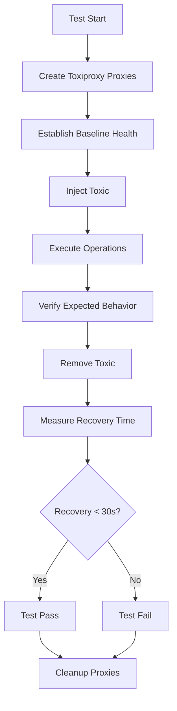

# Chaos Engineering Guide

## Overview

This guide provides comprehensive documentation for chaos engineering practices in TraceRTM. Chaos engineering helps us validate system resilience by intentionally injecting failures and observing how the system responds.

**Framework:** Toxiproxy (local/CI) + extensible to Chaos Mesh/Litmus (Kubernetes)
**Recovery Target:** All services must recover within 30 seconds
**Test Scope:** Network latency, connection failures, resource exhaustion, cascading failures

---

## Table of Contents

1. [Quick Start](#quick-start)
2. [Architecture](#architecture)
3. [Failure Scenarios](#failure-scenarios)
4. [Running Chaos Tests](#running-chaos-tests)
5. [Recovery Procedures](#recovery-procedures)
6. [CI/CD Integration](#cicd-integration)
7. [Kubernetes Deployment](#kubernetes-deployment)
8. [Monitoring & Observability](#monitoring--observability)

---

## Quick Start

### Prerequisites

- Python 3.12+
- Docker (for containerized Toxiproxy)
- Running TraceRTM services (PostgreSQL, Redis, NATS, backends)

### Local Setup

1. **Install Toxiproxy:**
   ```bash
   # Automatic installation
   ./scripts/toxiproxy-setup.sh install

   # Or install manually
   brew install toxiproxy  # macOS
   # OR download from https://github.com/Shopify/toxiproxy/releases
   ```

2. **Start Toxiproxy:**
   ```bash
   ./scripts/toxiproxy-setup.sh start

   # Verify it's running
   curl http://localhost:8474/version
   ```

3. **Run Chaos Tests:**
   ```bash
   # Run all chaos tests
   pytest tests/chaos/ -v

   # Run specific scenario
   pytest tests/chaos/test_network_latency.py -v

   # Run with detailed logging
   pytest tests/chaos/ -v -s --log-cli-level=INFO
   ```

---

## Architecture

### Toxiproxy Overview

Toxiproxy is a TCP proxy that sits between clients and services, allowing you to inject network-level failures:

```
Application → Toxiproxy Proxy → Actual Service
              (inject failures)
```

### Proxy Configuration

Chaos tests create temporary proxies for each service:

| Service          | Actual Port | Proxy Port | Toxic Types                    |
|------------------|-------------|------------|--------------------------------|
| PostgreSQL       | 5432        | 15432      | Latency, Bandwidth, Timeout    |
| Redis            | 6379        | 16379      | Latency, Connection drops      |
| NATS             | 4222        | 14222      | Latency, Timeout               |
| Go Backend       | 8080        | 18080      | Latency, Slow close            |
| Python Backend   | 8000        | 18000      | Latency, Bandwidth             |

### Test Flow



---

## Failure Scenarios

### 1. Network Latency Injection

**Purpose:** Test application performance under slow network conditions.

**Scenarios:**
- Database latency (500ms)
- Redis latency (300ms)
- Backend API latency (1000ms)
- Variable latency spikes (200ms-800ms)

**Expected Behavior:**
- Requests slow down but complete successfully
- Timeouts are handled gracefully
- System recovers immediately when latency is removed

**Test File:** `tests/chaos/test_network_latency.py`

**Example:**
```python
# Inject 500ms latency to PostgreSQL
await toxiproxy_client.add_latency(
    proxy_name="postgres_chaos",
    latency_ms=500,
    jitter_ms=100,
)
```

---

### 2. Connection Failures & Pod Kills

**Purpose:** Simulate service crashes and container terminations.

**Scenarios:**
- Database connection drop (simulate DB crash)
- Redis connection drop (simulate Redis pod kill)
- Backend service restart (simulate deployment)
- Intermittent connection drops (flapping network)

**Expected Behavior:**
- Application detects connection failure
- Retry logic activates
- Automatic reconnection when service recovers
- No data loss or corruption

**Test File:** `tests/chaos/test_connection_failures.py`

**Example:**
```python
# Simulate database crash
await toxiproxy_client.disable_proxy("postgres_chaos")

# Wait for reconnection
await asyncio.sleep(2)

# Simulate database restart
await toxiproxy_client.enable_proxy("postgres_chaos")
```

---

### 3. Resource Exhaustion

**Purpose:** Test system behavior under resource constraints.

**Scenarios:**
- Bandwidth limitation (10 KB/s)
- Slow connection close (5s delay)
- Connection timeout (10s hang)
- Combined pressure (latency + bandwidth limit)

**Expected Behavior:**
- Operations slow down but complete
- Connection pools handle constraints gracefully
- System doesn't crash under pressure
- Recovery when constraints are removed

**Test File:** `tests/chaos/test_resource_exhaustion.py`

**Example:**
```python
# Limit bandwidth to 10 KB/s
await toxiproxy_client.add_bandwidth_limit(
    proxy_name="postgres_chaos",
    rate_kbps=10,
)
```

---

### 4. End-to-End Resilience

**Purpose:** Validate entire system resilience under complex failure scenarios.

**Scenarios:**
- Cascading failures (DB → Redis → Backend)
- Gradual degradation under load
- Split-brain scenarios (partial network partition)

**Expected Behavior:**
- System degrades gracefully
- Partial failures don't cause total outage
- Full recovery when all services restore
- No permanent data inconsistency

**Test File:** `tests/chaos/test_end_to_end_resilience.py`

---

## Running Chaos Tests

### Local Execution

```bash
# Start Toxiproxy
./scripts/toxiproxy-setup.sh start

# Run all chaos tests
pytest tests/chaos/ -v --tb=short

# Run specific test category
pytest tests/chaos/test_network_latency.py -v

# Run with custom recovery target
RECOVERY_TIME_TARGET=20 pytest tests/chaos/ -v

# Run in parallel (not recommended for chaos tests)
pytest tests/chaos/ -v -n 1
```

### Docker Compose Execution

```bash
# Start services with Toxiproxy
docker-compose -f docker-compose.yml -f docker-compose.chaos.yml up -d

# Run chaos tests against Docker services
pytest tests/chaos/ -v \
  --toxiproxy-host=localhost \
  --toxiproxy-port=8474

# Cleanup
docker-compose -f docker-compose.yml -f docker-compose.chaos.yml down
```

### Pytest Markers

Chaos tests use specific pytest markers:

```bash
# Run only chaos tests
pytest -m chaos

# Run chaos tests excluding E2E
pytest -m "chaos and not e2e"

# Run slow tests (includes chaos)
pytest -m slow
```

---

## Recovery Procedures

### Automated Recovery

All services are configured with automatic recovery mechanisms:

1. **Connection Pooling:** Database and Redis clients maintain connection pools with automatic reconnection.
2. **Health Checks:** Process-compose and Docker have health probes that trigger restarts.
3. **Circuit Breakers:** Backend services implement circuit breakers for downstream dependencies.
4. **Retry Logic:** API clients retry failed requests with exponential backoff.

### Manual Recovery Steps

If a service fails to recover automatically:

#### PostgreSQL

```bash
# Check status
pg_isready -h localhost -p 5432

# Restart if needed
brew services restart postgresql@17

# Verify recovery
psql -U tracertm -d tracertm -c "SELECT 1"
```

#### Redis

```bash
# Check status
redis-cli ping

# Restart if needed
brew services restart redis

# Verify recovery
redis-cli get test_key
```

#### NATS

```bash
# Check status
curl http://localhost:8222/healthz

# Restart if needed
brew services restart nats-server

# Verify recovery
nats-server --signal reload
```

#### Go Backend

```bash
# Check logs
tail -f .process-compose/logs/go-backend.log

# If needed, restart via process-compose
process-compose project restart go-backend

# Verify health
curl http://localhost:8080/health
```

#### Python Backend

```bash
# Check logs
tail -f .process-compose/logs/python-backend.log

# Restart if needed
process-compose project restart python-backend

# Verify health
curl http://localhost:8000/health
```

### Recovery Time Monitoring

Track recovery times in Grafana:

1. Navigate to **Grafana Dashboard** (http://localhost:3000)
2. Select **Chaos Engineering Metrics**
3. View panels:
   - Service Recovery Time
   - Failed Request Rate
   - Connection Pool Status
   - Circuit Breaker State

---

## CI/CD Integration

### GitHub Actions Workflow

Chaos tests run automatically in CI/CD:

**Triggers:**
- Daily schedule (2 AM UTC)
- Manual workflow dispatch
- Pull requests affecting chaos tests

**Configuration:** `.github/workflows/chaos-tests.yml`

**Key Steps:**
1. Start Toxiproxy service container
2. Run chaos tests in parallel
3. Generate test summary
4. Upload test results as artifacts
5. Notify on failure (Slack)

### Staging Environment Tests

Chaos tests can be executed in staging:

```bash
# Trigger via GitHub Actions
gh workflow run chaos-tests.yml -f environment=staging
```

**Prerequisites:**
- Staging Kubernetes cluster configured
- Toxiproxy deployed as sidecar
- Monitoring and alerting enabled

---

## Kubernetes Deployment

### Chaos Mesh (K8s Native)

For Kubernetes environments, extend to Chaos Mesh:

```yaml
# Install Chaos Mesh
kubectl create ns chaos-testing
helm install chaos-mesh chaos-mesh/chaos-mesh -n chaos-testing

# Example NetworkChaos
apiVersion: chaos-mesh.org/v1alpha1
kind: NetworkChaos
metadata:
  name: network-delay
spec:
  action: delay
  mode: all
  selector:
    namespaces:
      - tracertm
    labelSelectors:
      "app": "tracertm-backend"
  delay:
    latency: "500ms"
    jitter: "100ms"
  duration: "30s"
```

### Litmus Chaos

Alternative K8s chaos framework:

```yaml
# Install Litmus
kubectl apply -f https://litmuschaos.github.io/litmus/litmus-operator-v1.13.8.yaml

# Example pod-delete experiment
apiVersion: litmuschaos.io/v1alpha1
kind: ChaosEngine
metadata:
  name: pod-delete-chaos
spec:
  appinfo:
    appns: tracertm
    applabel: "app=tracertm-backend"
  chaosServiceAccount: litmus-admin
  experiments:
    - name: pod-delete
      spec:
        components:
          env:
            - name: TOTAL_CHAOS_DURATION
              value: "30"
```

---

## Monitoring & Observability

### Key Metrics

Monitor during chaos tests:

1. **Service Health:**
   - HTTP response times
   - Error rates (4xx, 5xx)
   - Connection pool utilization

2. **Infrastructure:**
   - CPU usage
   - Memory consumption
   - Network I/O
   - Disk I/O

3. **Database:**
   - Query latency
   - Connection count
   - Transaction rate
   - Lock wait time

4. **Message Queue (NATS):**
   - Message throughput
   - Consumer lag
   - Connection status

### Prometheus Queries

```promql
# Service recovery time
increase(service_recovery_seconds[5m])

# Failed request rate during chaos
rate(http_requests_total{status=~"5.."}[1m])

# Database connection pool exhaustion
pg_stat_database_numbackends / pg_settings_max_connections > 0.8

# Redis connection errors
rate(redis_commands_failed_total[1m])
```

### Alerting Rules

```yaml
# Alert on slow recovery
- alert: SlowChaosRecovery
  expr: service_recovery_seconds > 30
  for: 1m
  labels:
    severity: critical
  annotations:
    summary: "Service recovery exceeded SLA"

# Alert on high error rate during chaos
- alert: HighErrorRateDuringChaos
  expr: rate(http_requests_total{status=~"5.."}[1m]) > 0.1
  for: 2m
  labels:
    severity: warning
  annotations:
    summary: "Error rate above threshold during chaos test"
```

---

## Best Practices

1. **Start Small:** Begin with low-impact failures (latency) before simulating crashes.
2. **Isolate Tests:** Run chaos tests in isolation to avoid cascading failures in CI/CD.
3. **Monitor Actively:** Watch metrics during chaos injection to understand impact.
4. **Document Failures:** Record unexpected failures and update recovery procedures.
5. **Automate Recovery:** Ensure all services have automatic recovery mechanisms.
6. **Test Regularly:** Run chaos tests on schedule (daily/weekly) to catch regressions.
7. **Gradual Rollout:** Introduce new chaos scenarios incrementally.

---

## Troubleshooting

### Toxiproxy Not Starting

```bash
# Check if port is in use
lsof -ti :8474

# Kill conflicting process
kill -9 $(lsof -ti :8474)

# Restart Toxiproxy
./scripts/toxiproxy-setup.sh restart
```

### Tests Failing to Connect

```bash
# Verify services are running
curl http://localhost:5432  # PostgreSQL
redis-cli ping              # Redis
curl http://localhost:8080/health  # Go backend

# Check proxy status
curl http://localhost:8474/proxies | jq
```

### Recovery Time Exceeds Target

1. Check service logs for errors
2. Verify retry configuration
3. Increase connection pool size
4. Review circuit breaker settings
5. Check for resource constraints (CPU, memory)

---

## References

- [Toxiproxy Documentation](https://github.com/Shopify/toxiproxy)
- [Chaos Mesh Documentation](https://chaos-mesh.org/docs/)
- [Litmus Chaos Documentation](https://litmuschaos.github.io/litmus/)
- [Principles of Chaos Engineering](https://principlesofchaos.org/)

---

**Last Updated:** 2026-02-01
**Maintained By:** TraceRTM DevOps Team
