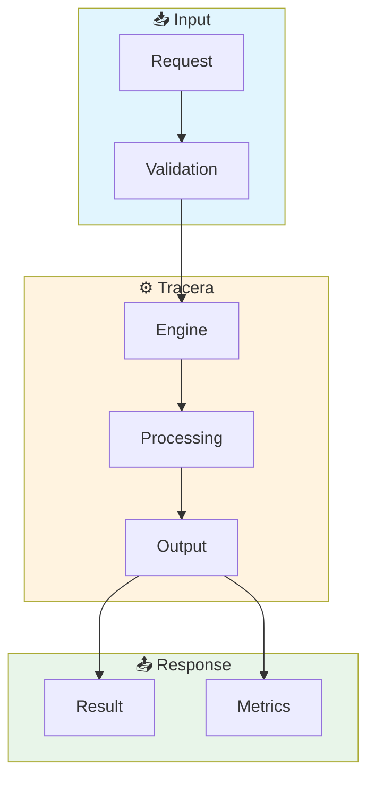

# Tracera User Journeys

> Visual step-by-step workflows for Trace Analysis

## Quick Navigation

| Journey | Time | Complexity | Status |
|---------|------|------------|--------|
| [Quick Start](./quick-start) | 5 min | ⭐ Beginner | ✅ Ready |
| [Core Integration](./core-integration) | 15 min | ⭐⭐ Intermediate | 🚧 Draft |
| [Production Setup](./production-setup) | 30 min | ⭐⭐⭐ Advanced | 📋 Planned |
| [Troubleshooting](./troubleshooting) | 10 min | ⭐⭐ Intermediate | 📋 Planned |

## Architecture Overview

## Performance Baselines

| Metric | P50 | P95 | P99 |
|--------|-----|-----|-----|
| Cold Start | &lt; 5ms | &lt; 10ms | &lt; 20ms |
| Hot Path | &lt; 1ms | &lt; 2ms | &lt; 5ms |
| Memory | &lt; 10MB | &lt; 20MB | &lt; 50MB |

## Choose Your Journey

### 🌱 Beginner
- [Quick Start](./quick-start) - Get running in 5 minutes

### 🚀 Intermediate  
- [Core Integration](./core-integration) - Integrate with your stack

### 🏆 Advanced
- [Production Setup](./production-setup) - Enterprise deployment
