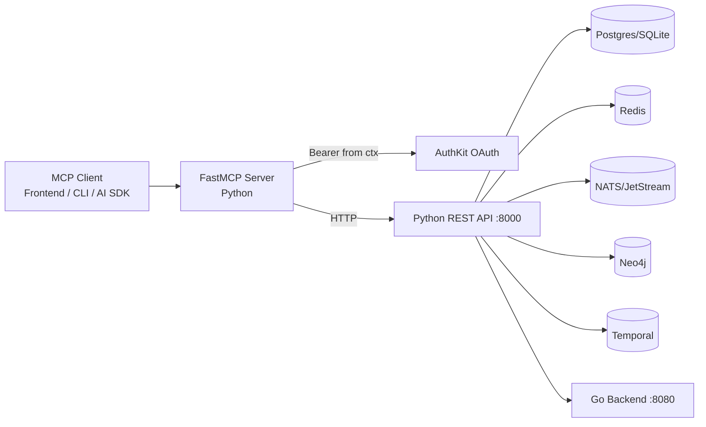
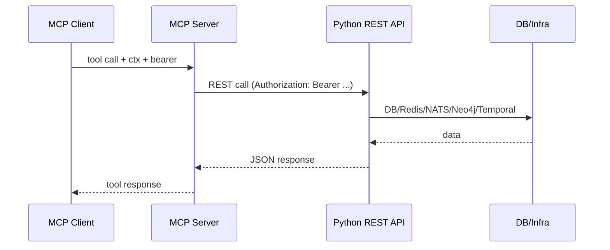

# MCP Architecture and Tool Reference

This document provides a complete walkthrough of the MCP architecture, flows, and every registered MCP tool in this repository.

## 1) Architecture Overview

### 1.1 Components

- MCP Clients: frontend agent UI, CLI, external AI SDK clients
- MCP Server: `tracertm.mcp` (FastMCP runtime), tool registry in `src/tracertm/mcp/tools/*`
- Auth: AuthKit OAuth for user MCP clients + bearer passthrough for agent context
- Python REST API: `uvicorn tracertm.api.main:app` (default `http://127.0.0.1:4000`)
- Go Backend: `http://localhost:8080`
- Infra: Postgres/SQLite, Redis, NATS/JetStream, Neo4j, Temporal (migration in progress)

### 1.2 Canonical data flow (target design)

- MCP tools should call the Python REST API (canonical contract).
- REST API enforces auth + permissions, performs DB/infra operations, returns JSON.
- MCP tools act as a safe, agent‑intuitive facade.

### 1.3 Current reality

- Core MCP tools (`core_tools.py`) and spec tools (`specifications.py`) call REST.
- Legacy MCP tools (`items.py`, `links.py`, `traceability.py`, `graph.py`, `items_optimized.py`, `items_phase3.py`) still access DB/services directly.
- Parameterized MCP tools (`params/*`) dispatch to core/spec tools or local logic.

## 2) Architecture Diagrams

### 2.1 Component graph (Mermaid)



### 2.2 Tool invocation flow (Mermaid)



### 2.3 ASCII overview

```
Client (CLI/Frontend/AI)
   |
   v
FastMCP (Python)
   |  bearer token (AuthKit OAuth)
   v
Python REST API (:8000) ---> Go backend (:8080)
   |           |           |        |         |
   v           v           v        v         v
Postgres     Redis       NATS     Neo4j    Temporal
```

## 3) Core MCP Tools (REST‑backed)

Source: `src/tracertm/mcp/tools/core_tools.py`

### 3.1 Projects

- `create_project(name, description)`
  - Action: POST `/api/v1/projects`
  - Side effects: stores `current_project_id` and `current_project_name` in ConfigManager
  - Output: `{project_id, name, description}`

- `list_projects()`
  - Action: GET `/api/v1/projects`
  - Output: `{projects: [...]}`

- `select_project(project_id)`
  - Action: GET `/api/v1/projects/{id}` (fallback to list+prefix match)
  - Side effects: sets current project in ConfigManager
  - Output: `{project_id, name}`

- `snapshot_project(project_id, label)`
  - Action: GET `/api/v1/projects/{id}` to validate
  - Side effects: writes `~/.tracertm/projects/<id>/snapshots.yaml`
  - Output: `{snapshot_id, created_at}`

### 3.2 Items

- `create_item(title, view, item_type, description, status, priority, owner, parent_id, metadata)`
  - Action: POST `/api/v1/items`
  - Output: `{id, title, view, type, status, priority, ...}`

- `query_items(view, item_type, status, owner, limit)`
  - Action: GET `/api/v1/items` with filters
  - Client‑side filters: `item_type`, `owner`
  - Output: `{project_id, filters, items[]}`

- `summarize_view(view)`
  - Action: GET `/api/v1/items/summary`
  - Output: summary counts + samples

- `get_item(item_id)`
  - Action: GET `/api/v1/items/{id}`
  - Fallback: list items and prefix match on `id` or `external_id`
  - Output: item object

- `update_item(item_id, title, description, status, priority, owner, metadata)`
  - Action: PUT `/api/v1/items/{id}`
  - Fallback: list items and prefix match, then PUT
  - Output: updated item object

- `delete_item(item_id)`
  - Action: DELETE `/api/v1/items/{id}`
  - Fallback: list items and prefix match, then DELETE
  - Output: `{id, status}`

- `bulk_update_items(view, status, new_status)`
  - Action: POST `/api/v1/items/bulk-update`
  - Output: bulk update summary

### 3.3 Links

- `create_link(source_id, target_id, link_type, metadata)`
  - Action: POST `/api/v1/links`
  - Output: `{id, source_id, target_id, link_type, metadata}`

- `list_links(item_id, link_type, limit)`
  - Action: GET `/api/v1/links`
  - If `item_id` provided: resolves prefix/external_id and queries both source and target links
  - Output: `{project_id, count, links[]}`

- `show_links(item_id, view)`
  - Action: GET `/api/v1/links/grouped`
  - Output: `{item, outgoing[], incoming[]}`

### 3.4 Traceability & Graph

- `find_gaps(from_view, to_view)`
  - Action: GET `/api/v1/analysis/gaps`
  - Output: gap list + counts

- `get_trace_matrix(source_view, target_view)`
  - Action: GET `/api/v1/analysis/trace-matrix`
  - Output: traceability matrix

- `analyze_impact(item_id, max_depth, link_types)`
  - Action: GET `/api/v1/analysis/impact/{item_id}`
  - Output: impact analysis summary

- `analyze_reverse_impact(item_id, max_depth)`
  - Action: GET `/api/v1/analysis/reverse-impact/{item_id}`
  - Output: upstream dependencies

- `project_health()`
  - Action: GET `/api/v1/analysis/health/{project_id}`
  - Output: project stats

- `detect_cycles()`
  - Action: GET `/api/v1/analysis/cycles/{project_id}`
  - Output: cycle summary

- `shortest_path(source_id, target_id)`
  - Action: GET `/api/v1/analysis/shortest-path`
  - Output: `{exists, distance, path, link_types}`

## 4) Specification MCP Tools (REST‑backed)

Source: `src/tracertm/mcp/tools/specifications.py`

- `create_adr(project_id, title, context, decision, consequences, status, decision_drivers, tags)`
  - Action: POST `/api/v1/adrs`
  - Output: `{id, adr_number, title, status}`

- `list_adrs(project_id, status)`
  - Action: GET `/api/v1/adrs`
  - Output: list of ADRs

- `create_contract(project_id, item_id, title, contract_type, status)`
  - Action: POST `/api/v1/contracts`
  - Output: `{id, contract_number, title}`

- `create_feature(project_id, name, description, as_a, i_want, so_that)`
  - Action: POST `/api/v1/features`
  - Output: `{id, feature_number, name}`

- `create_scenario(feature_id, title, gherkin_text)`
  - Action: POST `/api/v1/features/{feature_id}/scenarios`
  - Output: `{id, scenario_number, title}`

- `analyze_quality(item_id)`
  - Action: POST `/api/v1/quality/items/{item_id}/analyze`
  - Output: `{smells, ambiguity_score, completeness_score, suggestions}`

## 5) Parameterized MCP Tools (Unified dispatch)

Source: `src/tracertm/mcp/tools/params/*` (implementation in `src/tracertm/mcp/tools/param.py`)

These tools accept an `action` or `kind` field plus a `payload`, then dispatch to core/spec tools or local logic. All are JSON‑friendly entry points intended for agent use.

- `project_manage(action, payload, ctx)`
- `item_manage(action, payload, ctx)`
- `link_manage(action, payload, ctx)`
- `trace_analyze(kind, payload, ctx)`
- `graph_analyze(kind, payload, ctx)`
- `specification_manage(kind, action, payload, ctx)`
- `config_manage(action, payload, ctx)`
- `database_manage(action, payload, ctx)`
- `export_manage(action, payload, ctx)`
- `import_manage(action, payload, ctx)`
- `ingestion_manage(action, payload, ctx)`
- `sync_manage(action, payload, ctx)`
- `backup_manage(action, payload, ctx)`
- `file_watch_manage(action, payload, ctx)`
- `agent_manage(action, payload, ctx)`
- `progress_manage(action, payload, ctx)`
- `saved_query_manage(action, payload, ctx)`
- `test_manage(action, payload, ctx)`
- `tui_manage(action, payload, ctx)`
- `design_manage(action, payload, ctx)`
- `benchmark_manage(action, payload, ctx)`
- `chaos_manage(action, payload, ctx)`

## 6) Legacy direct‑DB tools (non‑canonical)

These tools still access DB/services directly and do not use the REST API contract. They should be treated as legacy/local‑dev tools.

### 6.1 Items (legacy)

Source: `src/tracertm/mcp/tools/items.py`

- `create_item(...)`
- `get_item(item_id)`
- `update_item(...)`
- `delete_item(item_id)`
- `query_items(...)`
- `summarize_view(view)`
- `bulk_update_items(...)`

### 6.2 Links (legacy)

Source: `src/tracertm/mcp/tools/links.py`

- `create_link(...)`
- `list_links(...)`
- `show_links(...)`

### 6.3 Traceability (legacy)

Source: `src/tracertm/mcp/tools/traceability.py`

- `find_gaps(...)`
- `get_trace_matrix(...)`
- `analyze_impact(...)`
- `analyze_reverse_impact(...)`
- `project_health()`

### 6.4 Graph (legacy)

Source: `src/tracertm/mcp/tools/graph.py`

- `detect_cycles(...)`
- `shortest_path(...)`

## 7) Optimized item tools (direct‑DB variants)

### 7.1 Optimized v2

Source: `src/tracertm/mcp/tools/items_optimized.py`

- `create_item_optimized(...)`
- `get_item_optimized(...)`
- `query_items_optimized(...)`
- `update_item_optimized(...)`
- `delete_item_optimized(...)`
- `summarize_view_optimized(...)`

### 7.2 Phase 3 (cache + pooling)

Source: `src/tracertm/mcp/tools/items_phase3.py`

- `create_item_phase3(...)`
- `get_item_phase3(...)`
- `query_items_phase3(...)`
- `get_db_metrics_phase3(...)`

## 8) Streaming tools

### 8.1 Streaming v1

Source: `src/tracertm/mcp/tools/streaming.py`

- `stream_impact_analysis(item_id, max_depth, progress)`
- `get_matrix_page(project_id, page, page_size, source_view, target_view, ctx)`
- `get_impact_by_depth(item_id, depth, ctx)`
- `get_items_page(project_id, page, page_size, view, status, item_type, sort_by, sort_order, ctx)`
- `get_links_page(project_id, page, page_size, link_type, source_id, target_id, ctx)`

### 8.2 Streaming v2 (batch based)

Source: `src/tracertm/mcp/tools/streaming_v2.py`

- `stream_items(view, item_type, status, batch_size, ctx)`
- `get_items_batch(batch, view, item_type, status, batch_size, ctx)`
- `stream_links(link_type, source_id, target_id, batch_size, ctx)`
- `get_links_batch(batch, link_type, source_id, target_id, batch_size, ctx)`
- `stream_matrix(source_view, target_view, batch_size, ctx)`
- `get_matrix_batch(batch, source_view, target_view, batch_size, ctx)`

## 9) Auth/Config/DB tools

Source: `src/tracertm/mcp/tools/auth_config_db.py`

- `auth_login(ctx, authkit_domain, client_id, scopes, connect_endpoint)`
- `auth_status(ctx)`
- `auth_logout(ctx)`
- `config_init(ctx, database_url)`
- `config_show(ctx)`
- `config_set(ctx, key, value)`
- `config_get(ctx, key)`
- `config_unset(ctx, key)`
- `config_list(ctx)`
- `db_init(ctx, database_url)`
- `db_status(ctx)`
- `db_migrate(ctx)`
- `db_rollback(ctx, confirm)`
- `db_reset(ctx, confirm)`

## 10) Optional feature tools

Source: `src/tracertm/mcp/tools/optional_features.py`

- Views: `view_list`, `view_switch`, `view_current`, `view_stats`, `view_show`
- History: `history_show`, `history_version`, `history_rollback`
- Agents: `agent_list`, `agent_activity`, `agent_metrics`, `agent_workload`, `agent_health`
- State: `state_show`, `state_get`
- Utility: `drill_item`, `dashboard_show`

## 11) Design + ingest + migration tools

Source: `src/tracertm/mcp/tools/design_ingest_migration.py`

- Design: `design_init`, `design_link`, `design_sync`, `design_generate`, `design_status`, `design_list`
- Ingest: `ingest_directory`, `ingest_markdown`, `ingest_yaml`, `ingest_file`
- Migration: `migrate_project`
- Link QA: `link_detect_missing`, `link_detect_orphans`, `link_auto_link`

## 12) BMM workflow tools

Source: `src/tracertm/mcp/tools/bmm_workflows.py`

- `init_project(ctx, progress)`
- `run_workflow(ctx, workflow_id, auto, progress)`
- `run_phase(ctx, phase, parallel, auto, progress)`
- `get_status()`

## 13) Feature demo tools

Source: `src/tracertm/mcp/tools/feature_demos.py`

- `mcp_feature_status(ctx)`
- `demo_versioned_tool(x, y)` (v1)
- `demo_versioned_tool(x, y, z, mode)` (v2)
- `demo_long_task(steps, delay_seconds, progress)`

## 14) Workflow execution tool

Source: `src/tracertm/mcp/workflow_executor.py`

- `execute_workflow(...)` executes a named workflow definition with tool calls

## 15) MCP Resources (read‑only)

### 15.1 TraceRTM resources

Source: `src/tracertm/mcp/resources/tracertm.py`

- `tracertm://projects`
- `tracertm://project/{project_id}`
- `tracertm://items/{project_id}`
- `tracertm://links/{project_id}`
- `tracertm://matrix/{project_id}`
- `tracertm://health/{project_id}`
- `tracertm://views/traceability/{project_id}`
- `tracertm://views/impact/{project_id}`
- `tracertm://views/coverage/{project_id}`

### 15.2 BMM resources

Source: `src/tracertm/mcp/resources/bmm.py`

- `bmm://workflow-status`
- `bmm://project-config`
- `bmm://next-workflow`
- `bmm://progress-summary`

## 16) Notes on tool selection

- Prefer `core_tools.py` + `specifications.py` for any agent‑facing or client‑facing MCP usage.
- Use `params/*` when you want a single “action + payload” entrypoint.
- Legacy DB tools are useful for local testing but bypass API‑level auth, caching, and telemetry.

