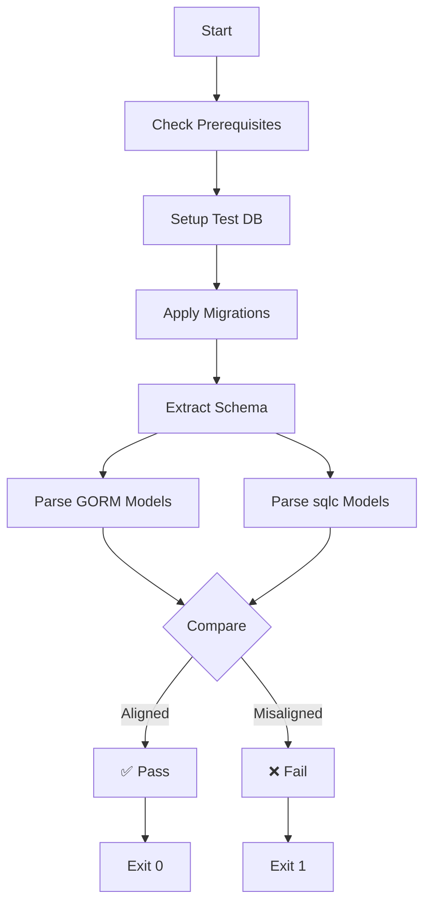

# Schema Validation Quick Reference

Fast reference for schema alignment validation script usage.

## Quick Commands

```bash
# Run validation (local)
./scripts/validate_schema_alignment.sh

# Keep test DB for inspection
KEEP_TEST_DB=true ./scripts/validate_schema_alignment.sh

# Custom database
DB_HOST=myhost DB_USER=myuser ./scripts/validate_schema_alignment.sh

# Fix common issues
sqlc generate && ./scripts/validate_schema_alignment.sh
```

## Validation Workflow



## Exit Codes

| Code | Status | Action |
|------|--------|--------|
| 0 | ✅ Success | All aligned - proceed |
| 1 | ❌ Failed | Fix mismatches |
| 2 | ⚠️ Error | Check setup (tools/DB) |

## Common Fixes

### GORM Missing Column

```go
// Before: Field missing
type Item struct {
    ID    string
    Title string
}

// After: Add missing field
type Item struct {
    ID        string
    Title     string
    NewField  string `gorm:"column:new_field"`
}
```

### GORM Extra Field

**Option 1**: Remove from model
```go
// Remove field that doesn't exist in DB
type Item struct {
    ID    string
    Title string
    // OldField string  // Remove this
}
```

**Option 2**: Add migration
```sql
-- Create column in database
ALTER TABLE items ADD COLUMN old_field VARCHAR(255);
```

### sqlc Out of Sync

```bash
# Regenerate sqlc models
sqlc generate

# Verify
./scripts/validate_schema_alignment.sh
```

### Migration Failed

```bash
# Check migration syntax
cat internal/db/migrations/20250131_*.sql

# Test migration manually
psql -d test_db -f internal/db/migrations/20250131_*.sql

# Fix and re-run
./scripts/validate_schema_alignment.sh
```

## Validation Checks

| Check | What It Does | Fix If Failed |
|-------|--------------|---------------|
| Prerequisites | Verify tools installed | Install missing tools |
| Test DB Setup | Create clean database | Check PostgreSQL running |
| Apply Migrations | Run all migrations | Fix SQL syntax errors |
| GORM Alignment | Match models to schema | Update model structs |
| sqlc Alignment | Match generated models | Run `sqlc generate` |
| Query Compilation | Verify sqlc queries | Fix query syntax |

## Environment Variables

```bash
# Database connection
export DB_HOST=localhost
export DB_PORT=5432
export DB_USER=postgres
export DB_PASSWORD=postgres

# Test database name
export TEST_DB_NAME=trace_validation_test

# Schema to validate
export DB_SCHEMA=public

# Keep test DB after run
export KEEP_TEST_DB=true
```

## CI/CD Integration

### Automatic Triggers

- Push to `main` or `develop`
- Pull requests
- Changes to:
  - `backend/internal/db/migrations/**`
  - `backend/internal/models/**`
  - `backend/internal/db/models.go`
  - `backend/sqlc.yaml`

### Workflow File

`.github/workflows/schema-validation.yml`

### View Results

```bash
# Check GitHub Actions
# Go to: Repository → Actions → Schema Validation

# Download artifacts
# - schema-validation-report
# - schema-documentation
```

## Output Examples

### ✅ Success

```
╔════════════════════════════════════════════════════════════╗
║          ✅ ALL SCHEMAS ALIGNED - VALIDATION PASSED        ║
╚════════════════════════════════════════════════════════════╝

Statistics:
  Total Checks:   4
  Passed:         12 (✅)
  Failed:         0 (❌)
  Warnings:       0 (⚠️)
```

### ❌ Failure

```
❌ GORM missing column: new_field
❌ Table 'agents' has alignment issues

╔════════════════════════════════════════════════════════════╗
║         ❌ SCHEMA MISMATCHES FOUND - VALIDATION FAILED     ║
╚════════════════════════════════════════════════════════════╝

Action Required:
  1. Review migration files
  2. Update GORM models to match database schema
  3. Regenerate sqlc models: sqlc generate
  4. Re-run this validation script
```

## Development Workflow

### After Creating Migration

```bash
# 1. Create migration
cat > internal/db/migrations/20250131_add_field.sql <<EOF
ALTER TABLE items ADD COLUMN new_field VARCHAR(255);
EOF

# 2. Update GORM model
vim internal/models/models.go
# Add: NewField string `gorm:"column:new_field"`

# 3. Regenerate sqlc
sqlc generate

# 4. Validate
./scripts/validate_schema_alignment.sh
```

### After Modifying Model

```bash
# 1. Modify GORM model
vim internal/models/models.go

# 2. Create matching migration
vim internal/db/migrations/20250131_update_schema.sql

# 3. Regenerate sqlc
sqlc generate

# 4. Validate
./scripts/validate_schema_alignment.sh
```

## Troubleshooting

### Can't Connect to Database

```bash
# Check PostgreSQL is running
pg_isready -h localhost -p 5432

# Check credentials
psql -h localhost -U postgres -d postgres -c "SELECT 1"

# Check extensions
psql -h localhost -U postgres -d postgres -c "SELECT * FROM pg_extension"
```

### Tool Not Found

```bash
# Install PostgreSQL client
# Ubuntu/Debian
sudo apt-get install postgresql-client

# macOS
brew install postgresql

# Install sqlc
go install github.com/sqlc-dev/sqlc/cmd/sqlc@latest

# Verify
which psql sqlc go
```

### Migration Conflicts

```bash
# Inspect test database
KEEP_TEST_DB=true ./scripts/validate_schema_alignment.sh

# Connect and inspect
psql -h localhost -U postgres -d trace_validation_test
\dt  # List tables
\d items  # Describe table

# Check for duplicates
SELECT table_name, COUNT(*)
FROM information_schema.tables
WHERE table_schema = 'public'
GROUP BY table_name
HAVING COUNT(*) > 1;
```

### Debug Mode

```bash
# Enable verbose output
set -x
./scripts/validate_schema_alignment.sh

# Or edit script: Add -x to shebang
#!/bin/bash -x
```

## Best Practices

1. ✅ Run validation after every schema change
2. ✅ Keep migrations idempotent (`IF NOT EXISTS`)
3. ✅ Version migrations with timestamps
4. ✅ Update models before committing migrations
5. ✅ Test on clean database before merging
6. ❌ Don't modify generated sqlc files manually
7. ❌ Don't skip validation in CI/CD
8. ❌ Don't commit without running validation

## Quick Checklist

- [ ] PostgreSQL running and accessible
- [ ] All required extensions enabled
- [ ] Tools installed (psql, go, sqlc)
- [ ] Migrations apply cleanly
- [ ] GORM models match schema
- [ ] sqlc models regenerated
- [ ] Validation passes locally
- [ ] CI/CD workflow succeeds

## Related Commands

```bash
# View migrations
ls -la internal/db/migrations/

# Check GORM models
grep "type.*struct" internal/models/models.go

# Check sqlc models
grep "type.*struct" internal/db/models.go

# Test sqlc generation
sqlc generate

# Apply migrations manually
for f in internal/db/migrations/*.sql; do
  psql -d mydb -f "$f"
done
```

## Getting Help

1. Check script output for specific errors
2. Review full documentation: `scripts/README_SCHEMA_VALIDATION.md`
3. Inspect test database with `KEEP_TEST_DB=true`
4. Check GitHub Actions logs
5. File issue with validation report

## See Also

- [Full Documentation](../../backend/scripts/README_SCHEMA_VALIDATION.md)
- [Migration Guide](../../backend/internal/db/migrations/README.md)
- [CI/CD Workflows](../../.github/workflows/schema-validation.yml)
