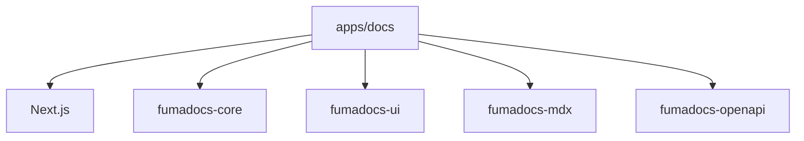

# Docs App Architecture (Fumadocs + Next.js)

## Scope
- App: `frontend/apps/docs`

## High-level stack
- Runtime: Next.js 16 + React 19
- Docs framework: Fumadocs (core/ui/mdx/openapi)
- Styling: Tailwind CSS + Typography + tailwind-merge
- Search/indexing: local indexing scripts (Fumadocs + custom scripts)
- Testing: Playwright e2e, Lighthouse CI

## Dependency map

## Build/runtime flow (simplified)
1) Generate OpenAPI artifacts (optional for build).
2) Next.js compiles MDX content via Fumadocs pipeline.
3) Static/SSR build depending on command.

## Key entrypoints
- Next config: `frontend/apps/docs/next.config.mjs`
- App root: `frontend/apps/docs/app`
- Fumadocs config: `frontend/apps/docs/fumadocs.config.ts`
- OpenAPI scripts: `frontend/apps/docs/scripts`

## Quality gates
- Lint: `next lint`
- Format: `oxfmt`
- E2E: Playwright
- Perf: Lighthouse CI
