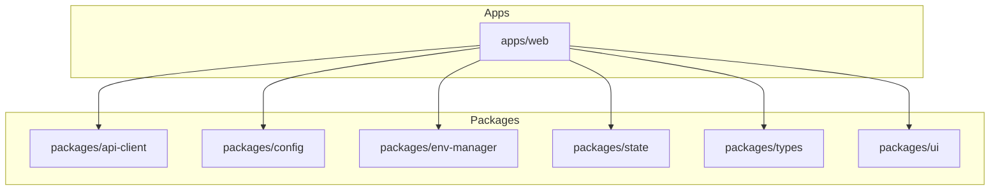

# Frontend Architecture (Web + Shared Packages)

## Scope
- Apps: `frontend/apps/web`
- Shared packages: `frontend/packages/*`

## High-level stack
- Runtime: React 19 + Vite 8 (dev/build)
- Routing: TanStack Router (file-based)
- State: Zustand + @legendapp/state
- Data: TanStack Query + OpenAPI client (`openapi-fetch` + `openapi-typescript`)
- UI: @tracertm/ui (Radix UI, CVA, Tailwind-merge)
- Auth: WorkOS AuthKit React
- Tests: Vitest, Playwright (e2e/visual), Storybook for UI

## App/package dependency map

## Runtime flow (simplified)
1) Router loads route module and guard.
2) Auth store validates session/token.
3) Data layer uses OpenAPI client + TanStack Query.
4) UI composed from @tracertm/ui + app components.

## Key entrypoints
- Vite config: `frontend/apps/web/vite.config.mjs`
- Router root: `frontend/apps/web/src/routes/__root.tsx`
- App entry: `frontend/apps/web/src/main.tsx`
- API client: `frontend/packages/api-client`
- UI components: `frontend/packages/ui`

## Quality gates
- Lint: `oxlint` (type-aware)
- Format: `oxfmt`
- Unit: `vitest`
- E2E/Visual: `playwright`
