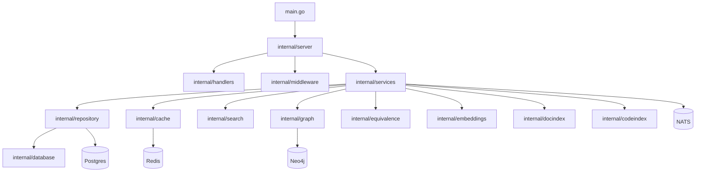

# Go Backend Architecture

## Scope
- Service: `go-backend` (root `main.go`, `internal/*`, `cmd/*`)

## High-level stack
- Language/runtime: Go (module `github.com/kooshapari/tracertm-backend`)
- HTTP framework: Echo
- gRPC: `internal/grpc`
- Storage: Postgres (pgx), Redis, Neo4j
- Messaging: NATS
- Observability: OpenTelemetry + Sentry
- Migrations: `internal/db` + `internal/database`

## Dependency map (major subsystems)

## Runtime flow (simplified)
1) `main.go` loads config and preflight checks.
2) Infrastructure initialized (Postgres, Redis, NATS, Neo4j).
3) Services wired (business logic, indexers, search).
4) Echo HTTP + gRPC servers start.
5) Middleware adds auth, metrics, tracing, rate limits.

## Key entrypoints
- Main: `main.go`
- Server wiring: `internal/server/server.go`
- HTTP handlers: `internal/handlers/*`
- Services: `internal/services/*`
- Repositories: `internal/repository/*`
- DB/infra: `internal/database/*`, `internal/infrastructure/*`

## Quality gates
- Linting: golangci-lint + custom rules (mnd, gocognit, funlen, gosec)
- Tests: `go test ./...`
