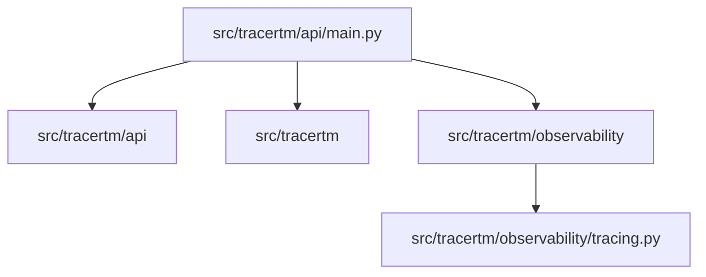

# Python Backend Architecture

## Scope
- Service: `python-backend` (src-based Python app)

## High-level stack
- Runtime: Python (ASGI)
- Web server: Uvicorn
- Framework: FastAPI (assumed by structure and typical setup)
- Observability: OpenTelemetry (custom init), metrics endpoint
- Integration: depends on Go backend + Temporal (per startup checks)

## Dependency map (major subsystems)

## Runtime flow (simplified)
1) Uvicorn launches ASGI app.
2) Observability initialized (OTel tracing + metrics).
3) App startup checks/polling (go-backend, temporal-host).
4) Routes serve API, `/health`, `/metrics`.

## Key entrypoints
- App: `src/tracertm/api/main.py`
- Observability: `src/tracertm/observability/tracing.py`

## Quality gates
- Unit tests: `pytest` (if configured)
- Lint/typecheck: project-dependent (ruff/mypy if configured)
