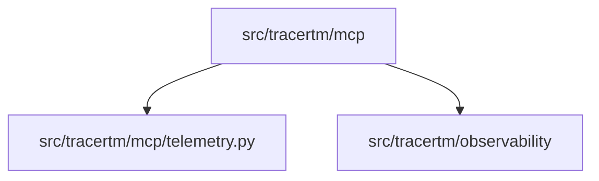

# Python MCP Architecture

## Scope
- MCP integration layer: `src/tracertm/mcp`

## High-level stack
- Runtime: Python
- Protocol: MCP (tooling/telemetry integration)
- Observability: shared tracing via `src/tracertm/observability`

## Dependency map

## Runtime flow (simplified)
1) MCP module imports are lazy to avoid preflight on import.
2) Telemetry hooks use shared tracing provider when available.
3) MCP tools register and execute via the MCP protocol runtime.

## Key entrypoints
- MCP package: `src/tracertm/mcp/__init__.py`
- Telemetry: `src/tracertm/mcp/telemetry.py`

## Quality gates
- Unit tests: `pytest` (if configured)
- Lint/typecheck: project-dependent (ruff/mypy if configured)
