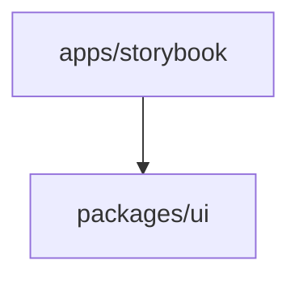

# Storybook Architecture

## Scope
- App: `frontend/apps/storybook`
- UI package: `frontend/packages/ui`

## High-level stack
- Storybook 8 (Vite builder)
- React 19
- UI source: @tracertm/ui
- Tests: Vitest (storybook app), Playwright (in web app for visual/e2e)

## Dependency map

## Runtime flow (simplified)
1) Storybook loads stories from @tracertm/ui and app-level stories.
2) Vite builder compiles components and renders in Storybook iframe.
3) Optional Chromatic CI for visual regression.

## Key entrypoints
- Storybook config: `frontend/apps/storybook/.storybook`
- UI package: `frontend/packages/ui`

## Quality gates
- Storybook test: `bun run test:vitest`
- Optional CI: Chromatic
