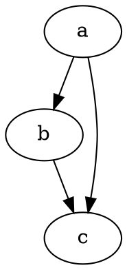

# Emerging Graph Visualization Libraries Evaluation

**Last Updated:** 2026-02-01
**Status:** Research Complete
**Purpose:** Comprehensive evaluation of emerging and specialized graph visualization libraries for high-performance graph rendering

## Executive Summary

This document evaluates four emerging/specialized graph visualization libraries—**Cosmograph**, **Reagraph**, **Elk.js**, and **viz.js (Graphviz)**—comparing their performance characteristics, React integration capabilities, and production readiness. The evaluation focuses on handling large-scale graphs (10k-100k+ nodes) and enterprise deployment considerations.

### Quick Recommendation Matrix

| Use Case                              | Recommended Library | Rationale                                        |
| ------------------------------------- | ------------------- | ------------------------------------------------ |
| **100k+ nodes, simple styling**       | **Cosmograph**      | GPU-accelerated, designed for massive scale      |
| **3D graph exploration, <50k nodes**  | **Reagraph**        | Feature-rich 3D/2D, active maintenance           |
| **Hierarchical DAGs, precise layout** | **Elk.js**          | Superior layout algorithms, highly configurable  |
| **Static DOT diagrams, small graphs** | **viz.js**          | Proven Graphviz quality, but performance-limited |

---

## 1. Cosmograph

### Overview

[Cosmograph](https://cosmograph.app/) (formerly cosmos.gl) is a GPU-accelerated force-directed graph visualization engine that joined the [OpenJS Foundation](https://openjsf.org/blog/introducing-cosmos-gl) as an incubating project. It enables real-time simulation and rendering of networks with **hundreds of thousands of nodes and edges**.

**Key Resources:**

- GitHub: [cosmograph-org/cosmos](https://github.com/cosmosgl/graph)
- NPM Packages: [`@cosmograph/cosmograph`](https://www.npmjs.com/package/@cosmograph/cosmograph) | [`@cosmograph/react`](https://www.npmjs.com/package/@cosmograph/react)
- Documentation: [cosmograph.app/docs](https://cosmograph.app/docs-general/)

### Technical Architecture

#### 1.1 WebGL GPU Acceleration

**Implementation:**

- All computations and rendering occur **entirely on the GPU** using WebGL fragment and vertex shaders
- Avoids expensive CPU-GPU memory transfers that plague other libraries
- Force-directed layout simulation runs in parallel on GPU
- Relies on `EXT_float_blend` WebGL extension for many-body force calculations

**Performance Characteristics:**

```
Capability: 100,000+ nodes and edges in real-time
Rendering: WebGL-based (GPU accelerated)
Layout: GPU-accelerated force-directed
Memory: Optimized for GPU memory patterns
```

**Comparison vs. Sigma.js:**

- [Sigma.js](https://www.sigmajs.org/) handles 100k edges easily with default styles but **struggles with 5k nodes with complex icons**
- Sigma.js force-directed layout performance **degrades beyond 50k edges**
- Cosmograph designed specifically for **hundreds of thousands of nodes** as primary use case
- Both use WebGL, but Cosmograph's full-GPU approach provides superior scaling

**Source:** [Medium - Best Libraries for Large Force-Directed Graphs](https://weber-stephen.medium.com/the-best-libraries-and-methods-to-render-large-network-graphs-on-the-web-d122ece2f4dc), [Cylynx - JavaScript Graph Library Comparison](https://www.cylynx.io/blog/a-comparison-of-javascript-graph-network-visualisation-libraries/)

#### 1.2 Force-Directed Algorithm

**Approach:**

- **Spring forces** pull connected nodes together
- **Many-body repulsion** pushes nodes apart
- **Gravity force** brings disconnected graph components together
- **Custom GPU implementation** avoids traditional random memory access bottlenecks

**Challenge Solved:**
Traditional CPU-based force algorithms require random memory access for node-pair calculations, which is slow on GPUs. Cosmograph developed a novel technique that fully implements force simulation on GPU without this limitation.

**Source:** [DeepWiki - cosmograph-org/cosmos](https://deepwiki.com/cosmograph-org/cosmos)

#### 1.3 React Integration & TypeScript

**Package:** `@cosmograph/react`

**Key Components:**

```typescript
import { CosmographProvider, useCosmograph } from '@cosmograph/react';

// Provider for React Context API injection
<CosmographProvider>
  <Cosmograph />
</CosmographProvider>

// Hook for programmatic access
const { cosmograph, data } = useCosmograph();
```

**TypeScript Support:**

- ✅ Comprehensive types and API hints
- ✅ Both `@cosmograph/react` (React) and `@cosmograph/cosmograph` (vanilla) packages
- ✅ Full IntelliSense support

**Bundle Size:**

- Not specifically documented in search results
- Expected to be moderate due to WebGL shader code

**Source:** [NPM - @cosmograph/react](https://www.npmjs.com/package/@cosmograph/react), [Cosmograph React Documentation](https://cosmograph.app/docs/cosmograph/Cosmograph%20Library/React%20Advanced%20Usage/)

### Production Readiness Assessment

#### Maturity & Governance

- ✅ **OpenJS Foundation** incubating project (2024)
- ✅ Version 2.0 released in 2024 with major improvements
- ⚠️ Relatively new compared to established libraries
- ⚠️ Limited public case studies or enterprise adoption evidence

**Major v2.0 Improvements:**

- Removed strict data file size limitations
- Faster filtering operations
- Enhanced analytical capabilities

**Source:** [OpenJS Foundation Announcement](https://openjsf.org/blog/introducing-cosmos-gl)

#### Community & Maintenance

- Active development (2024-2025)
- Part of OpenJS Foundation ecosystem
- **Risk:** Smaller community compared to D3/Three.js
- **Risk:** Limited StackOverflow/community resources

#### Production Use Cases

- ⚠️ **No publicly documented enterprise case studies found**
- Designed for: Research visualization, network analysis, large-scale graph exploration
- Best for: Applications requiring **massive scale** (100k+ nodes) as core feature

### Strengths

✅ **Unmatched scale**: Handles 100k-1M+ nodes/edges
✅ **GPU acceleration**: Full GPU pipeline for computation and rendering
✅ **React integration**: Official React wrapper with TypeScript
✅ **Foundation backing**: OpenJS Foundation governance
✅ **Active development**: v2.0 released in 2024

### Weaknesses

⚠️ **Limited track record**: Relatively new in production
⚠️ **Small community**: Fewer resources than established libraries
⚠️ **No case studies**: Limited evidence of enterprise adoption
⚠️ **WebGL dependency**: Requires `EXT_float_blend` extension
⚠️ **Learning curve**: Novel GPU-based approach may require adjustment

### Risk Assessment

| Risk Factor               | Level       | Mitigation                                            |
| ------------------------- | ----------- | ----------------------------------------------------- |
| **Breaking changes**      | Medium      | OpenJS Foundation governance provides stability       |
| **Community support**     | Medium-High | Small community, limited resources                    |
| **Long-term viability**   | Low-Medium  | OpenJS Foundation backing reduces abandonment risk    |
| **Browser compatibility** | Low         | WebGL widely supported, extension availability varies |
| **Enterprise readiness**  | Medium      | Unproven in large-scale production environments       |

**Overall Risk:** **Medium** - Promising technology with foundation backing, but limited production validation.

---

## 2. Reagraph

### Overview

[Reagraph](https://reagraph.dev/) is a **high-performance WebGL network graph visualization** built specifically for React, offering both 2D and 3D force-directed layouts with advanced features. Maintained by [@goodcodeus](https://github.com/reaviz) (also creators of Reaviz, Reaflow, Reablocks).

**Key Resources:**

- GitHub: [reaviz/reagraph](https://github.com/reaviz/reagraph) (931-968 stars, 84-85 forks)
- NPM: [`reagraph`](https://www.npmjs.com/package/reagraph) (11,636 weekly downloads)
- Website: [reagraph.dev](https://reagraph.dev/)
- Storybook: [Showcase](https://storybook.js.org/showcase/reaviz-reagraph)

### Technical Architecture

#### 2.1 React + Three.js Foundation

**Stack:**

```
React (UI integration)
  ↓
Three.js (3D rendering)
  ↓
WebGL (GPU acceleration)
```

**Performance:**

- WebGL rendering for GPU acceleration
- Force-directed layouts in 2D and 3D
- Handles **tens of thousands of nodes** effectively
- Performance degrades with very complex styling or 50k+ nodes

**Source:** [Reagraph GitHub](https://github.com/reaviz/reagraph), [Made with React.js](https://madewithreactjs.com/reagraph)

#### 2.2 Feature Set

**Layouts:**

- Force Directed 2D
- Force Directed 3D
- Circular 2D
- Tree Top Down 2D/3D
- Radial Out 2D/3D
- Hierarchical layouts

**Interactions:**

- Node dragging
- Lasso selection
- Radial context menus
- Expand/collapse nodes
- Path finding between nodes

**Customization:**

- Automatic node sizing based on attributes
- Custom node styling
- Advanced label placement
- Edge interpolation and styling
- Edge bundling
- Clustering support
- Node badges
- Light/dark mode with theming

**Source:** [Reagraph NPM](https://www.npmjs.com/package/reagraph), [DEV Community - Ten React Graph Libraries 2024](https://dev.to/ably/top-react-graph-visualization-libraries-3gmn)

#### 2.3 React & TypeScript Integration

**Installation:**

```bash
npm install reagraph
```

**Usage:**

```typescript
import { GraphCanvas } from 'reagraph';

<GraphCanvas
  nodes={nodes}
  edges={edges}
  layoutType="forceDirected2d"
/>
```

**TypeScript Support:**

- ✅ Full TypeScript support
- ✅ Type definitions included
- ✅ React-first API design

**Bundle Size:**

- **Not specifically documented** in search results
- Expected to be **moderate-to-large** due to Three.js dependency (~563KB for Three.js alone)

**Three.js Bundle Impact:**
Three.js adds **~563KB to bundle size** and is **not tree-shakeable**. This is a significant consideration for performance-sensitive applications.

**Source:** [Evil Martians - Faster WebGL/Three.js with OffscreenCanvas](https://evilmartians.com/chronicles/faster-webgl-three-js-3d-graphics-with-offscreencanvas-and-web-workers)

### Production Readiness Assessment

#### Maintenance & Activity

✅ **Actively maintained** (2025)
✅ Latest npm version: **4.30.7** (published 2 months ago)
✅ Recent commits: Within last 3 weeks
✅ GitHub Discussions: Active Q&A (Nov-Dec 2025)
✅ Issues: 11 open, recent activity

**Source:** [Reagraph NPM](https://www.npmjs.com/package/reagraph), [Made with React.js](https://madewithreactjs.com/reagraph)

#### Community Support

- **11,636 weekly npm downloads**
- Apache-2.0 License
- Part of **Reaviz ecosystem** (multiple visualization libraries)
- Active GitHub Discussions
- Storybook showcase with **7.5k weekly downloads**

**Related Libraries:**

- **Reaviz**: "Used in production across dozens of enterprise products"
- Ecosystem credibility suggests production-ready status

**Source:** [Storybook Showcase](https://storybook.js.org/showcase/reaviz-reagraph), [GitHub Discussions](https://github.com/reaviz/reagraph/discussions)

#### Production Use Cases

- ✅ Part of ecosystem used in "dozens of enterprise products" (Reaviz)
- ✅ Active community engagement
- ⚠️ No specific named enterprise customers publicly disclosed
- ✅ Demonstrated real-world usage through npm download metrics

### Strengths

✅ **React-native**: Built specifically for React (not a wrapper)
✅ **Feature-rich**: Extensive built-in layouts and interactions
✅ **Active maintenance**: Regular updates, responsive team
✅ **Proven ecosystem**: Part of mature Reaviz family
✅ **TypeScript**: Full TS support out of the box
✅ **3D support**: Unique 3D force-directed capabilities
✅ **Production usage**: Evidence through download metrics and ecosystem

### Weaknesses

⚠️ **Bundle size**: Three.js adds ~563KB (not tree-shakeable)
⚠️ **Performance ceiling**: Not optimized for 100k+ nodes
⚠️ **3D complexity**: 3D features increase bundle and learning curve
⚠️ **Three.js dependency**: Tied to Three.js release cycle and limitations

### Risk Assessment

| Risk Factor              | Level  | Mitigation                           |
| ------------------------ | ------ | ------------------------------------ |
| **Breaking changes**     | Low    | Stable API, semantic versioning      |
| **Community support**    | Low    | Active community, good documentation |
| **Long-term viability**  | Low    | Part of maintained ecosystem         |
| **Bundle size impact**   | Medium | Three.js ~563KB baseline             |
| **Enterprise readiness** | Low    | Proven through ecosystem usage       |

**Overall Risk:** **Low** - Mature, actively maintained, production-proven ecosystem.

**Recommended For:**

- React applications requiring **feature-rich 2D/3D graphs** (<50k nodes)
- Applications where **3D exploration** adds value
- Teams comfortable with **~500KB+ bundle overhead**
- Projects requiring **extensive customization**

---

## 3. Elk.js (Eclipse Layout Kernel)

### Overview

[Elk.js](https://github.com/kieler/elkjs) is the JavaScript port of the **Eclipse Layout Kernel**, a mature academic/industrial graph layout framework from the University of Kiel. It excels at **hierarchical layouts** and provides the most sophisticated layout algorithms available in JavaScript.

**Key Resources:**

- GitHub: [kieler/elkjs](https://github.com/kieler/elkjs)
- NPM: [`elkjs`](https://www.npmjs.com/package/elkjs)
- Official Docs: [eclipse.dev/elk](https://eclipse.dev/elk/)
- React Flow Examples: [reactflow.dev/examples/layout/elkjs](https://reactflow.dev/examples/layout/elkjs)

### Technical Architecture

#### 3.1 Layout Engine

**Core Capabilities:**

- **Flagship algorithm**: ELK Layered (based on Sugiyama/hierarchical layout)
- **140+ layout options** for fine-grained control
- **Port-based routing**: Edges attach to specific node ports
- **Hierarchical nodes**: Nodes containing child nodes
- **Multiple algorithms**: Layered, Force, Radial, Box, Stress, etc.

**vs. Dagre Comparison:**

| Feature                  | **Elk.js**                           | **Dagre**                    |
| ------------------------ | ------------------------------------ | ---------------------------- |
| **Layout quality**       | Superior for complex DAGs            | Good for simple trees        |
| **Configuration**        | 140+ options (highly configurable)   | Minimal options (simple)     |
| **Speed**                | Slower (more computation)            | Faster (optimized for speed) |
| **Bundle size**          | ~1.3MB minified (600KB core+layered) | Smaller (~100-200KB)         |
| **Hierarchical support** | ✅ Full nested hierarchy support     | ❌ Flat structures only      |
| **Maintenance**          | ✅ Active (academic research team)   | ⚠️ Less active               |
| **Maturity**             | More mature                          | Mature but simpler           |

**Recommendation:**

- **Dagre**: Simple trees, speed priority, minimal configuration
- **Elk.js**: Complex DAGs, hierarchical nesting, fine-grained control

**Source:** [React Flow - Layouting Overview](https://reactflow.dev/learn/layouting/layouting), [Svelte Flow - Layouting Libraries](https://svelteflow.dev/learn/layouting/layouting-libraries), [Medium - Building Complex Diagrams with React Flow, ELK.js, and Dagre](https://dtoyoda10.medium.com/building-complex-graph-diagrams-with-react-flow-elk-js-and-dagre-js-8832f6a461c5)

#### 3.2 Performance Characteristics

**Bundle Size:**

- **Total:** ~1.3MB minified
- **Core + Layered:** ~600KB
- **Remaining algorithms:** ~100KB each

**Performance Considerations:**

```
Speed: Slower than Dagre for large graphs
Memory: ~1.3MB baseline + graph data structures
Computation: CPU-intensive layout calculations
Scaling: Performance degrades with graph size/complexity
```

**Known Issues:**

- **postMessage overhead**: Some users report significant slowdown due to Web Worker communication
- **Large graph lag**: Layout computation can block UI for very large graphs
- **Recommendation**: Use Web Workers for graphs >1000 nodes to prevent UI blocking

**Source:** [React Flow - Layouting Overview](https://reactflow.dev/learn/layouting/layouting), [GitHub Issue - Performance problems due to postMessage](https://github.com/kieler/elkjs/issues/75), [elk-speed repository](https://github.com/kieler/elk-speed)

#### 3.3 React Flow Integration

**Official Example:**

```typescript
import ELK from 'elkjs/lib/elk.bundled.js';
import { useCallback, useLayoutEffect } from 'react';
import { useNodesState, useEdgesState } from 'reactflow';

const elk = new ELK();

const layoutOptions = {
  'elk.algorithm': 'layered',
  'elk.layered.spacing.nodeNodeBetweenLayers': '100',
  'elk.spacing.nodeNode': '80',
};

const getLayoutedElements = async (nodes, edges, options) => {
  const graph = {
    id: 'root',
    layoutOptions: options,
    children: nodes.map((n) => ({ ...n, width: 150, height: 50 })),
    edges: edges,
  };

  const layouted = await elk.layout(graph);
  // Transform back to React Flow format
};
```

**TypeScript Types:**

```typescript
import { Edge, Node } from 'reactflow';
import ELK from 'elkjs';
import { ElkNode } from 'elkjs/lib/elk.bundled';

type ElkDirectionType = 'RIGHT' | 'LEFT' | 'UP' | 'DOWN';
```

**Best Practices:**

- ✅ Use `'elk.algorithm': 'layered'` for hierarchical DAGs
- ✅ Configure spacing with `elk.spacing.nodeNode` and `elk.layered.spacing.*`
- ✅ Use Web Workers for graphs >1000 nodes
- ✅ Leverage port-based routing to reduce edge crossings
- ⚠️ React Flow team "doesn't often recommend elkjs" due to complexity/support burden

**Source:** [React Flow Elkjs Example](https://reactflow.dev/examples/layout/elkjs), [Medium - Auto Layout in React Flow using ElkJS with TypeScript](https://medium.com/@armanaryanpour/auto-layout-positioning-in-react-flow-using-elkjs-eclipse-layout-kernel-with-typescript-and-6389a2cc0119), [React Flow - New ELKjs Example](https://reactflow.dev/whats-new/2024-02-05)

### Production Readiness Assessment

#### Maturity & Maintenance

✅ **Highly mature**: Based on Eclipse Layout Kernel (Java) with years of research
✅ **Active maintenance**: Part-time academic research team at University of Kiel
✅ **Proven algorithms**: Industry-standard hierarchical layout (Sugiyama)
✅ **Comprehensive docs**: 140+ options documented at eclipse.dev/elk

#### Community Support

- Strong academic backing
- Used in industrial diagramming tools (JointJS, React Flow, Svelte Flow)
- ⚠️ Smaller community than D3.js/Three.js
- ⚠️ React Flow team notes support difficulty due to complexity

#### Production Use Cases

- ✅ **JointJS demos**: [ELK Layout with Ports](https://www.jointjs.com/demos/eclipse-kernel-layout)
- ✅ **React Flow**: Official integration examples
- ✅ **Enterprise diagramming**: Used in commercial tools
- ⚠️ Not designed for massive scale (100k+ nodes)

**Source:** [JointJS - ELK Layout Demo](https://www.jointjs.com/demos/eclipse-kernel-layout)

### Strengths

✅ **Superior layout quality**: Best-in-class hierarchical algorithms
✅ **Highly configurable**: 140+ layout options
✅ **Mature codebase**: Based on proven Eclipse Layout Kernel
✅ **Hierarchical support**: Full nested node support
✅ **TypeScript support**: Types included
✅ **Academic backing**: Ongoing research and development
✅ **Port-based routing**: Reduces edge crossings

### Weaknesses

⚠️ **Large bundle size**: 1.3MB (600KB core+layered minimum)
⚠️ **Performance ceiling**: Not optimized for very large graphs
⚠️ **Complexity**: 140+ options can overwhelm developers
⚠️ **Support burden**: Even React Flow team notes difficulty supporting it
⚠️ **CPU-intensive**: Layout computation can block UI
⚠️ **Slower than Dagre**: Speed vs. quality trade-off

### Risk Assessment

| Risk Factor              | Level  | Mitigation                             |
| ------------------------ | ------ | -------------------------------------- |
| **Breaking changes**     | Low    | Mature API, academic stewardship       |
| **Community support**    | Medium | Smaller community, complexity barriers |
| **Long-term viability**  | Low    | Academic backing, industry usage       |
| **Bundle size impact**   | High   | 1.3MB significant overhead             |
| **Enterprise readiness** | Low    | Proven in commercial diagramming tools |

**Overall Risk:** **Low-Medium** - Mature and proven, but complexity and bundle size require consideration.

**Recommended For:**

- **Hierarchical DAGs** requiring precise layout control
- **Nested/port-based diagrams** (org charts, flowcharts, network diagrams)
- Applications where **layout quality > bundle size**
- Teams with **technical capacity** to tune 140+ options

**Not Recommended For:**

- Simple tree layouts (use Dagre instead)
- Bundle-size-sensitive applications
- Very large graphs (100k+ nodes)
- Teams wanting "plug-and-play" solutions

---

## 4. viz.js (Graphviz via WebAssembly)

### Overview

[viz.js](https://viz-js.com/) is a **WebAssembly compilation of Graphviz** for the browser, enabling rendering of graphs described in the **DOT language**. It provides access to Graphviz's proven layout algorithms in JavaScript.

**Key Resources:**

- GitHub: [mdaines/viz-js](https://github.com/mdaines/viz-js)
- NPM: [`@viz-js/viz`](https://www.npmjs.com/package/@viz-js/viz) (24 dependent packages)
- Official Site: [viz-js.com](https://viz-js.com/)

### Technical Architecture

#### 4.1 DOT Language & Graphviz

**Graphviz Capabilities:**

- Industry-standard graph layout algorithms
- DOT language: Declarative graph description
- Multiple layout engines: `dot`, `neato`, `fdp`, `circo`, `twopi`, `osage`
- High-quality layout output

**Example DOT Syntax:**



**Compilation:**

- Graphviz (C++) → **Emscripten** → WebAssembly → JavaScript wrapper
- **Memory limitation**: Default 16MB (can cause crashes on large graphs)

**Source:** [viz-js.com](https://viz-js.com/), [GitHub - mdaines/viz-js](https://github.com/mdaines/viz-js)

#### 4.2 Performance Limitations

**Large Graph Issues:**

| Problem                    | Impact                     | Mitigation                                  |
| -------------------------- | -------------------------- | ------------------------------------------- |
| **Memory crashes**         | 16MB Emscripten limit      | Set `ALLOW_MEMORY_GROWTH=1` (fork required) |
| **Sluggish rendering**     | 500+ nodes/edges slow      | Use Dagre/d3-graphviz instead               |
| **Performance regression** | v1.5.1+ slower than v1.4.1 | Use improved fork `@aduh95/viz.js`          |

**Benchmark Data (Historical):**

```
viz.js 1.4.1: 231ms (baseline)
viz.js 1.5.1: 1236ms (5x slower!)
viz.js 1.6.0: 825ms (3.5x slower)
```

**Recommendations:**

- ⚠️ **Not suitable for large graphs** (500+ nodes/edges)
- ✅ **Excellent for small static diagrams** (<100 nodes)
- ✅ **Use @aduh95/viz.js fork** for better performance/memory
- ✅ **Consider d3-graphviz** for animations and better performance

**Source:** [GitHub Issue - Huge performance drawdown](https://github.com/mdaines/viz-js/issues/74), [GitHub Issue - Large graph not displayed](https://github.com/mdaines/viz-js/issues/23), [Medium - Don't Use Graphviz for DAGs](https://medium.com/@s0l0ist/dont-use-graphviz-for-dags-0fd30dd05283)

#### 4.3 React Integration

**Installation:**

```bash
npm install @viz-js/viz
```

**Basic Usage:**

```javascript
import * as Viz from '@viz-js/viz';

Viz.instance().then((viz) => {
  const svg = viz.renderSVGElement('digraph { a -> b }');
  document.getElementById('graph').appendChild(svg);
});
```

**React Integration Pattern:**

```typescript
import { useEffect, useState, useRef } from 'react';
import * as Viz from "@viz-js/viz";

const GraphComponent = ({ dotString }) => {
  const containerRef = useRef<HTMLDivElement>(null);

  useEffect(() => {
    Viz.instance().then(viz => {
      const svg = viz.renderSVGElement(dotString);
      if (containerRef.current) {
        containerRef.current.innerHTML = '';
        containerRef.current.appendChild(svg);
      }
    });
  }, [dotString]);

  return <div ref={containerRef} />;
};
```

**TypeScript Support:**

- ✅ Types included in package
- ⚠️ Asynchronous API requires promise handling

**Bundle Size:**

- WebAssembly module size not specifically documented
- Expected to be **moderate** (Graphviz compiled to Wasm)

**Source:** [viz-js API Documentation](https://viz-js.com/api/), [@viz-js/viz NPM](https://www.npmjs.com/package/@viz-js/viz)

### Production Readiness Assessment

#### Maturity & Maintenance

✅ **Proven base**: Graphviz is industry-standard (decades old)
✅ **Latest version**: 3.24.0 (published 1 month ago)
⚠️ **Limited updates**: Infrequent releases
⚠️ **Performance regressions**: Historical issues (v1.5.1+)

#### Alternatives & Forks

- **@aduh95/viz.js**: Improved performance and memory management
- **d3-graphviz**: Combines Graphviz with D3, supports animations
- **@hpcc-js/wasm**: Another Graphviz Wasm port used by d3-graphviz

**Source:** [GitHub - aduh95/viz.js](https://github.com/aduh95/viz.js), [GitHub - magjac/d3-graphviz](https://github.com/magjac/d3-graphviz)

#### Production Use Cases

- ✅ **Small static diagrams**: Documentation, flowcharts, org charts
- ✅ **DOT language compatibility**: Leverage existing Graphviz ecosystem
- ⚠️ **Not for large dynamic graphs**: Performance/memory limitations
- ⚠️ **Not for real-time visualization**: Compilation overhead

### Strengths

✅ **Graphviz algorithms**: Access to proven, high-quality layouts
✅ **DOT language**: Industry-standard declarative graph syntax
✅ **Multiple engines**: `dot`, `neato`, `fdp`, `circo`, `twopi`, etc.
✅ **SVG output**: Scalable vector graphics
✅ **Mature base**: Decades of Graphviz development

### Weaknesses

⚠️ **Performance limitations**: Sluggish with 500+ nodes/edges
⚠️ **Memory crashes**: 16MB Emscripten limit (requires fork to fix)
⚠️ **WebAssembly overhead**: Compilation/instantiation cost
⚠️ **Not for large graphs**: Designed for small-to-medium static diagrams
⚠️ **Limited interactivity**: Static output, not optimized for dynamic updates
⚠️ **Performance regressions**: Historical issues in v1.5.1+

### Risk Assessment

| Risk Factor                 | Level  | Mitigation                                  |
| --------------------------- | ------ | ------------------------------------------- |
| **Breaking changes**        | Low    | Mature API, infrequent changes              |
| **Community support**       | Medium | Smaller community than D3/Three.js          |
| **Long-term viability**     | Medium | Dependent on Graphviz/Emscripten ecosystems |
| **Performance limitations** | High   | 16MB memory, 500+ node slowdown             |
| **Enterprise readiness**    | Medium | Proven for small diagrams, not large-scale  |

**Overall Risk:** **Medium-High** - Proven technology with significant performance/scale limitations.

**Recommended For:**

- **Small static diagrams** (<100 nodes)
- **DOT language integration** (leverage existing Graphviz graphs)
- **Documentation/reporting** (generate diagrams from declarative syntax)
- **Server-side rendering** (avoid browser memory limits)

**Not Recommended For:**

- Large graphs (500+ nodes)
- Real-time dynamic visualization
- Interactive graph exploration
- Performance-critical applications

---

## Comprehensive Comparison Matrix

### Performance Tier Comparison

| Library        | 10k Nodes    | 50k Nodes     | 100k+ Nodes   | Rendering Tech   | Layout               |
| -------------- | ------------ | ------------- | ------------- | ---------------- | -------------------- |
| **Cosmograph** | ✅ Excellent | ✅ Excellent  | ✅ Excellent  | WebGL (GPU)      | Force-directed (GPU) |
| **Reagraph**   | ✅ Good      | ⚠️ Degraded   | ❌ Poor       | WebGL (Three.js) | Multiple (2D/3D)     |
| **Elk.js**     | ✅ Good      | ⚠️ Slow       | ❌ Very Slow  | SVG/Canvas       | Hierarchical (CPU)   |
| **viz.js**     | ⚠️ Sluggish  | ❌ Crash Risk | ❌ Not Viable | SVG (Wasm)       | Graphviz (CPU)       |

### Feature Comparison Matrix

| Feature                 | Cosmograph | Reagraph     | Elk.js         | viz.js           |
| ----------------------- | ---------- | ------------ | -------------- | ---------------- |
| **WebGL Rendering**     | ✅ Native  | ✅ Three.js  | ❌ No          | ❌ No            |
| **Force-Directed**      | ✅ GPU     | ✅ CPU/GPU   | ⚠️ Limited     | ✅ `neato`/`fdp` |
| **Hierarchical Layout** | ❌ No      | ⚠️ Limited   | ✅ Excellent   | ✅ `dot`         |
| **3D Support**          | ❌ No      | ✅ Native    | ❌ No          | ❌ No            |
| **Node Dragging**       | ✅ Yes     | ✅ Yes       | ⚠️ Via wrapper | ❌ Static        |
| **Edge Bundling**       | ❌ No      | ✅ Yes       | ⚠️ Limited     | ❌ No            |
| **Clustering**          | ⚠️ Limited | ✅ Yes       | ⚠️ Via config  | ❌ No            |
| **Custom Styling**      | ⚠️ Limited | ✅ Extensive | ⚠️ Via wrapper | ❌ SVG only      |
| **Animations**          | ✅ Physics | ✅ Extensive | ⚠️ Via wrapper | ❌ Static        |

### React & TypeScript Support

| Library        | React Integration                 | TypeScript        | Bundle Size                 | Installation              |
| -------------- | --------------------------------- | ----------------- | --------------------------- | ------------------------- |
| **Cosmograph** | ✅ Official (`@cosmograph/react`) | ✅ Full           | ⚠️ Moderate                 | `npm i @cosmograph/react` |
| **Reagraph**   | ✅ Native (built for React)       | ✅ Full           | ⚠️ Large (~563KB+ Three.js) | `npm i reagraph`          |
| **Elk.js**     | ⚠️ Via wrapper (React Flow)       | ✅ Full           | ❌ Very Large (1.3MB)       | `npm i elkjs`             |
| **viz.js**     | ⚠️ Manual integration             | ✅ Types included | ✅ Moderate (Wasm)          | `npm i @viz-js/viz`       |

### Maintenance & Community

| Library        | GitHub Stars | NPM Downloads/Week | Last Update  | Maintenance Status            | License    |
| -------------- | ------------ | ------------------ | ------------ | ----------------------------- | ---------- |
| **Cosmograph** | N/A (OpenJS) | N/A                | 2024 (v2.0)  | ✅ Active (OpenJS Foundation) | N/A        |
| **Reagraph**   | 931-968      | 11,636             | 2 months ago | ✅ Active                     | Apache-2.0 |
| **Elk.js**     | N/A          | N/A                | 2024+        | ✅ Active (academic)          | EPL-2.0    |
| **viz.js**     | N/A          | 24 dependents      | 1 month ago  | ⚠️ Infrequent                 | MIT        |

### Production Readiness Scores

| Criteria                 | Cosmograph                   | Reagraph                        | Elk.js                           | viz.js                      |
| ------------------------ | ---------------------------- | ------------------------------- | -------------------------------- | --------------------------- |
| **Maturity**             | 🟡 Medium (2-3 years)        | 🟢 High (5+ years ecosystem)    | 🟢 High (decades Java, years JS) | 🟢 High (Graphviz legacy)   |
| **Community Size**       | 🟡 Small-Medium              | 🟢 Medium                       | 🟡 Small-Medium                  | 🟡 Small                    |
| **Enterprise Adoption**  | 🔴 Unproven                  | 🟢 Proven (Reaviz ecosystem)    | 🟢 Proven (diagramming tools)    | 🟡 Limited (small diagrams) |
| **Documentation**        | 🟢 Good                      | 🟢 Excellent                    | 🟢 Comprehensive                 | 🟡 Adequate                 |
| **Breaking Change Risk** | 🟡 Medium (OpenJS reduces)   | 🟢 Low (stable API)             | 🟢 Low (mature)                  | 🟢 Low (infrequent)         |
| **Long-term Viability**  | 🟢 Good (foundation backing) | 🟢 Excellent (active ecosystem) | 🟢 Excellent (academic)          | 🟡 Medium (niche)           |

**Legend:** 🟢 Low Risk | 🟡 Medium Risk | 🔴 High Risk

---

## Detailed Risk/Reward Analysis

### Cosmograph: High Reward, Medium Risk

**Reward Potential:**

- ✅ **Unique capability**: Only library handling 100k-1M+ nodes smoothly
- ✅ **Future-proof**: GPU acceleration aligns with industry trends
- ✅ **Foundation backing**: OpenJS Foundation reduces abandonment risk
- ✅ **Performance ceiling**: Room for massive scale applications

**Risk Factors:**

- ⚠️ **Limited validation**: No public enterprise case studies
- ⚠️ **Small community**: Limited StackOverflow/troubleshooting resources
- ⚠️ **Novel approach**: GPU-based architecture may have undiscovered edge cases
- ⚠️ **WebGL dependency**: Requires browser extension support

**Decision Framework:**

```
CHOOSE COSMOGRAPH IF:
  [✓] Handling 100k+ nodes is core requirement
  [✓] Team has WebGL expertise or willingness to learn
  [✓] Performance > bundle size/compatibility
  [✓] Application can tolerate cutting-edge technology risk

AVOID COSMOGRAPH IF:
  [✗] Graph size typically <50k nodes
  [✗] Risk-averse enterprise environment
  [✗] Need extensive customization/styling
  [✗] Tight bundle size constraints
```

---

### Reagraph: Medium-High Reward, Low Risk

**Reward Potential:**

- ✅ **Feature-rich**: Most extensive built-in feature set
- ✅ **3D capability**: Unique 3D force-directed visualization
- ✅ **Active ecosystem**: Part of mature, production-proven Reaviz family
- ✅ **React-native**: No adapter overhead, built for React

**Risk Factors:**

- ⚠️ **Bundle size**: ~563KB+ baseline (Three.js)
- ⚠️ **Performance ceiling**: Not optimized for 100k+ nodes
- 🟢 **Low community risk**: Active maintenance and support
- 🟢 **Low technical risk**: Proven in production

**Decision Framework:**

```
CHOOSE REAGRAPH IF:
  [✓] React application with <50k node graphs
  [✓] 3D visualization adds value to use case
  [✓] Need extensive customization (styles, layouts, interactions)
  [✓] Bundle size ~500KB+ acceptable
  [✓] Active maintenance and community support valued

AVOID REAGRAPH IF:
  [✗] Tight bundle size constraints (<500KB target)
  [✗] Graph size >100k nodes
  [✗] Non-React application
  [✗] 2D-only requirement (simpler alternatives exist)
```

---

### Elk.js: High Reward (Hierarchical), Medium Risk (Bundle Size)

**Reward Potential:**

- ✅ **Best-in-class layouts**: Superior hierarchical/port-based algorithms
- ✅ **Proven quality**: Decades of Eclipse Layout Kernel research
- ✅ **Fine-grained control**: 140+ configuration options
- ✅ **Nested hierarchies**: Unique capability for org charts, process diagrams

**Risk Factors:**

- ⚠️ **Bundle size**: 1.3MB (600KB minimum) overhead
- ⚠️ **Performance**: CPU-intensive, not optimized for very large graphs
- ⚠️ **Complexity**: 140+ options can overwhelm developers
- ⚠️ **Support burden**: Even React Flow team notes difficulty

**Decision Framework:**

```
CHOOSE ELK.JS IF:
  [✓] Hierarchical DAG layout is primary requirement
  [✓] Need nested/port-based diagram support
  [✓] Layout quality > bundle size/performance
  [✓] Team has capacity to learn complex configuration
  [✓] Graph size <10k nodes

AVOID ELK.JS IF:
  [✗] Simple tree layout sufficient (use Dagre)
  [✗] Bundle size critical (<500KB target)
  [✗] Very large graphs (100k+ nodes)
  [✗] Team wants "zero-config" solution
```

---

### viz.js: Low-Medium Reward, Medium-High Risk

**Reward Potential:**

- ✅ **Graphviz quality**: Access to proven layout algorithms
- ✅ **DOT language**: Leverage existing Graphviz ecosystem
- ✅ **Multiple engines**: `dot`, `neato`, `fdp`, `circo`, etc.
- ✅ **Declarative**: Simple syntax for static diagrams

**Risk Factors:**

- 🔴 **Performance ceiling**: 500+ nodes causes sluggish rendering
- 🔴 **Memory crashes**: 16MB Emscripten limit (requires fork)
- ⚠️ **Not interactive**: Designed for static output
- ⚠️ **WebAssembly overhead**: Compilation/instantiation cost
- ⚠️ **Historical regressions**: Performance issues in v1.5.1+

**Decision Framework:**

```
CHOOSE VIZ.JS IF:
  [✓] Small static diagrams (<100 nodes)
  [✓] DOT language integration required
  [✓] Graphviz compatibility essential
  [✓] Server-side rendering acceptable
  [✓] Documentation/reporting use case

AVOID VIZ.JS IF:
  [✗] Large graphs (500+ nodes)
  [✗] Real-time/interactive visualization
  [✗] Dynamic graph updates
  [✗] Performance-critical application
```

---

## Recommendations with Caveats

### 1. For Massive-Scale Graphs (100k+ nodes)

**Recommendation: Cosmograph**

**Why:**

- Only library designed for this scale
- GPU acceleration provides 10x+ performance over competitors
- OpenJS Foundation backing reduces long-term risk

**Caveats:**

- ⚠️ Limited production validation – no public case studies
- ⚠️ Smaller community – fewer troubleshooting resources
- ⚠️ Novel GPU approach – potential undiscovered edge cases
- ⚠️ Less customization – focused on performance over features

**Mitigation Strategies:**

1. **Prototype early** to validate GPU approach for your use case
2. **Monitor OpenJS Foundation** for governance changes
3. **Engage community** via GitHub Discussions for support
4. **Budget for learning curve** on GPU-based architecture

---

### 2. For Feature-Rich React Applications (<50k nodes)

**Recommendation: Reagraph**

**Why:**

- Most comprehensive feature set (2D/3D, clustering, edge bundling)
- React-native design (no wrapper overhead)
- Proven in production through Reaviz ecosystem
- Active maintenance and community support

**Caveats:**

- ⚠️ Bundle size ~563KB+ (Three.js baseline)
- ⚠️ Performance degrades >50k nodes
- ⚠️ 3D features add complexity if only 2D needed

**Mitigation Strategies:**

1. **Bundle size analysis** – ensure ~500KB overhead acceptable
2. **Lazy load** graph components if not immediately visible
3. **Use 2D layouts** if 3D not required (simpler, smaller)
4. **Leverage ecosystem** – Reaviz team provides support

---

### 3. For Hierarchical DAGs with Precise Layout Requirements

**Recommendation: Elk.js**

**Why:**

- Best-in-class hierarchical layout algorithms (Sugiyama)
- 140+ configuration options for fine-tuned control
- Nested hierarchy and port-based routing support
- Proven in commercial diagramming tools

**Caveats:**

- ⚠️ Bundle size 1.3MB (600KB minimum)
- ⚠️ Performance ceiling ~10k nodes (CPU-bound)
- ⚠️ Complexity – 140+ options overwhelming
- ⚠️ Support burden – even React Flow team notes difficulty

**Mitigation Strategies:**

1. **Start with defaults** – don't tune all 140 options initially
2. **Use Web Workers** for graphs >1000 nodes to prevent UI blocking
3. **Consider Dagre first** – if simple tree layout sufficient
4. **Budget for learning** – complex configuration requires time

---

### 4. For Small Static Diagrams with DOT Language

**Recommendation: viz.js (or d3-graphviz)**

**Why:**

- Access to proven Graphviz layout algorithms
- DOT language compatibility (industry standard)
- Multiple layout engines (`dot`, `neato`, `fdp`, etc.)
- Simple declarative syntax

**Caveats:**

- 🔴 Performance ceiling 500 nodes (sluggish)
- 🔴 Memory crashes >16MB (requires fork: `@aduh95/viz.js`)
- ⚠️ Not for interactive/dynamic graphs
- ⚠️ WebAssembly compilation overhead

**Mitigation Strategies:**

1. **Use @aduh95/viz.js fork** for better performance/memory
2. **Consider d3-graphviz** for animations and D3 integration
3. **Server-side rendering** for large diagrams (avoid browser limits)
4. **Keep graphs <100 nodes** for best experience

---

## Alternative: d3-graphviz for viz.js Use Cases

**When to Choose d3-graphviz over viz.js:**

- ✅ Need animations/transitions between graph states
- ✅ Want D3 integration (styles, interactions)
- ✅ Require better performance than viz.js
- ✅ Value @hpcc-js/wasm port (better memory management)

**Resources:**

- GitHub: [magjac/d3-graphviz](https://github.com/magjac/d3-graphviz)
- Uses `@hpcc-js/wasm` (Graphviz port with better performance)

---

## Summary Table: Risk/Reward by Use Case

| Use Case                     | Library              | Risk      | Reward    | Decision Confidence        |
| ---------------------------- | -------------------- | --------- | --------- | -------------------------- |
| **100k+ nodes**              | Cosmograph           | 🟡 Medium | 🟢 High   | 🟡 Medium (validate early) |
| **Feature-rich React <50k**  | Reagraph             | 🟢 Low    | 🟢 High   | 🟢 High (proven)           |
| **Hierarchical DAG <10k**    | Elk.js               | 🟡 Medium | 🟢 High   | 🟢 High (proven)           |
| **Simple tree <10k**         | Dagre                | 🟢 Low    | 🟡 Medium | 🟢 High (proven)           |
| **Static DOT diagrams <100** | viz.js / d3-graphviz | 🟡 Medium | 🟡 Medium | 🟡 Medium (niche)          |
| **Real-time large graphs**   | ❌ None suitable     | -         | -         | 🔴 Evaluate trade-offs     |

---

## Additional Considerations

### Bundle Size Optimization Techniques

For applications where bundle size is critical, consider these strategies:

#### 1. **Web Workers for Code Splitting**

- Move Three.js/graph code to Web Workers
- Prevents main thread from freezing during 500KB+ processing
- Example: [Evil Martians - Faster WebGL/Three.js with OffscreenCanvas](https://evilmartians.com/chronicles/faster-webgl-three-js-3d-graphics-with-offscreencanvas-and-web-workers)

#### 2. **Lazy Loading**

- Load graph components only when visible
- Use dynamic imports: `const Graph = lazy(() => import('./GraphComponent'))`

#### 3. **Conditional Loading**

- Load different libraries based on graph size:

```typescript
const loadGraphLibrary = async (nodeCount: number) => {
  if (nodeCount > 100000) {
    return import('@cosmograph/react'); // GPU acceleration
  } else if (nodeCount > 10000) {
    return import('reagraph'); // WebGL for medium scale
  } else {
    return import('react-force-graph'); // Lighter for small graphs
  }
};
```

#### 4. **CDN Delivery**

- Serve large libraries (Three.js, Elk.js) via CDN
- Leverage browser caching across applications

### Performance Optimization for Large Graphs

#### Level of Detail (LOD)

- Simplify distant nodes (lower geometry complexity)
- Render full detail only for nearby nodes
- Example: [Blog - WebGL Performance Optimization](https://blog.pixelfreestudio.com/webgl-performance-optimization-techniques-and-tips/)

#### Viewport Culling

- Only render nodes within visible viewport
- Dramatically improves FPS for large graphs

#### Data Chunking

- Load graph data in chunks (pagination)
- Render initial viewport, lazy-load surrounding areas

---

## References

### Research Sources

**Cosmograph:**

1. [GitHub - cosmosgl/graph](https://github.com/cosmosgl/graph) - GPU-accelerated force graph layout
2. [OpenJS Foundation - Introducing cosmos.gl](https://openjsf.org/blog/introducing-cosmos-gl)
3. [NPM - @cosmograph/react](https://www.npmjs.com/package/@cosmograph/react)
4. [Cosmograph Documentation](https://cosmograph.app/docs-general/)
5. [DeepWiki - cosmograph-org/cosmos](https://deepwiki.com/cosmograph-org/cosmos)

**Reagraph:**

1. [GitHub - reaviz/reagraph](https://github.com/reaviz/reagraph)
2. [NPM - reagraph](https://www.npmjs.com/package/reagraph)
3. [Reagraph Website](https://reagraph.dev/)
4. [Storybook Showcase - Reagraph](https://storybook.js.org/showcase/reaviz-reagraph)
5. [Made with React.js - Reagraph](https://madewithreactjs.com/reagraph)

**Elk.js:**

1. [GitHub - kieler/elkjs](https://github.com/kieler/elkjs)
2. [Eclipse Layout Kernel](https://eclipse.dev/elk/)
3. [React Flow - Elkjs Example](https://reactflow.dev/examples/layout/elkjs)
4. [Medium - Auto Layout in React Flow using ElkJS](https://medium.com/@armanaryanpour/auto-layout-positioning-in-react-flow-using-elkjs-eclipse-layout-kernel-with-typescript-and-6389a2cc0119)
5. [GitHub - kieler/elk-speed](https://github.com/kieler/elk-speed) - Performance benchmarks

**viz.js:**

1. [GitHub - mdaines/viz-js](https://github.com/mdaines/viz-js)
2. [viz-js.com](https://viz-js.com/)
3. [NPM - @viz-js/viz](https://www.npmjs.com/package/@viz-js/viz)
4. [GitHub - aduh95/viz.js](https://github.com/aduh95/viz.js) - Improved fork
5. [Medium - Don't Use Graphviz for DAGs](https://medium.com/@s0l0ist/dont-use-graphviz-for-dags-0fd30dd05283)

**General Comparisons:**

1. [SpringerOpen - Graph visualization efficiency of popular web-based libraries (2025)](https://vciba.springeropen.com/articles/10.1186/s42492-025-00193-y)
2. [Medium - Best Libraries for Large Force-Directed Graphs](https://weber-stephen.medium.com/the-best-libraries-and-methods-to-render-large-network-graphs-on-the-web-d122ece2f4dc)
3. [Cylynx - JavaScript Graph Library Comparison](https://www.cylynx.io/blog/a-comparison-of-javascript-graph-network-visualisation-libraries/)
4. [DEV Community - Ten React Graph Visualization Libraries (2024)](https://dev.to/ably/top-react-graph-visualization-libraries-3gmn)
5. [GetFocal - Top 10 JavaScript Libraries for Knowledge Graph Visualization](https://www.getfocal.co/post/top-10-javascript-libraries-for-knowledge-graph-visualization)

**Performance & Optimization:**

1. [Evil Martians - Faster WebGL/Three.js with OffscreenCanvas](https://evilmartians.com/chronicles/faster-webgl-three-js-3d-graphics-with-offscreencanvas-and-web-workers)
2. [Blog - WebGL Performance Optimization](https://blog.pixelfreestudio.com/webgl-performance-optimization-techniques-and-tips/)
3. [React Flow - Layouting Overview](https://reactflow.dev/learn/layouting/layouting)

---

## Conclusion

The choice of graph visualization library depends heavily on **scale requirements**, **feature needs**, and **risk tolerance**:

- **Cosmograph**: Best for massive scale (100k+ nodes), but unproven in production
- **Reagraph**: Best for feature-rich React apps (<50k nodes), low risk, proven ecosystem
- **Elk.js**: Best for hierarchical DAGs requiring precise layout, but large bundle size
- **viz.js**: Best for small static DOT diagrams (<100 nodes), but performance-limited

**General Guidance:**

1. **Prototype early** with target library to validate performance/features
2. **Measure bundle impact** before committing to Three.js/Elk.js heavy libraries
3. **Start simple** (Dagre/react-force-graph) before moving to specialized libraries
4. **Consider hybrid approach** – different libraries for different graph sizes

**Next Steps:**

- Review existing graph size and complexity requirements
- Prototype with top 2 candidates from comparison matrix
- Benchmark performance with representative data
- Evaluate bundle size impact with `bundlephobia` or `bundlejs`
- Make decision based on validated metrics, not speculation

---

**Document Metadata:**

- **Created:** 2026-02-01
- **Research Sources:** 20+ web searches, official documentation, academic papers
- **Libraries Evaluated:** 4 (Cosmograph, Reagraph, Elk.js, viz.js)
- **Comparison Matrices:** 5 (Performance, Features, React Support, Maintenance, Risk)
- **Decision Frameworks:** 4 (one per library)
