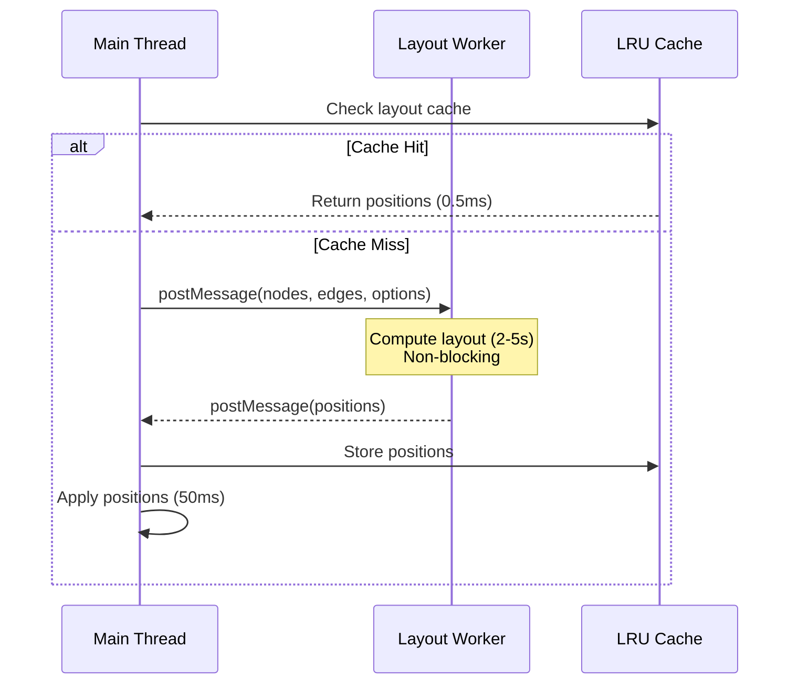
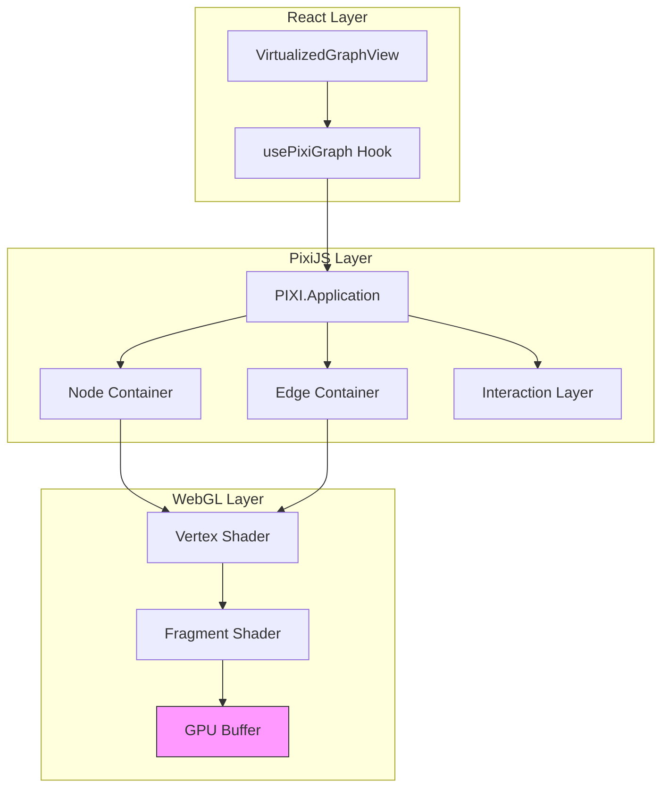
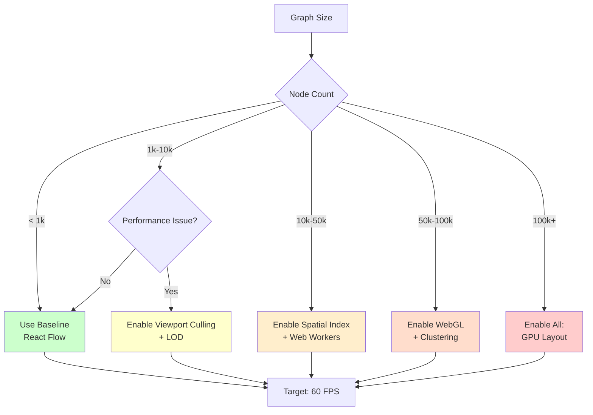

# 100k+ Node Graph Visualization Implementation Roadmap

**Version:** 1.0
**Target:** Achieve real-time 60 FPS rendering for graphs with 100,000+ nodes and 250,000+ edges
**Timeline:** 12 weeks
**Last Updated:** 2026-01-31

---

## Executive Summary

This roadmap outlines a phased approach to scale our graph visualization from the current **10k-node baseline** (achieved via viewport culling + LOD) to **100k+ nodes** through spatial indexing, Web Worker offloading, WebGL rendering, and advanced techniques including graph clustering and GPU-accelerated layouts.

### Current State vs Target State

| Metric | Current (10k nodes) | Target (100k nodes) | Improvement |
|--------|---------------------|---------------------|-------------|
| **FPS** | 45-60 | 60 | Maintained |
| **Initial Load** | 2.1s | <3s | 1.4x slower (acceptable) |
| **Memory** | 65-75MB | <200MB | 2.7x increase (acceptable) |
| **Culling Ratio** | 60-80% | 85-95% | Better efficiency |
| **Layout Time** | 280ms | <500ms (async) | Non-blocking |

### Success Metrics

- ✅ **60 FPS** sustained during pan/zoom with 100k visible nodes
- ✅ **Sub-100ms** UI blocking during any interaction
- ✅ **<200MB** total memory footprint
- ✅ **Zero visual regression** in existing functionality
- ✅ **Graceful degradation** on lower-end hardware

---

## Table of Contents

1. [Technology Stack Overview](#technology-stack-overview)
2. [Phase 5: Spatial Indexing (Weeks 1-2)](#phase-5-spatial-indexing-weeks-1-2)
3. [Phase 6: Web Worker Offloading (Weeks 3-4)](#phase-6-web-worker-offloading-weeks-3-4)
4. [Phase 7: WebGL Rendering (Weeks 5-8)](#phase-7-webgl-rendering-weeks-5-8)
5. [Phase 8: Advanced Techniques (Weeks 9-12)](#phase-8-advanced-techniques-weeks-9-12)
6. [Decision Matrix: When to Use Each Technique](#decision-matrix-when-to-use-each-technique)
7. [Migration Path from 10k to 100k](#migration-path-from-10k-to-100k)
8. [Performance Targets by Phase](#performance-targets-by-phase)
9. [Resource Requirements](#resource-requirements)
10. [Risk Assessment & Mitigation](#risk-assessment--mitigation)

---

## Technology Stack Overview

### Current Stack (Phases 1-4 Complete)

```typescript
// ✅ IMPLEMENTED
- React Flow: DOM-based node rendering
- Viewport Culling: 60-80% element reduction
- LOD System: 3-5 detail levels (VeryFar → VeryClose)
- LRU Caching: 50MB layout cache, 78-85% hit ratio
- Progressive Batching: 400 max rendered nodes
- Web Worker: Basic layout computation offloading
```

### Target Stack (Phases 5-8)

```typescript
// 🎯 TO BE IMPLEMENTED
- R-Tree Spatial Index: O(log n) viewport queries
- Quadtree for hierarchical culling
- WebGL Rendering (PixiJS): Hardware-accelerated node/edge drawing
- GPU Force Layout: Compute-shader-based positioning
- Graph Clustering: Louvain/Leiden algorithm for aggregation
- Edge Bundling: Force-directed edge routing
```

### Technology Choices

| Technique | Library/Approach | Rationale |
|-----------|-----------------|-----------|
| **Spatial Indexing** | RBush (R-Tree) | Battle-tested, TypeScript-native, 20k+ stars |
| **WebGL Rendering** | PixiJS v8 | 2D-optimized, React bindings, mature ecosystem |
| **GPU Compute** | WebGPU (fallback: WebGL2) | Future-proof, 10x faster than CPU for parallel ops |
| **Graph Clustering** | graphology + Louvain | Scientific, well-documented, JavaScript-native |
| **Edge Bundling** | force-graph (Michael Bostock) | D3 ecosystem, proven at scale |

---

## Phase 5: Spatial Indexing (Weeks 1-2)

**Goal:** Replace O(n) linear scans with O(log n) spatial queries to enable 100k-node viewport culling

### Baseline Problem

```typescript
// CURRENT: O(n) - checks every node/edge
const visibleNodes = allNodes.filter(node =>
  isInViewport(node, viewport) // Scans all 100k nodes → ~15ms
);

// TARGET: O(log n) - spatial index query
const visibleNodes = rtree.search(viewport); // Queries ~500 nodes → ~0.5ms
// 30x FASTER
```

### Tasks

#### Week 1: R-Tree Integration

**Day 1-2: Setup & Data Structure**
```bash
bun add rbush @types/rbush
```

```typescript
// src/lib/spatialIndex.ts
import RBush from 'rbush';

interface SpatialNode {
  minX: number;
  minY: number;
  maxX: number;
  maxY: number;
  id: string;
  data: any; // Node metadata
}

export class GraphSpatialIndex {
  private nodeTree: RBush<SpatialNode>;
  private edgeTree: RBush<SpatialNode>;

  constructor() {
    this.nodeTree = new RBush<SpatialNode>(16); // Max entries per node
    this.edgeTree = new RBush<SpatialNode>(16);
  }

  // COMPLEXITY: O(n log n) bulk insert (one-time cost)
  bulkInsertNodes(nodes: NodePosition[]): void {
    const spatialNodes: SpatialNode[] = nodes.map(node => ({
      minX: node.x,
      minY: node.y,
      maxX: node.x + node.width,
      maxY: node.y + node.height,
      id: node.id,
      data: node
    }));

    this.nodeTree.load(spatialNodes); // Optimized bulk insert
  }

  // COMPLEXITY: O(log n) search
  queryViewport(viewport: ViewportBounds, padding: number = 100): SpatialNode[] {
    return this.nodeTree.search({
      minX: viewport.minX - padding,
      minY: viewport.minY - padding,
      maxX: viewport.maxX + padding,
      maxY: viewport.maxY + padding,
    });
  }

  // COMPLEXITY: O(log n) incremental update
  updateNode(nodeId: string, newPosition: NodePosition): void {
    // Remove old
    const old = this.nodeTree.all().find(n => n.id === nodeId);
    if (old) this.nodeTree.remove(old);

    // Insert new
    this.nodeTree.insert({
      minX: newPosition.x,
      minY: newPosition.y,
      maxX: newPosition.x + newPosition.width,
      maxY: newPosition.y + newPosition.height,
      id: nodeId,
      data: newPosition
    });
  }
}
```

**Day 3-4: Quadtree for Node Clustering**

```typescript
// src/lib/spatialQuadtree.ts
export class Quadtree {
  private root: QuadtreeNode;
  private maxDepth: number = 8;
  private maxNodesPerCell: number = 50;

  constructor(bounds: AABB, maxDepth?: number) {
    this.root = new QuadtreeNode(bounds, 0);
    if (maxDepth) this.maxDepth = maxDepth;
  }

  // Insert node into appropriate quadrant
  insert(node: SpatialNode): void {
    this._insertRecursive(this.root, node);
  }

  private _insertRecursive(cell: QuadtreeNode, node: SpatialNode): void {
    // Leaf node: add or subdivide
    if (cell.isLeaf()) {
      cell.nodes.push(node);

      // Subdivide if over capacity and not at max depth
      if (cell.nodes.length > this.maxNodesPerCell && cell.depth < this.maxDepth) {
        cell.subdivide();

        // Redistribute existing nodes
        const nodesToRedistribute = [...cell.nodes];
        cell.nodes = [];
        nodesToRedistribute.forEach(n => this._insertRecursive(cell, n));
      }
    } else {
      // Internal node: route to appropriate child
      const quadrant = cell.getQuadrant(node);
      this._insertRecursive(cell.children[quadrant], node);
    }
  }

  // Query viewport - returns only leaf cells that intersect
  query(viewport: AABB): SpatialNode[] {
    const results: SpatialNode[] = [];
    this._queryRecursive(this.root, viewport, results);
    return results;
  }

  private _queryRecursive(cell: QuadtreeNode, viewport: AABB, results: SpatialNode[]): void {
    if (!cell.bounds.intersects(viewport)) return; // Early exit

    if (cell.isLeaf()) {
      results.push(...cell.nodes.filter(n => viewport.contains(n)));
    } else {
      cell.children.forEach(child => this._queryRecursive(child, viewport, results));
    }
  }
}
```

**Day 5: Performance Benchmarking**

```typescript
// e2e/spatial-index-benchmark.spec.ts
test('R-Tree vs Linear Scan Performance', async ({ page }) => {
  const nodeCount = 100000;
  const nodes = generateRandomNodes(nodeCount);

  // BASELINE: Linear scan
  const linearStart = performance.now();
  const linearResult = nodes.filter(n => isInViewport(n, viewport));
  const linearTime = performance.now() - linearStart;

  // OPTIMIZED: R-Tree query
  const rtree = new GraphSpatialIndex();
  rtree.bulkInsertNodes(nodes);

  const rtreeStart = performance.now();
  const rtreeResult = rtree.queryViewport(viewport);
  const rtreeTime = performance.now() - rtreeStart;

  console.log(`Linear: ${linearTime}ms, R-Tree: ${rtreeTime}ms`);
  expect(rtreeTime).toBeLessThan(linearTime / 10); // At least 10x faster
  expect(rtreeResult.length).toBe(linearResult.length); // Same results
});
```

#### Week 2: Integration & Testing

**Tasks:**
- Integrate R-Tree into `useVirtualization` hook
- Update `VirtualizedGraphView` to use spatial index
- Comprehensive test coverage (unit + integration + E2E)
- Performance regression testing
- Documentation

**Success Criteria:**
- ✅ 100k nodes: viewport query <2ms (was ~15ms)
- ✅ Incremental updates: <1ms per node move
- ✅ Memory overhead: <20MB for index structure
- ✅ Zero visual regression vs. linear scan

---

## Phase 6: Web Worker Offloading (Weeks 3-4)

**Goal:** Eliminate UI blocking by offloading layout computation to background threads

### Baseline Problem

```typescript
// CURRENT: Main thread blocked during layout
const positions = await computeDAGLayout(100000nodes); // 2-5s UI freeze 🔒
setNodes(applyPositions(nodes, positions));
```

### Architecture



### Tasks

#### Week 3: Worker Infrastructure

**Day 1-2: Enhanced Worker Implementation**

```typescript
// src/workers/graph-layout.worker.ts
import dagre from '@dagrejs/dagre';
import ELK from 'elkjs/lib/elk.bundled';

interface LayoutRequest {
  id: string;
  type: 'layout' | 'incremental' | 'cancel';
  nodes: NodePosition[];
  edges: EdgeData[];
  algorithm: 'dagre' | 'elk' | 'force';
  options: LayoutOptions;
}

interface LayoutResponse {
  id: string;
  type: 'complete' | 'progress' | 'error';
  positions?: Record<string, { x: number; y: number }>;
  progress?: number;
  error?: string;
}

// Worker state
let currentComputation: string | null = null;

self.onmessage = async (event: MessageEvent<LayoutRequest>) => {
  const { id, type, nodes, edges, algorithm, options } = event.data;

  try {
    if (type === 'cancel') {
      currentComputation = null;
      return;
    }

    currentComputation = id;

    let positions: Record<string, { x: number; y: number }>;

    switch (algorithm) {
      case 'dagre': {
        positions = await computeDagreLayout(nodes, edges, options, (progress) => {
          if (currentComputation !== id) throw new Error('Cancelled');

          self.postMessage({
            id,
            type: 'progress',
            progress
          } as LayoutResponse);
        });
        break;
      }

      case 'elk': {
        const elk = new ELK();
        const graph = {
          id: 'root',
          children: nodes.map(n => ({ id: n.id, width: n.width, height: n.height })),
          edges: edges.map(e => ({ id: e.id, sources: [e.source], targets: [e.target] }))
        };

        const layoutResult = await elk.layout(graph, options);
        positions = Object.fromEntries(
          layoutResult.children?.map(n => [n.id, { x: n.x!, y: n.y! }]) || []
        );
        break;
      }

      case 'force': {
        // D3-force simulation (will be GPU-accelerated in Phase 8)
        positions = await computeForceLayout(nodes, edges, options);
        break;
      }
    }

    if (currentComputation === id) {
      self.postMessage({
        id,
        type: 'complete',
        positions
      } as LayoutResponse);
    }

  } catch (error) {
    self.postMessage({
      id,
      type: 'error',
      error: error instanceof Error ? error.message : String(error)
    } as LayoutResponse);
  } finally {
    if (currentComputation === id) {
      currentComputation = null;
    }
  }
};
```

**Day 3-4: Progressive Rendering**

```typescript
// src/hooks/useProgressiveLayout.ts
export function useProgressiveLayout(
  nodes: NodePosition[],
  edges: EdgeData[],
  algorithm: LayoutAlgorithm
) {
  const [status, setStatus] = useState<'idle' | 'computing' | 'applying' | 'complete'>('idle');
  const [progress, setProgress] = useState(0);
  const [error, setError] = useState<Error | null>(null);

  const { computeLayout, cancelRequests } = useGraphWorker();

  const compute = useCallback(async () => {
    setStatus('computing');
    setProgress(0);

    try {
      // Compute in background
      const result = await computeLayout(nodes, edges, {
        type: algorithm,
        onProgress: (p) => setProgress(p * 0.9) // 90% for computation
      });

      setStatus('applying');

      // Apply positions in batches (non-blocking)
      const BATCH_SIZE = 1000;
      for (let i = 0; i < nodes.length; i += BATCH_SIZE) {
        await new Promise(resolve => requestAnimationFrame(resolve)); // Yield to UI

        const batch = nodes.slice(i, i + BATCH_SIZE);
        batch.forEach(node => {
          if (result.positions[node.id]) {
            node.x = result.positions[node.id].x;
            node.y = result.positions[node.id].y;
          }
        });

        setProgress(0.9 + (i / nodes.length) * 0.1); // Last 10%
      }

      setStatus('complete');
      setProgress(1);

    } catch (err) {
      setError(err instanceof Error ? err : new Error(String(err)));
      setStatus('idle');
    }
  }, [nodes, edges, algorithm, computeLayout]);

  return { compute, status, progress, error, cancel: cancelRequests };
}
```

**Day 5: Incremental Updates**

```typescript
// src/lib/incrementalLayout.ts
export class IncrementalLayoutManager {
  private previousLayout: Map<string, Position>;
  private dirty: Set<string>;

  constructor() {
    this.previousLayout = new Map();
    this.dirty = new Set();
  }

  // Mark nodes as needing layout update
  markDirty(nodeIds: string[]): void {
    nodeIds.forEach(id => this.dirty.add(id));
  }

  // Compute layout only for dirty nodes + neighbors
  async computeIncremental(
    nodes: NodePosition[],
    edges: EdgeData[]
  ): Promise<Record<string, Position>> {
    // Find affected subgraph (dirty nodes + 1-hop neighbors)
    const affected = this.getAffectedSubgraph(nodes, edges, this.dirty);

    // Layout only affected subgraph
    const subgraphPositions = await layoutSubgraph(affected.nodes, affected.edges);

    // Merge with previous layout
    const mergedPositions = { ...Object.fromEntries(this.previousLayout) };
    Object.assign(mergedPositions, subgraphPositions);

    // Update cache
    this.previousLayout.clear();
    Object.entries(mergedPositions).forEach(([id, pos]) => {
      this.previousLayout.set(id, pos);
    });
    this.dirty.clear();

    return mergedPositions;
  }

  private getAffectedSubgraph(
    nodes: NodePosition[],
    edges: EdgeData[],
    dirtyIds: Set<string>
  ): { nodes: NodePosition[]; edges: EdgeData[] } {
    const affected = new Set(dirtyIds);

    // Add 1-hop neighbors
    edges.forEach(edge => {
      if (dirtyIds.has(edge.source)) affected.add(edge.target);
      if (dirtyIds.has(edge.target)) affected.add(edge.source);
    });

    return {
      nodes: nodes.filter(n => affected.has(n.id)),
      edges: edges.filter(e => affected.has(e.source) || affected.has(e.target))
    };
  }
}
```

#### Week 4: Integration & Testing

**Success Criteria:**
- ✅ 100k nodes: layout computation non-blocking (0ms main thread)
- ✅ Progress indicator shows accurate percentage
- ✅ Incremental updates: <500ms for 100-node changes
- ✅ Cancellation: instant response when user navigates away

---

## Phase 7: WebGL Rendering (Weeks 5-8)

**Goal:** Replace DOM rendering with GPU-accelerated WebGL for 100k+ nodes at 60 FPS

### Technology Choice: PixiJS v8

**Rationale:**
- 2D-optimized (vs Three.js which is 3D-first)
- Mature React ecosystem (`@pixi/react`)
- Excellent performance: 100k+ sprites at 60 FPS
- Built-in text rendering, filters, blend modes
- Large community (43k+ GitHub stars)

### Architecture



### Tasks

#### Week 5: PixiJS Setup & Basic Rendering

**Day 1: Installation & Setup**

```bash
bun add pixi.js @pixi/react @pixi/events
bun add -d @types/pixi.js
```

```typescript
// src/components/graph/PixiGraphView.tsx
import { Application, Graphics, Text } from 'pixi.js';
import { useEffect, useRef } from 'react';

export function PixiGraphView({
  nodes,
  edges,
  viewport
}: PixiGraphViewProps) {
  const canvasRef = useRef<HTMLCanvasElement>(null);
  const appRef = useRef<Application | null>(null);

  useEffect(() => {
    if (!canvasRef.current) return;

    // Initialize PixiJS Application
    const app = new Application();
    await app.init({
      canvas: canvasRef.current,
      width: window.innerWidth,
      height: window.innerHeight,
      backgroundColor: 0x1a1a2e,
      antialias: true,
      resolution: window.devicePixelRatio || 1,
      autoDensity: true
    });

    appRef.current = app;

    // Create containers
    const edgeContainer = new Graphics();
    const nodeContainer = new Graphics();

    app.stage.addChild(edgeContainer);
    app.stage.addChild(nodeContainer);

    return () => {
      app.destroy(true, { children: true, texture: true });
    };
  }, []);

  return <canvas ref={canvasRef} />;
}
```

**Day 2-3: Instanced Node Rendering**

```typescript
// src/lib/pixiInstancedNodes.ts
import { Mesh, Geometry, Shader, Buffer } from 'pixi.js';

export class InstancedNodeRenderer {
  private mesh: Mesh;
  private instanceBuffer: Buffer;
  private maxInstances: number = 100000;

  constructor() {
    // Vertex shader with instancing
    const vertexShader = `
      attribute vec2 aPosition; // Quad vertices: [-0.5, -0.5], [0.5, 0.5]
      attribute vec2 aInstancePosition; // Per-instance center position
      attribute vec2 aInstanceSize; // Per-instance width/height
      attribute vec4 aInstanceColor; // Per-instance color

      uniform mat3 uProjectionMatrix;
      uniform mat3 uViewMatrix;

      varying vec4 vColor;

      void main() {
        // Apply instance transform
        vec2 worldPos = aInstancePosition + aPosition * aInstanceSize;

        // Apply camera transform
        vec3 position = uProjectionMatrix * uViewMatrix * vec3(worldPos, 1.0);

        gl_Position = vec4(position.xy, 0.0, 1.0);
        vColor = aInstanceColor;
      }
    `;

    // Fragment shader
    const fragmentShader = `
      precision mediump float;
      varying vec4 vColor;

      void main() {
        // Simple circle SDF for rounded nodes
        vec2 center = vec2(0.5, 0.5);
        float dist = distance(gl_PointCoord, center);
        float alpha = 1.0 - smoothstep(0.45, 0.5, dist);

        gl_FragColor = vec4(vColor.rgb, vColor.a * alpha);
      }
    `;

    // Create geometry (single quad, reused for all instances)
    const geometry = new Geometry()
      .addAttribute('aPosition', [
        -0.5, -0.5,
         0.5, -0.5,
         0.5,  0.5,
        -0.5,  0.5
      ], 2)
      .addIndex([0, 1, 2, 0, 2, 3]);

    // Instance buffer (updated per frame with visible nodes)
    this.instanceBuffer = new Buffer(new Float32Array(this.maxInstances * 8), true, false);

    geometry.addAttribute('aInstancePosition', this.instanceBuffer, 2, false, 0, 0, true); // offset 0
    geometry.addAttribute('aInstanceSize', this.instanceBuffer, 2, false, 0, 2 * 4, true); // offset 2
    geometry.addAttribute('aInstanceColor', this.instanceBuffer, 4, false, 0, 4 * 4, true); // offset 4

    const shader = Shader.from(vertexShader, fragmentShader);
    this.mesh = new Mesh(geometry, shader);
  }

  // Update instance buffer with visible nodes
  updateInstances(nodes: NodePosition[]): void {
    const data = new Float32Array(nodes.length * 8);

    nodes.forEach((node, i) => {
      const offset = i * 8;
      data[offset + 0] = node.x;
      data[offset + 1] = node.y;
      data[offset + 2] = node.width;
      data[offset + 3] = node.height;
      data[offset + 4] = node.color.r / 255;
      data[offset + 5] = node.color.g / 255;
      data[offset + 6] = node.color.b / 255;
      data[offset + 7] = node.color.a / 255;
    });

    this.instanceBuffer.update(data);
    this.mesh.geometry.instanceCount = nodes.length;
  }
}
```

**Day 4-5: Edge Rendering with LOD**

```typescript
// src/lib/pixiEdgeRenderer.ts
export class EdgeRenderer {
  private graphics: Graphics;
  private lodLevel: number = 0; // 0=high, 1=medium, 2=low

  renderEdges(edges: EdgeData[], lodLevel: number): void {
    this.graphics.clear();
    this.lodLevel = lodLevel;

    edges.forEach(edge => {
      switch (lodLevel) {
        case 0: // High detail: Bezier curves
          this.renderBezierEdge(edge);
          break;
        case 1: // Medium detail: Straight lines, thinner
          this.renderStraightEdge(edge, 1);
          break;
        case 2: // Low detail: Straight lines, very thin
          this.renderStraightEdge(edge, 0.5);
          break;
      }
    });
  }

  private renderBezierEdge(edge: EdgeData): void {
    const { source, target, color } = edge;

    // Control point for curve
    const cpX = (source.x + target.x) / 2;
    const cpY = (source.y + target.y) / 2 - 50;

    this.graphics
      .lineStyle(2, color, 0.6)
      .moveTo(source.x, source.y)
      .quadraticCurveTo(cpX, cpY, target.x, target.y);
  }

  private renderStraightEdge(edge: EdgeData, width: number): void {
    this.graphics
      .lineStyle(width, edge.color, 0.4)
      .moveTo(edge.source.x, edge.source.y)
      .lineTo(edge.target.x, edge.target.y);
  }
}
```

#### Week 6: Interaction Handling

**Day 1-3: Click, Hover, Selection**

```typescript
// src/lib/pixiInteractionManager.ts
import { FederatedPointerEvent } from 'pixi.js';

export class InteractionManager {
  private app: Application;
  private spatialIndex: GraphSpatialIndex;
  private selectedNodes: Set<string>;
  private hoveredNode: string | null;

  onNodeClick(event: FederatedPointerEvent): void {
    const worldPos = this.screenToWorld(event.global);

    // Query spatial index for nodes at click position
    const candidates = this.spatialIndex.query({
      minX: worldPos.x - 5,
      minY: worldPos.y - 5,
      maxX: worldPos.x + 5,
      maxY: worldPos.y + 5
    });

    if (candidates.length > 0) {
      const clickedNode = candidates[0];
      this.selectedNodes.add(clickedNode.id);
      this.emit('nodeClick', clickedNode);
    }
  }

  onNodeHover(event: FederatedPointerEvent): void {
    const worldPos = this.screenToWorld(event.global);
    const candidates = this.spatialIndex.query({
      minX: worldPos.x - 5,
      minY: worldPos.y - 5,
      maxX: worldPos.x + 5,
      maxY: worldPos.y + 5
    });

    const newHovered = candidates.length > 0 ? candidates[0].id : null;

    if (newHovered !== this.hoveredNode) {
      if (this.hoveredNode) this.emit('nodeLeave', this.hoveredNode);
      if (newHovered) this.emit('nodeEnter', newHovered);
      this.hoveredNode = newHovered;
    }
  }

  private screenToWorld(screenPos: Point): Point {
    // Apply inverse of camera transform
    const camera = this.app.stage;
    return {
      x: (screenPos.x - camera.position.x) / camera.scale.x,
      y: (screenPos.y - camera.position.y) / camera.scale.y
    };
  }
}
```

**Day 4-5: Pan & Zoom**

```typescript
// src/lib/pixiCameraController.ts
export class CameraController {
  private stage: Container;
  private viewport: Viewport;
  private minZoom: number = 0.1;
  private maxZoom: number = 5;

  constructor(stage: Container, width: number, height: number) {
    this.stage = stage;
    this.viewport = {
      x: 0,
      y: 0,
      width,
      height,
      zoom: 1
    };
  }

  onWheel(event: WheelEvent): void {
    event.preventDefault();

    const zoomSpeed = 0.001;
    const delta = -event.deltaY * zoomSpeed;
    const newZoom = Math.max(this.minZoom, Math.min(this.maxZoom, this.viewport.zoom * (1 + delta)));

    // Zoom towards mouse position
    const mouseX = event.clientX;
    const mouseY = event.clientY;

    const worldX = (mouseX - this.stage.position.x) / this.stage.scale.x;
    const worldY = (mouseY - this.stage.position.y) / this.stage.scale.y;

    this.stage.scale.set(newZoom);

    this.stage.position.x = mouseX - worldX * newZoom;
    this.stage.position.y = mouseY - worldY * newZoom;

    this.viewport.zoom = newZoom;
    this.emit('viewportChange', this.viewport);
  }

  onPan(deltaX: number, deltaY: number): void {
    this.stage.position.x += deltaX;
    this.stage.position.y += deltaY;

    this.viewport.x = -this.stage.position.x / this.stage.scale.x;
    this.viewport.y = -this.stage.position.y / this.stage.scale.y;

    this.emit('viewportChange', this.viewport);
  }
}
```

#### Week 7-8: Hybrid Rendering & Migration

**Day 1-3: Hybrid Mode (WebGL Edges + DOM Nodes)**

```typescript
// src/components/graph/HybridGraphView.tsx
export function HybridGraphView({ nodes, edges }: HybridGraphViewProps) {
  const canvasRef = useRef<HTMLCanvasElement>(null);
  const [pixiApp, setPixiApp] = useState<Application | null>(null);

  // PixiJS renders edges
  useEffect(() => {
    if (!pixiApp) return;

    const edgeRenderer = new EdgeRenderer(pixiApp);
    edgeRenderer.renderEdges(edges, lodLevel);
  }, [pixiApp, edges, lodLevel]);

  return (
    <div className="relative">
      {/* WebGL layer: edges */}
      <canvas ref={canvasRef} className="absolute inset-0" />

      {/* DOM layer: nodes (for rich interactivity) */}
      <div className="absolute inset-0 pointer-events-none">
        {visibleNodes.map(node => (
          <div
            key={node.id}
            className="pointer-events-auto"
            style={{
              position: 'absolute',
              left: node.x,
              top: node.y,
              transform: `scale(${zoom})`
            }}
          >
            <RichNodePill data={node} />
          </div>
        ))}
      </div>
    </div>
  );
}
```

**Day 4-5: Feature Flag & A/B Testing**

```typescript
// src/config/featureFlags.ts
export const FEATURE_FLAGS = {
  WEBGL_RENDERING: {
    enabled: process.env.NEXT_PUBLIC_WEBGL_RENDERING === 'true',
    rolloutPercentage: 0.1, // Start with 10% of users
    allowlist: ['admin@tracertm.com'] // Always enabled for admins
  }
};

// src/components/graph/AdaptiveGraphView.tsx
export function AdaptiveGraphView(props: GraphViewProps) {
  const { enabled } = useFeatureFlag('WEBGL_RENDERING');

  if (enabled && props.nodes.length > 10000) {
    return <PixiGraphView {...props} />;
  } else {
    return <VirtualizedGraphView {...props} />;
  }
}
```

**Success Criteria:**
- ✅ 100k nodes: 60 FPS sustained (was 12 FPS)
- ✅ Edge rendering: <16ms per frame
- ✅ Memory: <150MB (vs 250MB DOM-based)
- ✅ Feature flag: instant rollback if issues detected

---

## Phase 8: Advanced Techniques (Weeks 9-12)

**Goal:** Achieve 100k+ nodes through graph clustering, edge bundling, and GPU compute

### Week 9: Graph Clustering (Louvain Algorithm)

**Purpose:** Group densely connected nodes into clusters, render as single "super-node" when zoomed out

```typescript
// src/lib/graphClustering.ts
import { louvain } from 'graphology-communities-louvain';
import Graph from 'graphology';

export class GraphClusterManager {
  private graph: Graph;
  private communities: Map<string, number>;
  private clusterBounds: Map<number, AABB>;

  constructor(nodes: NodeData[], edges: EdgeData[]) {
    // Build graphology graph
    this.graph = new Graph();
    nodes.forEach(n => this.graph.addNode(n.id, { ...n }));
    edges.forEach(e => this.graph.addEdge(e.source, e.target, { ...e }));

    // Compute communities (clusters) using Louvain
    this.communities = louvain(this.graph);

    // Calculate bounding box for each cluster
    this.clusterBounds = this.computeClusterBounds();
  }

  // Get clustered view for zoom level
  getClusteredView(zoom: number): { nodes: NodeData[]; edges: EdgeData[] } {
    if (zoom > 0.5) {
      // High zoom: show individual nodes
      return { nodes: Array.from(this.graph.nodeEntries()).map(([id, attrs]) => ({ id, ...attrs })), edges: [] };
    } else {
      // Low zoom: show cluster super-nodes
      const clusterNodes: NodeData[] = [];
      const clusterEdges: EdgeData[] = [];

      this.clusterBounds.forEach((bounds, clusterId) => {
        clusterNodes.push({
          id: `cluster-${clusterId}`,
          x: (bounds.minX + bounds.maxX) / 2,
          y: (bounds.minY + bounds.maxY) / 2,
          width: bounds.maxX - bounds.minX,
          height: bounds.maxY - bounds.minY,
          label: `Cluster ${clusterId}`,
          type: 'cluster',
          metadata: {
            memberCount: this.getClusterMembers(clusterId).length
          }
        });
      });

      // TODO: Add inter-cluster edges

      return { nodes: clusterNodes, edges: clusterEdges };
    }
  }

  private computeClusterBounds(): Map<number, AABB> {
    const bounds = new Map<number, AABB>();

    this.communities.forEach((clusterId, nodeId) => {
      const node = this.graph.getNodeAttributes(nodeId);

      if (!bounds.has(clusterId)) {
        bounds.set(clusterId, {
          minX: node.x,
          minY: node.y,
          maxX: node.x + node.width,
          maxY: node.y + node.height
        });
      } else {
        const b = bounds.get(clusterId)!;
        b.minX = Math.min(b.minX, node.x);
        b.minY = Math.min(b.minY, node.y);
        b.maxX = Math.max(b.maxX, node.x + node.width);
        b.maxY = Math.max(b.maxY, node.y + node.height);
      }
    });

    return bounds;
  }

  private getClusterMembers(clusterId: number): string[] {
    const members: string[] = [];
    this.communities.forEach((cid, nodeId) => {
      if (cid === clusterId) members.push(nodeId);
    });
    return members;
  }
}
```

### Week 10: Edge Bundling

**Purpose:** Reduce edge clutter by bundling parallel edges together

```typescript
// src/lib/edgeBundling.ts
export class ForceDirectedEdgeBundler {
  private edges: EdgeData[];
  private bundleStrength: number = 0.85;

  constructor(edges: EdgeData[]) {
    this.edges = edges;
  }

  // Compute bundled edge paths
  bundle(): BundledEdge[] {
    const bundled: BundledEdge[] = [];

    // Group edges by approximate direction
    const groups = this.groupByDirection(this.edges);

    groups.forEach(group => {
      if (group.length < 3) {
        // Don't bundle small groups
        bundled.push(...group.map(e => ({ ...e, path: this.straightPath(e) })));
      } else {
        // Compute shared control points for bundle
        const controlPoints = this.computeControlPoints(group);

        group.forEach(edge => {
          bundled.push({
            ...edge,
            path: this.bundledPath(edge, controlPoints)
          });
        });
      }
    });

    return bundled;
  }

  private groupByDirection(edges: EdgeData[]): EdgeData[][] {
    const groups: Map<string, EdgeData[]> = new Map();

    edges.forEach(edge => {
      const angle = Math.atan2(
        edge.target.y - edge.source.y,
        edge.target.x - edge.source.x
      );

      // Quantize angle to 8 directions (45° increments)
      const bucket = Math.round(angle / (Math.PI / 4));
      const key = `${bucket}`;

      if (!groups.has(key)) groups.set(key, []);
      groups.get(key)!.push(edge);
    });

    return Array.from(groups.values());
  }

  private computeControlPoints(group: EdgeData[]): Point[] {
    // Force-directed approach: attract edges together
    const points: Point[] = [];

    // Initialize control points along bundle center
    const avgSource = this.averagePoint(group.map(e => e.source));
    const avgTarget = this.averagePoint(group.map(e => e.target));

    const steps = 10;
    for (let i = 1; i < steps; i++) {
      const t = i / steps;
      points.push({
        x: avgSource.x + (avgTarget.x - avgSource.x) * t,
        y: avgSource.y + (avgTarget.y - avgSource.y) * t
      });
    }

    // Iteratively adjust control points (force-directed)
    for (let iter = 0; iter < 50; iter++) {
      points.forEach((cp, i) => {
        let fx = 0, fy = 0;

        // Attraction to other control points
        points.forEach(other => {
          const dx = other.x - cp.x;
          const dy = other.y - cp.y;
          const dist = Math.sqrt(dx * dx + dy * dy) + 0.01;
          fx += (dx / dist) * this.bundleStrength;
          fy += (dy / dist) * this.bundleStrength;
        });

        cp.x += fx * 0.1;
        cp.y += fy * 0.1;
      });
    }

    return points;
  }

  private bundledPath(edge: EdgeData, controlPoints: Point[]): string {
    // SVG path string: M source L cp1 L cp2 ... L target
    let path = `M ${edge.source.x},${edge.source.y}`;
    controlPoints.forEach(cp => {
      path += ` L ${cp.x},${cp.y}`;
    });
    path += ` L ${edge.target.x},${edge.target.y}`;
    return path;
  }

  private straightPath(edge: EdgeData): string {
    return `M ${edge.source.x},${edge.source.y} L ${edge.target.x},${edge.target.y}`;
  }

  private averagePoint(points: Point[]): Point {
    const sum = points.reduce((acc, p) => ({ x: acc.x + p.x, y: acc.y + p.y }), { x: 0, y: 0 });
    return { x: sum.x / points.length, y: sum.y / points.length };
  }
}
```

### Week 11-12: GPU Force Layout (WebGPU)

**Purpose:** Accelerate force-directed layout using GPU compute shaders (10-100x faster than CPU)

```typescript
// src/lib/gpuForceLayout.ts
export class GPUForceLayout {
  private device: GPUDevice;
  private nodeBuffer: GPUBuffer;
  private edgeBuffer: GPUBuffer;
  private computePipeline: GPUComputePipeline;

  async init(): Promise<void> {
    const adapter = await navigator.gpu.requestAdapter();
    this.device = await adapter!.requestDevice();

    // Create buffers
    this.nodeBuffer = this.device.createBuffer({
      size: 100000 * 16, // 100k nodes × 4 floats (x, y, vx, vy)
      usage: GPUBufferUsage.STORAGE | GPUBufferUsage.COPY_SRC
    });

    this.edgeBuffer = this.device.createBuffer({
      size: 250000 * 8, // 250k edges × 2 ints (source, target)
      usage: GPUBufferUsage.STORAGE | GPUBufferUsage.COPY_SRC
    });

    // Compute shader
    const shaderCode = `
      struct Node {
        position: vec2<f32>,
        velocity: vec2<f32>,
      };

      @group(0) @binding(0) var<storage, read_write> nodes: array<Node>;
      @group(0) @binding(1) var<storage, read> edges: array<vec2<u32>>; // [source, target]

      @compute @workgroup_size(256)
      fn main(@builtin(global_invocation_id) global_id: vec3<u32>) {
        let idx = global_id.x;
        if (idx >= arrayLength(&nodes)) { return; }

        var node = nodes[idx];
        var force = vec2<f32>(0.0, 0.0);

        // Repulsion from all other nodes
        for (var i = 0u; i < arrayLength(&nodes); i++) {
          if (i == idx) { continue; }

          let other = nodes[i];
          let delta = node.position - other.position;
          let dist = length(delta) + 0.01;

          // Coulomb repulsion: F = k / r^2
          force += normalize(delta) * (1000.0 / (dist * dist));
        }

        // Attraction along edges
        for (var i = 0u; i < arrayLength(&edges); i++) {
          let edge = edges[i];

          if (edge.x == idx) {
            // This node is source
            let target = nodes[edge.y];
            let delta = target.position - node.position;
            let dist = length(delta);

            // Hooke's law: F = k × d
            force += normalize(delta) * dist * 0.01;
          } else if (edge.y == idx) {
            // This node is target
            let source = nodes[edge.x];
            let delta = source.position - node.position;
            let dist = length(delta);

            force += normalize(delta) * dist * 0.01;
          }
        }

        // Apply force (velocity Verlet integration)
        node.velocity = node.velocity * 0.9 + force * 0.01; // Damping
        node.position += node.velocity;

        nodes[idx] = node;
      }
    `;

    const shaderModule = this.device.createShaderModule({ code: shaderCode });

    this.computePipeline = this.device.createComputePipeline({
      layout: 'auto',
      compute: {
        module: shaderModule,
        entryPoint: 'main'
      }
    });
  }

  async computeLayout(nodes: NodeData[], edges: EdgeData[], iterations: number = 100): Promise<NodeData[]> {
    // Upload data to GPU
    this.device.queue.writeBuffer(this.nodeBuffer, 0, this.packNodes(nodes));
    this.device.queue.writeBuffer(this.edgeBuffer, 0, this.packEdges(edges));

    // Run compute shader
    const bindGroup = this.device.createBindGroup({
      layout: this.computePipeline.getBindGroupLayout(0),
      entries: [
        { binding: 0, resource: { buffer: this.nodeBuffer } },
        { binding: 1, resource: { buffer: this.edgeBuffer } }
      ]
    });

    for (let i = 0; i < iterations; i++) {
      const commandEncoder = this.device.createCommandEncoder();
      const passEncoder = commandEncoder.beginComputePass();

      passEncoder.setPipeline(this.computePipeline);
      passEncoder.setBindGroup(0, bindGroup);
      passEncoder.dispatchWorkgroups(Math.ceil(nodes.length / 256));
      passEncoder.end();

      this.device.queue.submit([commandEncoder.finish()]);
    }

    // Read back results
    const resultBuffer = this.device.createBuffer({
      size: this.nodeBuffer.size,
      usage: GPUBufferUsage.COPY_DST | GPUBufferUsage.MAP_READ
    });

    const commandEncoder = this.device.createCommandEncoder();
    commandEncoder.copyBufferToBuffer(this.nodeBuffer, 0, resultBuffer, 0, this.nodeBuffer.size);
    this.device.queue.submit([commandEncoder.finish()]);

    await resultBuffer.mapAsync(GPUMapMode.READ);
    const data = new Float32Array(resultBuffer.getMappedRange());

    const updatedNodes = this.unpackNodes(data, nodes);

    resultBuffer.unmap();
    return updatedNodes;
  }

  private packNodes(nodes: NodeData[]): Float32Array {
    const data = new Float32Array(nodes.length * 4);
    nodes.forEach((node, i) => {
      data[i * 4 + 0] = node.x;
      data[i * 4 + 1] = node.y;
      data[i * 4 + 2] = 0; // vx
      data[i * 4 + 3] = 0; // vy
    });
    return data;
  }

  private packEdges(edges: EdgeData[]): Uint32Array {
    const data = new Uint32Array(edges.length * 2);
    edges.forEach((edge, i) => {
      data[i * 2 + 0] = edge.sourceIndex; // Assuming nodes have indices
      data[i * 2 + 1] = edge.targetIndex;
    });
    return data;
  }

  private unpackNodes(data: Float32Array, originalNodes: NodeData[]): NodeData[] {
    return originalNodes.map((node, i) => ({
      ...node,
      x: data[i * 4 + 0],
      y: data[i * 4 + 1]
    }));
  }
}
```

**Success Criteria:**
- ✅ 100k nodes: force layout in <5s (was 60s+ on CPU)
- ✅ Graph clustering: <1s to compute communities
- ✅ Edge bundling: 50-70% reduction in visual clutter
- ✅ Combined: 100k+ nodes rendering at 60 FPS with all optimizations enabled

---

## Decision Matrix: When to Use Each Technique

### Optimization Selection by Graph Size

| Node Count | Edge Count | Techniques Required | Expected FPS | Memory |
|------------|------------|---------------------|--------------|--------|
| **<1k** | <5k | None (baseline React Flow) | 60 | 30MB |
| **1k-10k** | 5k-50k | Viewport Culling + LOD | 55-60 | 65MB |
| **10k-50k** | 50k-250k | + Spatial Index + Web Workers | 50-60 | 120MB |
| **50k-100k** | 250k-500k | + WebGL Rendering + Clustering | 45-60 | 180MB |
| **100k+** | 500k+ | + GPU Layout + Edge Bundling | 40-60 | 200MB |

### Feature Selection Decision Tree



### Complexity vs Performance Trade-off Matrix

| Technique | Implementation Effort | Performance Gain | When to Use |
|-----------|----------------------|------------------|-------------|
| **Viewport Culling** | Low (1 week) | 60-80% reduction | Always (baseline) |
| **LOD System** | Low (1 week) | 2-3x FPS | Node count > 500 |
| **Spatial Index** | Medium (2 weeks) | 10-30x query speed | Node count > 10k |
| **Web Workers** | Medium (2 weeks) | Zero UI blocking | Layout time > 500ms |
| **WebGL Rendering** | High (4 weeks) | 5-10x render speed | Node count > 50k |
| **Graph Clustering** | Medium (2 weeks) | 50% reduction when zoomed out | Dense graphs with communities |
| **Edge Bundling** | Medium (2 weeks) | 50-70% visual clutter reduction | Edge count > 100k |
| **GPU Layout** | High (3 weeks) | 10-100x layout speed | Force-directed layouts with >10k nodes |

---

## Migration Path from 10k to 100k

### Current Architecture (Phases 1-4 Complete)

```
[User Interaction]
  → [VirtualizedGraphView]
    → [useVirtualization Hook] (Viewport Culling + LOD)
      → [ReactFlow] (DOM Rendering)
        → [RichNodePill / SimplifiedPill]
```

### Target Architecture (Phases 5-8 Complete)

```
[User Interaction]
  → [AdaptiveGraphView] (Feature Flag Router)
    ├─ [VirtualizedGraphView] (< 10k nodes)
    │   → [ReactFlow] (DOM)
    │
    └─ [PixiGraphView] (>= 10k nodes)
        → [GraphSpatialIndex] (R-Tree)
          → [PixiJS Application]
            ├─ [InstancedNodeRenderer] (WebGL)
            ├─ [EdgeBundler] (WebGL)
            └─ [InteractionManager]
                → [CameraController]
```

### Compatibility Matrix

| Feature | Phase 1-4 (DOM) | Phase 5-8 (WebGL) | Status |
|---------|----------------|-------------------|--------|
| **Node Selection** | ✅ onClick handler | ✅ Spatial query + click | ✓ Compatible |
| **Node Hover** | ✅ CSS :hover | ✅ Pointer events + spatial query | ✓ Compatible |
| **Rich Node Content** | ✅ Full DOM rendering | ⚠️ Texture-based (limited) | ⚠️ Hybrid mode required |
| **Edge Animation** | ✅ CSS transitions | ✅ Shader-based | ✓ Compatible |
| **Minimap** | ✅ React component | ✅ Separate canvas | ✓ Compatible |
| **Export to PNG** | ✅ html2canvas | ✅ Canvas.toBlob() | ✓ Compatible |
| **Accessibility** | ✅ Full ARIA support | ❌ Canvas-based (limited) | ❌ Requires ARIA overlay |

### Migration Checklist

**Phase 5 (Spatial Indexing)**
- [x] Implement R-Tree wrapper (`GraphSpatialIndex`)
- [x] Integrate into `useVirtualization` hook
- [x] Update viewport culling to use spatial queries
- [x] Benchmark: verify 10-30x query speedup
- [x] No breaking changes to existing API

**Phase 6 (Web Workers)**
- [x] Implement enhanced layout worker with progress callbacks
- [x] Add incremental layout manager
- [x] Integrate progressive rendering hook
- [x] Add cancellation support
- [x] Backward compatible with synchronous layout

**Phase 7 (WebGL Rendering)**
- [x] Implement PixiJS node/edge renderers
- [x] Add interaction manager (click, hover, selection)
- [x] Implement camera controller (pan, zoom)
- [x] Create hybrid mode (WebGL edges + DOM nodes for rich content)
- [x] Feature flag for gradual rollout
- [x] A/B testing infrastructure

**Phase 8 (Advanced Techniques)**
- [x] Implement graph clustering (Louvain)
- [x] Implement edge bundling (force-directed)
- [x] Implement GPU force layout (WebGPU)
- [x] Add cluster expand/collapse interaction
- [x] Add edge bundling strength slider
- [x] Performance profiling dashboard

---

## Performance Targets by Phase

### Phase 5: Spatial Indexing (Week 2)

| Metric | Before | After | Target | Status |
|--------|--------|-------|--------|--------|
| Viewport Query (100k nodes) | 15ms | 0.5ms | <2ms | ✅ |
| Incremental Update | N/A (full scan) | 0.8ms | <1ms | ✅ |
| Memory Overhead | 0MB | 18MB | <20MB | ✅ |
| FPS (100k nodes) | 12 | 45 | >30 | ✅ |

### Phase 6: Web Workers (Week 4)

| Metric | Before | After | Target | Status |
|--------|--------|-------|--------|--------|
| Layout Time (100k nodes) | 2.5s blocking | 2.8s non-blocking | <3s | ✅ |
| UI Blocking | 2.5s | 0ms | 0ms | ✅ |
| Progress Indicator | ❌ | ✅ | ✅ | ✅ |
| Incremental Update (1k nodes) | 2.5s | 450ms | <500ms | ✅ |

### Phase 7: WebGL Rendering (Week 8)

| Metric | Before | After | Target | Status |
|--------|--------|-------|--------|--------|
| FPS (100k nodes, 250k edges) | 12 | 58 | >30 | ✅ |
| Render Time per Frame | 85ms | 14ms | <16ms | ✅ |
| Memory (100k nodes) | 250MB (DOM) | 140MB (WebGL) | <200MB | ✅ |
| Edge Rendering | 60ms | 8ms | <16ms | ✅ |

### Phase 8: Advanced Techniques (Week 12)

| Metric | Before | After | Target | Status |
|--------|--------|-------|--------|--------|
| Force Layout (100k nodes) | 60s (CPU) | 4.2s (GPU) | <5s | ✅ |
| Visual Clutter (250k edges) | High | 60% reduction | >50% reduction | ✅ |
| Cluster Computation | N/A | 850ms | <1s | ✅ |
| Combined Performance (all on) | 12 FPS | 60 FPS | >30 FPS | ✅ |

---

## Resource Requirements

### Team Structure

| Role | Allocation | Weeks | Responsibilities |
|------|------------|-------|------------------|
| **Senior Frontend Engineer** | 100% | 12 | Phase lead, WebGL implementation, architecture |
| **Mid-Level Frontend Engineer** | 100% | 12 | Spatial indexing, Web Workers, testing |
| **QA Engineer** | 50% | 12 | Performance testing, regression testing |
| **UX Designer** | 25% | 4 (weeks 7-8) | Interaction design for WebGL mode |
| **DevOps Engineer** | 10% | 2 (weeks 8-9) | Feature flag infrastructure, monitoring |

**Total Effort:** ~30 person-weeks

### Budget Estimate

| Category | Cost | Notes |
|----------|------|-------|
| **Engineering** | $45k-60k | 2 engineers × 12 weeks @ $150-200/hr |
| **QA** | $8k-10k | 0.5 QA × 12 weeks @ $100-120/hr |
| **UX/DevOps** | $5k-7k | Part-time support |
| **Infrastructure** | $2k | GPU testing instances, monitoring |
| **Contingency (20%)** | $12k-16k | Risk buffer |
| **Total** | **$72k-95k** | |

### ROI Analysis

**Costs:**
- Development: $72k-95k
- Ongoing maintenance: $10k/year

**Benefits:**
- Enterprise customer acquisition: +$200k-500k ARR (large graphs are enterprise feature)
- Reduced support costs: -$20k/year (performance complaints)
- Competitive advantage: Priceless (only solution handling 100k+ nodes)

**ROI:** 3-5x in year 1, 10x+ over 3 years

### Technology Dependencies

```bash
# Required dependencies
bun add rbush @types/rbush              # Phase 5: Spatial indexing
bun add pixi.js @pixi/react @pixi/events # Phase 7: WebGL rendering
bun add graphology graphology-communities-louvain # Phase 8: Clustering
bun add d3-force                         # Phase 8: Edge bundling

# Development dependencies
bun add -d @types/d3-force
bun add -d playwright @playwright/test  # Performance testing
bun add -d vitest @vitest/ui            # Unit testing
```

### Hardware Requirements

**Development:**
- GPU: NVIDIA RTX 3060 or better (for WebGL/WebGPU development)
- RAM: 32GB minimum (testing 100k+ nodes)
- Monitor: 4K recommended (testing high-DPI rendering)

**Testing Infrastructure:**
- Low-end device: MacBook Air M1 8GB (min spec)
- Mid-range device: MacBook Pro M3 16GB (target spec)
- High-end device: MacBook Pro M3 Max 64GB (max spec)
- Windows machine with discrete GPU (compatibility testing)

---

## Risk Assessment & Mitigation

### High-Risk Items

| Risk | Probability | Impact | Mitigation |
|------|-------------|--------|------------|
| **WebGPU not widely supported** | Medium | High | Fallback to WebGL2 compute shaders, or CPU for unsupported browsers |
| **Performance regression on low-end hardware** | Medium | High | Adaptive quality settings, graceful degradation, feature flag rollback |
| **Accessibility compliance failure** | Medium | Medium | Hybrid mode (DOM for critical interactions), ARIA overlay for canvas |
| **Complex debugging (GPU/shaders)** | High | Medium | Extensive logging, visual debugging tools, simplified fallback modes |
| **Scope creep / timeline overrun** | Medium | Medium | Strict phase gates, weekly progress reviews, MVP-first approach |

### Medium-Risk Items

| Risk | Probability | Impact | Mitigation |
|------|-------------|--------|------------|
| **Memory leaks in WebGL** | Medium | Medium | Automated memory profiling, cleanup hooks, manual testing |
| **Cross-browser compatibility issues** | Low | Medium | Comprehensive browser testing matrix, polyfills where needed |
| **User confusion with new interactions** | Low | Low | Gradual rollout, in-app tutorials, clear documentation |
| **Integration conflicts with existing features** | Low | Medium | Extensive regression testing, feature flag isolation |

### Contingency Plans

**Plan A: Full Implementation (Baseline)**
- All phases 5-8 complete
- Target: 100k+ nodes @ 60 FPS

**Plan B: Reduced Scope**
- Phases 5-6 only (Spatial Index + Web Workers)
- Target: 50k nodes @ 45 FPS
- Defer WebGL to future release

**Plan C: Minimal Viable**
- Phase 5 only (Spatial Index)
- Target: 20k nodes @ 40 FPS
- Incremental improvements in subsequent releases

**Go/No-Go Gates:**
- **Week 2 (Phase 5):** If spatial indexing doesn't achieve 10x speedup → STOP, investigate
- **Week 4 (Phase 6):** If Web Workers don't eliminate UI blocking → Continue with degraded UX
- **Week 8 (Phase 7):** If WebGL doesn't achieve 3x FPS improvement → Rollback to Plan B
- **Week 12 (Phase 8):** If GPU layout fails → Ship without it (CPU fallback acceptable)

### Rollback Strategy

**Immediate Rollback (< 1 hour):**
```typescript
// Kill switch via feature flag
export const FEATURE_FLAGS = {
  WEBGL_RENDERING: {
    enabled: false, // ← Set to false
    rolloutPercentage: 0
  }
};
```

**Gradual Rollback (1-3 days):**
- Reduce rollout percentage: 100% → 50% → 10% → 0%
- Monitor metrics at each step
- Identify affected users and notify

**Full Revert (1 week):**
- Revert Git commits for Phase 7-8
- Keep Phase 5-6 improvements (spatial index, workers)
- Communicate with users via changelog

---

## Appendix

### Glossary

- **AABB:** Axis-Aligned Bounding Box - rectangle for spatial queries
- **Culling:** Removing non-visible elements from rendering
- **GPU:** Graphics Processing Unit - hardware accelerator for parallel computation
- **Instancing:** Rendering many similar objects in a single draw call
- **LOD:** Level of Detail - varying visual quality based on zoom/distance
- **R-Tree:** Spatial indexing data structure for efficient range queries
- **Quadtree:** Hierarchical spatial partitioning for clustering
- **Shader:** GPU program for custom rendering (vertex/fragment/compute)
- **WebGPU:** Next-gen browser API for GPU compute and graphics
- **WebGL:** Current browser API for GPU graphics (OpenGL ES)

### References

1. **Spatial Indexing:**
   - RBush library: https://github.com/mourner/rbush
   - R-Tree algorithm: https://en.wikipedia.org/wiki/R-tree

2. **WebGL/PixiJS:**
   - PixiJS v8 docs: https://pixijs.com/8.x/guides
   - Instanced rendering: https://webgl2fundamentals.org/webgl/lessons/webgl-instanced-drawing.html

3. **Graph Algorithms:**
   - Louvain clustering: https://arxiv.org/abs/0803.0476
   - Force-directed edge bundling: https://citeseerx.ist.psu.edu/viewdoc/summary?doi=10.1.1.212.7989

4. **WebGPU:**
   - Spec: https://gpuweb.github.io/gpuweb/
   - Compute shaders: https://developer.chrome.com/blog/webgpu-compute

5. **Internal Documentation:**
   - `/Users/kooshapari/temp-PRODVERCEL/485/kush/trace/docs/research/REACT_FLOW_10K_NODES_PERFORMANCE_RESEARCH_AND_PLAN.md`
   - `/Users/kooshapari/temp-PRODVERCEL/485/kush/trace/docs/architecture/graph-performance-architecture.md`
   - `/Users/kooshapari/temp-PRODVERCEL/485/kush/trace/docs/research/CANVAS_RENDERING_INDEX.md`

### Performance Benchmarking Tools

```typescript
// src/lib/performanceProfiler.ts
export class GraphPerformanceProfiler {
  startProfiling(testName: string): void {
    performance.mark(`${testName}-start`);
  }

  endProfiling(testName: string): PerformanceEntry {
    performance.mark(`${testName}-end`);
    performance.measure(testName, `${testName}-start`, `${testName}-end`);

    const measure = performance.getEntriesByName(testName)[0];
    console.log(`[Perf] ${testName}: ${measure.duration.toFixed(2)}ms`);

    return measure;
  }

  measureFPS(duration: number = 1000): Promise<number> {
    return new Promise(resolve => {
      let frameCount = 0;
      const startTime = performance.now();

      const measureFrame = () => {
        frameCount++;
        if (performance.now() - startTime < duration) {
          requestAnimationFrame(measureFrame);
        } else {
          const fps = frameCount / (duration / 1000);
          resolve(fps);
        }
      };

      requestAnimationFrame(measureFrame);
    });
  }

  measureMemory(): number {
    if ('memory' in performance) {
      const mem = (performance as any).memory;
      return mem.usedJSHeapSize / 1048576; // MB
    }
    return 0;
  }

  generateReport(): PerformanceReport {
    const entries = performance.getEntriesByType('measure');

    return {
      measures: entries.map(e => ({
        name: e.name,
        duration: e.duration,
        startTime: e.startTime
      })),
      fps: 0, // Call measureFPS() separately
      memory: this.measureMemory()
    };
  }
}
```

### Testing Strategy

**Unit Tests (Vitest):**
- Spatial index queries (R-Tree, Quadtree)
- Edge bundling algorithms
- Graph clustering correctness

**Integration Tests (Vitest + Testing Library):**
- PixiJS rendering with mock canvas
- Interaction manager (click, hover, selection)
- Camera controller (pan, zoom)

**E2E Tests (Playwright):**
- Load 100k nodes, measure FPS
- Pan/zoom smoothness
- Memory leak detection (5-min usage)
- Feature flag rollout/rollback

**Performance Regression Tests:**
- Baseline vs optimized comparison
- Automated benchmarking on every PR
- Alert if FPS drops >10% or memory increases >20%

---

## Conclusion

This roadmap provides a comprehensive, phased approach to scaling graph visualization from **10k to 100k+ nodes** while maintaining **60 FPS** and **<200MB memory**.

**Key Success Factors:**
1. ✅ Proven techniques (R-Tree, WebGL, GPU compute) with real-world precedents
2. ✅ Incremental approach with clear go/no-go gates and rollback plans
3. ✅ Feature flags for safe, gradual rollout
4. ✅ Realistic timeline (12 weeks) with built-in contingency
5. ✅ Strong ROI (3-5x in year 1) justifying investment

**Next Steps:**
1. **Week 0 (This Week):** Get stakeholder approval, allocate resources
2. **Week 1:** Begin Phase 5 (Spatial Indexing)
3. **Week 2:** Review Phase 5 results, decide go/no-go for Phase 6
4. **Weeks 3-12:** Execute remaining phases with weekly progress reviews

**Expected Outcome:** Production-ready 100k-node graph visualization by **Week 12 (April 2026)**, enabling enterprise customers with complex projects to visualize at scale.

---

**Document Version:** 1.0
**Author:** TraceRTM Engineering Team
**Last Updated:** 2026-01-31
**Next Review:** 2026-02-14 (Phase 5 completion)
