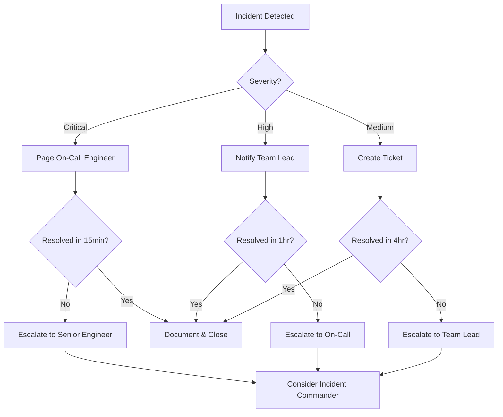

# Incident Response Runbooks

## Overview

This directory contains comprehensive incident response runbooks for common failure scenarios in the Trace system. Each runbook provides detection, investigation, resolution, and prevention procedures.

## Quick Index

| Incident Type | Severity | Typical Response Time | Runbook |
|---------------|----------|----------------------|---------|
| Database Connection Failures | Critical | < 5 minutes | [database-connection-failures.md](./database-connection-failures.md) |
| High Latency/Timeouts | High | < 10 minutes | [high-latency-timeouts.md](./high-latency-timeouts.md) |
| Memory Exhaustion | Critical | < 5 minutes | [memory-exhaustion.md](./memory-exhaustion.md) |
| Disk Space Issues | High | < 15 minutes | [disk-space-issues.md](./disk-space-issues.md) |
| Network Partitions | Critical | < 5 minutes | [network-partitions.md](./network-partitions.md) |
| Authentication Failures | High | < 10 minutes | [authentication-failures.md](./authentication-failures.md) |
| Cache Invalidation Issues | Medium | < 20 minutes | [cache-invalidation-issues.md](./cache-invalidation-issues.md) |

## Severity Levels

### Critical
- System unavailable or data loss imminent
- Immediate response required
- Escalate to senior engineers
- Target resolution: < 30 minutes

### High
- Major functionality impaired
- User impact significant
- Response within business hours
- Target resolution: < 2 hours

### Medium
- Minor functionality affected
- Limited user impact
- Response during normal hours
- Target resolution: < 4 hours

## Using These Runbooks

1. **Identify the incident** - Match symptoms to runbook
2. **Follow detection steps** - Verify the issue
3. **Execute investigation** - Gather diagnostic data
4. **Apply resolution** - Follow steps sequentially
5. **Verify fix** - Confirm system recovery
6. **Document** - Record actions taken
7. **Follow up** - Execute prevention measures

## Escalation Path



## Common Tools & Commands

### System Diagnostics
```bash
# Check service health
make health-check

# View service logs
docker-compose logs -f [service-name]

# Monitor resource usage
docker stats

# Database connection test
make db-test
```

### Monitoring Access
- **Grafana**: http://localhost:3001
- **Prometheus**: http://localhost:9090
- **Jaeger**: http://localhost:16686

### Quick Recovery Commands
```bash
# Restart all services
docker-compose restart

# Restart specific service
docker-compose restart [service-name]

# Clear cache
docker-compose exec redis redis-cli FLUSHALL

# Database migration status
make db-status

# Rollback last migration
make db-rollback
```

## Post-Incident Procedures

After resolving any incident:

1. **Document the incident**
   - Root cause
   - Actions taken
   - Time to resolution
   - User impact

2. **Update monitoring**
   - Add alerts if missing
   - Adjust thresholds
   - Improve detection

3. **Improve runbooks**
   - Add new scenarios
   - Update procedures
   - Document lessons learned

4. **Conduct blameless postmortem** (for Critical/High incidents)
   - Within 48 hours
   - Include all stakeholders
   - Focus on systemic improvements

## Contributing

When updating runbooks:

1. Test all commands and procedures
2. Include actual output examples
3. Update the index in this README
4. Add version history to the runbook
5. Review with team before merging

## Additional Resources

- [Monitoring Guide](../guides/monitoring.md)
- [Deployment Guide](../guides/DEPLOYMENT_GUIDE.md)
- [Architecture Documentation](../01-getting-started/README.md)
- [API Documentation](../04-guides/README.md)
