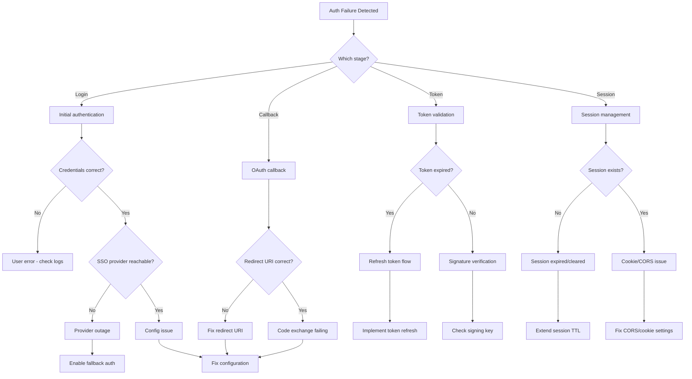

# Authentication Failures

**Severity**: High
**Response Time**: < 10 minutes
**Last Updated**: 2026-02-01

## Overview

Authentication failures prevent users from accessing the system, causing service disruption and potential security concerns. These can stem from SSO provider issues, token expiration, credential misconfigurations, session management problems, or OAuth flow failures.

## Detection

### Symptoms
- Users unable to log in
- "Unauthorized" (401) or "Forbidden" (403) errors
- OAuth callback failures
- Token validation errors
- Session timeouts
- Redirect loops during authentication
- Users being logged out unexpectedly

### Alerts
- `HighAuthFailureRate` - Authentication failure rate > 10%
- `OAuthCallbackFailures` - OAuth callbacks failing
- `TokenValidationErrors` - JWT validation failures

### Quick Check
```bash
# Check authentication endpoint
curl -I http://localhost:8000/api/v1/auth/login

# Test OAuth flow
curl -L http://localhost:8000/api/v1/auth/oauth/workos

# Check WorkOS configuration
docker-compose exec backend env | grep WORKOS

# Check for auth errors in logs
docker-compose logs backend --tail=100 | grep -i "auth\|token\|unauthorized"

# Verify session storage (Redis)
docker-compose exec redis redis-cli KEYS "session:*" | head -10
```

## Investigation Flowchart



## Investigation Steps

### 1. Identify Authentication Flow Stage

#### Check Login Endpoint
```bash
# Test login endpoint
curl -X POST http://localhost:8000/api/v1/auth/login \
  -H "Content-Type: application/json" \
  -d '{"email": "test@example.com", "password": "test123"}' \
  -v

# Check OAuth initiation
curl -L http://localhost:8000/api/v1/auth/oauth/workos -v

# Look for redirect to SSO provider
# Should see Location header with WorkOS URL
```

#### Check Recent Auth Attempts
```bash
# Check backend logs for auth attempts
docker-compose logs backend --tail=500 | grep -E "auth|login|oauth|token"

# Look for patterns:
# - "Invalid credentials"
# - "Token validation failed"
# - "OAuth state mismatch"
# - "Callback error"
```

### 2. Verify SSO Provider Configuration

#### Check WorkOS Configuration
```bash
# Verify environment variables
docker-compose exec backend python -c "
from backend.core.config import settings
print(f'WorkOS API Key: {settings.workos_api_key[:10]}...')
print(f'WorkOS Client ID: {settings.workos_client_id}')
print(f'Redirect URI: {settings.workos_redirect_uri}')
print(f'Environment: {settings.environment}')
"

# Test WorkOS API connectivity
curl -H "Authorization: Bearer $WORKOS_API_KEY" \
  https://api.workos.com/user_management/organizations

# Check rate limits
curl -H "Authorization: Bearer $WORKOS_API_KEY" \
  https://api.workos.com/rate_limit -v
```

#### Verify OAuth Configuration
```bash
# Check redirect URIs in WorkOS dashboard
# Should match: http://localhost:3000/auth/callback (development)
#          or: https://trace.example.com/auth/callback (production)

# Check configured providers
curl -H "Authorization: Bearer $WORKOS_API_KEY" \
  https://api.workos.com/user_management/organizations/$ORG_ID/auth_providers
```

### 3. Token Validation Issues

#### Check JWT Configuration
```bash
# Verify JWT secret
docker-compose exec backend python -c "
from backend.core.config import settings
print(f'JWT Secret length: {len(settings.jwt_secret)}')
print(f'JWT Algorithm: {settings.jwt_algorithm}')
print(f'Token expiry: {settings.jwt_expiration_minutes} minutes')
"

# Test token generation
docker-compose exec backend python -c "
from backend.core.security import create_access_token
token = create_access_token({'sub': 'test@example.com'})
print(f'Generated token: {token[:50]}...')
"

# Validate a token
docker-compose exec backend python -c "
from backend.core.security import verify_token
token = 'YOUR_TOKEN_HERE'
try:
    payload = verify_token(token)
    print(f'Token valid: {payload}')
except Exception as e:
    print(f'Token invalid: {e}')
"
```

#### Check Token Storage
```bash
# Check Redis for session data
docker-compose exec redis redis-cli KEYS "session:*"

# Inspect a session
SESSION_KEY=$(docker-compose exec redis redis-cli KEYS "session:*" | head -1)
docker-compose exec redis redis-cli GET "$SESSION_KEY"

# Check session TTL
docker-compose exec redis redis-cli TTL "$SESSION_KEY"
```

### 4. Session Management Issues

#### Check Cookie Settings
```bash
# Verify cookie configuration
docker-compose exec backend python -c "
from backend.core.config import settings
print(f'Cookie domain: {settings.cookie_domain}')
print(f'Cookie secure: {settings.cookie_secure}')
print(f'Cookie SameSite: {settings.cookie_samesite}')
print(f'Session TTL: {settings.session_ttl_seconds}')
"

# Test cookie creation
curl -X POST http://localhost:8000/api/v1/auth/login \
  -H "Content-Type: application/json" \
  -d '{"email": "test@example.com", "password": "test"}' \
  -c cookies.txt -v

# Check cookies file
cat cookies.txt
```

#### Check CORS Configuration
```bash
# Verify CORS settings
docker-compose exec backend python -c "
from backend.core.config import settings
print(f'CORS origins: {settings.cors_origins}')
print(f'CORS credentials: {settings.cors_allow_credentials}')
"

# Test CORS headers
curl -H "Origin: http://localhost:3000" \
  -H "Access-Control-Request-Method: POST" \
  -H "Access-Control-Request-Headers: X-Requested-With" \
  -X OPTIONS http://localhost:8000/api/v1/auth/login -v

# Should see Access-Control-Allow-Origin header
```

### 5. OAuth Flow Debugging

#### Trace Complete OAuth Flow
```bash
# 1. Initiate OAuth (should redirect to WorkOS)
curl -L http://localhost:8000/api/v1/auth/oauth/workos -v 2>&1 | grep Location

# 2. Simulate callback (get from WorkOS after auth)
curl "http://localhost:8000/api/v1/auth/callback?code=AUTH_CODE&state=STATE" -v

# 3. Check for token in response
```

#### Check OAuth State Management
```bash
# Verify state is being stored
docker-compose exec redis redis-cli KEYS "oauth:state:*"

# Check state TTL (should be short, e.g., 5 minutes)
STATE_KEY=$(docker-compose exec redis redis-cli KEYS "oauth:state:*" | head -1)
docker-compose exec redis redis-cli TTL "$STATE_KEY"
```

### 6. Database Connection for Users

#### Verify User Data
```bash
# Check if users table exists and has data
docker-compose exec postgres psql -U postgres -d trace -c "
SELECT COUNT(*) as user_count FROM users;
"

# Check specific user
docker-compose exec postgres psql -U postgres -d trace -c "
SELECT id, email, created_at, last_login
FROM users
WHERE email = 'test@example.com';
"

# Check for authentication records
docker-compose exec postgres psql -U postgres -d trace -c "
SELECT COUNT(*) FROM auth_sessions WHERE expires_at > NOW();
"
```

## Resolution Steps

### Scenario 1: WorkOS Configuration Error

```bash
# Verify correct environment variables in .env
cat > .env <<EOF
WORKOS_API_KEY=sk_live_xxx
WORKOS_CLIENT_ID=client_xxx
WORKOS_REDIRECT_URI=http://localhost:3000/auth/callback
WORKOS_ENVIRONMENT_ID=environment_xxx
EOF

# Update docker-compose.yml to use .env
docker-compose down
docker-compose up -d backend

# Verify new configuration
docker-compose exec backend env | grep WORKOS
```

### Scenario 2: Redirect URI Mismatch

```bash
# Check current redirect URI
echo $WORKOS_REDIRECT_URI

# Update in WorkOS dashboard:
# Development: http://localhost:3000/auth/callback
# Production: https://trace.example.com/auth/callback

# Update in .env
WORKOS_REDIRECT_URI=http://localhost:3000/auth/callback

# Restart backend
docker-compose restart backend
```

### Scenario 3: JWT Secret Rotation

```python
# Generate new JWT secret
import secrets
new_secret = secrets.token_urlsafe(32)
print(f"New JWT secret: {new_secret}")
```

```bash
# Update .env
JWT_SECRET=new_secret_here
JWT_ALGORITHM=HS256
JWT_EXPIRATION_MINUTES=60

# Restart backend (will invalidate all existing tokens)
docker-compose restart backend

# Clear all existing sessions
docker-compose exec redis redis-cli FLUSHDB
```

### Scenario 4: Session Expiration Issues

```bash
# Increase session TTL in .env
SESSION_TTL_SECONDS=86400  # 24 hours (was 3600)

# Update cookie settings for cross-domain
COOKIE_DOMAIN=.example.com
COOKIE_SECURE=true
COOKIE_SAMESITE=lax

# Restart backend
docker-compose restart backend
```

### Scenario 5: CORS Issues

```python
# backend/main.py - Fix CORS configuration
from fastapi.middleware.cors import CORSMiddleware

app.add_middleware(
    CORSMiddleware,
    allow_origins=[
        "http://localhost:3000",
        "https://trace.example.com"
    ],
    allow_credentials=True,
    allow_methods=["*"],
    allow_headers=["*"],
    expose_headers=["Set-Cookie"]
)
```

```bash
# Rebuild and restart
docker-compose build backend
docker-compose up -d backend
```

### Scenario 6: OAuth Code Exchange Failure

```python
# backend/api/routes/auth.py - Add retry logic
from tenacity import retry, stop_after_attempt, wait_exponential

@retry(
    stop=stop_after_attempt(3),
    wait=wait_exponential(multiplier=1, min=2, max=10)
)
async def exchange_code_for_token(code: str):
    """Exchange OAuth code for token with retries"""
    async with httpx.AsyncClient() as client:
        response = await client.post(
            "https://api.workos.com/user_management/authenticate",
            json={
                "client_id": settings.workos_client_id,
                "client_secret": settings.workos_api_key,
                "code": code,
                "grant_type": "authorization_code"
            },
            timeout=10.0
        )
        response.raise_for_status()
        return response.json()
```

### Scenario 7: Token Refresh Implementation

```python
# backend/api/routes/auth.py
@router.post("/refresh")
async def refresh_token(
    refresh_token: str = Cookie(None),
    db: Session = Depends(get_db)
):
    """Refresh access token using refresh token"""
    if not refresh_token:
        raise HTTPException(status_code=401, detail="No refresh token")

    try:
        # Verify refresh token
        payload = verify_refresh_token(refresh_token)
        user_id = payload.get("sub")

        # Generate new access token
        access_token = create_access_token({"sub": user_id})

        return {
            "access_token": access_token,
            "token_type": "bearer"
        }
    except Exception as e:
        logger.error(f"Token refresh failed: {e}")
        raise HTTPException(status_code=401, detail="Invalid refresh token")
```

## Rollback Procedures

### Revert Configuration Changes

```bash
# Restore previous .env
cp .env.backup .env

# Restart services
docker-compose restart backend

# Clear Redis to remove bad sessions
docker-compose exec redis redis-cli FLUSHDB
```

### Revert Code Changes

```bash
# Rollback to previous version
git revert HEAD

# Rebuild and deploy
docker-compose build backend
docker-compose up -d backend
```

### Emergency: Bypass Authentication (Development Only)

```python
# backend/api/dependencies.py - TEMPORARY BYPASS
async def get_current_user(
    token: str = Depends(oauth2_scheme),
    db: Session = Depends(get_db)
):
    # TEMPORARY: Allow bypass for emergency access
    if os.getenv("AUTH_BYPASS_ENABLED") == "true":
        return await db.query(User).first()

    # Normal authentication flow
    ...
```

```bash
# Enable bypass
echo "AUTH_BYPASS_ENABLED=true" >> .env
docker-compose restart backend

# CRITICAL: Remove after fixing auth!
```

## Verification

### 1. Test Complete Auth Flow
```bash
# 1. Initiate login
curl -X POST http://localhost:8000/api/v1/auth/login \
  -H "Content-Type: application/json" \
  -d '{"email": "test@example.com", "password": "test123"}' \
  -c cookies.txt -v

# 2. Verify token in response
TOKEN=$(cat cookies.txt | grep access_token | awk '{print $7}')
echo "Token: $TOKEN"

# 3. Use token to access protected endpoint
curl http://localhost:8000/api/v1/items \
  -H "Authorization: Bearer $TOKEN" \
  -v

# Should return 200 OK
```

### 2. Test OAuth Flow
```bash
# Test OAuth initiation
curl -L http://localhost:8000/api/v1/auth/oauth/workos -v 2>&1 | grep -i location

# Should redirect to WorkOS with state parameter
```

### 3. Verify Session Persistence
```bash
# Login
curl -X POST http://localhost:8000/api/v1/auth/login \
  -H "Content-Type: application/json" \
  -d '{"email": "test@example.com", "password": "test123"}' \
  -c cookies.txt

# Wait 5 minutes
sleep 300

# Try accessing protected resource
curl http://localhost:8000/api/v1/items \
  -b cookies.txt \
  -v

# Should still work
```

### 4. Monitor Auth Success Rate
```bash
# Check auth metrics
curl -s 'http://localhost:9090/api/v1/query?query=rate(auth_attempts_total[5m])' | jq
curl -s 'http://localhost:9090/api/v1/query?query=rate(auth_failures_total[5m])' | jq

# Success rate should be > 90%
```

## Prevention Measures

### 1. Comprehensive Auth Monitoring

```yaml
# prometheus/alerts.yml
groups:
  - name: authentication
    interval: 30s
    rules:
      - alert: HighAuthFailureRate
        expr: |
          (
            rate(auth_failures_total[5m])
            / rate(auth_attempts_total[5m])
          ) > 0.1
        for: 5m
        labels:
          severity: high
        annotations:
          summary: "High authentication failure rate"
          description: "{{ $value | humanizePercentage }} of auth attempts failing"

      - alert: OAuthCallbackFailures
        expr: rate(oauth_callback_errors_total[5m]) > 0.05
        for: 3m
        labels:
          severity: high
        annotations:
          summary: "OAuth callbacks failing"

      - alert: TokenValidationErrors
        expr: rate(token_validation_errors_total[5m]) > 1
        for: 5m
        labels:
          severity: medium
        annotations:
          summary: "Token validation errors increasing"

      - alert: SessionStoreUnreachable
        expr: redis_up{job="redis"} == 0
        for: 1m
        labels:
          severity: critical
        annotations:
          summary: "Session store (Redis) unreachable"
```

### 2. Auth Metrics Implementation

```python
# backend/core/metrics.py
from prometheus_client import Counter, Histogram

# Auth attempt metrics
auth_attempts_total = Counter(
    'auth_attempts_total',
    'Total authentication attempts',
    ['method', 'provider']
)

auth_failures_total = Counter(
    'auth_failures_total',
    'Failed authentication attempts',
    ['method', 'provider', 'reason']
)

auth_duration_seconds = Histogram(
    'auth_duration_seconds',
    'Authentication duration',
    ['method']
)

# Usage in auth routes
@router.post("/login")
async def login(credentials: LoginRequest):
    auth_attempts_total.labels(method='password', provider='local').inc()

    with auth_duration_seconds.labels(method='password').time():
        try:
            user = await authenticate_user(credentials)
            return create_session(user)
        except AuthError as e:
            auth_failures_total.labels(
                method='password',
                provider='local',
                reason=str(e)
            ).inc()
            raise
```

### 3. Token Refresh Strategy

```python
# backend/core/security.py
from datetime import datetime, timedelta
import jwt

def create_token_pair(user_id: str):
    """Create access and refresh token pair"""
    # Short-lived access token (15 minutes)
    access_token = jwt.encode(
        {
            "sub": user_id,
            "type": "access",
            "exp": datetime.utcnow() + timedelta(minutes=15)
        },
        settings.jwt_secret,
        algorithm=settings.jwt_algorithm
    )

    # Long-lived refresh token (7 days)
    refresh_token = jwt.encode(
        {
            "sub": user_id,
            "type": "refresh",
            "exp": datetime.utcnow() + timedelta(days=7)
        },
        settings.jwt_secret,
        algorithm=settings.jwt_algorithm
    )

    return access_token, refresh_token
```

### 4. Session Management

```python
# backend/core/sessions.py
import redis
from datetime import timedelta

class SessionManager:
    def __init__(self):
        self.redis = redis.Redis(host='redis', port=6379, db=0)
        self.ttl = timedelta(hours=24)

    def create_session(self, user_id: str, data: dict):
        """Create user session"""
        session_id = secrets.token_urlsafe(32)
        key = f"session:{session_id}"

        self.redis.setex(
            key,
            self.ttl,
            json.dumps({
                "user_id": user_id,
                "created_at": datetime.utcnow().isoformat(),
                **data
            })
        )

        return session_id

    def get_session(self, session_id: str):
        """Get session data"""
        key = f"session:{session_id}"
        data = self.redis.get(key)

        if not data:
            return None

        # Refresh TTL on access
        self.redis.expire(key, self.ttl)

        return json.loads(data)

    def delete_session(self, session_id: str):
        """Delete session"""
        self.redis.delete(f"session:{session_id}")
```

### 5. Auth Testing Suite

```python
# tests/test_auth.py
import pytest
from fastapi.testclient import TestClient

def test_login_success(client: TestClient):
    """Test successful login"""
    response = client.post(
        "/api/v1/auth/login",
        json={"email": "test@example.com", "password": "test123"}
    )
    assert response.status_code == 200
    assert "access_token" in response.json()

def test_login_invalid_credentials(client: TestClient):
    """Test login with invalid credentials"""
    response = client.post(
        "/api/v1/auth/login",
        json={"email": "test@example.com", "password": "wrong"}
    )
    assert response.status_code == 401

def test_oauth_flow(client: TestClient):
    """Test OAuth flow"""
    # Initiate OAuth
    response = client.get("/api/v1/auth/oauth/workos", follow_redirects=False)
    assert response.status_code == 302
    assert "workos.com" in response.headers["location"]

def test_token_refresh(client: TestClient):
    """Test token refresh"""
    # Login
    login_response = client.post(
        "/api/v1/auth/login",
        json={"email": "test@example.com", "password": "test123"}
    )

    # Refresh
    refresh_response = client.post(
        "/api/v1/auth/refresh",
        cookies=login_response.cookies
    )
    assert refresh_response.status_code == 200
    assert "access_token" in refresh_response.json()

def test_protected_endpoint_without_auth(client: TestClient):
    """Test accessing protected endpoint without authentication"""
    response = client.get("/api/v1/items")
    assert response.status_code == 401
```

### 6. Configuration Validation

```python
# backend/core/config.py
from pydantic import BaseSettings, validator

class Settings(BaseSettings):
    workos_api_key: str
    workos_client_id: str
    workos_redirect_uri: str

    jwt_secret: str
    jwt_algorithm: str = "HS256"

    @validator("workos_api_key")
    def validate_workos_key(cls, v):
        if not v.startswith("sk_"):
            raise ValueError("Invalid WorkOS API key format")
        return v

    @validator("jwt_secret")
    def validate_jwt_secret(cls, v):
        if len(v) < 32:
            raise ValueError("JWT secret must be at least 32 characters")
        return v

    @validator("workos_redirect_uri")
    def validate_redirect_uri(cls, v):
        if not v.startswith(("http://", "https://")):
            raise ValueError("Invalid redirect URI format")
        return v

settings = Settings()
```

## Related Runbooks

- [High Latency/Timeouts](./high-latency-timeouts.md)
- [Network Partitions](./network-partitions.md)
- [Cache Invalidation Issues](./cache-invalidation-issues.md)

## Version History

- 2026-02-01: Initial version
