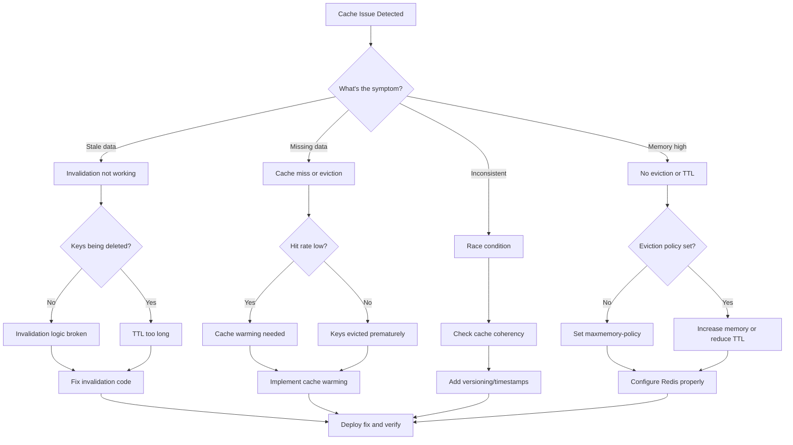

# Cache Invalidation Issues

**Severity**: Medium
**Response Time**: < 20 minutes
**Last Updated**: 2026-02-01

## Overview

Cache invalidation issues occur when cached data becomes stale or inconsistent with the source of truth, leading to users seeing outdated information, data inconsistencies across services, or performance degradation. This is one of the hardest problems in computer science: "There are only two hard things in Computer Science: cache invalidation and naming things."

## Detection

### Symptoms
- Users seeing stale data
- Data inconsistencies between page refreshes
- Changes not reflected immediately
- Old values returned after updates
- Cache hit rate anomalies (too high or too low)
- Memory usage growing unbounded in Redis
- Different users seeing different data for same resource

### Alerts
- `CacheHitRateLow` - Cache hit rate < 50%
- `CacheMemoryHigh` - Redis memory > 85%
- `StaleCacheDetected` - Data age > threshold
- `CacheKeyCountHigh` - Too many keys in cache

### Quick Check
```bash
# Check Redis status
docker-compose exec redis redis-cli INFO stats

# Check cache hit rate
docker-compose exec redis redis-cli INFO stats | grep -E "keyspace_hits|keyspace_misses"

# Check memory usage
docker-compose exec redis redis-cli INFO memory | grep used_memory_human

# Check number of keys
docker-compose exec redis redis-cli DBSIZE

# Check for specific cached data
docker-compose exec redis redis-cli KEYS "cache:*" | head -20

# Check TTL on cached keys
docker-compose exec redis redis-cli TTL "cache:items:123"
```

## Investigation Flowchart



## Investigation Steps

### 1. Analyze Cache Metrics

#### Check Cache Statistics
```bash
# Overall statistics
docker-compose exec redis redis-cli INFO stats

# Calculate hit rate
HITS=$(docker-compose exec redis redis-cli INFO stats | grep keyspace_hits | cut -d: -f2)
MISSES=$(docker-compose exec redis redis-cli INFO stats | grep keyspace_misses | cut -d: -f2)
TOTAL=$((HITS + MISSES))
HIT_RATE=$(echo "scale=2; $HITS * 100 / $TOTAL" | bc)
echo "Cache hit rate: ${HIT_RATE}%"

# Memory statistics
docker-compose exec redis redis-cli INFO memory

# Key statistics by pattern
docker-compose exec redis redis-cli --scan --pattern "cache:items:*" | wc -l
docker-compose exec redis redis-cli --scan --pattern "cache:users:*" | wc -l
docker-compose exec redis redis-cli --scan --pattern "session:*" | wc -l
```

#### Check Eviction Statistics
```bash
# Check eviction count
docker-compose exec redis redis-cli INFO stats | grep evicted_keys

# Check eviction policy
docker-compose exec redis redis-cli CONFIG GET maxmemory-policy

# Check memory limit
docker-compose exec redis redis-cli CONFIG GET maxmemory

# Top memory consumers
docker-compose exec redis redis-cli --bigkeys
```

### 2. Identify Stale Data

#### Find Old Cache Entries
```bash
# Check TTL distribution
for key in $(docker-compose exec redis redis-cli KEYS "cache:*" | head -50); do
    ttl=$(docker-compose exec redis redis-cli TTL "$key")
    echo "$key: $ttl seconds"
done | sort -t: -k2 -n

# Find keys without TTL (persist forever)
docker-compose exec redis redis-cli --scan --pattern "cache:*" | while read key; do
    ttl=$(docker-compose exec redis redis-cli TTL "$key")
    if [ "$ttl" = "-1" ]; then
        echo "No TTL: $key"
    fi
done

# Check data age (if stored in value)
docker-compose exec redis redis-cli GET "cache:items:123" | jq '.cached_at'
```

#### Compare Cache vs Database
```bash
# Get cached value
CACHED=$(docker-compose exec redis redis-cli GET "cache:items:123")
echo "Cached: $CACHED"

# Get database value
DB_VALUE=$(docker-compose exec postgres psql -U postgres -d trace -t -c "SELECT row_to_json(items) FROM items WHERE id = 123;")
echo "Database: $DB_VALUE"

# Compare
if [ "$CACHED" != "$DB_VALUE" ]; then
    echo "STALE DATA DETECTED"
fi
```

### 3. Analyze Cache Invalidation Logic

#### Check Invalidation Events
```bash
# Look for invalidation in logs
docker-compose logs backend --tail=500 | grep -i "cache.*invalidat\|cache.*clear\|cache.*delete"

# Check for publish events (if using pub/sub)
docker-compose exec redis redis-cli SUBSCRIBE "cache:invalidate:*"

# Monitor deletions
docker-compose exec redis redis-cli MONITOR | grep DEL
```

#### Test Invalidation Manually
```bash
# Create cache entry
docker-compose exec redis redis-cli SET "cache:test:123" '{"name":"old"}'

# Update source data
docker-compose exec postgres psql -U postgres -d trace -c "UPDATE items SET title = 'new' WHERE id = 123;"

# Check if cache was invalidated
docker-compose exec redis redis-cli GET "cache:test:123"
# Should be deleted or show new data
```

### 4. Check for Race Conditions

#### Look for Concurrent Updates
```bash
# Check application logs for concurrent access patterns
docker-compose logs backend --tail=1000 | grep "cache.*update\|cache.*set" | sort

# Monitor Redis operations in real-time
docker-compose exec redis redis-cli MONITOR | grep "SET\|DEL\|GET"

# Check for distributed lock issues (if using locks)
docker-compose exec redis redis-cli KEYS "lock:*"
```

### 5. Analyze Memory Growth

#### Track Memory Over Time
```bash
# Query Prometheus for memory trends
curl -s 'http://localhost:9090/api/v1/query_range?query=redis_memory_used_bytes&start='$(date -u -d '1 hour ago' +%s)'&end='$(date -u +%s)'&step=60' | jq

# Check key count growth
watch -n 5 'docker-compose exec redis redis-cli DBSIZE'

# Analyze key patterns
docker-compose exec redis redis-cli --scan --pattern "*" | \
  awk -F: '{print $1":"$2}' | \
  sort | uniq -c | sort -rn
```

## Resolution Steps

### Scenario 1: Missing Cache Invalidation

```python
# backend/services/items.py - Add proper invalidation

from typing import Optional
import redis

redis_client = redis.Redis(host='redis', port=6379, decode_responses=True)

async def update_item(item_id: str, data: dict) -> Item:
    """Update item and invalidate cache"""

    # Update database
    item = await db.query(Item).filter(Item.id == item_id).first()
    for key, value in data.items():
        setattr(item, key, value)

    await db.commit()
    await db.refresh(item)

    # Invalidate cache
    cache_keys = [
        f"cache:items:{item_id}",
        f"cache:items:all",
        f"cache:project:{item.project_id}:items",
    ]

    for key in cache_keys:
        redis_client.delete(key)

    # Also publish invalidation event for other instances
    redis_client.publish(
        "cache:invalidate:items",
        json.dumps({"item_id": item_id})
    )

    return item
```

### Scenario 2: No TTL on Cache Keys

```bash
# Set default TTL on all cache keys
docker-compose exec redis redis-cli --scan --pattern "cache:*" | while read key; do
    ttl=$(docker-compose exec redis redis-cli TTL "$key")
    if [ "$ttl" = "-1" ]; then
        docker-compose exec redis redis-cli EXPIRE "$key" 3600
        echo "Set TTL on $key"
    fi
done
```

```python
# Fix code to always set TTL
def cache_set(key: str, value: str, ttl: int = 3600):
    """Set cache with TTL"""
    redis_client.setex(key, ttl, value)  # Use setex instead of set

# Or with default TTL in decorator
def cached(ttl: int = 3600):
    def decorator(func):
        @wraps(func)
        async def wrapper(*args, **kwargs):
            cache_key = f"cache:{func.__name__}:{hash(args)}"

            # Check cache
            cached = redis_client.get(cache_key)
            if cached:
                return json.loads(cached)

            # Execute function
            result = await func(*args, **kwargs)

            # Cache with TTL
            redis_client.setex(cache_key, ttl, json.dumps(result))

            return result
        return wrapper
    return decorator
```

### Scenario 3: Cache Eviction Too Aggressive

```bash
# Check current eviction policy
docker-compose exec redis redis-cli CONFIG GET maxmemory-policy

# Set better eviction policy
docker-compose exec redis redis-cli CONFIG SET maxmemory-policy allkeys-lru

# Increase memory if needed
docker-compose exec redis redis-cli CONFIG SET maxmemory 512mb

# Make permanent in redis.conf
cat >> redis.conf <<EOF
maxmemory 512mb
maxmemory-policy allkeys-lru
maxmemory-samples 5
EOF

# Restart Redis
docker-compose restart redis
```

### Scenario 4: Distributed Cache Inconsistency

```python
# Implement cache versioning
import hashlib
from datetime import datetime

class VersionedCache:
    """Cache with versioning to detect stale data"""

    def __init__(self, redis_client):
        self.redis = redis_client

    def get_version(self, resource_type: str, resource_id: str) -> int:
        """Get current version of resource"""
        version_key = f"version:{resource_type}:{resource_id}"
        version = self.redis.get(version_key)
        return int(version) if version else 0

    def increment_version(self, resource_type: str, resource_id: str):
        """Increment version on update"""
        version_key = f"version:{resource_type}:{resource_id}"
        self.redis.incr(version_key)

    def set_cached(self, key: str, value: dict, resource_type: str, resource_id: str, ttl: int = 3600):
        """Set cached value with version"""
        version = self.get_version(resource_type, resource_id)

        cached_data = {
            "version": version,
            "data": value,
            "cached_at": datetime.utcnow().isoformat()
        }

        self.redis.setex(key, ttl, json.dumps(cached_data))

    def get_cached(self, key: str, resource_type: str, resource_id: str) -> Optional[dict]:
        """Get cached value and verify version"""
        cached = self.redis.get(key)
        if not cached:
            return None

        cached_data = json.loads(cached)
        cached_version = cached_data.get("version")
        current_version = self.get_version(resource_type, resource_id)

        # Check if stale
        if cached_version != current_version:
            self.redis.delete(key)
            return None

        return cached_data["data"]

# Usage
cache = VersionedCache(redis_client)

async def update_item(item_id: str, data: dict):
    # Update database
    item = await db.update(Item, item_id, data)

    # Increment version
    cache.increment_version("items", item_id)

    return item

async def get_item(item_id: str):
    # Try cache
    cached = cache.get_cached(f"cache:items:{item_id}", "items", item_id)
    if cached:
        return cached

    # Fetch from database
    item = await db.get(Item, item_id)

    # Cache with version
    cache.set_cached(f"cache:items:{item_id}", item.dict(), "items", item_id)

    return item
```

### Scenario 5: Cache Stampede

```python
# Implement cache locking to prevent stampede
import asyncio
from contextlib import asynccontextmanager

class CacheLock:
    """Distributed lock for cache operations"""

    def __init__(self, redis_client, timeout: int = 30):
        self.redis = redis_client
        self.timeout = timeout

    @asynccontextmanager
    async def acquire(self, key: str):
        """Acquire lock with timeout"""
        lock_key = f"lock:{key}"
        lock_id = secrets.token_hex(16)

        # Try to acquire lock
        acquired = False
        start_time = time.time()

        while not acquired and (time.time() - start_time) < self.timeout:
            acquired = self.redis.set(
                lock_key,
                lock_id,
                nx=True,  # Only set if not exists
                ex=10     # 10 second expiry
            )

            if not acquired:
                await asyncio.sleep(0.1)

        if not acquired:
            raise TimeoutError(f"Could not acquire lock for {key}")

        try:
            yield
        finally:
            # Release lock only if we still own it
            lua_script = """
            if redis.call("get", KEYS[1]) == ARGV[1] then
                return redis.call("del", KEYS[1])
            else
                return 0
            end
            """
            self.redis.eval(lua_script, 1, lock_key, lock_id)

# Usage
lock = CacheLock(redis_client)

async def get_items_with_lock(project_id: str):
    """Get items with cache locking to prevent stampede"""
    cache_key = f"cache:project:{project_id}:items"

    # Check cache first
    cached = redis_client.get(cache_key)
    if cached:
        return json.loads(cached)

    # Acquire lock before expensive operation
    async with lock.acquire(cache_key):
        # Double-check cache (might have been populated while waiting for lock)
        cached = redis_client.get(cache_key)
        if cached:
            return json.loads(cached)

        # Fetch from database
        items = await db.query(Item).filter(Item.project_id == project_id).all()

        # Cache result
        redis_client.setex(cache_key, 300, json.dumps([item.dict() for item in items]))

        return items
```

### Scenario 6: Cache Memory Full

```bash
# Immediate: Clear cache
docker-compose exec redis redis-cli FLUSHDB

# Analyze what was using memory
docker-compose exec redis redis-cli --bigkeys

# Implement tiered caching
# Keep hot data in Redis, move cold data to application-level cache
```

```python
# Two-tier caching strategy
from cachetools import TTLCache
from typing import Optional

class TieredCache:
    """Two-tier cache: In-memory + Redis"""

    def __init__(self):
        # L1: In-memory cache (small, fast)
        self.l1_cache = TTLCache(maxsize=1000, ttl=300)

        # L2: Redis cache (larger, slower)
        self.l2_cache = redis.Redis(host='redis', port=6379)

    def get(self, key: str) -> Optional[str]:
        """Get from cache (L1 -> L2)"""
        # Try L1 first
        if key in self.l1_cache:
            return self.l1_cache[key]

        # Try L2
        value = self.l2_cache.get(key)
        if value:
            # Promote to L1
            self.l1_cache[key] = value
            return value

        return None

    def set(self, key: str, value: str, ttl: int = 3600):
        """Set in both caches"""
        # Store in L1
        self.l1_cache[key] = value

        # Store in L2 with TTL
        self.l2_cache.setex(key, ttl, value)

    def delete(self, key: str):
        """Delete from both caches"""
        self.l1_cache.pop(key, None)
        self.l2_cache.delete(key)
```

## Rollback Procedures

### Clear Entire Cache

```bash
# Clear all cache (will cause temporary performance degradation)
docker-compose exec redis redis-cli FLUSHDB

# Or clear specific patterns
docker-compose exec redis redis-cli --scan --pattern "cache:items:*" | xargs docker-compose exec redis redis-cli DEL
```

### Restore Previous Cache Configuration

```bash
# Restore redis.conf
cp redis.conf.backup redis.conf

# Restart Redis
docker-compose restart redis
```

### Revert Code Changes

```bash
# Rollback caching code
git revert HEAD

# Rebuild and deploy
docker-compose build backend
docker-compose up -d backend

# Clear cache to remove inconsistent data
docker-compose exec redis redis-cli FLUSHDB
```

## Verification

### 1. Check Cache Hit Rate
```bash
# Should be > 70% for effective caching
HITS=$(docker-compose exec redis redis-cli INFO stats | grep keyspace_hits: | cut -d: -f2)
MISSES=$(docker-compose exec redis redis-cli INFO stats | grep keyspace_misses: | cut -d: -f2)
TOTAL=$((HITS + MISSES))
HIT_RATE=$(echo "scale=2; $HITS * 100 / $TOTAL" | bc)
echo "Cache hit rate: ${HIT_RATE}%"
```

### 2. Verify Data Freshness
```bash
# Update a resource
curl -X PATCH http://localhost:8000/api/v1/items/123 \
  -H "Content-Type: application/json" \
  -d '{"title": "Updated Title"}'

# Immediately fetch it
curl http://localhost:8000/api/v1/items/123

# Should show updated data, not cached stale data
```

### 3. Test Invalidation
```bash
# Check cache exists
docker-compose exec redis redis-cli GET "cache:items:123"

# Update item
curl -X PATCH http://localhost:8000/api/v1/items/123 \
  -H "Content-Type: application/json" \
  -d '{"title": "New Title"}'

# Cache should be invalidated
docker-compose exec redis redis-cli GET "cache:items:123"
# Should return (nil)
```

### 4. Monitor Memory Stability
```bash
# Memory should not grow unbounded
watch -n 10 'docker-compose exec redis redis-cli INFO memory | grep used_memory_human'

# Should stabilize at configured maxmemory
```

## Prevention Measures

### 1. Comprehensive Caching Strategy

```python
# backend/core/cache.py
from enum import Enum
from typing import Optional, Callable
from functools import wraps
import json

class CacheStrategy(Enum):
    """Cache invalidation strategies"""
    TTL = "ttl"                    # Time-based expiration
    VERSION = "version"            # Version-based invalidation
    WRITE_THROUGH = "write_through" # Invalidate on write
    EVENT_DRIVEN = "event_driven"  # Pub/sub invalidation

class CacheManager:
    """Centralized cache management"""

    def __init__(self, redis_client, strategy: CacheStrategy = CacheStrategy.TTL):
        self.redis = redis_client
        self.strategy = strategy

    def cached(
        self,
        ttl: int = 3600,
        key_prefix: str = "cache",
        invalidate_on: Optional[list] = None
    ):
        """Decorator for caching function results"""
        def decorator(func: Callable):
            @wraps(func)
            async def wrapper(*args, **kwargs):
                # Generate cache key
                cache_key = self._generate_key(key_prefix, func.__name__, args, kwargs)

                # Try cache
                cached = await self._get_cached(cache_key)
                if cached is not None:
                    return cached

                # Execute function
                result = await func(*args, **kwargs)

                # Store in cache
                await self._set_cached(cache_key, result, ttl)

                return result
            return wrapper
        return decorator

    async def invalidate(self, pattern: str):
        """Invalidate cache keys matching pattern"""
        keys = self.redis.keys(pattern)
        if keys:
            self.redis.delete(*keys)

        # Publish event for distributed invalidation
        self.redis.publish("cache:invalidate", pattern)

    def _generate_key(self, prefix: str, func_name: str, args, kwargs) -> str:
        """Generate cache key from function call"""
        key_parts = [prefix, func_name]

        # Add args
        for arg in args:
            if isinstance(arg, (str, int)):
                key_parts.append(str(arg))

        # Add kwargs
        for k, v in sorted(kwargs.items()):
            if isinstance(v, (str, int)):
                key_parts.append(f"{k}:{v}")

        return ":".join(key_parts)

    async def _get_cached(self, key: str) -> Optional[dict]:
        """Get from cache with strategy"""
        cached = self.redis.get(key)
        if not cached:
            return None

        data = json.loads(cached)

        # Check version if using version strategy
        if self.strategy == CacheStrategy.VERSION:
            if not self._check_version(key, data.get("version")):
                self.redis.delete(key)
                return None

        return data.get("value")

    async def _set_cached(self, key: str, value: dict, ttl: int):
        """Set in cache with strategy"""
        data = {"value": value}

        # Add version if using version strategy
        if self.strategy == CacheStrategy.VERSION:
            data["version"] = self._get_version(key)

        self.redis.setex(key, ttl, json.dumps(data))

# Usage
cache_manager = CacheManager(redis_client, strategy=CacheStrategy.VERSION)

@cache_manager.cached(ttl=300, key_prefix="items")
async def get_project_items(project_id: str):
    return await db.query(Item).filter(Item.project_id == project_id).all()

# Invalidate on update
async def update_item(item_id: str, data: dict):
    item = await db.update(Item, item_id, data)
    await cache_manager.invalidate(f"items:*{item.project_id}*")
    return item
```

### 2. Cache Monitoring

```yaml
# prometheus/alerts.yml
groups:
  - name: cache
    interval: 30s
    rules:
      - alert: CacheHitRateLow
        expr: |
          (
            rate(redis_keyspace_hits_total[5m])
            / (rate(redis_keyspace_hits_total[5m]) + rate(redis_keyspace_misses_total[5m]))
          ) < 0.5
        for: 10m
        labels:
          severity: medium
        annotations:
          summary: "Cache hit rate below 50%"
          description: "Hit rate is {{ $value | humanizePercentage }}"

      - alert: CacheMemoryHigh
        expr: redis_memory_used_bytes / redis_memory_max_bytes > 0.85
        for: 5m
        labels:
          severity: high
        annotations:
          summary: "Redis memory usage high"

      - alert: CacheEvictionRateHigh
        expr: rate(redis_evicted_keys_total[5m]) > 100
        for: 5m
        labels:
          severity: medium
        annotations:
          summary: "High cache eviction rate"

      - alert: CacheKeyCountHigh
        expr: redis_db_keys > 100000
        for: 10m
        labels:
          severity: medium
        annotations:
          summary: "Too many keys in cache"
```

### 3. Testing Suite

```python
# tests/test_cache.py
import pytest
from backend.core.cache import CacheManager

@pytest.mark.asyncio
async def test_cache_hit(cache_manager, redis_client):
    """Test cache hit"""
    # Set cache
    await cache_manager._set_cached("test:key", {"value": "data"}, 60)

    # Get from cache
    result = await cache_manager._get_cached("test:key")

    assert result == {"value": "data"}

@pytest.mark.asyncio
async def test_cache_miss(cache_manager):
    """Test cache miss"""
    result = await cache_manager._get_cached("nonexistent:key")
    assert result is None

@pytest.mark.asyncio
async def test_cache_invalidation(cache_manager, redis_client):
    """Test cache invalidation"""
    # Set multiple keys
    await cache_manager._set_cached("test:item:1", {"id": 1}, 60)
    await cache_manager._set_cached("test:item:2", {"id": 2}, 60)

    # Invalidate pattern
    await cache_manager.invalidate("test:item:*")

    # Keys should be gone
    assert await cache_manager._get_cached("test:item:1") is None
    assert await cache_manager._get_cached("test:item:2") is None

@pytest.mark.asyncio
async def test_cache_ttl_expiration(cache_manager, redis_client):
    """Test TTL expiration"""
    # Set with short TTL
    await cache_manager._set_cached("test:ttl", {"value": "data"}, 1)

    # Should exist immediately
    assert await cache_manager._get_cached("test:ttl") is not None

    # Wait for expiration
    await asyncio.sleep(2)

    # Should be expired
    assert await cache_manager._get_cached("test:ttl") is None
```

### 4. Documentation

```markdown
# Cache Key Naming Convention

All cache keys should follow this pattern:
`{prefix}:{resource_type}:{resource_id}:{optional_suffix}`

Examples:
- `cache:items:123` - Single item
- `cache:project:abc:items` - Items for project
- `cache:user:xyz:permissions` - User permissions

# TTL Guidelines

| Data Type | TTL | Reason |
|-----------|-----|--------|
| User sessions | 24 hours | User convenience |
| API responses | 5 minutes | Balance freshness vs performance |
| Static content | 1 hour | Rarely changes |
| Computed aggregations | 15 minutes | Expensive to compute |
| Real-time data | 30 seconds | Must be fresh |

# Invalidation Strategy

1. **Write-through**: Invalidate immediately on write
2. **Version-based**: Use version numbers to detect stale data
3. **Event-driven**: Publish invalidation events via pub/sub
4. **TTL-based**: Let data expire naturally for non-critical data
```

## Related Runbooks

- [High Latency/Timeouts](./high-latency-timeouts.md)
- [Memory Exhaustion](./memory-exhaustion.md)
- [Database Connection Failures](./database-connection-failures.md)

## Version History

- 2026-02-01: Initial version
