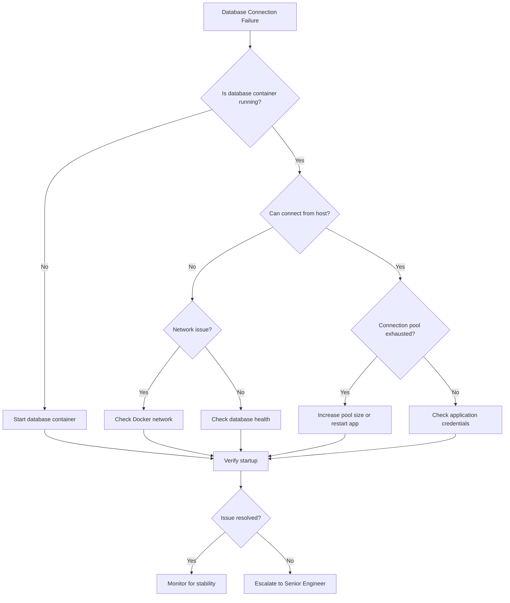

# Database Connection Failures

**Severity**: Critical
**Response Time**: < 5 minutes
**Last Updated**: 2026-02-01

## Overview

Database connection failures prevent the application from accessing persistent data, resulting in complete service outage or severe degradation.

## Detection

### Symptoms
- HTTP 500 errors on all API endpoints
- Application logs showing connection timeout errors
- Health check endpoint returning unhealthy status
- Grafana dashboard showing zero database connections

### Alerts
- `DatabaseConnectionPoolExhausted`
- `DatabaseConnectionTimeout`
- `HealthCheckFailed`

### Quick Check
```bash
# Check database service status
docker-compose ps postgres

# Test database connection
docker-compose exec backend python -c "
from backend.core.database import engine
try:
    with engine.connect() as conn:
        result = conn.execute('SELECT 1')
        print('✓ Database connection successful')
except Exception as e:
    print(f'✗ Database connection failed: {e}')
"

# Check connection pool status
docker-compose logs backend | grep -i "connection pool"
```

## Investigation Flowchart



## Investigation Steps

### 1. Verify Database Container Status
```bash
# Check if PostgreSQL is running
docker-compose ps postgres

# Expected output:
# NAME                COMMAND                  SERVICE    STATUS
# trace-postgres-1    "docker-entrypoint.s…"   postgres   Up 2 hours

# If not running, check why it stopped
docker-compose logs --tail=100 postgres
```

### 2. Check Database Health
```bash
# Connect to database directly
docker-compose exec postgres psql -U postgres -d trace -c "SELECT version();"

# Check active connections
docker-compose exec postgres psql -U postgres -d trace -c "
SELECT count(*) as active_connections,
       max_conn,
       max_conn - count(*) as remaining_connections
FROM pg_stat_activity
CROSS JOIN (SELECT setting::int as max_conn FROM pg_settings WHERE name = 'max_connections') mc
GROUP BY max_conn;
"

# Check for long-running queries blocking connections
docker-compose exec postgres psql -U postgres -d trace -c "
SELECT pid, now() - pg_stat_activity.query_start AS duration, query, state
FROM pg_stat_activity
WHERE state != 'idle'
ORDER BY duration DESC;
"
```

### 3. Check Network Connectivity
```bash
# Test network connectivity from backend to database
docker-compose exec backend ping -c 3 postgres

# Check Docker network
docker network inspect trace_default

# Verify DNS resolution
docker-compose exec backend nslookup postgres
```

### 4. Check Application Configuration
```bash
# Verify database URL in environment
docker-compose exec backend env | grep DATABASE

# Check connection pool settings
docker-compose exec backend python -c "
from backend.core.config import settings
print(f'Database URL: {settings.database_url}')
print(f'Pool Size: {settings.database_pool_size}')
print(f'Max Overflow: {settings.database_max_overflow}')
"
```

### 5. Review Application Logs
```bash
# Check for connection errors
docker-compose logs backend --tail=500 | grep -i "database\|connection\|sqlalchemy"

# Look for specific error patterns:
# - "FATAL: remaining connection slots are reserved"
# - "connection timeout"
# - "could not connect to server"
# - "Connection pool exhausted"
```

## Resolution Steps

### Scenario 1: Database Container Not Running

```bash
# Start the database container
docker-compose up -d postgres

# Wait for database to be ready
sleep 10

# Verify it's healthy
docker-compose exec postgres pg_isready -U postgres

# Restart application to reconnect
docker-compose restart backend
```

### Scenario 2: Connection Pool Exhausted

```bash
# Immediate: Restart application to reset pool
docker-compose restart backend

# Medium-term: Increase pool size
# Edit docker-compose.yml or .env:
# DATABASE_POOL_SIZE=20  # Increase from default
# DATABASE_MAX_OVERFLOW=40  # Increase overflow

# Restart with new settings
docker-compose up -d backend

# Verify new pool size
docker-compose logs backend | grep "pool_size"
```

### Scenario 3: Database Out of Connections

```bash
# Find and kill idle connections
docker-compose exec postgres psql -U postgres -d trace -c "
SELECT pg_terminate_backend(pid)
FROM pg_stat_activity
WHERE datname = 'trace'
  AND pid <> pg_backend_pid()
  AND state = 'idle'
  AND state_change < NOW() - INTERVAL '5 minutes';
"

# Increase max_connections in PostgreSQL
docker-compose exec postgres psql -U postgres -c "
ALTER SYSTEM SET max_connections = 200;
"

# Restart PostgreSQL to apply
docker-compose restart postgres
sleep 10

# Restart application
docker-compose restart backend
```

### Scenario 4: Database Corrupted or Locked

```bash
# Check for lock issues
docker-compose exec postgres psql -U postgres -d trace -c "
SELECT pid, usename, pg_blocking_pids(pid) as blocked_by, query
FROM pg_stat_activity
WHERE cardinality(pg_blocking_pids(pid)) > 0;
"

# If locks found, terminate blocking processes
# (Get PID from above query)
docker-compose exec postgres psql -U postgres -d trace -c "
SELECT pg_terminate_backend([PID]);
"

# Last resort: Restart database (ONLY if safe)
docker-compose restart postgres
```

### Scenario 5: Network Partition

```bash
# Recreate Docker network
docker-compose down
docker network prune -f
docker-compose up -d

# Verify connectivity
docker-compose exec backend ping -c 3 postgres
```

## Rollback Procedures

### If Changes Made to Database Configuration

```bash
# Revert PostgreSQL configuration changes
docker-compose exec postgres psql -U postgres -c "
ALTER SYSTEM RESET max_connections;
"

# Restore original pool size in .env
# DATABASE_POOL_SIZE=10
# DATABASE_MAX_OVERFLOW=20

# Restart services
docker-compose restart postgres backend
```

### If Database Migration Caused Issues

```bash
# Rollback last migration
cd backend
alembic downgrade -1

# Restart application
docker-compose restart backend
```

## Verification

### 1. Test Database Connection
```bash
# Health check endpoint
curl http://localhost:8000/health

# Expected response:
# {"status": "healthy", "database": "connected", ...}
```

### 2. Test Application Functionality
```bash
# Create a test item
curl -X POST http://localhost:8000/api/v1/items \
  -H "Content-Type: application/json" \
  -d '{"title": "Connection Test", "type": "task"}'

# Verify response is successful (201)
```

### 3. Monitor Connection Pool
```bash
# Watch connection pool metrics
docker-compose logs -f backend | grep "pool"

# Check Grafana dashboard
open http://localhost:3001/d/database-connections
```

### 4. Verify No Error Logs
```bash
# Should see no connection errors
docker-compose logs backend --since=5m | grep -i error
```

## Prevention Measures

### 1. Connection Pool Configuration
```yaml
# In .env - Properly sized connection pool
DATABASE_POOL_SIZE=20
DATABASE_MAX_OVERFLOW=40
DATABASE_POOL_TIMEOUT=30
DATABASE_POOL_RECYCLE=3600
DATABASE_POOL_PRE_PING=true
```

### 2. Monitoring and Alerts
```yaml
# Add to prometheus/alerts.yml
- alert: DatabaseConnectionPoolExhausted
  expr: sqlalchemy_pool_size - sqlalchemy_pool_checked_out < 2
  for: 1m
  labels:
    severity: critical
  annotations:
    summary: "Database connection pool nearly exhausted"

- alert: DatabaseConnectionTimeout
  expr: increase(database_connection_errors_total[5m]) > 10
  for: 2m
  labels:
    severity: critical
  annotations:
    summary: "High rate of database connection timeouts"
```

### 3. Application Code Best Practices
```python
# backend/core/database.py - Ensure proper connection handling

from sqlalchemy.pool import QueuePool
from sqlalchemy import create_engine

engine = create_engine(
    settings.database_url,
    poolclass=QueuePool,
    pool_size=settings.database_pool_size,
    max_overflow=settings.database_max_overflow,
    pool_pre_ping=True,  # Verify connections before use
    pool_recycle=3600,   # Recycle connections every hour
    pool_timeout=30,     # Timeout if pool exhausted
    echo_pool=True,      # Log pool checkouts (debug only)
)

# Always use context managers
def get_db():
    db = SessionLocal()
    try:
        yield db
    finally:
        db.close()  # Always close connections
```

### 4. Database Maintenance
```bash
# Add to cron or scheduled tasks

# Weekly: Analyze database for query optimization
docker-compose exec postgres psql -U postgres -d trace -c "ANALYZE;"

# Monthly: Vacuum database
docker-compose exec postgres psql -U postgres -d trace -c "VACUUM ANALYZE;"

# Monitor slow queries
# Enable pg_stat_statements extension
docker-compose exec postgres psql -U postgres -d trace -c "
CREATE EXTENSION IF NOT EXISTS pg_stat_statements;
"
```

### 5. Regular Health Checks
```bash
# Add to monitoring/healthcheck.sh
#!/bin/bash

# Test database connectivity
if ! docker-compose exec -T postgres pg_isready -U postgres; then
    echo "ERROR: Database not ready"
    exit 1
fi

# Check connection count
CONN_COUNT=$(docker-compose exec -T postgres psql -U postgres -t -c "SELECT count(*) FROM pg_stat_activity;")
MAX_CONN=$(docker-compose exec -T postgres psql -U postgres -t -c "SELECT setting FROM pg_settings WHERE name = 'max_connections';")

if [ "$CONN_COUNT" -gt "$((MAX_CONN * 80 / 100))" ]; then
    echo "WARNING: Database connections at ${CONN_COUNT}/${MAX_CONN}"
fi
```

## Related Runbooks

- [High Latency/Timeouts](./high-latency-timeouts.md)
- [Memory Exhaustion](./memory-exhaustion.md)
- [Network Partitions](./network-partitions.md)

## Version History

- 2026-02-01: Initial version
