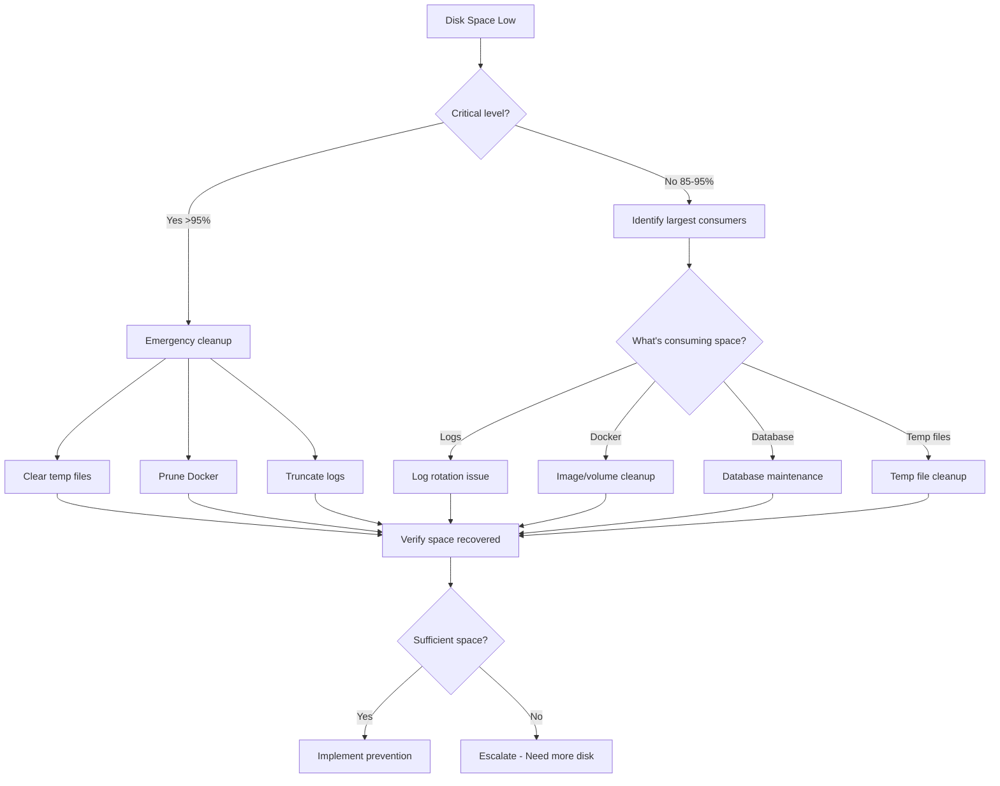

# Disk Space Issues

**Severity**: High
**Response Time**: < 15 minutes
**Last Updated**: 2026-02-01

## Overview

Disk space exhaustion can cause database corruption, failed writes, application crashes, and complete service outages. This typically results from log accumulation, database growth, temporary file buildup, or Docker image/volume sprawl.

## Detection

### Symptoms
- "No space left on device" errors in logs
- Database write failures
- Application unable to create temporary files
- Docker build/pull failures
- Log rotation stopped working
- Container crashes with disk errors

### Alerts
- `DiskSpaceHigh` - Disk usage > 85%
- `DiskSpaceCritical` - Disk usage > 95%
- `InodeUsageHigh` - Inode usage > 85%

### Quick Check
```bash
# Check disk usage
df -h

# Check specific mount points
df -h /var/lib/docker
df -h /var/log

# Check inode usage
df -i

# Check Docker disk usage
docker system df

# Check largest directories
du -h --max-depth=1 / 2>/dev/null | sort -hr | head -20
```

## Investigation Flowchart



## Investigation Steps

### 1. Identify Disk Usage

#### Overall Disk Status
```bash
# Filesystem usage
df -h

# Sample output:
# Filesystem      Size  Used Avail Use% Mounted on
# /dev/sda1       100G   87G   13G  87% /
# /dev/sdb1       500G  450G   50G  90% /var/lib/docker

# Inode usage (can run out even with space available)
df -i

# Find largest directories
du -h --max-depth=1 / 2>/dev/null | sort -hr | head -20

# Find directories over 1GB
find / -type d -size +1G 2>/dev/null
```

#### Docker-Specific Usage
```bash
# Docker system disk usage
docker system df

# Verbose output with details
docker system df -v

# Check volume usage
docker volume ls
docker volume inspect $(docker volume ls -q) | jq '.[].Mountpoint' | xargs -I {} du -sh {}

# Check image usage
docker images --format "table {{.Repository}}\t{{.Tag}}\t{{.Size}}" | sort -k3 -hr

# Check container logs size
find /var/lib/docker/containers -name "*-json.log" -exec du -h {} \; | sort -hr | head -20
```

#### Application-Specific Usage
```bash
# Database size
docker-compose exec postgres psql -U postgres -c "
SELECT pg_database.datname,
       pg_size_pretty(pg_database_size(pg_database.datname)) AS size
FROM pg_database
ORDER BY pg_database_size(pg_database.datname) DESC;
"

# Table sizes
docker-compose exec postgres psql -U postgres -d trace -c "
SELECT schemaname,
       tablename,
       pg_size_pretty(pg_total_relation_size(schemaname||'.'||tablename)) AS size
FROM pg_tables
ORDER BY pg_total_relation_size(schemaname||'.'||tablename) DESC
LIMIT 20;
"

# Log file sizes
du -sh /var/log/*
du -sh logs/*

# Temporary files
du -sh /tmp
du -sh /var/tmp
```

### 2. Analyze Growth Patterns

#### Check Historical Growth
```bash
# Query Prometheus for disk usage trends
curl -s 'http://localhost:9090/api/v1/query_range?query=node_filesystem_avail_bytes&start='$(date -u -d '7 days ago' +%s)'&end='$(date -u +%s)'&step=3600' | jq

# Estimate when disk will be full
# Current usage rate
USED_NOW=$(df / | awk 'NR==2 {print $3}')
USED_HOUR_AGO=$(docker-compose exec prometheus wget -qO- 'http://localhost:9090/api/v1/query?query=node_filesystem_size_bytes{mountpoint="/"}-node_filesystem_avail_bytes{mountpoint="/"}' | jq -r '.data.result[0].value[1]')

GROWTH_RATE=$(echo "($USED_NOW - $USED_HOUR_AGO) / 1024 / 1024" | bc)
echo "Growth rate: ${GROWTH_RATE} MB/hour"
```

#### Identify Rapidly Growing Files
```bash
# Find files modified in last hour
find /var/log -type f -mmin -60 -exec du -h {} \; | sort -hr

# Find files modified in last 24 hours over 100MB
find / -type f -size +100M -mtime -1 2>/dev/null

# Watch directory size in real-time
watch -n 5 'du -sh /var/lib/docker /var/log'
```

### 3. Check Specific Components

#### Database Growth
```bash
# Check for table bloat
docker-compose exec postgres psql -U postgres -d trace -c "
SELECT schemaname, tablename,
       pg_size_pretty(pg_total_relation_size(schemaname||'.'||tablename)) AS total_size,
       pg_size_pretty(pg_relation_size(schemaname||'.'||tablename)) AS table_size,
       pg_size_pretty(pg_total_relation_size(schemaname||'.'||tablename) - pg_relation_size(schemaname||'.'||tablename)) AS index_size
FROM pg_tables
WHERE schemaname = 'public'
ORDER BY pg_total_relation_size(schemaname||'.'||tablename) DESC;
"

# Check for dead tuples
docker-compose exec postgres psql -U postgres -d trace -c "
SELECT schemaname, tablename,
       n_dead_tup,
       n_live_tup,
       round(n_dead_tup::numeric / NULLIF(n_live_tup, 0), 2) AS dead_ratio
FROM pg_stat_user_tables
WHERE n_dead_tup > 1000
ORDER BY n_dead_tup DESC;
"

# Check WAL size
docker-compose exec postgres psql -U postgres -c "
SELECT pg_size_pretty(
    pg_wal_lsn_diff(pg_current_wal_lsn(), '0/0')
) AS wal_size;
"
```

#### Log Files
```bash
# Find largest log files
find /var/log -type f -exec du -h {} \; | sort -hr | head -20

# Check Docker container logs
find /var/lib/docker/containers -name "*-json.log" -exec du -h {} \; | sort -hr | head -10

# Check application logs
du -sh logs/*

# Check log rotation status
cat /etc/logrotate.d/*
systemctl status logrotate
```

#### Temporary Files
```bash
# Check temp directories
du -sh /tmp /var/tmp /tmp/*

# Find old temp files
find /tmp -type f -mtime +7

# Check for orphaned files
lsof +L1
```

## Resolution Steps

### Scenario 1: Emergency - Critical Disk Space (>95%)

```bash
# IMMEDIATE ACTIONS - Run these in parallel

# 1. Clear Docker resources (most effective)
docker system prune -af --volumes

# 2. Clear old logs
find /var/log -name "*.log" -mtime +7 -delete
find /var/log -name "*.gz" -mtime +30 -delete

# 3. Truncate large container logs
find /var/lib/docker/containers -name "*-json.log" -size +100M -exec truncate -s 10M {} \;

# 4. Clear temp files
find /tmp -type f -mtime +1 -delete
find /var/tmp -type f -mtime +7 -delete

# 5. Clear package manager cache
apt-get clean  # Debian/Ubuntu
yum clean all  # RHEL/CentOS

# Verify space recovered
df -h
```

### Scenario 2: Docker Image/Volume Cleanup

```bash
# Remove unused images
docker image prune -a

# Remove dangling volumes
docker volume prune

# Remove stopped containers
docker container prune

# Remove everything unused
docker system prune -a --volumes

# Clean up build cache
docker builder prune -a

# Remove specific large images
docker images | grep '<none>' | awk '{print $3}' | xargs docker rmi

# Remove old image versions
# Keep only latest 3 versions of each image
for image in $(docker images --format "{{.Repository}}" | sort -u); do
    docker images --format "{{.ID}} {{.CreatedAt}}" $image |
    tail -n +4 |
    awk '{print $1}' |
    xargs -r docker rmi
done
```

### Scenario 3: Database Bloat

```bash
# Vacuum database to reclaim space
docker-compose exec postgres psql -U postgres -d trace -c "VACUUM FULL VERBOSE;"

# Reindex to reduce index bloat
docker-compose exec postgres psql -U postgres -d trace -c "REINDEX DATABASE trace;"

# Drop old partitions (if using partitioning)
docker-compose exec postgres psql -U postgres -d trace -c "
DROP TABLE IF EXISTS events_old CASCADE;
"

# Archive old data
# Export old records
docker-compose exec postgres psql -U postgres -d trace -c "
COPY (SELECT * FROM items WHERE created_at < NOW() - INTERVAL '2 years')
TO '/tmp/items_archive.csv' CSV HEADER;
"

# Delete archived records
docker-compose exec postgres psql -U postgres -d trace -c "
DELETE FROM items WHERE created_at < NOW() - INTERVAL '2 years';
"

# Vacuum after delete
docker-compose exec postgres psql -U postgres -d trace -c "VACUUM FULL items;"
```

### Scenario 4: Log File Accumulation

```bash
# Configure log rotation
cat > /etc/logrotate.d/trace <<EOF
/var/log/trace/*.log {
    daily
    rotate 7
    compress
    delaycompress
    missingok
    notifempty
    create 0644 root root
}
EOF

# Rotate logs immediately
logrotate -f /etc/logrotate.d/trace

# Configure Docker log limits
# Edit docker-compose.yml
services:
  backend:
    logging:
      driver: "json-file"
      options:
        max-size: "10m"
        max-file: "3"

# Apply changes
docker-compose up -d

# Truncate existing large logs
find /var/lib/docker/containers -name "*-json.log" -size +100M -exec sh -c 'tail -n 10000 "$1" > "$1.tmp" && mv "$1.tmp" "$1"' _ {} \;
```

### Scenario 5: Temporary File Buildup

```bash
# Set up automatic cleanup of temp files
cat > /etc/cron.daily/cleanup-temp <<EOF
#!/bin/bash
# Clean temp files older than 7 days
find /tmp -type f -mtime +7 -delete
find /var/tmp -type f -mtime +30 -delete

# Clean application temp directory
find /opt/trace/tmp -type f -mtime +1 -delete

# Clean Python __pycache__
find /opt/trace -type d -name __pycache__ -exec rm -rf {} + 2>/dev/null
EOF

chmod +x /etc/cron.daily/cleanup-temp

# Run immediately
/etc/cron.daily/cleanup-temp

# Configure tmpfs for /tmp (uses RAM, cleared on reboot)
# Add to /etc/fstab
# tmpfs /tmp tmpfs defaults,noatime,mode=1777,size=2G 0 0
```

### Scenario 6: Expand Disk Space

```bash
# If on cloud provider, expand volume
# AWS example:
aws ec2 modify-volume --volume-id vol-xxx --size 200

# Wait for modification
aws ec2 wait volume-available --volume-ids vol-xxx

# Extend filesystem
sudo growpart /dev/xvda 1
sudo resize2fs /dev/xvda1

# Verify
df -h

# If using LVM
sudo lvextend -l +100%FREE /dev/mapper/vg-root
sudo resize2fs /dev/mapper/vg-root
```

## Rollback Procedures

### Restore Pruned Docker Resources

```bash
# Rebuild images
docker-compose build

# Pull images
docker-compose pull

# Recreate volumes from backups
docker volume create trace_postgres_data
docker run --rm -v trace_postgres_data:/data -v /backup:/backup alpine \
  sh -c "cd /data && tar xzf /backup/postgres_data.tar.gz"
```

### Restore Database from Backup

```bash
# If database was corrupted during cleanup
docker-compose exec postgres psql -U postgres -d trace < /backup/trace_backup.sql
```

## Verification

### 1. Check Available Space
```bash
# Should show < 80% usage
df -h

# Verify specific mount points
df -h / /var/lib/docker /var/log

# Check inode availability
df -i
```

### 2. Verify Services Running
```bash
# All services should be healthy
docker-compose ps

# Check database
docker-compose exec postgres psql -U postgres -c "SELECT 1;"

# Test application
curl http://localhost:8000/health
```

### 3. Monitor for Regrowth
```bash
# Monitor disk usage for 1 hour
watch -n 300 'df -h'

# Check growth rate
BEFORE=$(df / | awk 'NR==2 {print $3}')
sleep 3600
AFTER=$(df / | awk 'NR==2 {print $3}')
GROWTH=$(echo "($AFTER - $BEFORE) / 1024" | bc)
echo "Grew ${GROWTH} MB in 1 hour"
```

## Prevention Measures

### 1. Implement Disk Monitoring

```yaml
# prometheus/alerts.yml
groups:
  - name: disk
    interval: 60s
    rules:
      - alert: DiskSpaceHigh
        expr: (node_filesystem_avail_bytes / node_filesystem_size_bytes) < 0.15
        for: 5m
        labels:
          severity: high
        annotations:
          summary: "Low disk space on {{ $labels.mountpoint }}"
          description: "Only {{ $value | humanizePercentage }} space remaining"

      - alert: DiskSpaceCritical
        expr: (node_filesystem_avail_bytes / node_filesystem_size_bytes) < 0.05
        for: 1m
        labels:
          severity: critical
        annotations:
          summary: "Critical disk space on {{ $labels.mountpoint }}"

      - alert: InodeUsageHigh
        expr: (node_filesystem_files_free / node_filesystem_files) < 0.15
        for: 5m
        labels:
          severity: high
        annotations:
          summary: "Low inode availability on {{ $labels.mountpoint }}"

      - alert: DiskGrowthRate
        expr: |
          predict_linear(node_filesystem_avail_bytes[1h], 24*3600) < 0
        for: 30m
        labels:
          severity: high
        annotations:
          summary: "Disk will be full in 24 hours"
```

### 2. Configure Log Rotation

```yaml
# docker-compose.yml - Set log limits for all services
x-logging: &default-logging
  driver: "json-file"
  options:
    max-size: "10m"
    max-file: "3"

services:
  backend:
    logging: *default-logging

  postgres:
    logging: *default-logging

  redis:
    logging: *default-logging
```

```bash
# /etc/logrotate.d/docker-containers
/var/lib/docker/containers/*/*.log {
    rotate 7
    daily
    compress
    size=10M
    missingok
    delaycompress
    copytruncate
}
```

### 3. Automate Docker Cleanup

```bash
# /etc/cron.weekly/docker-cleanup
#!/bin/bash

# Remove unused images weekly
docker image prune -af --filter "until=168h"

# Remove unused volumes monthly (on 1st of month)
if [ $(date +%d) -eq 01 ]; then
    docker volume prune -f --filter "label!=keep"
fi

# Remove build cache older than 7 days
docker builder prune -af --filter "until=168h"

# Log cleanup actions
echo "Docker cleanup completed at $(date)" >> /var/log/docker-cleanup.log
```

### 4. Database Maintenance

```bash
# /etc/cron.weekly/database-maintenance
#!/bin/bash

# Vacuum database
docker-compose exec -T postgres psql -U postgres -d trace -c "VACUUM ANALYZE;"

# Archive old data (customize based on retention policy)
docker-compose exec -T postgres psql -U postgres -d trace <<EOF
-- Archive items older than 2 years
INSERT INTO items_archive SELECT * FROM items WHERE created_at < NOW() - INTERVAL '2 years';
DELETE FROM items WHERE created_at < NOW() - INTERVAL '2 years';

-- Vacuum after delete
VACUUM FULL items;
EOF
```

### 5. Set Disk Quotas

```bash
# Enable quotas on filesystem
sudo apt-get install quota

# Add to /etc/fstab
# /dev/sda1 / ext4 defaults,usrquota,grpquota 0 1

# Remount with quotas
sudo mount -o remount /

# Create quota database
sudo quotacheck -cum /

# Turn on quotas
sudo quotaon /

# Set quota for docker user
sudo setquota -u docker 100G 150G 0 0 /
```

### 6. Implement Data Retention Policies

```python
# backend/tasks/cleanup.py
from datetime import datetime, timedelta
from sqlalchemy import delete

async def cleanup_old_data():
    """Remove data based on retention policies"""

    # Delete items older than 2 years
    cutoff_date = datetime.utcnow() - timedelta(days=730)
    await db.execute(
        delete(Item).where(Item.created_at < cutoff_date)
    )

    # Delete test runs older than 90 days
    test_cutoff = datetime.utcnow() - timedelta(days=90)
    await db.execute(
        delete(TestRun).where(TestRun.created_at < test_cutoff)
    )

    # Delete notifications older than 30 days
    notif_cutoff = datetime.utcnow() - timedelta(days=30)
    await db.execute(
        delete(Notification).where(
            Notification.created_at < notif_cutoff,
            Notification.read == True
        )
    )

    await db.commit()

# Schedule with celery/cron
# 0 2 * * 0  # Weekly at 2 AM Sunday
```

### 7. Monitor Application File Creation

```python
# backend/core/files.py
import os
from pathlib import Path

class ManagedTempFile:
    """Ensure temp files are always cleaned up"""

    def __init__(self, prefix="trace_"):
        self.file = tempfile.NamedTemporaryFile(
            prefix=prefix,
            delete=False
        )
        self.path = Path(self.file.name)

        # Register for cleanup
        atexit.register(self.cleanup)

    def cleanup(self):
        if self.path.exists():
            self.path.unlink()

    def __enter__(self):
        return self.file

    def __exit__(self, *args):
        self.cleanup()
```

## Related Runbooks

- [Database Connection Failures](./database-connection-failures.md)
- [Memory Exhaustion](./memory-exhaustion.md)
- [High Latency/Timeouts](./high-latency-timeouts.md)

## Version History

- 2026-02-01: Initial version
