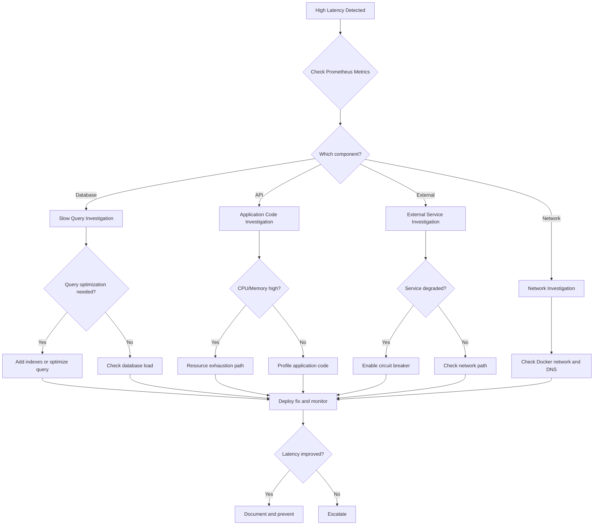

# High Latency / Timeouts

**Severity**: High
**Response Time**: < 10 minutes
**Last Updated**: 2026-02-01

## Overview

High latency and timeout issues cause slow response times, degraded user experience, and potential request failures. These can stem from database queries, external API calls, network issues, or resource contention.

## Detection

### Symptoms
- Requests taking > 5 seconds to complete
- Gateway timeout errors (504)
- Request timeout errors (408)
- Users reporting slow page loads
- Increased error rates in logs

### Alerts
- `HighRequestLatency` - p95 latency > 5s
- `SlowDatabaseQueries` - Query duration > 10s
- `HighTimeoutRate` - Timeout rate > 5%

### Quick Check
```bash
# Check current request latency
curl -w "@-" -o /dev/null -s http://localhost:8000/api/v1/items <<'EOF'
    time_namelookup:  %{time_namelookup}s\n
       time_connect:  %{time_connect}s\n
    time_appconnect:  %{time_appconnect}s\n
   time_pretransfer:  %{time_pretransfer}s\n
      time_redirect:  %{time_redirect}s\n
 time_starttransfer:  %{time_starttransfer}s\n
                    ----------\n
         time_total:  %{time_total}s\n
EOF

# Check slow queries in database
docker-compose exec postgres psql -U postgres -d trace -c "
SELECT pid, now() - query_start AS duration, query, state
FROM pg_stat_activity
WHERE state != 'idle'
  AND now() - query_start > interval '5 seconds'
ORDER BY duration DESC;
"

# Check application response times in logs
docker-compose logs backend --tail=100 | grep "duration\|latency\|slow"
```

## Investigation Flowchart



## Investigation Steps

### 1. Identify the Bottleneck

#### Check Request Tracing
```bash
# View distributed traces in Jaeger
open http://localhost:16686

# Look for:
# - Long-duration spans
# - Database query times
# - External API call times
# - Lock contention
```

#### Check Prometheus Metrics
```bash
# Query latency percentiles
curl -s 'http://localhost:9090/api/v1/query?query=histogram_quantile(0.95,http_request_duration_seconds_bucket)' | jq

# Database query duration
curl -s 'http://localhost:9090/api/v1/query?query=histogram_quantile(0.95,database_query_duration_seconds_bucket)' | jq

# External API latency
curl -s 'http://localhost:9090/api/v1/query?query=histogram_quantile(0.95,external_api_duration_seconds_bucket)' | jq
```

### 2. Database Performance Investigation

#### Identify Slow Queries
```bash
# Current slow queries
docker-compose exec postgres psql -U postgres -d trace -c "
SELECT
    pid,
    now() - query_start AS duration,
    state,
    query
FROM pg_stat_activity
WHERE state != 'idle'
  AND query NOT LIKE '%pg_stat_activity%'
ORDER BY duration DESC
LIMIT 10;
"

# Query statistics (requires pg_stat_statements)
docker-compose exec postgres psql -U postgres -d trace -c "
SELECT
    calls,
    total_exec_time,
    mean_exec_time,
    max_exec_time,
    query
FROM pg_stat_statements
ORDER BY mean_exec_time DESC
LIMIT 10;
"

# Check for missing indexes
docker-compose exec postgres psql -U postgres -d trace -c "
SELECT
    schemaname,
    tablename,
    seq_scan,
    seq_tup_read,
    idx_scan,
    seq_tup_read / seq_scan AS avg_seq_tup_read
FROM pg_stat_user_tables
WHERE seq_scan > 0
ORDER BY seq_tup_read DESC
LIMIT 10;
"
```

#### Check Database Locks
```bash
# Check for blocking queries
docker-compose exec postgres psql -U postgres -d trace -c "
SELECT
    blocked_locks.pid AS blocked_pid,
    blocked_activity.usename AS blocked_user,
    blocking_locks.pid AS blocking_pid,
    blocking_activity.usename AS blocking_user,
    blocked_activity.query AS blocked_statement,
    blocking_activity.query AS blocking_statement,
    blocked_activity.application_name AS blocked_application
FROM pg_catalog.pg_locks blocked_locks
JOIN pg_catalog.pg_stat_activity blocked_activity ON blocked_activity.pid = blocked_locks.pid
JOIN pg_catalog.pg_locks blocking_locks
    ON blocking_locks.locktype = blocked_locks.locktype
    AND blocking_locks.database IS NOT DISTINCT FROM blocked_locks.database
    AND blocking_locks.relation IS NOT DISTINCT FROM blocked_locks.relation
    AND blocking_locks.page IS NOT DISTINCT FROM blocked_locks.page
    AND blocking_locks.tuple IS NOT DISTINCT FROM blocked_locks.tuple
    AND blocking_locks.virtualxid IS NOT DISTINCT FROM blocked_locks.virtualxid
    AND blocking_locks.transactionid IS NOT DISTINCT FROM blocked_locks.transactionid
    AND blocking_locks.classid IS NOT DISTINCT FROM blocked_locks.classid
    AND blocking_locks.objid IS NOT DISTINCT FROM blocked_locks.objid
    AND blocking_locks.objsubid IS NOT DISTINCT FROM blocked_locks.objsubid
    AND blocking_locks.pid != blocked_locks.pid
JOIN pg_catalog.pg_stat_activity blocking_activity ON blocking_activity.pid = blocking_locks.pid
WHERE NOT blocked_locks.granted;
"
```

### 3. Application Performance Investigation

#### Check Resource Usage
```bash
# Container resource usage
docker stats --no-stream

# CPU usage by service
docker stats --format "table {{.Name}}\t{{.CPUPerc}}\t{{.MemUsage}}" --no-stream

# Check for CPU throttling
docker-compose exec backend cat /sys/fs/cgroup/cpu/cpu.stat
```

#### Profile Application
```bash
# Enable Python profiling (if using cProfile)
docker-compose exec backend python -m cProfile -o /tmp/profile.stats -m uvicorn backend.main:app

# Analyze profile
docker-compose exec backend python -c "
import pstats
p = pstats.Stats('/tmp/profile.stats')
p.sort_stats('cumulative')
p.print_stats(20)
"

# Check for memory leaks
docker-compose exec backend python -c "
import psutil
import os
process = psutil.Process(os.getpid())
print(f'Memory: {process.memory_info().rss / 1024 / 1024:.2f} MB')
"
```

### 4. External Service Investigation

#### Test External APIs
```bash
# Check GitHub API latency
time curl -s -H "Authorization: Bearer $GITHUB_TOKEN" https://api.github.com/rate_limit

# Check WorkOS latency
time curl -s https://api.workos.com/user_management/users

# Check DNS resolution time
time nslookup api.github.com
```

#### Check Circuit Breaker Status
```bash
# View circuit breaker metrics
curl -s http://localhost:9090/api/v1/query?query=circuit_breaker_state | jq

# Check failure rates
docker-compose logs backend | grep "circuit.*open\|circuit.*half-open"
```

### 5. Network Investigation

#### Check Docker Network
```bash
# Test network latency between containers
docker-compose exec backend ping -c 10 postgres
docker-compose exec backend ping -c 10 redis

# Check network statistics
docker network inspect trace_default | jq '.[0].Containers'

# Test DNS resolution
docker-compose exec backend time nslookup postgres
```

## Resolution Steps

### Scenario 1: Slow Database Queries

#### Add Missing Index
```bash
# Identify missing index from investigation
# Example: Create index on items.project_id
docker-compose exec postgres psql -U postgres -d trace -c "
CREATE INDEX CONCURRENTLY idx_items_project_id ON items(project_id);
"

# Verify index creation
docker-compose exec postgres psql -U postgres -d trace -c "
SELECT indexname, indexdef FROM pg_indexes WHERE tablename = 'items';
"

# Analyze table to update statistics
docker-compose exec postgres psql -U postgres -d trace -c "
ANALYZE items;
"
```

#### Optimize Problematic Query
```python
# Before - N+1 query problem
items = db.query(Item).all()
for item in items:
    print(item.project.name)  # N additional queries

# After - Use eager loading
from sqlalchemy.orm import joinedload

items = db.query(Item).options(joinedload(Item.project)).all()
for item in items:
    print(item.project.name)  # Single query
```

#### Kill Long-Running Query
```bash
# Get PID from investigation
PID=12345

# Terminate the query
docker-compose exec postgres psql -U postgres -d trace -c "
SELECT pg_terminate_backend($PID);
"
```

### Scenario 2: Connection Pool Exhaustion

```bash
# Check pool status
docker-compose logs backend | grep "pool"

# Increase pool size temporarily
docker-compose exec backend python -c "
from backend.core.database import engine
print(f'Current pool size: {engine.pool.size()}')
engine.pool.resize(30)  # Increase from default
"

# Update configuration permanently
# In .env:
# DATABASE_POOL_SIZE=30
# DATABASE_MAX_OVERFLOW=60

docker-compose restart backend
```

### Scenario 3: External Service Timeout

#### Enable Circuit Breaker
```python
# backend/services/github_service.py
from circuitbreaker import circuit

@circuit(failure_threshold=5, recovery_timeout=60, expected_exception=requests.RequestException)
async def fetch_github_data(url: str):
    timeout = aiohttp.ClientTimeout(total=5)  # 5 second timeout
    async with aiohttp.ClientSession(timeout=timeout) as session:
        async with session.get(url) as response:
            return await response.json()
```

#### Implement Caching
```python
# Add caching for slow external calls
from functools import lru_cache
from datetime import datetime, timedelta

@lru_cache(maxsize=1000)
async def get_github_user(username: str):
    # Cache for 1 hour
    return await fetch_github_data(f"https://api.github.com/users/{username}")
```

### Scenario 4: Resource Contention

#### Scale Horizontally
```bash
# Add more backend workers
docker-compose up -d --scale backend=3

# Verify scaling
docker-compose ps backend
```

#### Increase Resource Limits
```yaml
# In docker-compose.yml
services:
  backend:
    deploy:
      resources:
        limits:
          cpus: '2.0'  # Increase from 1.0
          memory: 2G   # Increase from 1G
        reservations:
          cpus: '1.0'
          memory: 1G
```

```bash
# Apply changes
docker-compose up -d backend
```

### Scenario 5: Network Latency

```bash
# Recreate network with optimized settings
docker-compose down
docker network create trace_default --driver bridge --opt com.docker.network.driver.mtu=1500
docker-compose up -d

# Enable DNS caching in containers
# Add to docker-compose.yml
services:
  backend:
    dns:
      - 8.8.8.8
      - 8.8.4.4
```

## Rollback Procedures

### Rollback Database Changes
```bash
# Drop recently added index
docker-compose exec postgres psql -U postgres -d trace -c "
DROP INDEX CONCURRENTLY idx_items_project_id;
"

# Rollback configuration changes
git checkout .env docker-compose.yml
docker-compose restart backend
```

### Rollback Code Changes
```bash
# If deployed new code
git revert HEAD
docker-compose build backend
docker-compose up -d backend
```

## Verification

### 1. Test Response Times
```bash
# Test API latency (should be < 1s)
time curl http://localhost:8000/api/v1/items

# Run load test
ab -n 1000 -c 10 http://localhost:8000/api/v1/items

# Check p95 latency in Prometheus
curl -s 'http://localhost:9090/api/v1/query?query=histogram_quantile(0.95,http_request_duration_seconds_bucket{path="/api/v1/items"})' | jq
```

### 2. Verify Database Performance
```bash
# No slow queries
docker-compose exec postgres psql -U postgres -d trace -c "
SELECT count(*) FROM pg_stat_activity
WHERE state != 'idle'
  AND now() - query_start > interval '5 seconds';
"
# Should return 0

# Check query performance
docker-compose exec postgres psql -U postgres -d trace -c "
SELECT mean_exec_time, query FROM pg_stat_statements
ORDER BY mean_exec_time DESC LIMIT 5;
"
# Mean times should be < 100ms
```

### 3. Monitor for Stability
```bash
# Watch metrics for 10 minutes
watch -n 5 'curl -s http://localhost:9090/api/v1/query?query=http_request_duration_seconds | jq'

# Check error rate
docker-compose logs backend --since=10m | grep -i error | wc -l
```

## Prevention Measures

### 1. Query Optimization

#### Add Appropriate Indexes
```sql
-- Common query patterns should have indexes
CREATE INDEX CONCURRENTLY idx_items_project_id ON items(project_id);
CREATE INDEX CONCURRENTLY idx_items_status ON items(status);
CREATE INDEX CONCURRENTLY idx_items_created_at ON items(created_at DESC);
CREATE INDEX CONCURRENTLY idx_links_source_id ON links(source_id);
CREATE INDEX CONCURRENTLY idx_links_target_id ON links(target_id);

-- Composite indexes for common filters
CREATE INDEX CONCURRENTLY idx_items_project_status
ON items(project_id, status);
```

#### Enable Query Monitoring
```sql
-- Enable pg_stat_statements
CREATE EXTENSION IF NOT EXISTS pg_stat_statements;

-- Configure postgresql.conf
-- shared_preload_libraries = 'pg_stat_statements'
-- pg_stat_statements.track = all
-- pg_stat_statements.max = 10000
```

### 2. Application Timeouts

```python
# backend/core/config.py
class Settings(BaseSettings):
    # Database timeouts
    database_statement_timeout: int = 30000  # 30 seconds
    database_pool_timeout: int = 30

    # HTTP timeouts
    http_client_timeout: int = 10
    http_client_connect_timeout: int = 5

    # External service timeouts
    github_api_timeout: int = 5
    workos_api_timeout: int = 5

# backend/core/database.py
engine = create_engine(
    settings.database_url,
    connect_args={
        "options": f"-c statement_timeout={settings.database_statement_timeout}"
    }
)
```

### 3. Caching Strategy

```python
# backend/services/cache.py
from redis import Redis
from functools import wraps
import json

redis_client = Redis(host='redis', port=6379, db=0)

def cache_result(ttl: int = 3600):
    """Cache function results in Redis"""
    def decorator(func):
        @wraps(func)
        async def wrapper(*args, **kwargs):
            # Generate cache key
            cache_key = f"{func.__name__}:{json.dumps(args)}:{json.dumps(kwargs)}"

            # Check cache
            cached = redis_client.get(cache_key)
            if cached:
                return json.loads(cached)

            # Execute function
            result = await func(*args, **kwargs)

            # Store in cache
            redis_client.setex(cache_key, ttl, json.dumps(result))

            return result
        return wrapper
    return decorator

# Usage
@cache_result(ttl=300)  # Cache for 5 minutes
async def get_project_items(project_id: str):
    return await db.query(Item).filter(Item.project_id == project_id).all()
```

### 4. Monitoring and Alerts

```yaml
# prometheus/alerts.yml
groups:
  - name: latency
    interval: 30s
    rules:
      - alert: HighRequestLatency
        expr: histogram_quantile(0.95, http_request_duration_seconds_bucket) > 5
        for: 2m
        labels:
          severity: high
        annotations:
          summary: "High request latency detected"
          description: "P95 latency is {{ $value }}s"

      - alert: SlowDatabaseQueries
        expr: histogram_quantile(0.95, database_query_duration_seconds_bucket) > 10
        for: 1m
        labels:
          severity: high
        annotations:
          summary: "Slow database queries detected"
          description: "P95 query time is {{ $value }}s"

      - alert: ExternalServiceTimeout
        expr: rate(external_api_timeout_total[5m]) > 0.1
        for: 2m
        labels:
          severity: medium
        annotations:
          summary: "High external service timeout rate"
```

### 5. Load Testing

```bash
# scripts/load-test.sh
#!/bin/bash

# Regular load testing to identify bottlenecks
echo "Running load test..."

# Test critical endpoints
ab -n 10000 -c 50 -g results.tsv http://localhost:8000/api/v1/items
ab -n 5000 -c 25 http://localhost:8000/api/v1/projects

# Analyze results
python scripts/analyze-load-test.py results.tsv

# Alert if p95 > threshold
P95=$(cat results.tsv | awk '{print $9}' | sort -n | tail -n $((10000 * 95 / 100)) | head -1)
if (( $(echo "$P95 > 1000" | bc -l) )); then
    echo "WARNING: P95 latency is ${P95}ms"
    exit 1
fi
```

### 6. Database Maintenance

```bash
# Add to cron (weekly)
# scripts/db-maintenance.sh
#!/bin/bash

# Update table statistics
docker-compose exec postgres psql -U postgres -d trace -c "ANALYZE;"

# Reindex if needed
docker-compose exec postgres psql -U postgres -d trace -c "
REINDEX INDEX CONCURRENTLY idx_items_project_id;
"

# Vacuum to reclaim space
docker-compose exec postgres psql -U postgres -d trace -c "
VACUUM (ANALYZE, VERBOSE) items;
"

# Report on index usage
docker-compose exec postgres psql -U postgres -d trace -c "
SELECT
    schemaname,
    tablename,
    indexname,
    idx_scan,
    idx_tup_read,
    idx_tup_fetch
FROM pg_stat_user_indexes
ORDER BY idx_scan ASC;
" > /tmp/index-usage-report.txt
```

## Related Runbooks

- [Database Connection Failures](./database-connection-failures.md)
- [Memory Exhaustion](./memory-exhaustion.md)
- [Cache Invalidation Issues](./cache-invalidation-issues.md)

## Version History

- 2026-02-01: Initial version
