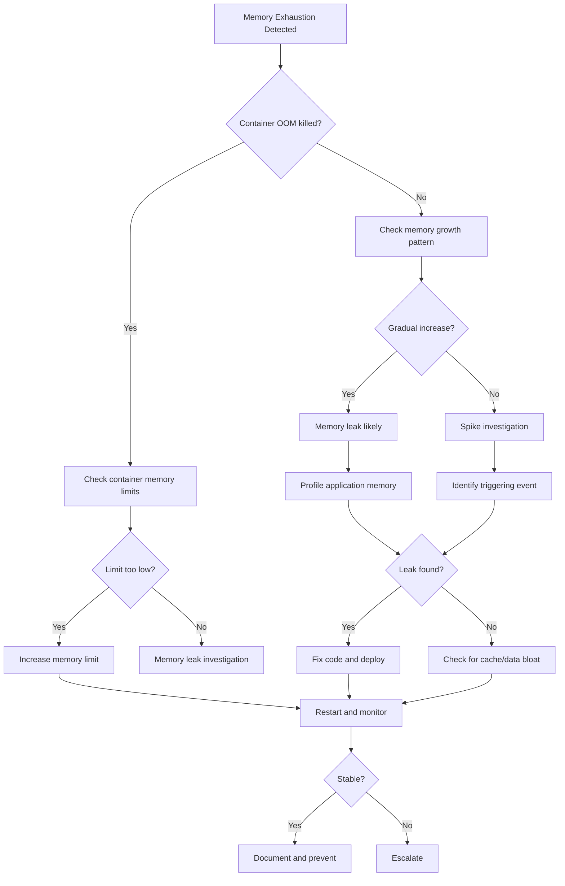

# Memory Exhaustion

**Severity**: Critical
**Response Time**: < 5 minutes
**Last Updated**: 2026-02-01

## Overview

Memory exhaustion occurs when a service consumes all available memory, leading to OOM (Out Of Memory) kills, swap thrashing, and service crashes. This can be caused by memory leaks, unbounded caching, large dataset processing, or insufficient resource limits.

## Detection

### Symptoms
- Container restarts with exit code 137 (OOM killed)
- Swap usage at 100%
- Application becoming unresponsive
- "MemoryError" or "Cannot allocate memory" errors
- Gradual performance degradation over time

### Alerts
- `HighMemoryUsage` - Memory usage > 85%
- `ContainerOOMKilled` - Container killed by OOM
- `SwapUsageHigh` - Swap > 50%

### Quick Check
```bash
# Check container memory usage
docker stats --no-stream

# Check for OOM kills in logs
docker-compose logs backend | grep -i "killed\|oom\|memory"

# Check system memory
free -h

# Check for memory pressure
docker-compose exec backend cat /sys/fs/cgroup/memory/memory.pressure_level
```

## Investigation Flowchart



## Investigation Steps

### 1. Identify Memory Usage Patterns

#### Check Current Memory State
```bash
# Container memory usage
docker stats --format "table {{.Name}}\t{{.MemUsage}}\t{{.MemPerc}}" --no-stream

# Detailed memory breakdown
docker-compose exec backend cat /sys/fs/cgroup/memory/memory.stat

# Python process memory (if applicable)
docker-compose exec backend python -c "
import psutil
import os

process = psutil.Process(os.getpid())
mem_info = process.memory_info()

print(f'RSS: {mem_info.rss / 1024 / 1024:.2f} MB')
print(f'VMS: {mem_info.vms / 1024 / 1024:.2f} MB')
print(f'Shared: {mem_info.shared / 1024 / 1024:.2f} MB')
print(f'% Memory: {process.memory_percent():.2f}%')
"
```

#### Check Historical Memory Usage
```bash
# Query Prometheus for memory trends
curl -s 'http://localhost:9090/api/v1/query_range?query=container_memory_usage_bytes{name="trace-backend-1"}&start='$(date -u -d '1 hour ago' +%s)'&end='$(date -u +%s)'&step=60' | jq

# Check for OOM events
docker inspect trace-backend-1 | jq '.[0].State.OOMKilled'

# View container restart count
docker inspect trace-backend-1 | jq '.[0].RestartCount'
```

### 2. Profile Memory Usage

#### Python Memory Profiling
```bash
# Install memory profiler if not present
docker-compose exec backend pip install memory-profiler

# Profile specific function
docker-compose exec backend python -m memory_profiler backend/api/routes/items.py

# Generate memory dump
docker-compose exec backend python -c "
import tracemalloc
import gc

# Start tracking
tracemalloc.start()

# Trigger memory usage (adjust based on your app)
# ... your code here ...

# Get snapshot
snapshot = tracemalloc.take_snapshot()
top_stats = snapshot.statistics('lineno')

print('Top 10 memory allocations:')
for stat in top_stats[:10]:
    print(stat)
"

# Use objgraph to find memory leaks
docker-compose exec backend python -c "
import objgraph
import gc

gc.collect()
objgraph.show_most_common_types(limit=20)

# Find growth over time
# Run this twice with some delay
objgraph.show_growth(limit=10)
"
```

#### Check for Common Memory Hogs
```bash
# Large database query results
docker-compose logs backend | grep -i "query.*rows\|fetched"

# Large file uploads/processing
docker-compose logs backend | grep -i "upload\|file.*size"

# Cache size
docker-compose exec redis redis-cli INFO memory

# Check SQLAlchemy connection pool
docker-compose exec backend python -c "
from backend.core.database import engine
print(f'Pool size: {engine.pool.size()}')
print(f'Checked out: {engine.pool.checkedout()}')
print(f'Overflow: {engine.pool.overflow()}')
"
```

### 3. Identify Memory Leak Sources

#### Check for Circular References
```python
# Add to suspect code areas
import gc
import sys

def find_circular_refs():
    gc.collect()
    for obj in gc.garbage:
        print(f"Garbage: {type(obj)}")
        print(f"  Referrers: {len(gc.get_referrers(obj))}")
        for ref in gc.get_referrers(obj)[:5]:
            print(f"    {type(ref)}")
```

#### Check for Unbounded Growth
```bash
# Check global variable sizes
docker-compose exec backend python -c "
import sys
import backend.main as main

# Get all global variables
globals_dict = vars(main)

for name, obj in sorted(globals_dict.items(), key=lambda x: sys.getsizeof(x[1]), reverse=True)[:20]:
    print(f'{name}: {sys.getsizeof(obj)} bytes')
"

# Check for growing lists/dicts
docker-compose exec backend python -c "
import sys
from backend.core import cache

if hasattr(cache, 'CACHE'):
    print(f'Cache size: {sys.getsizeof(cache.CACHE)} bytes')
    print(f'Cache items: {len(cache.CACHE)}')
"
```

### 4. Check External Factors

#### Database Connection Pooling
```bash
# Check for connection leaks
docker-compose exec postgres psql -U postgres -d trace -c "
SELECT count(*), state
FROM pg_stat_activity
GROUP BY state;
"

# Check connection age
docker-compose exec postgres psql -U postgres -d trace -c "
SELECT pid, usename, application_name,
       now() - backend_start AS connection_age,
       state
FROM pg_stat_activity
WHERE backend_start < now() - interval '1 hour'
ORDER BY backend_start;
"
```

#### Redis Memory Usage
```bash
# Check Redis memory
docker-compose exec redis redis-cli INFO memory | grep -E "used_memory_human|used_memory_peak_human|maxmemory"

# Check key count
docker-compose exec redis redis-cli DBSIZE

# Find largest keys
docker-compose exec redis redis-cli --bigkeys

# Check for expired keys not being cleaned up
docker-compose exec redis redis-cli INFO stats | grep expired
```

## Resolution Steps

### Scenario 1: Container Memory Limit Too Low

```bash
# Check current limits
docker inspect trace-backend-1 | jq '.[0].HostConfig.Memory'

# Increase memory limit in docker-compose.yml
# Before:
#   deploy:
#     resources:
#       limits:
#         memory: 1G

# After:
#   deploy:
#     resources:
#       limits:
#         memory: 2G
#       reservations:
#         memory: 1G

# Apply changes
docker-compose up -d backend

# Verify new limits
docker inspect trace-backend-1 | jq '.[0].HostConfig.Memory'
```

### Scenario 2: Memory Leak in Application Code

```python
# Common leak pattern - Event handlers not cleaned up
# BAD:
class ItemService:
    def __init__(self):
        self.subscribers = []  # Never cleaned!

    def subscribe(self, callback):
        self.subscribers.append(callback)

# GOOD:
class ItemService:
    def __init__(self):
        self.subscribers = weakref.WeakSet()  # Auto cleanup

    def subscribe(self, callback):
        self.subscribers.add(callback)

# Common leak pattern - Unbounded cache
# BAD:
CACHE = {}  # Grows forever

def get_item(item_id):
    if item_id not in CACHE:
        CACHE[item_id] = fetch_item(item_id)
    return CACHE[item_id]

# GOOD:
from functools import lru_cache

@lru_cache(maxsize=1000)  # Limited size
def get_item(item_id):
    return fetch_item(item_id)

# Common leak pattern - Circular references
# BAD:
class Node:
    def __init__(self, parent=None):
        self.parent = parent
        self.children = []
        if parent:
            parent.children.append(self)  # Circular!

# GOOD:
import weakref

class Node:
    def __init__(self, parent=None):
        self.parent = weakref.ref(parent) if parent else None
        self.children = []
```

### Scenario 3: Database Query Result Set Too Large

```python
# BAD - Loads entire table into memory
items = db.query(Item).all()
for item in items:
    process(item)

# GOOD - Stream results in batches
from sqlalchemy import func

batch_size = 1000
offset = 0

while True:
    batch = db.query(Item).offset(offset).limit(batch_size).all()
    if not batch:
        break

    for item in batch:
        process(item)

    offset += batch_size
    db.expunge_all()  # Clear session to free memory

# BETTER - Use server-side cursor
from sqlalchemy.orm import Session

with Session(engine, expire_on_commit=False) as session:
    for item in session.query(Item).yield_per(1000):
        process(item)
        session.expunge(item)  # Remove from session
```

### Scenario 4: Redis Cache Bloat

```bash
# Set maxmemory and eviction policy
docker-compose exec redis redis-cli CONFIG SET maxmemory 512mb
docker-compose exec redis redis-cli CONFIG SET maxmemory-policy allkeys-lru

# Make permanent in redis.conf
echo "maxmemory 512mb" >> redis.conf
echo "maxmemory-policy allkeys-lru" >> redis.conf

# Clear cache if needed
docker-compose exec redis redis-cli FLUSHDB

# Restart Redis
docker-compose restart redis
```

### Scenario 5: File Upload/Processing

```python
# BAD - Loads entire file into memory
@app.post("/upload")
async def upload_file(file: UploadFile):
    content = await file.read()  # Entire file in memory!
    process(content)

# GOOD - Stream processing
@app.post("/upload")
async def upload_file(file: UploadFile):
    chunk_size = 1024 * 1024  # 1MB chunks

    while True:
        chunk = await file.read(chunk_size)
        if not chunk:
            break
        process_chunk(chunk)

# BETTER - Save to disk and process
import tempfile
import shutil

@app.post("/upload")
async def upload_file(file: UploadFile):
    with tempfile.NamedTemporaryFile(delete=False) as tmp:
        shutil.copyfileobj(file.file, tmp)
        tmp_path = tmp.name

    try:
        process_file(tmp_path)  # Process from disk
    finally:
        os.unlink(tmp_path)
```

### Scenario 6: Connection Pool Leak

```python
# Ensure connections are always closed
from contextlib import contextmanager
from sqlalchemy.orm import Session

@contextmanager
def get_db_session():
    session = Session(engine)
    try:
        yield session
        session.commit()
    except Exception:
        session.rollback()
        raise
    finally:
        session.close()  # Always close!

# Usage
with get_db_session() as db:
    items = db.query(Item).all()
    # Connection automatically closed
```

## Rollback Procedures

### Revert Memory Limit Changes
```bash
# Restore previous docker-compose.yml
git checkout docker-compose.yml

# Restart with old limits
docker-compose up -d backend
```

### Revert Code Changes
```bash
# Rollback to previous version
git revert HEAD

# Rebuild and deploy
docker-compose build backend
docker-compose up -d backend
```

### Emergency: Restart Service
```bash
# Quick restart to free memory
docker-compose restart backend

# If that doesn't work, full recreate
docker-compose up -d --force-recreate backend
```

## Verification

### 1. Check Memory Stability
```bash
# Monitor memory usage for 30 minutes
watch -n 10 'docker stats --no-stream --format "table {{.Name}}\t{{.MemUsage}}\t{{.MemPerc}}"'

# Should see stable or slowly growing memory, not rapid increase
```

### 2. Verify No Memory Leaks
```bash
# Run memory profiler before and after load
echo "Before load:"
docker-compose exec backend python -c "
import psutil, os
print(f'Memory: {psutil.Process(os.getpid()).memory_info().rss / 1024 / 1024:.2f} MB')
"

# Generate load
ab -n 10000 -c 10 http://localhost:8000/api/v1/items

echo "After load:"
docker-compose exec backend python -c "
import psutil, os
print(f'Memory: {psutil.Process(os.getpid()).memory_info().rss / 1024 / 1024:.2f} MB')
"

# Wait 5 minutes for GC
sleep 300

echo "After GC:"
docker-compose exec backend python -c "
import gc, psutil, os
gc.collect()
print(f'Memory: {psutil.Process(os.getpid()).memory_info().rss / 1024 / 1024:.2f} MB')
"
# Should return close to "Before load" value
```

### 3. Check for OOM Events
```bash
# Should return false
docker inspect trace-backend-1 | jq '.[0].State.OOMKilled'

# Check system logs for OOM killer
dmesg | grep -i "out of memory"
```

## Prevention Measures

### 1. Set Appropriate Memory Limits

```yaml
# docker-compose.yml
services:
  backend:
    deploy:
      resources:
        limits:
          memory: 2G  # Hard limit
        reservations:
          memory: 1G  # Guaranteed minimum

  redis:
    deploy:
      resources:
        limits:
          memory: 512M
        reservations:
          memory: 256M

  postgres:
    deploy:
      resources:
        limits:
          memory: 4G
        reservations:
          memory: 2G
```

### 2. Implement Memory Monitoring

```yaml
# prometheus/alerts.yml
groups:
  - name: memory
    interval: 30s
    rules:
      - alert: HighMemoryUsage
        expr: container_memory_usage_bytes / container_spec_memory_limit_bytes > 0.85
        for: 5m
        labels:
          severity: high
        annotations:
          summary: "Container {{ $labels.name }} memory usage high"
          description: "Memory usage at {{ $value | humanizePercentage }}"

      - alert: MemoryLeakSuspected
        expr: |
          (
            container_memory_usage_bytes{name=~".*backend.*"}
            - container_memory_usage_bytes{name=~".*backend.*"} offset 1h
          ) > 100000000
        for: 10m
        labels:
          severity: high
        annotations:
          summary: "Memory leak suspected in {{ $labels.name }}"
          description: "Memory grew by {{ $value | humanize }}B in 1 hour"

      - alert: ContainerOOMKilled
        expr: changes(container_oom_events_total[5m]) > 0
        labels:
          severity: critical
        annotations:
          summary: "Container {{ $labels.name }} was OOM killed"
```

### 3. Implement Proper Caching

```python
# backend/core/cache.py
from functools import lru_cache
from cachetools import TTLCache, cached
import redis
import pickle

# In-memory cache with size limit
class MemoryCache:
    def __init__(self, maxsize: int = 1000, ttl: int = 3600):
        self.cache = TTLCache(maxsize=maxsize, ttl=ttl)

    @cached(cache=cache)
    def get(self, key: str, factory):
        return factory()

# Redis cache with memory limit
class RedisCache:
    def __init__(self):
        self.client = redis.Redis(host='redis', port=6379, db=0)
        # Set memory limit
        self.client.config_set('maxmemory', '512mb')
        self.client.config_set('maxmemory-policy', 'allkeys-lru')

    def get(self, key: str, factory, ttl: int = 3600):
        cached = self.client.get(key)
        if cached:
            return pickle.loads(cached)

        value = factory()
        self.client.setex(key, ttl, pickle.dumps(value))
        return value
```

### 4. Stream Large Data Sets

```python
# backend/api/routes/export.py
from fastapi.responses import StreamingResponse
from typing import AsyncIterator

async def stream_items() -> AsyncIterator[bytes]:
    """Stream items as CSV without loading all into memory"""
    yield b"id,title,status\n"

    batch_size = 1000
    offset = 0

    while True:
        batch = db.query(Item).offset(offset).limit(batch_size).all()
        if not batch:
            break

        for item in batch:
            yield f"{item.id},{item.title},{item.status}\n".encode()

        offset += batch_size
        db.expunge_all()

@app.get("/api/v1/export/items")
async def export_items():
    return StreamingResponse(
        stream_items(),
        media_type="text/csv",
        headers={"Content-Disposition": "attachment; filename=items.csv"}
    )
```

### 5. Regular Memory Profiling

```bash
# scripts/memory-profile.sh
#!/bin/bash

echo "Running memory profiling..."

# Profile application
docker-compose exec backend python -m memory_profiler backend/main.py > /tmp/memory-profile.txt

# Check for growth
docker-compose exec backend python -c "
import objgraph
import gc

gc.collect()
print('Memory growth over 60 seconds:')
objgraph.show_growth(limit=10, file='/tmp/growth-1.txt')

import time
time.sleep(60)

objgraph.show_growth(limit=10, file='/tmp/growth-2.txt')
"

# Analyze results
python scripts/analyze-memory-profile.py /tmp/memory-profile.txt
```

### 6. Garbage Collection Tuning

```python
# backend/main.py
import gc

# Tune garbage collection for long-running process
gc.set_threshold(700, 10, 10)  # More aggressive collection

# Disable GC during critical sections
def process_large_dataset():
    gc.disable()
    try:
        # Process data
        pass
    finally:
        gc.enable()
        gc.collect()
```

### 7. Resource Cleanup Patterns

```python
# Always use context managers
from contextlib import contextmanager

@contextmanager
def resource_cleanup():
    resource = acquire_resource()
    try:
        yield resource
    finally:
        release_resource(resource)

# Use weakref for callbacks
import weakref

class EventEmitter:
    def __init__(self):
        self._subscribers = weakref.WeakSet()

    def subscribe(self, callback):
        self._subscribers.add(callback)

# Explicitly delete large objects
def process_large_file(path):
    data = load_file(path)  # Large data
    result = process(data)
    del data  # Explicitly free memory
    gc.collect()
    return result
```

## Related Runbooks

- [High Latency/Timeouts](./high-latency-timeouts.md)
- [Database Connection Failures](./database-connection-failures.md)
- [Disk Space Issues](./disk-space-issues.md)

## Version History

- 2026-02-01: Initial version
