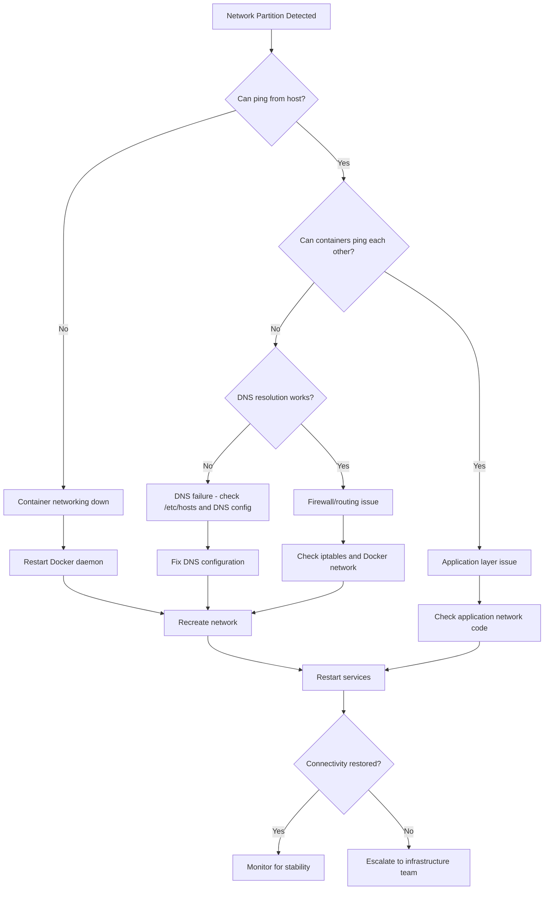

# Network Partitions

**Severity**: Critical
**Response Time**: < 5 minutes
**Last Updated**: 2026-02-01

## Overview

Network partitions occur when network connectivity is lost between services, causing distributed system failures, split-brain scenarios, and data inconsistencies. In containerized environments, this can happen due to Docker network issues, DNS failures, firewall rules, or infrastructure problems.

## Detection

### Symptoms
- Services unable to reach each other
- Intermittent connection failures
- Timeout errors between services
- DNS resolution failures
- Health checks failing
- Database connection errors from some containers but not others

### Alerts
- `ServiceUnreachable` - Service health check fails
- `HighConnectionFailureRate` - Connection attempts failing
- `DNSResolutionFailure` - DNS lookups failing

### Quick Check
```bash
# Test connectivity between containers
docker-compose exec backend ping -c 3 postgres
docker-compose exec backend ping -c 3 redis

# Test DNS resolution
docker-compose exec backend nslookup postgres
docker-compose exec backend nslookup redis

# Check Docker network
docker network inspect trace_default

# Check service connectivity
docker-compose exec backend curl -I http://frontend:3000
docker-compose exec backend nc -zv postgres 5432
docker-compose exec backend nc -zv redis 6379
```

## Investigation Flowchart



## Investigation Steps

### 1. Verify Network Connectivity

#### Test Basic Connectivity
```bash
# From host to containers
docker-compose ps | awk '{print $1}' | tail -n +2 | while read container; do
    echo "Testing $container..."
    docker exec $container ping -c 1 -W 1 8.8.8.8 > /dev/null 2>&1 && echo "  ✓ Internet" || echo "  ✗ Internet"
done

# Between containers
docker-compose exec backend ping -c 3 postgres
docker-compose exec backend ping -c 3 redis
docker-compose exec backend ping -c 3 frontend

# Test specific ports
docker-compose exec backend nc -zv postgres 5432
docker-compose exec backend nc -zv redis 6379
docker-compose exec backend telnet postgres 5432
```

#### Check Network Configuration
```bash
# Inspect Docker network
docker network inspect trace_default | jq '.[0].Containers'

# Check network driver
docker network inspect trace_default | jq '.[0].Driver'

# List all networks
docker network ls

# Check for network isolation
docker network inspect bridge trace_default | jq '.[].Options'
```

### 2. DNS Resolution Testing

#### Test DNS Functionality
```bash
# Test name resolution
docker-compose exec backend nslookup postgres
docker-compose exec backend dig postgres
docker-compose exec backend host postgres

# Check /etc/hosts
docker-compose exec backend cat /etc/hosts

# Check /etc/resolv.conf
docker-compose exec backend cat /etc/resolv.conf

# Test external DNS
docker-compose exec backend nslookup google.com
docker-compose exec backend nslookup google.com 8.8.8.8
```

#### Verify Docker DNS
```bash
# Check Docker daemon DNS configuration
docker info | grep -A 10 DNS

# Check container DNS settings
docker inspect backend | jq '.[0].HostConfig.Dns'
docker inspect backend | jq '.[0].HostConfig.DnsSearch'
```

### 3. Check Firewall and Routing

#### Examine iptables Rules
```bash
# List all iptables rules
sudo iptables -L -n -v

# Docker-specific chains
sudo iptables -t nat -L -n -v | grep DOCKER
sudo iptables -t filter -L DOCKER -n -v

# Check if packets are being dropped
sudo iptables -L -n -v | grep DROP
```

#### Check Routing
```bash
# Check routing table in container
docker-compose exec backend ip route show

# Check routing from host
ip route show

# Trace route between containers
docker-compose exec backend traceroute postgres
docker-compose exec backend mtr -n -c 10 postgres
```

### 4. Inspect Docker Network State

#### Check Bridge Networks
```bash
# List bridges
brctl show

# Check bridge configuration
ip addr show docker0

# Check bridge forwarding
sysctl net.ipv4.ip_forward

# Check Docker network interfaces
ip link show | grep docker
```

#### Container Network Namespaces
```bash
# List network namespaces
sudo ip netns list

# Get container PID
PID=$(docker inspect -f '{{.State.Pid}}' trace-backend-1)

# Check container network namespace
sudo nsenter -t $PID -n ip addr
sudo nsenter -t $PID -n ip route
sudo nsenter -t $PID -n iptables -L
```

### 5. Check Service-Specific Issues

#### Database Connectivity
```bash
# Test PostgreSQL connection
docker-compose exec backend python -c "
import psycopg2
try:
    conn = psycopg2.connect(
        host='postgres',
        port=5432,
        user='postgres',
        password='postgres',
        database='trace',
        connect_timeout=5
    )
    print('✓ Database connection successful')
    conn.close()
except Exception as e:
    print(f'✗ Database connection failed: {e}')
"

# Check PostgreSQL is listening
docker-compose exec postgres ss -tln | grep 5432
```

#### Redis Connectivity
```bash
# Test Redis connection
docker-compose exec backend python -c "
import redis
try:
    r = redis.Redis(host='redis', port=6379, socket_connect_timeout=5)
    r.ping()
    print('✓ Redis connection successful')
except Exception as e:
    print(f'✗ Redis connection failed: {e}')
"

# Check Redis is listening
docker-compose exec redis ss -tln | grep 6379
```

### 6. Application Layer Testing

#### HTTP Connectivity
```bash
# Test HTTP endpoints
docker-compose exec backend curl -v http://frontend:3000
docker-compose exec backend curl -I http://frontend:3000/health

# Test with timeout
docker-compose exec backend curl --connect-timeout 5 http://frontend:3000

# Check for proxy issues
docker-compose exec backend env | grep -i proxy
```

## Resolution Steps

### Scenario 1: Docker Network Corruption

```bash
# Restart Docker daemon (will briefly interrupt all containers)
sudo systemctl restart docker

# Wait for Docker to stabilize
sleep 10

# Recreate services
docker-compose up -d

# Verify connectivity
docker-compose exec backend ping -c 3 postgres
```

### Scenario 2: DNS Resolution Failure

```bash
# Fix Docker DNS configuration
# Edit /etc/docker/daemon.json
sudo tee /etc/docker/daemon.json <<EOF
{
  "dns": ["8.8.8.8", "8.8.4.4"],
  "dns-search": ["trace.local"]
}
EOF

# Restart Docker
sudo systemctl restart docker

# Recreate containers with new DNS
docker-compose down
docker-compose up -d

# Verify DNS
docker-compose exec backend nslookup postgres
```

### Scenario 3: Network Bridge Issues

```bash
# Remove and recreate Docker network
docker-compose down

# Remove network
docker network rm trace_default

# Recreate with explicit configuration
docker network create trace_default \
  --driver bridge \
  --subnet=172.25.0.0/16 \
  --gateway=172.25.0.1 \
  --opt com.docker.network.bridge.name=trace_br0 \
  --opt com.docker.network.driver.mtu=1500

# Start services
docker-compose up -d

# Verify network
docker network inspect trace_default
```

### Scenario 4: iptables Blocking Traffic

```bash
# Check if Docker iptables rules are present
sudo iptables -t nat -L DOCKER

# If missing, reload Docker
sudo systemctl reload docker

# Flush and recreate rules (DANGEROUS - may affect other services)
# Only if safe to do so:
# sudo iptables -F DOCKER
# sudo systemctl restart docker

# Allow specific traffic if blocked
sudo iptables -I DOCKER-USER -i trace_br0 -j ACCEPT
sudo iptables -I DOCKER-USER -o trace_br0 -j ACCEPT
```

### Scenario 5: Container Network Mode Issues

```yaml
# Check docker-compose.yml network configuration
# Ensure all services on same network

services:
  backend:
    networks:
      - trace_network

  postgres:
    networks:
      - trace_network

  redis:
    networks:
      - trace_network

networks:
  trace_network:
    driver: bridge
```

```bash
# Apply configuration
docker-compose down
docker-compose up -d
```

### Scenario 6: MTU Mismatch

```bash
# Check MTU on host
ip link show | grep mtu

# Check MTU in container
docker-compose exec backend ip link show eth0

# Set MTU on Docker network
docker network create trace_default \
  --opt com.docker.network.driver.mtu=1450

# Or in docker-compose.yml
networks:
  default:
    driver: bridge
    driver_opts:
      com.docker.network.driver.mtu: 1450
```

### Scenario 7: Service Not Listening on Correct Interface

```bash
# Check what interface PostgreSQL is listening on
docker-compose exec postgres ss -tln | grep 5432

# Ensure it's listening on all interfaces (0.0.0.0)
# Edit postgresql.conf if needed
docker-compose exec postgres bash -c "echo \"listen_addresses = '*'\" >> /var/lib/postgresql/data/postgresql.conf"

# Restart PostgreSQL
docker-compose restart postgres

# Verify
docker-compose exec postgres ss -tln | grep 5432
```

## Rollback Procedures

### Restore Docker Network Configuration

```bash
# Restore original daemon.json
sudo cp /etc/docker/daemon.json.backup /etc/docker/daemon.json

# Restart Docker
sudo systemctl restart docker

# Recreate services
docker-compose up -d
```

### Restore iptables Rules

```bash
# Restore iptables from backup
sudo iptables-restore < /etc/iptables.backup

# Or remove custom rules
sudo iptables -D DOCKER-USER -i trace_br0 -j ACCEPT
sudo iptables -D DOCKER-USER -o trace_br0 -j ACCEPT
```

### Recreate Network from Scratch

```bash
# Complete network reset
docker-compose down
docker network prune -f
docker system prune -f

# Restart Docker
sudo systemctl restart docker

# Recreate everything
docker-compose up -d --force-recreate
```

## Verification

### 1. Test Network Connectivity
```bash
# All services should be reachable
for service in postgres redis frontend; do
    echo "Testing $service..."
    docker-compose exec backend ping -c 3 $service && echo "  ✓ Reachable" || echo "  ✗ Unreachable"
done

# Test specific ports
docker-compose exec backend nc -zv postgres 5432
docker-compose exec backend nc -zv redis 6379
```

### 2. Verify DNS Resolution
```bash
# All service names should resolve
for service in postgres redis frontend backend; do
    echo "Resolving $service..."
    docker-compose exec backend nslookup $service | grep "Address:" && echo "  ✓ Resolved" || echo "  ✗ Failed"
done
```

### 3. Test Application Connectivity
```bash
# Test database connection
docker-compose exec backend python -c "
from backend.core.database import engine
with engine.connect() as conn:
    result = conn.execute('SELECT 1')
    print('✓ Database connection successful')
"

# Test Redis connection
docker-compose exec backend python -c "
from redis import Redis
r = Redis(host='redis', port=6379)
r.ping()
print('✓ Redis connection successful')
"

# Test API endpoints
curl http://localhost:8000/health
curl http://localhost:3000/health
```

### 4. Monitor for Stability
```bash
# Watch connectivity for 10 minutes
watch -n 30 'docker-compose exec backend ping -c 1 postgres && docker-compose exec backend ping -c 1 redis'

# Check for connection errors in logs
docker-compose logs --since=10m | grep -i "connection\|network\|timeout"
```

## Prevention Measures

### 1. Network Resilience Configuration

```yaml
# docker-compose.yml - Configure network with resilience
networks:
  trace_network:
    driver: bridge
    driver_opts:
      com.docker.network.bridge.name: trace_br0
      com.docker.network.driver.mtu: 1500
      com.docker.network.bridge.enable_icc: "true"
      com.docker.network.bridge.enable_ip_masquerade: "true"
    ipam:
      driver: default
      config:
        - subnet: 172.25.0.0/16
          gateway: 172.25.0.1
```

### 2. Service Health Checks

```yaml
# docker-compose.yml - Add health checks
services:
  backend:
    healthcheck:
      test: ["CMD", "curl", "-f", "http://localhost:8000/health"]
      interval: 30s
      timeout: 10s
      retries: 3
      start_period: 40s

  postgres:
    healthcheck:
      test: ["CMD-SHELL", "pg_isready -U postgres"]
      interval: 30s
      timeout: 5s
      retries: 3

  redis:
    healthcheck:
      test: ["CMD", "redis-cli", "ping"]
      interval: 30s
      timeout: 3s
      retries: 3
```

### 3. Connection Retry Logic

```python
# backend/core/database.py
from sqlalchemy import create_engine
from tenacity import retry, stop_after_attempt, wait_exponential

@retry(
    stop=stop_after_attempt(5),
    wait=wait_exponential(multiplier=1, min=4, max=10),
    reraise=True
)
def create_db_connection():
    """Create database connection with retries"""
    engine = create_engine(
        settings.database_url,
        pool_pre_ping=True,  # Verify connections before use
        pool_recycle=3600,   # Recycle connections every hour
        connect_args={
            "connect_timeout": 10,
            "keepalives": 1,
            "keepalives_idle": 30,
            "keepalives_interval": 10,
            "keepalives_count": 5,
        }
    )
    # Test connection
    with engine.connect() as conn:
        conn.execute("SELECT 1")
    return engine

engine = create_db_connection()
```

### 4. Circuit Breaker Pattern

```python
# backend/services/external.py
from circuitbreaker import circuit

@circuit(failure_threshold=5, recovery_timeout=60)
async def call_external_service(url: str):
    """Call external service with circuit breaker"""
    async with aiohttp.ClientSession() as session:
        async with session.get(
            url,
            timeout=aiohttp.ClientTimeout(total=10)
        ) as response:
            return await response.json()
```

### 5. Network Monitoring

```yaml
# prometheus/alerts.yml
groups:
  - name: network
    interval: 30s
    rules:
      - alert: ServiceUnreachable
        expr: up{job="trace-services"} == 0
        for: 2m
        labels:
          severity: critical
        annotations:
          summary: "Service {{ $labels.instance }} is unreachable"

      - alert: HighConnectionFailureRate
        expr: rate(net_conntrack_dialer_conn_failed_total[5m]) > 0.1
        for: 3m
        labels:
          severity: high
        annotations:
          summary: "High connection failure rate"

      - alert: DNSResolutionFailure
        expr: rate(coredns_dns_request_duration_seconds_count{rcode="SERVFAIL"}[5m]) > 0.1
        for: 2m
        labels:
          severity: high
        annotations:
          summary: "DNS resolution failures detected"
```

### 6. Automated Network Testing

```bash
# scripts/network-health-check.sh
#!/bin/bash

set -e

echo "Running network health checks..."

# Test inter-service connectivity
services=("postgres" "redis" "frontend")

for service in "${services[@]}"; do
    echo "Testing connectivity to $service..."

    # Ping test
    if ! docker-compose exec -T backend ping -c 3 -W 5 "$service" > /dev/null 2>&1; then
        echo "ERROR: Cannot ping $service"
        exit 1
    fi

    # DNS test
    if ! docker-compose exec -T backend nslookup "$service" > /dev/null 2>&1; then
        echo "ERROR: Cannot resolve $service"
        exit 1
    fi

    echo "  ✓ $service reachable"
done

# Test external connectivity
if ! docker-compose exec -T backend ping -c 3 -W 5 8.8.8.8 > /dev/null 2>&1; then
    echo "ERROR: No internet connectivity"
    exit 1
fi

echo "✓ All network health checks passed"
```

### 7. Docker Daemon Configuration

```json
// /etc/docker/daemon.json
{
  "dns": ["8.8.8.8", "8.8.4.4"],
  "dns-search": ["trace.local"],
  "default-address-pools": [
    {
      "base": "172.25.0.0/16",
      "size": 24
    }
  ],
  "mtu": 1500,
  "iptables": true,
  "ip-forward": true,
  "log-driver": "json-file",
  "log-opts": {
    "max-size": "10m",
    "max-file": "3"
  }
}
```

### 8. Network Debugging Tools

```dockerfile
# Add to Dockerfile for debugging
RUN apt-get update && apt-get install -y \
    iputils-ping \
    dnsutils \
    net-tools \
    netcat \
    tcpdump \
    mtr \
    curl \
    telnet \
    && rm -rf /var/lib/apt/lists/*
```

## Related Runbooks

- [Database Connection Failures](./database-connection-failures.md)
- [High Latency/Timeouts](./high-latency-timeouts.md)
- [Authentication Failures](./authentication-failures.md)

## Version History

- 2026-02-01: Initial version
