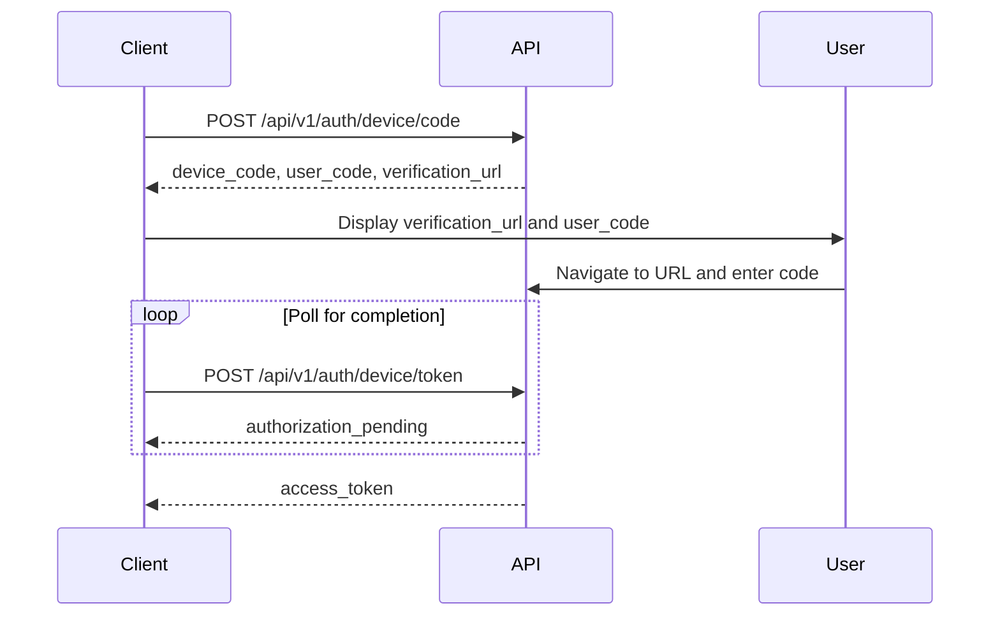

# Authentication

TraceRTM uses device-based OAuth 2.0 authentication, designed for CLI tools and desktop applications.

## Authentication Flow



## Endpoints

### Start Device Authorization

`POST /api/v1/auth/device/code`

Initiates the device authorization flow.

**Request Body:**

```json
{
  "client_id": "your-client-id",
  "scope": "openid profile email"
}
```

**Response:**

```json
{
  "device_code": "NGU5OWFiNjQ...",
  "user_code": "WDJB-MJHT",
  "verification_url": "https://example.com/device",
  "expires_in": 1800,
  "interval": 5
}
```

**Code Samples:**

<Tabs items={['TypeScript', 'Python', 'curl', 'Go']}>
  <Tab value="TypeScript">
    <pre>
      <code className="language-typescript">{String.raw`const response = await fetch('http://localhost:8000/api/v1/auth/device/code', {
  method: 'POST',
  headers: {
    'Content-Type': 'application/json',
  },
  body: JSON.stringify({
    client_id: 'your-client-id',
    scope: 'openid profile email'
  })
});

const data = await response.json();
console.log('Verification URL:', data.verification_url);
console.log('User Code:', data.user_code);`}</code>

</pre>

  </Tab>

  <Tab value="Python">
    <pre>
      <code className="language-python">{String.raw`import requests

response = requests.post(
'http://localhost:8000/api/v1/auth/device/code',
json={
'client_id': 'your-client-id',
'scope': 'openid profile email'
}
)

data = response.json()
print(f"Verification URL: {data['verification_url']}")
print(f"User Code: {data['user_code']}")`}</code>

</pre>

  </Tab>

<Tab value='curl'>
  <pre>
    <code className='language-bash'>{String.raw`curl -X POST http://localhost:8000/api/v1/auth/device/code \
  -H "Content-Type: application/json" \
  -d '{
    "client_id": "your-client-id",
    "scope": "openid profile email"
  }'`}</code>
  </pre>
</Tab>

  <Tab value="Go">
    <pre>
      <code className="language-go">{String.raw`package main

import (
    "bytes"
    "encoding/json"
    "fmt"
    "net/http"
)

func main() {
data := map[string]string{
"client_id": "your-client-id",
"scope": "openid profile email",
}

    jsonData, _ := json.Marshal(data)

    resp, err := http.Post(
        "http://localhost:8000/api/v1/auth/device/code",
        "application/json",
        bytes.NewBuffer(jsonData),
    )

    if err != nil {
        panic(err)
    }
    defer resp.Body.Close()

    var result map[string]interface{}
    json.NewDecoder(resp.Body).Decode(&result)

    fmt.Println("Verification URL:", result["verification_url"])
    fmt.Println("User Code:", result["user_code"])

}`}</code>

</pre>

  </Tab>
</Tabs>

### Poll for Token

`POST /api/v1/auth/device/token`

Poll this endpoint to check if the user has completed authorization.

**Request Body:**

```json
{
  "device_code": "NGU5OWFiNjQ...",
  "client_id": "your-client-id"
}
```

**Responses:**

**Success (200):**

```json
{
  "access_token": "eyJhbGciOiJIUzI1NiIsInR5cCI6IkpXVCJ9...",
  "token_type": "Bearer",
  "expires_in": 3600
}
```

**Pending (400):**

```json
{
  "error": "authorization_pending",
  "error_description": "User hasn't completed authorization yet"
}
```

**Expired (400):**

```json
{
  "error": "expired_token",
  "error_description": "The device code has expired"
}
```

### Get Current User

`GET /api/v1/auth/me`

Returns information about the currently authenticated user.

**Headers:**

```
Authorization: Bearer <access_token>
```

**Response:**

```json
{
  "user_id": "123",
  "email": "user@example.com",
  "account_id": "456",
  "permissions": ["read", "write"]
}
```

**Code Sample:**

```typescript
const response = await fetch('http://localhost:8000/api/v1/auth/me', {
  headers: {
    Authorization: `Bearer ${accessToken}`,
  },
});

const user = await response.json();
```

## Error Handling

All authentication endpoints return standard error responses:

```json
{
  "detail": "Error message",
  "error_code": "AUTH_ERROR_CODE"
}
```

Common error codes:

- `invalid_client` - Invalid client_id
- `invalid_request` - Missing or invalid parameters
- `authorization_pending` - User hasn't authorized yet
- `slow_down` - Too many polling requests
- `expired_token` - Device code expired
- `access_denied` - User denied authorization
